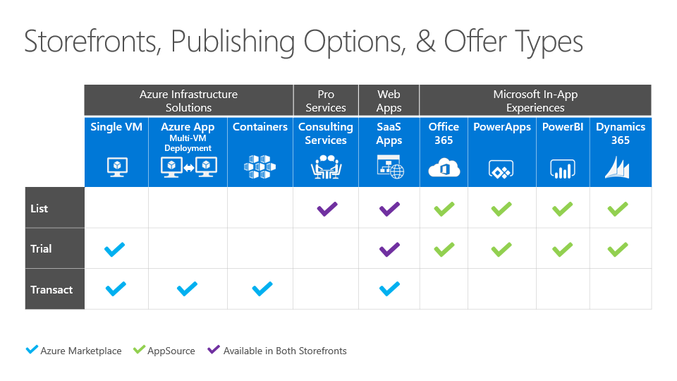

# Determine your publishing option
The publishing option that you choose for your offer relates directly to both the eligibility requirements and marketplace GTM benefits. More importantly, the selection of publishing option and offer type defines how users will interact with your marketplace offer.

To configure your offer, you’ll need to understand the following key marketplace concepts: the publishing options, offer types and configuration, and calls-to-action that will govern how and where your offer is presented in the marketplace storefronts.

In this article, you will learn…
<ul><li>	How to determine the appropriate storefront for your solution </ul></li>
<ul><li>	Which publishing options and calls-to-action are available in each storefront </ul></li>
<ul><li>	Which offer types are available for each publishing option </ul></li>

## Selecting a storefront, publishing option, and offer type for your solution

Before you select a publishing option, it’s important to understand the storefront eligibility requirements for marketplace solutions, apps, and services:

**Azure Marketplace** applications are technical “building-block” solutions built-on or built-for Azure and intended for an IT or developer audience. Azure Marketplace consulting services are professional services offerings that help customers get started with or accelerate the use of Azure.

**AppSource** applications are line-of-business solutions that can be built-on Azure or built-for: Dynamics 365, Office 365, Power BI, or Power Apps. AppSource consulting services are professional services offerings that help customers get started with or accelerate usage of Dynamics 365 and Power BI.

## Understand storefront selection

The storefront where your offer will be presented, Azure Marketplace and/or AppSource, will be automatically determined by your offer details and target audience, as well as the categories and industries selected by you when creating your offer. 

>[!Note]
>“Cross-listing” (for SaaS Apps only): when a list or trial-based offer meets the criteria for both a technical and business user audience, your offer will be listed in both storefronts. Learn more about the publishing options below.

## Choose a publishing option

The publishing options available offer differentiated customer engagement while giving you access to lead sharing and [Go-To-Market benefits](https://partner.microsoft.com/reach-customers/gtm). Note the calls-to-action that correspond with the publishing option:

| **Publishing option**    | **Description**  |
| :------------------- | :-------------------|
| **List** | Simple listing of your application or service that enables a marketplace user to request you to connect with the customer via the **Contact Me** call-to-action. |
| **Trial** | Use marketplace to enhance discoverability and automate provisioning of your solution’s trial experience, enabling prospective users to use your SaaS, IaaS, or Microsoft in-app experience at no cost for a limited time before they buy. The calls-to-action used for the trial publishing option are either: **Free Trial** or **Test Drive**. |
|**BYOL**  |Use marketplace to enhance discoverability and automate provisioning of your solution, and complete the financial transaction separately. BYOL offer types are ideal for on-premises to cloud migrations. The call to action is **Get it Now**.
| **Transact** | Your application runs on Azure and can be provisioned as a resource directly into the customer’s Azure subscription when the customer selects the **Get it Now** call to action. Your software license fees can optionally be purchased and billed via the customer’s choice of payment instrument and terms, and you can choose to offer time-limited access to your **Free Software Trial** (only available for Azure Marketplace.) |

>[!Note]
>When using the Transact publishing option, it is important to understand the pricing, billing, invoicing, and payout considerations before selecting an offer type and creating your offer. Review the [Marketplace Billing and Commercial Considerations article to learn more](./marketplace-commercial-transaction-capabilities-and-considerations.md).

## Next steps

*   Once you decide on a publishing option, you are ready to [select the offer type](./publisher-guide-by-offer-type.md) that will be used to present your offer.
*	Review the eligibility requirements in the publishing options by offer type section to finalize the selection and configuration of your offer.
*	Review the publishing patterns by storefront for examples on how your solution maps to an offer type and configuration.

