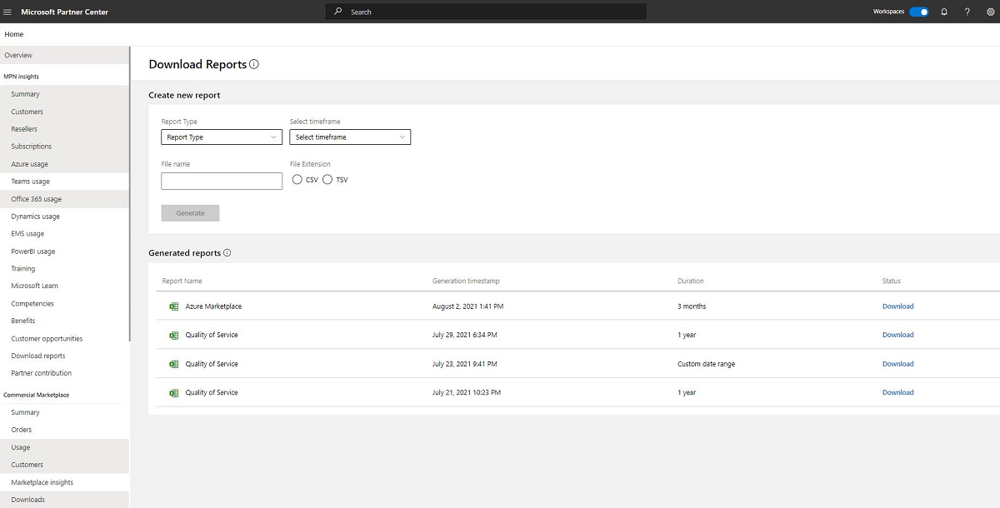

# Downloads dashboard in commercial marketplace analytics

This article provides information on the Downloads dashboard in Partner Center. This dashboard displays a list of your download requests over the last 30 days.

>[!NOTE]
> For detailed definitions of analytics terminology, see [Frequently asked questions and terminology for commercial marketplace analytics](analytics-faq.yml).

## Downloads dashboard

The [Downloads dashboard](https://go.microsoft.com/fwlink/?linkid=2165766) displays requests for any downloads that contain over 1000 rows of customer or order data.

You will receive a pop-up notification containing a link to the **Downloads** dashboard whenever you request a download with over 1000 rows of data. These data downloads will be available for a 30-day period and then removed.

## Lifetime export of commercial marketplace Analytics reports

On the Downloads page, end user can do the following:

- Lifetime export of commercial marketplace Analytics reports in csv and tsv format.
- Export of commercial marketplace Analytics reports for any date range.
- Export of commercial marketplace Analytics reports for 6- or 12-month duration.

Support for Lifetime Export Capability of Analytics reports:

| Report | Lifetime export | Any duration based on date |
| - | - | - |
| Orders |  |  |
| Customers |  |  |
| Marketplace Insights |  |  |
| Usage |  | Maximum of one year |
|

A user can schedule asynchronous downloads of reports from the Downloads dashboard.

## Next steps

- For an overview of analytics reports available in the Partner Center commercial marketplace, see [Analytics for the commercial marketplace in Partner Center](analytics.md).
- For graphs, trends, and values of aggregate data that summarize marketplace activity for your offer, see [Summary Dashboard in commercial marketplace analytics](summary-dashboard.md).
- For frequently asked questions about commercial marketplace analytics and for a comprehensive dictionary of data terms, see [Frequently asked questions and terminology for commercial marketplace analytics](analytics-faq.yml).