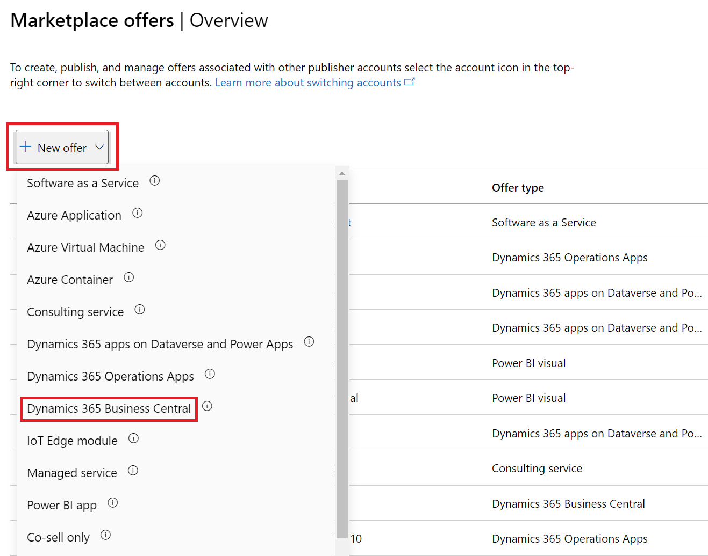

# Create a Dynamics 365 Business Central offer

This article describes how to create a [Dynamics 365 Business Central](https://dynamics.microsoft.com/business-central/overview) offer. This offer type is an enterprise resource planning (ERP) service that supports a wide range of business processes, including finance, operations, supply chain, CRM, project management, and electronic commerce. All offers for Dynamics 365 go through our certification process.

Before you start, create a commercial marketplace account in [Partner Center](create-account.md) and ensure it is enrolled in the commercial marketplace program.

## Before you begin

Before you can publish a Dynamics 365 Business Central offer, you must have a commercial marketplace account in Partner Center and ensure your account is enrolled in the commercial marketplace program. See [Create a commercial marketplace account in Partner Center](create-account.md) and [Verify your account information when you enroll in a new Partner Center program](/partner-center/verification-responses#checking-your-verification-status).

Review [Plan a Dynamics 365 offer](marketplace-dynamics-365.md). It explains the technical requirements for this offer and lists the information and assets you’ll need when you create it.

## Create a new offer

1. Sign in to [Partner Center](https://go.microsoft.com/fwlink/?linkid=2166002).

1. On the Home page, select the **Marketplace offers** tile.

    

1. On the Marketplace offers page, select **+ New offer** > **Dynamics 365 Business Central**.

    

> [!IMPORTANT]
> After an offer is published, any edits you make to it in Partner Center appear on Microsoft AppSource only after you republish the offer. Be sure to always republish an offer after changing it.

## New offer

1. In the dialog box that appears, enter an **Offer ID**. This is a unique identifier for each offer in your account.

    - This ID is visible to customers in the web address for the offer and in Azure Resource Manager templates, if applicable.
    - Use only lowercase letters and numbers. The ID can include hyphens and underscores, but no spaces. The combined sum of the Offer ID and Publisher ID is limited to 40 characters. For example, if your Publisher ID is `testpublisherid` and you enter **test-offer-1**, the offer web address will be `https://appsource.microsoft.com/product/dynamics-365/testpublisherid.test-offer-1`. In this case, the segment, “testpublisherid.test-offer-1”is 28 characters long, which is within the 40-character limit.
    - The Offer ID can't be changed after you select **Create**.

1. Enter an **Offer alias**. This is the name used for the offer in Partner Center.

    - This name isn't used on AppSource. It is different from the offer name and other values shown to customers.
    - This name can't be changed after you select **Create**.

1. Associate the new offer with a _publisher_. A publisher represents an account for your organization. You may have a need to create the offer under a particular publisher. If you don’t, you can simply accept the publisher account you’re signed in to.

    > [!NOTE]
    > The selected publisher must be enrolled in the [**Commercial Marketplace program**](marketplace-faq-publisher-guide.yml#how-do-i-sign-up-to-be-a-publisher-in-the-microsoft-commercial-marketplace-) and cannot be modified after the offer is created.

1. Select **Create** to generate the offer. Partner Center opens the **Offer setup** page.

## Alias

Enter a descriptive name that we'll use to refer to this offer solely within Partner Center. The offer alias (pre-populated with what you entered when you created the offer) won't be used in the marketplace and is different than the offer name shown to customers. If you want to update the offer name later, see the [Offer listing](dynamics-365-business-central-offer-listing.md) page.

## Setup details

Select the **Package type** that applies to your offer: (Biz Central)

- An **Add-on** app extends the experience and the existing functionality of Dynamics 365 Business Central. For details, see [Add-on apps](/dynamics365/business-central/dev-itpro/developer/readiness/readiness-add-on-apps).
- A **Connect** app can be used in the scenario where there must be established a point-to-point connection between Dynamics 365 Business Central and a third-party solution or service. For details, see [Connect Apps](/dynamics365/business-central/dev-itpro/developer/readiness/readiness-connect-apps).

For **How do you want potential customers to interact with this listing offer?**, select the option you'd like to use for this offer.

- **Get it now (free)** – List your offer to customers for free.
- **Free trial (listing)** – List your offer to customers with a link to a free trial. Offer listing free trials are created, managed, and configured by your service and do not have subscriptions managed by Microsoft.

    > [!NOTE]
    > The tokens your application will receive through your trial link can only be used to obtain user information through Azure Active Directory (Azure AD) to automate account creation in your app. Microsoft accounts are not supported for authentication using this token.

- **Contact me** – Collect customer contact information in the [Referrals workspace](https://partner.microsoft.com/dashboard/referrals/v2/leads) in Partner Center. You can also connect your customer relationship management (CRM) system to manage leads there.
        > [!NOTE]
        > Connecting to a CRM system is optional. For more information about configuring your CRM, see [Customer leads](#customer-leads).

## Test drive

A test drive is a great way to showcase your offer to potential customers by giving them the option to "try before you buy", resulting in increased conversion and the generation of highly qualified leads. To learn more, see [What is test drive?](what-is-test-drive.md).

To enable a test drive for a fixed period of time, select the **Enable a test drive** check box. To remove test drive from your offer, clear this check box.

> [!TIP]
> A test drive is different from a free trial. You can offer either a test drive, free trial, or both. They both provide customers with your solution for a fixed period-of-time. But, a test drive also includes a hands-on, self-guided tour of your product’s key features and benefits being demonstrated in a real-world implementation scenario.

## Customer leads

When a customer expresses interest or deploys your product, you’ll receive a lead in the [Referrals workspace](https://partner.microsoft.com/dashboard/referrals/v2/leads) in Partner Center.

You can also connect the product to your customer relationship management (CRM) system to handle leads there.

> [!NOTE]
> Connecting to a CRM system is optional.

To configure the lead management in Partner Center:

1. Under **Customer leads**, select the **Connect** link.
1. In the **Connection details** dialog box, select a lead destination.
1. Complete the fields that appear. For detailed steps, see the following articles:

   - [Configure your offer to send leads to the Azure table](./partner-center-portal/commercial-marketplace-lead-management-instructions-azure-table.md#configure-your-offer-to-send-leads-to-the-azure-table)
   - [Configure your offer to send leads to Dynamics 365 Customer Engagement](./partner-center-portal/commercial-marketplace-lead-management-instructions-dynamics.md#configure-your-offer-to-send-leads-to-dynamics-365-customer-engagement) (formerly Dynamics CRM Online)
   - [Configure your offer to send leads to HTTPS endpoint](./partner-center-portal/commercial-marketplace-lead-management-instructions-https.md#configure-your-offer-to-send-leads-to-the-https-endpoint)
   - [Configure your offer to send leads to Marketo](./partner-center-portal/commercial-marketplace-lead-management-instructions-marketo.md#configure-your-offer-to-send-leads-to-marketo)
   - [Configure your offer to send leads to Salesforce](./partner-center-portal/commercial-marketplace-lead-management-instructions-salesforce.md#configure-your-offer-to-send-leads-to-salesforce)

1. To validate the configuration you provided, select the **Validate** link.
1. Select **Connect**.

    For more information, see [Customer leads from your commercial marketplace offer](partner-center-portal/commercial-marketplace-get-customer-leads.md).

1. Select **Save draft** before continuing to the next tab in the left-nav menu, **Properties**.

## Next steps

- [Configure offer properties](dynamics-365-business-central-properties.md)
- [Offer listing best practices](gtm-offer-listing-best-practices.md)
