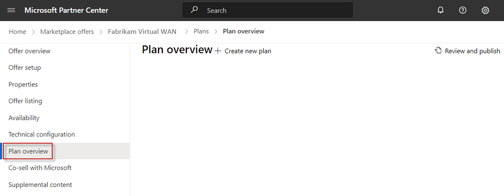
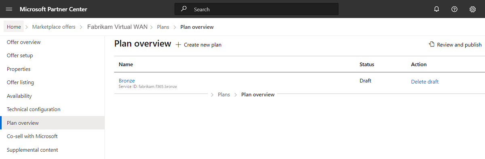

# Create Dynamics 365 apps on Dataverse and Power Apps plans

If you enabled app license management for your offer, the **Plans overview** tab appears as shown in the following screenshot. Otherwise, go to [Set up Dynamics 365 apps on Dataverse and Power Apps offer technical configuration](dynamics-365-customer-engage-technical-configuration.md).

You need to define at least one plan, if your offer has app license management enabled. You can create a variety of plans with different options for the same offer. These plans (sometimes referred to as SKUs) can differ in terms of monetization or tiers of service. Later, you will map the Service IDs of each plan in the metadata of your solution package to enable a runtime license check by the Dynamics platform against these plans (we'll walk you through this process later). You will map the Service ID of each plan in your solution package.

## Create a plan

1. In the left-nav, select **Plan overview**.
1. Near the top of the page, select **+ Create new plan**.
1. In the dialog box that appears, in the **Plan ID** box, enter a unique plan ID. Use up to 50 lowercase alphanumeric characters, dashes, or underscores. You cannot modify the plan ID after you select **Create**.
1. In the **Plan name** box, enter a unique name for this plan. Use a maximum of 200 characters.
1. Select **Create**.

## Define the plan listing

On the **Plan listing** tab, you can define the plan name and description as you want them to appear in the commercial marketplace. This information will be shown on the Microsoft AppSource listing page.

1. In the **Plan name** box, the name you provided earlier for this plan appears here. You can change it at any time. This name will appear in the commercial marketplace as the title of your offer's software plan.
1. In the **Plan description** box, explain what makes this software plan unique and any differences from other plans within your offer. This description may contain up to 3,000 characters.
1. Select **Save draft**.

## Define pricing and availability

If you chose to sell through Microsoft and have Microsoft host transactions on your behalf, then the **Pricing and availability** tab appears in the left-nav. Otherwise, go to [Copy the Service IDs](#copy-the-service-ids).

1. In the left-nav, select **Pricing and availability**.
1. In the **Markets** section, select **Edit markets**.
1. On the side panel that appears, select at least one market. To make your offer available in every possible market, choose **Select all** or select only the specific markets you want. When you're finished, select **Save**.

    Your selections here apply only to new acquisitions; if someone already has your app in a certain market, and you later remove that market, the people who already have the offer in that market can continue to use it, but no new customers in that market will be able to get your offer.

    > [!IMPORTANT]
    > It is your responsibility to meet any local legal requirements, even if those requirements aren't listed here or in Partner Center. Even if you select all markets, local laws, restrictions, or other factors may prevent certain offers from being listed in some countries and regions.

### Configure per user pricing

1. On the **Pricing and availability** tab, under **User limits**, optionally specify the minimum and maximum number of users that for this plan.
    > [!NOTE]
    > If you choose not to define the user limits, the default value of one to one million users will be used.
1. Under **Billing term**, specify a monthly price, annual price, or both.

    > [!NOTE]
    > You must specify a price for your offer, even if the price is zero.

### Enable a free trial

You can optionally configure a free trial for each plan in your offer. To enable a free trial, select the **Allow a one-month free trial** check box.

> [!IMPORTANT]
> After your transactable offer has been published with a free trial, it cannot be disabled for that plan. Make sure this setting is correct before you publish the offer to avoid having to re-create the plan.

If you select this option, customers are not charged for the first month of use. At the end of the free month, one of the following occurs:
- If the customer chose recurring billing, they will automatically be upgraded to a paid plan and the selected payment method is charged.
- If the customer didn’t choose recurring billing, the plan will expire at the end of the free trial.

### Choose who can see your plan

You can configure each plan to be visible to everyone or to only a specific audience. You grant access to a private plan using tenant IDs with the option to include a description of each tenant ID you assign. You can add a maximum of 10 tenant IDs manually or up to 20,000 tenant IDs using a .CSV file. A private plan is not the same as a preview audience.

> [!NOTE]
> If you publish a private plan, you can change its visibility to public later. However, once you publish a public plan, you cannot change its visibility to private.

#### Make your plan public

1. Under **Plan visibility**, select **Public**.
1. Select **Save draft**, and then go to [View your plans](#view-your-plans).

#### Manually add tenant IDs for a private plan

1. Under **Plan visibility**, select **Private**.
1. In the **Tenant ID** box that appears, enter the Azure AD tenant ID of the audience you want to grant access to this private plan. A minimum of one tenant ID is required.
1. (Optional) Enter a description of this audience in the **Description** box.
1. To add another tenant ID, select **Add ID**, and then repeat steps 2 and 3.
1. When you're done adding tenant IDs, select **Save draft**, and then go to [View your plans](#view-your-plans).

#### Use a .CSV file for a private plan

1. Under **Plan visibility**, select **Private**.
1. Select the **Export Audience (csv)** link.
1. Open the .CSV file and add the Azure IDs you want to grant access to the private offer to the **ID** column.
1. (Optional) Enter a description for each audience in the **Description** column.
1. Add "TenantID" in the **Type** column, for each row with an Azure ID.
1. Save the .CSV file.
1. On the **Pricing and availability** tab, under **Plan visibility**, select the **Import Audience (csv)** link.
1. In the dialog box that appears, select **Yes**.
1. Select the .CSV file and then select **Open**.
1. Select **Save draft**, and then the next section: View your plans.

### View your plans

1. In the breadcrumb at the top of the page, select **Plan overview**.
1. To create another plan for this offer, at the top of the **Plan overview** page, repeat the steps in the [Create a plan](#create-a-plan) section. Otherwise, if you're done creating plans, go to the next section: Copy the Service IDs.

## Copy the Service IDs

You need to copy the Service ID of each plan you created so you can map them to your solution package in the next section: Add Service IDs to your solution package.

1. To go to the **Plan overview** page, in the breadcrumb at the top of the page, select **Plan overview**. If you don’t see the breadcrumb, select **Plan overview** in the left-nav.

1. For each plan you created, copy the Service ID to a safe place. You’ll add them to your solution package in the next section. The service ID is listed on the **Plan overview** page in the form of `ISV name.offer name.plan ID`. For example, fabrikam.f365.bronze.

    

## Add Service IDs to your solution package

1. Add the Service IDs you copied in the previous step to the metadata of your solution package. To learn how, see [Add licensing information to your solution](/powerapps/developer/data-platform/appendix-add-license-information-to-your-solution) and [Create an AppSource package for your app](/powerapps/developer/data-platform/create-package-app-appsource).
1. After you create the CRM package .zip file, upload it to [Azure Blob Storage](/power-apps/developer/data-platform/store-appsource-package-azure-storage). You will need to provide the SAS URL of the Azure Blob Storage account that contains the uploaded CRM package .zip file, when configuring the technical configuration.

## Next steps

- Go to [Set up Dynamics 365 apps on Dataverse and Power Apps offer technical configuration](dynamics-365-customer-engage-technical-configuration.md) to upload the solution package to your offer.
