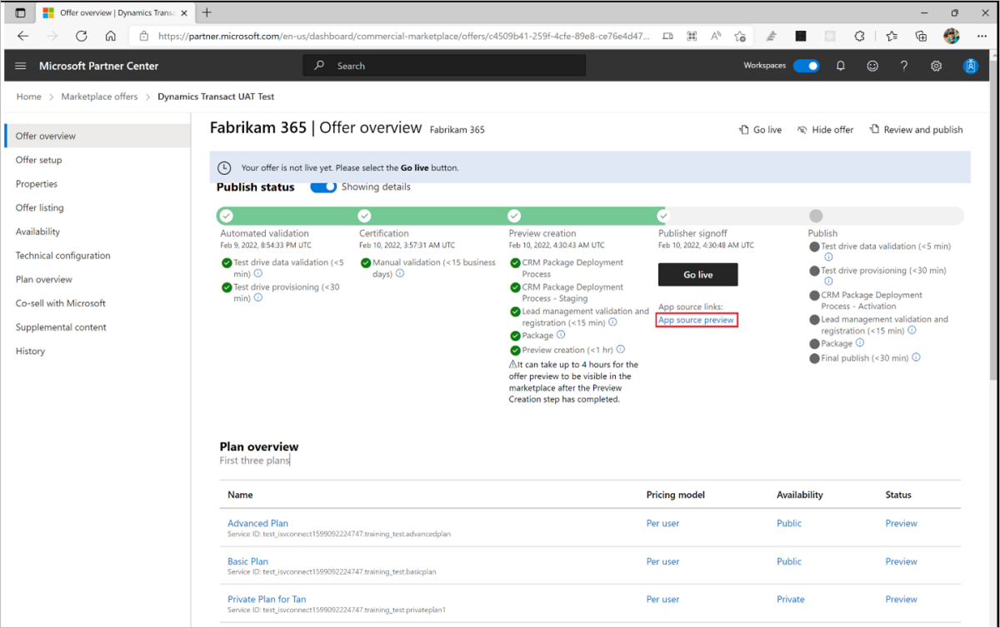

# Review and publish a Dynamics 365 offer

This article shows you how to use Partner Center to submit your Dynamics 365 offer for publishing, preview your offer, subscribe to a plan, and then publish it live to the commercial marketplace. It also covers how to check the publishing status as it proceeds through the publishing steps. You must have already created the offer that you want to publish.

## Submit your offer to publishing

1. Return to [Partner Center](https://go.microsoft.com/fwlink/?linkid=2166002).
1. On the Home page, select the **Marketplace offers** tile.
1. In the **Offer alias** column, select the offer you want to publish.
1. In the upper-right corner of the portal, select **Review and publish**.
1. Make sure that the **Status column** for each page for the offer says **Complete**. The three possible statuses are as follows:

    - **Not started** – The page is incomplete.
    - **Incomplete** – The page is missing required information or has errors that need to be fixed. You'll need to go back to the page and update it.
    - **Complete** – The page is complete. All required data has been provided and there are no errors.

1. If any of the pages have a status other than **Complete**, select the page name, correct the issue, save the page, and then select **Review and publish** again to return to this page.
1. Some offer types require testing. After all of the pages are complete, if you see a **Notes for certification** box, provide testing instructions to the certification team to ensure that your app is tested correctly. Provide any supplementary notes helpful for understanding your app.
1. To start the publishing process for your offer, select **Publish**. The **Offer overview** page appears and shows the offer's **Publish status**.

## Publish status

Your offer's publish status will change as it moves through the publication process. You can review your offer status on the **Overview** tab of the commercial marketplace offer in [Partner Center](https://partner.microsoft.com/dashboard/commercial-marketplace/overview). The **Status** of each offer will be one of the following:

| Status | Description |
| ------------ | ------------ |
| Draft | Offer has been created but it isn't being published. |
| Publish in progress | Offer is working its way through the publishing process. |
| Attention needed | We discovered a critical issue during certification or during another publishing phase. |
| Preview | We certified the offer, which now awaits a final verification by the publisher. Select **Go live** to publish the offer live. |
| Live | Offer is live in the marketplace and can be seen and acquired by customers. |
| Pending stop distribution | Publisher selected "stop distribution" on an offer or plan, but the action has not yet been completed. |
| Not available in the marketplace | A previously published offer in the marketplace has been removed. |

> [!TIP]
> After publishing an offer, the [owner](user-roles.md) of your developer account is notified of the publishing status and required actions through email and the Action Center in Partner Center. For more information about Action Center, see [Action Center Overview](/partner-center/action-center-overview).

## Preview and subscribe to the offer

When the offer is ready for you to test in the preview environment, we’ll send you an email to request that you review and approve your offer preview. You can also refresh the **Offer overview** page in your browser to see if your offer has reached the Publisher sign-off phase. If it has, the **Go live** button and preview link will be available. If you chose to sell your offer through Microsoft, anyone who has been added to the preview audience can test the acquisition and deployment of your offer to ensure it meets your requirements during this stage.

The following screenshot shows the **Offer overview** page for a _Dynamics 365 apps on Dataverse and Power apps_ offer, with a preview link under the **Go live** button. The validation steps you’ll see on this page vary depending on the selections you made when you created the offer.

- To preview your offer, select the _preview link_ under the **Go live** button. This takes you to the product details page on AppSource, where you can validate that all the details of the offer are showing correctly.

    

> [!IMPORTANT]
> To validate the end-to-end purchase and setup flow, purchase your offer while it is in Preview. First notify Microsoft with a support ticket to ensure we are aware that you're testing the offer. Otherwise, the customer account used for the purchase will be billed and invoiced. Publisher Payout will occur when the criteria are met and will be paid out per the payout schedule with the agency fee deducted from the purchase price.

If your offer is a _Contact Me_ listing, test that a lead is created as expected by providing the Contact Me details during preview.

## Test the offer in AppSource

1. From the _Product details_ page of the offer, select the **Buy Now** button.
1. Select the plan you want to purchase and then select **Next**.
1. Select the billing term, recurring billing term, and number of users.
1. On the Payment page, enter the sold-to address and payment method.
1. To place the order, select the **Place order** button.
1. Once the order is placed, you can select the **Assign licenses** button to go to the [Microsoft 365 admin center](https://admin.microsoft.com/) to assign licenses to users.

## Go live

After you complete your tests, you can publish the offer live to the commercial marketplace.

1. Return to [Partner Center](https://go.microsoft.com/fwlink/?linkid=2166002).
1. On the Home page, select the **Marketplace offers** tile.
1. On the Marketplace offers page, select the offer.
1. Select **Go live** to make your offer publicly available.

All offers for Dynamics 365 go through our certification process. Now that you’ve chosen to make your offer available in the commercial marketplace, we will perform certification and other verification processes before your offer is published to AppSource. If there is an issue, we will notify you with the details and provide guidance on how to fix it.

After these validation checks are complete, your offer will be live in the marketplace.

## Next steps

- If you enabled _Third-party app license management through Microsoft_ for your offer, after you sell your offer, you’ll need to register the deal in Partner Center. To learn more, see [Register deals you've won in Partner Center](/partner-center/register-deals).
- [Update an existing offer in the Commercial Marketplace](update-existing-offer.md)
