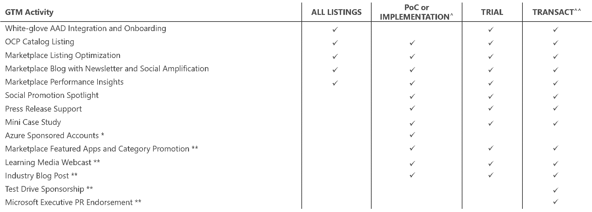

# GTM Benefits on the marketplace   
New listings in the storefronts on the marketplace are eligible to receive free Marketplace GTM benefits. After listing, marketing specialists at Microsoft contact you or your marketing contact to kick-start the activities. There is nothing for you to do except to engage with Microsoft when you are contacted.  

The activities that Microsoft provides differ depending on your solution status on the marketplace. Benefits significantly increase for listings.  

| storefront | Additional benefits available  |  
|:--- |:--- |  
| AppSource | <table> <tr><td>Microsoft Gold partners</td></tr> <tr><td>Trial apps</td></tr> </table> |  
| Azure Marketplace | <table> <tr><td>Transact offers</td></tr> <tr><td>Trial offers</td></tr> </table> |  

To maximize the impact of these activities, Microsoft encourages you to have your launch plan ready to implement. You might want to use your landing page for many of your launch tactics.  

>[!NOTE]
>One Commercial Partner Catalog (OCP Catalog) is a benefit of membership in the Microsoft Partner Network.  

  

Your go-to-market support includes templates, web content, training, and tools to promote your business.  
*   Forfor more information about go-to-market support, visit the Microsoft Go-To-Market Services page located at [partner.microsoft.com/reach-customers/gtm](https://partner.microsoft.com/reach-customers/gtm).  

## Next steps
*   Visit the [Azure Marketplace and AppSource Publisher Guide](./marketplace-publishers-guide.md) page.  
 
---  
