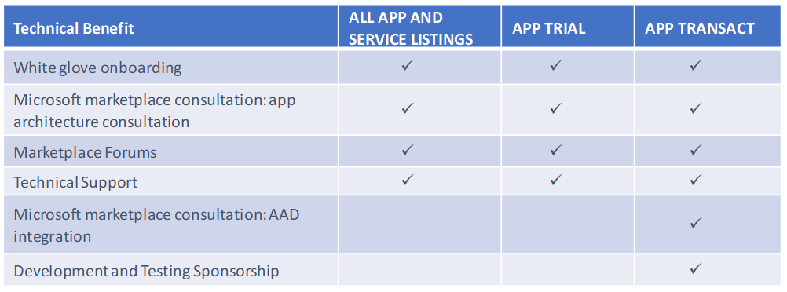
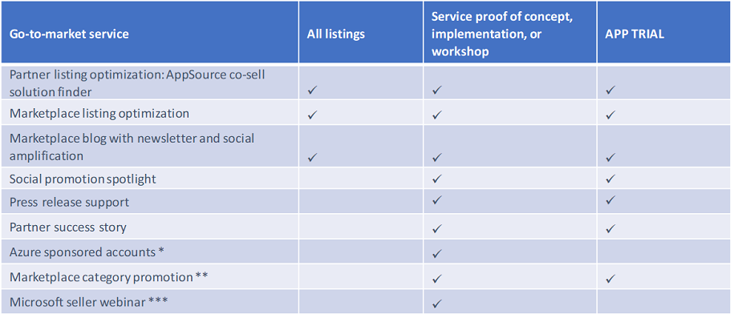

# Your Marketplace benefits

As part of your publishing journey, you need to create technical and marketing assets for your offer. As a result, there are technical and marketing benefits that Azure Marketplace and AppSource publishers can use in order to improve customer engagement with your offer. You may find the technical resources below useful.

## Technical resources provided by Microsoft

While you are creating your offer, you can take advantage of a number of Microsoft resources, such as consulting with a technical expert, or getting support for testing a marketplace-specific solution.

Technical resources can be used at any time.  The table below lists the benefits:

## How to access Microsoft resources

The Go-to-Market benefits are accessible to partners who have recently published an offer. 

1. Onboarding: [Register](https://azuremarketplace.microsoft.com/sell) to get access to the Cloud Partner Portal and onboarding support resources.
2. Microsoft Marketplaces Consultation: Take advantage of this [FREE consultation](https://support.microsoft.com/help/4010317/microsoft-marketplaces-consultation) to help plan the architecture of your app in marketplace.
3. Marketplace Forums: Ask your questions directly to Microsoft employees and other marketplace partners in the [Marketplace forum](https://www.microsoftpartnercommunity.com/t5/Azure-Marketplace-and-AppSource/bd-p/2222).
4. Technical Support: Use the Help menu in [Cloud Partner Portal](https://cloudpartner.azure.com/) to get help on your marketplace-related support questions. 
5. AAD Integration and Development and Testing sponsorship: you will be opted in when you go live with a transactable (deployable and billable offer). See the next section for how to get started with go-to-market benefits.

## Go-to-market (GTM) benefits in the Marketplace

New listings in both Azure Marketplace and AppSource are eligible to receive free marketplace GTM benefits through our Microsoft GTM Services team. This team will help you optimize your listings and increase awareness for your solutions in the Microsoft marketplace.

| Storefront | Additional available benefits |
|:--- |:--- |
| AppSource |  Microsoft Gold partners   Transact offers – Marketplace rewards   Trial Apps |
| The Azure Marketplace | Transact offers  – Marketplace rewards   Trial offers |

Your GTM support includes templates, web content, training, and tools to promote your business.

To access these benefits, you will need to:

1. Publish an offer in either Azure Marketplace or AppSource.
2. Ensure you have entered a marketing contact in the **contact information** portion of your offer. This should be a dedicated marketing resource, as opposed to a catch-all alias. (i.e, avoid using “support\@”, “info\@”, “marketing\@”, etc.)

Based on your solution status, offer being List, Trial, or Transact – Marketplace rewards, you will receive either an email with self-help resources, or an invitation to a consultation call with a dedicated Engagement Manager. You do not need to do anything to initiate the call—the Marketplace Onboarding Team will reach out to you based on the information you provide in the [Cloud Partner Portal](https://cloudpartner.azure.com/).

The scope of the activities available to you expands as you grow your offerings in the marketplace. All listings receive a base level of optimization recommendations and promotion.  These listings are also eligible for additional marketing benefits based on solution status (List, Trial, or Transact - marketplace rewards), chosen marketplace, and Microsoft Partner Competency achievement.

The table below summarize the eligibility requirements for list and trial offers:

\* Requires silver or gold competency.  
\*\* Requires gold competency.  
\*\*\* Requires gold competency and Co-sell Ready in Partner Listings.  
^ Transact only, applicable to Azure Marketplace.

## Marketplace rewards for transact partners

The full list of benefits for marketplace rewards can be viewed in the [program summary slides](https://onedrive.live.com/view.aspx?resid=1900675C97CA6FE0!630&ithint=file%2cpptx&authkey=!APQ6LSnDenx2FKM).

## Next steps

Sign in to the [Cloud Partner Portal](https://cloudpartner.azure.com/) to create and configure your offer.

---
