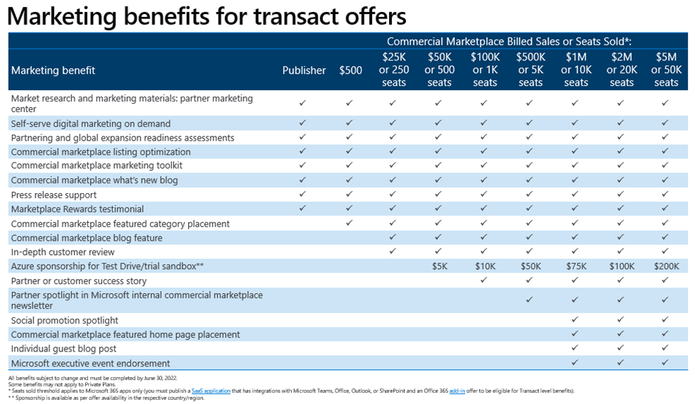
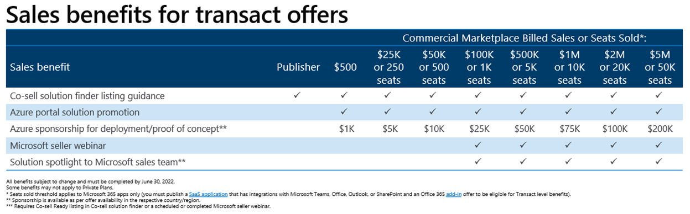
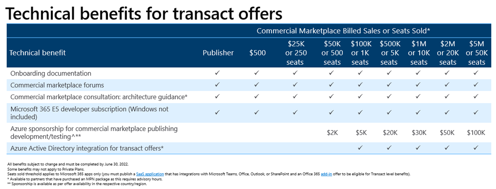

# Your commercial marketplace benefits

You've published to Microsoft commercial marketplace, now you want to see your offer be successful. We provide you the benefits - sales, technical, and marketing - you need to accelerate your offer's growth.

Once your offer is live on Microsoft AppSource or Azure Marketplace, go to [Partner Center](https://partner.microsoft.com/dashboard/mpn/membership/benefits/commercialmarketplace) to access and activate your eligible marketing, sales, and technical benefits. Marketplace Rewards benefits accrue based on your commercial marketplace engagement and sales. The more you engage, the more you get back.

## Marketplace Rewards

Marketplace Rewards is designed to support you at your specific stage of growth, starting with awareness activities to help you get your first customers. As you grow through the commercial marketplace, you unlock new benefits designed to help you convert customers and close deals.

The program creates a positive feedback loop: the benefits at each stage of growth are designed to progress you to the next stage, allowing you to grow your business to Microsoft customers, with Microsoft's field, and through Microsoft's channel by leveraging the commercial marketplace as your platform.

Your benefits are differentiated based on whether your offer is [List, Trial, or Transact](determine-your-listing-type.md#choose-a-listing-option).

You will be contacted by a member of the Rewards team when your offer goes live, based on your eligibility.

For Transact partners, as you grow your billed sales through the commercial marketplace platform, you unlock greater benefits per tier.

The minimum requirement to publish in the online stores is an MPNID, so these benefits are available to all partners regardless of MPN competency status or partner type. Each partner is empowered to grow their business through the commercial marketplace as a platform.

You will get support in understanding the resources available to you and in implementing the best practices, which you can also [review on your own](https://partner.microsoft.com/asset/collection/azure-marketplace-and-appsource-publisher-toolkit#/).

Detailed descriptions of all program benefits can be found in this [Marketplace Rewards program presentation](https://aka.ms/marketplacerewards).

Getting started is easy:

1. Publish an offer in either Microsoft AppSource or Azure Marketplace.
2. Go to [Marketplace Rewards](https://partner.microsoft.com/dashboard/mpn/program/commercialmarketplace) in Partner Center and select **Enroll in Marketplace Rewards Program**.
3. To activate sales and marketing benefits, assign a company marketing contact. This contact will receive follow-up communications about your Marketplace Rewards.
4. To add or update your marketing contact information, go to the top of the Sales and Marketing benefits tab on Marketplace Rewards page, then select **Add, update, or change**.  Next, do the following:

    1. Select a user from the list. If the user you want to assign is not in the list, you can add new users in **Account settings**.
    1. Provide an email address for the user that's different from the email address associated with your company's Partner Center account. We will email instructions for using your Marketplace Rewards benefit to your designated marketing contact's email address.
    1. Provide the contact phone and preferred language for this marketing contact. After you finish entering this information, select **Assign user**.
    1. After you've updated the marketing contact, select **Activate** for the benefit you want to start using. Once you activate a benefit, your marketing contact will be contacted by a member of the Rewards team within a week.

**Technical benefits**

1. You can use your technical benefits to request technical assistance during the presales, design, deployment, and app development phases of your cloud and hybrid solutions. To request assistance, fill in the request form and then select **Submit request**.
2. How to make use of Azure sponsorship benefits will be shared via an email as you unlock these benefits.

>[!NOTE]
>If your offer has been live for more than four weeks and you have not received a message, please check within your organization who is the owner of the offer in question, by looking in Partner Center. They should have the communication and next steps.  If you cannot determine the owner, or if the owner has left your company, you can raise a support ticket at [Help and Support](https://aka.ms/marketplacepublishersupport).

The scope of the activities available to you expands as you grow your offerings in the commercial marketplace. All listings receive a base level of optimization recommendations and promotion as part of a self-serve email of resources and best practices.

## List, trial, and consulting benefits

If you publish a trial or consulting proof of concept, implementation, or workshop, you will be assigned an engagement manager for three months, who will help guide you in a successful go-to-market plan. You can repeat this three-month engagement each time you publish a new offer, to help get each of your new offers started with success.

The table below summarizes the eligibility requirements for list, trial, and consulting offers:

Detailed descriptions for all these benefits can be found in the [Marketplace Rewards program deck](https://aka.ms/marketplacerewards).

## Marketplace Rewards for transact partners

When you go live with your transactable offer in either Microsoft AppSource or Azure Marketplace, you are able to access additional benefits as you grow your billed sales transactions or seats sold through the commercial marketplace.

>[!NOTE]
>Seats sold threshold only applies to Microsoft 365 apps (SaaS applications that have integrations with Microsoft Teams, Office, Outlook, or SharePoint) and benefits must have been completed by June 30, 2021.

These benefits are designed to support you in marketing, sales, and technical activities, and thereby helping you to get more visitors, receive more leads, and convert more business.

All partners who have a live offer get to work with a dedicated engagement manager to choose the highest-value activities for your portfolio of commercial marketplace offers. This engagement is evergreen per offer, meaning you can choose your activities and the timing of these activities to align to the timing of your company's broader marketing and sales strategies. 

\* Seats sold threshold applies to Microsoft 365 apps only (SaaS applications that have integrations with Microsoft Teams, Office, Outlook, or SharePoint) and benefits must be completed by June 30, 2021.

Detailed descriptions for all these benefits can be found in the [Marketplace Rewards program deck](https://aka.ms/marketplacerewards).

In addition to the rewards benefits, business applications partners with Dynamics offers published to Microsoft AppSource have supplementary programming available to them through [ISV Connect](https://partner.microsoft.com/solutions/business-applications/isv-overview). This includes technical, marketing, and sales support that is specialized for the needs of business applications partners.

## Marketplace Rewards requirements and restrictions

### Publisher Agreement

All the activities described on this page are covered by the [marketplace publisher agreement](https://go.microsoft.com/fwlink/?LinkID=699560) and are pursuant to the Commercial Benefits Program Addendum.

### Cancellation policy

[List and Trial](determine-your-listing-type.md) publishers can opt in or opt out to activities per offer publication. Partners may opt out of any engagement at any time. 

Microsoft reserves the right to revoke and terminate Marketplace Rewards benefits to publishers who: 

* Engage in illegal activity using their marketplace listing.
* Receive a purchase that is known or believed to be fraudulent.
* Are de-listed from the commercial marketplace. 
* Use their offer to show marketing or other content that violates copyright or trademark laws.
* Violate the policies of the [Azure sponsorship program](https://azure.microsoft.com/offers/ms-azr-0036p/), including, but not limited to, using the Azure sponsorship funding for their own internal operations or Bitcoin mining.

Microsoft reserves the right to revoke and terminate Marketplace Rewards when:

* The customer making the purchase did so accidentally and wishes to cancel the purchase. 
* The customer cancels before using the partner’s product.

### Offer availability

This offer is conducted in English for all partners with a live offer in Azure Marketplace or Microsoft AppSource.

Transactions that are proven to be fraudulent will not count towards a publisher's billed sales program tier, as noted in the [list, trial, consulting](#list-trial-and-consulting-benefits) section and the [transact partner benefits](#marketplace-rewards-for-transact-partners) section. Microsoft will allocate partners to eligibility tiers based on their actual billed sales, after the fraud has been removed.

## Next steps

Sign in to [Partner Center](https://partner.microsoft.com/dashboard/commercial-marketplace/overview) to create or configure your offer.

Activate your Marketplace Rewards benefits in [Partner Center](https://partner.microsoft.com/dashboard/commercial-marketplace/overview).

Review the [self-serve resources available to you](https://partner.microsoft.com/asset/collection/azure-marketplace-and-appsource-publisher-toolkit#/).

Sign up for the [Microsoft AppSource and Azure Marketplace community forum](https://aka.ms/MarketplaceCommunity) and learn about relevant topics or join the discussion.
