# Marketplace Insights dashboard in commercial marketplace analytics

This article provides information on the Marketplace Insights dashboard in Partner Center. This dashboard displays a summary of commercial marketplace web analytics that enables publishers to measure customer engagement for their respective product detail pages listed in the commercial marketplace online stores: Microsoft AppSource and Azure Marketplace.

For detailed definitions of analytics terminology, see [Commercial marketplace analytics terminology and common questions](./analytics-faq.yml).

## Marketplace Insights dashboard

The [Marketplace Insights dashboard](https://partner.microsoft.com/dashboard/insights/commercial-marketplace/analytics/marketplaceinsights) presents an overview of Azure Marketplace and AppSource offers’ business performance. This dashboard provides a broad overview of the following:

- Page visits trend
- Call to actions trend
- Page visits and Call to actions against offers, referral domains, and campaign IDs
- Marketplace Insights by geography
- Marketplace Insights details table

The Marketplace Insights dashboard provides clickstream data, which shouldn't be correlated with leads generated in the lead destination endpoint.

> [!NOTE]
> The maximum latency between users visiting offers on Azure Marketplace or AppSource and reporting in Partner Center is 48 hours.

## Access the Marketplace insights dashboard

1. Sign in to [Partner Center](https://partner.microsoft.com/dashboard/home).
1. On the Home page, select the **Insights** tile.

    

1. In the left menu, select **[Marketplace insights](https://partner.microsoft.com/dashboard/insights/commercial-marketplace/analytics/marketplaceinsights)**.

    [ 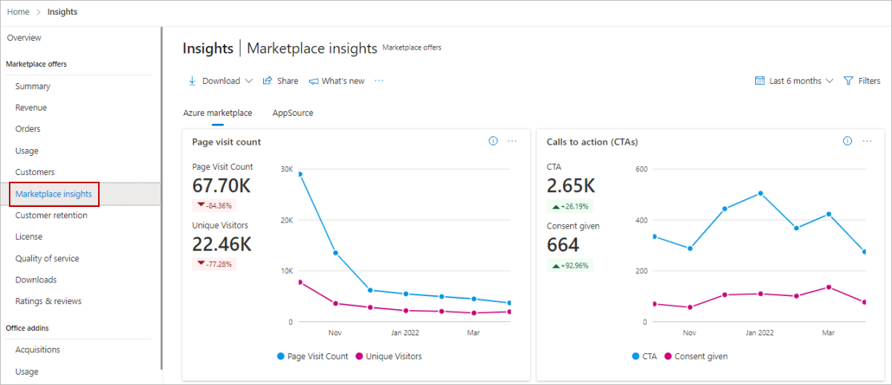 ](./media/insights-dashboard/marketplace-insights.png#lightbox)

## Elements of the Marketplace Insights dashboard

The following sections describe how to use the Marketplace Insights dashboard and how to read the data.

### Download

To download data for this dashboard, select **Download as PDF** from the **Download** list.

[ 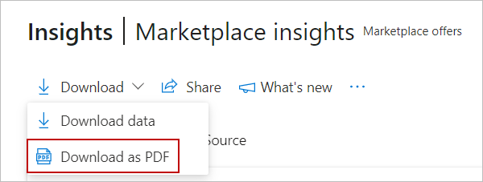 ](./media/insights-dashboard/download-as-pdf.png#lightbox)

Alternatively, you can go to the [Downloads dashboard](https://partner.microsoft.com/dashboard/insights/commercial-marketplace/analytics/downloads) to download the report.

### Share

To share the dashboard widgets data via email, in the top menu, select **Share**.

In the dialog box that appears, provide the recipient email address and message. To share the report URL, select the **Copy link** or **Share to Teams** button. To take a snapshot of charts data, select the **Copy as image** button.

[ 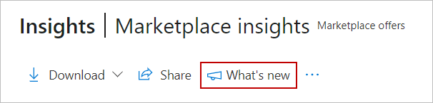 ](./media/insights-dashboard/share.png#lightbox)

### What's new

To learn about changes and enhancements that were made to the dashboard, select **What’s new**. The _What’s new_ side panel appears.

### About data refresh

To view the data source and the data refresh details, such as the frequency of the data refresh, select the ellipsis (three dots) and then select **Data refresh details**.

[ 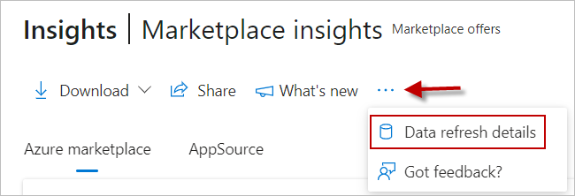 ](./media/insights-dashboard/data-refresh-details.png#lightbox)

### Got feedback?

To provide instant feedback about the report/dashboard, select the ellipsis (three dots), and then select the **Got feedback?** link.

[ 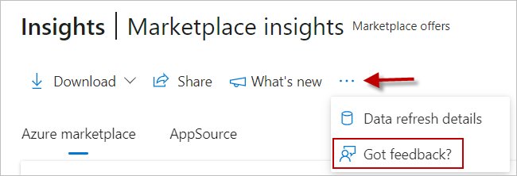 ](./media/insights-dashboard/got-feedback.png#lightbox)

### Month range

You can find a month range selection at the top-right corner of each page. Customize the output of the *Marketplace Insights* page graphs by selecting a month range based on the past 6 or 12 months, or by selecting a custom month range with a maximum duration of 12 months. The default month range is six months.

[ 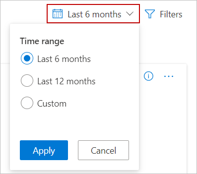 ](./media/insights-dashboard/dashboard-time-range.png#lightbox)

### Marketplace Insights dashboard filters

Filter the data by offer names. Filter options are dynamic and based on the selected date range.

To select the filters, in the top-right of the page, select **Filters**.

:::image type="content" source="./media/insights-dashboard/dashboard-filters.png" alt-text="Screenshot of the Filters button in the top menu..":::

In the panel that appears on the right, select the offer names you want, and then select **Apply**.

:::image type="content" source="./media/insights-dashboard/dashboard-filters-panel.png" alt-text="Screenshot of the dashboard filters panel.":::

### Page visits trends

The Marketplace Insights **Visitors** chart displays a count of _Page visits_ and _Unique visitors_ for the selected computation period.

**Page visits**: This number represents the count of distinct user sessions on the offer listing page (product detail page) for a selected computation period. The red and green percentage indicators represent the growth percentage of page visits. The trend chart represents the month-to-month count of page visits.

**Unique visitors**: This number represents the distinct visitor count during the selected computation period for the offer(s) in Azure Marketplace and AppSource. A visitor who has visited one or more product detail pages will be counted as one unique visitor.

[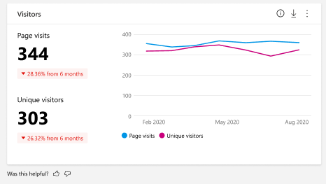](./media/insights-dashboard/visitors.png#lightbox)

Select the ellipsis (three dots) to copy the widget image, download aggregated widget data as .CSV file, and download the image as a PDF for sharing purposes.

### Call to actions trend

This number represents the count of **Call to Action** button clicks completed on the offer listing page (product detail page). _Calls to action_ are counted when users select the **Get It Now**, **Free Trial**, **Contact Me**, or **Test Drive** buttons. *Consent given* represents the total count of clicks for customer-provided consent to Microsoft or the partner. 

> [!NOTE]
> Consent given is not equivalent to leads. For more information about leads from marketplace, see [Get leads insights](/partner-center/referral-leads-insights).

The following screenshot shows two places where *Consent given* clicks appear.

:::image type="content" source="./media/insights-dashboard/consent-given.png" alt-text="Illustrates a location where a consent button is selected.":::

The following graph shows the *CTA* vs. *Consent given* metric.

:::image type="content" source="./media/insights-dashboard/call-to-action.png" alt-text="Shows a sample graph of Calls to Action vs. Consent Given.":::

Select the ellipsis (three dots) to copy the widget image, download aggregated widget data as a .CSV file, and download the image as a .PDF.

[ 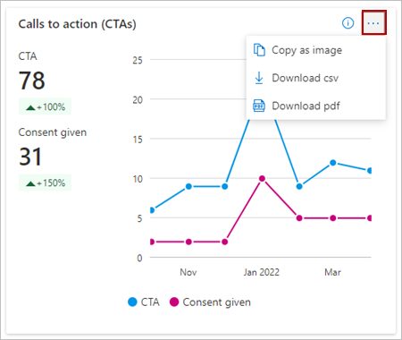 ](./media/insights-dashboard/call-to-action-ellipsis.png#lightbox)

### Page visits and Call to action

This widget provides page visits and calls to action against offers, referral domains, and campaign IDs.

#### Offers

Select the **Offer alias** tab to select a specific offer to see the monthly trend of page visits, calls to action, and consent-given clicks on the chart.

Select the ellipsis (three dots) to copy the widget image, download aggregated widget data as .CSV file, and download the image as a .PDF.

[ 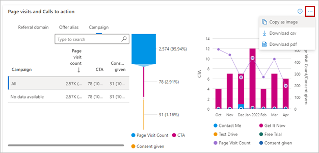 ](./media/insights-dashboard/offer-alias-tab-ellipsis.png#lightbox)

#### Referral domains

Selecting a specific referral domain on the **Referral domain** tab shows the monthly trend of page visits, calls to action, and consent clicks on the chart to the right. Additionally, there is a column for Platform – website and client, displays for AppSource offers only. The funnel view depicts the conversion rates among page views, calls to action, and consent-given clicks on the chart.

:::image type="content" source="./media/insights-dashboard/referral-domains-funnel-graph.png" alt-text="Shows a sample funnel graph of referral domains.":::

#### Campaign IDs

By selecting a specific campaign ID on the **Campaign** tab, you should be able to understand the success of the campaign. For each campaign, you should be able to see the monthly trend of page visits, calls to action, and consent-given clicks on the chart.

:::image type="content" source="./media/insights-dashboard/campaign-id-funnel-graph.png" alt-text="Illustrates the campaign chart on the Marketplace Insights dashboard.":::

### Marketplace Insights by geography

For the selected computation period, the geographical spread heatmap displays the count of page visits, unique visitors, and calls to action (CTA). The light to dark color on the map represents the low to high value of the unique visitors. Select a record in the table to zoom in on a country/region.

Select the ellipsis (three dots) to copy the widget image, download aggregated widget data as a .CSV file, and download the image as a .PDF.

[ 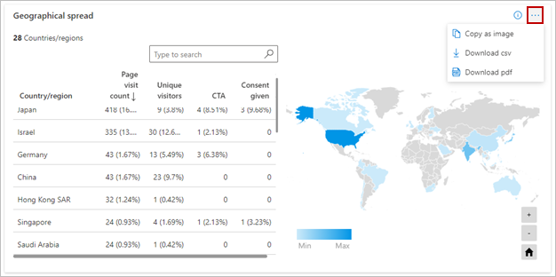 ](./media/insights-dashboard/geographical-spread-ellipsis.png#lightbox)

Note the following:

- You can move the map to view the exact location.
- You can zoom into a specific location.
- The heatmap has a supplementary grid to view the details of customer count, order count, and normalized usage hours in the specific location.
- You can search and select a country/region in the grid to zoom to the location in the map. Revert to the original view by selecting the **Home** button in the map.

### Marketplace Insights details table

This table provides a list view of the page visits and the calls to action of your selected offers' pages sorted by date.

- The data can be extracted to a .TSV or .CSV file if the count of records is less than 1,000.
- If the count of records is over 1,000, exported data will be asynchronously placed in a downloads page for the next 30 days.
- Filter data by Offer names and Campaign names to display the data you are interested in.

[ 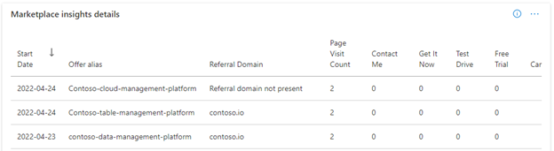 ](./media/insights-dashboard/marketplace-insights-details.png#lightbox)

> [!TIP]
> You can provide feedback on each of the widgets by selecting the “thumbs up” or “thumbs down” icon.

| Column name in user interface | Attribute name | Definition | Column name in programmatic access reports |
| ------------ | ------------- | ------------- | ------------- |
| Date | Date of Visit | The date of page visit and/or CTA click event generation on the offer’s page in Azure Marketplace and/or AppSource. | Date |
| Offer Name | Offer Name | The name of the commercial marketplace offering. | OfferName |
| Referral Domain | Referral Domain | The name of the referral domain from where the page visit happened. If there are no referral domains captured for the page visit, then the corresponding entry is “Referral domain not present”. |  ReferralDomain |
| Country Name | Country Name | The name of the country from where the page visit has happened. | CountryName |
| Page Visits | Page Visits | The number of page visits associated with the Offer Name for a particular date. | PageVisits |
| Get It Now | Get It Now | The number of clicks to the “Get It Now” CTA on the offer’s page for a particular date. | GetItNow |
| Contact Me | Contact Me | The number of clicks to the “Contact Me” CTA on the offer’s page for a particular date. | ContactMe |
| Test Drive | Test Drive | The number of clicks to the “Test Drive” CTA on the offer’s page for a particular date. | TestDrive |
| Free Trial | Free Trial | The number of clicks to the “Free Trial” CTA on the offer’s page for a particular date. | FreeTrial |
| Campaign | Name of the Campaign | Ability to understand web telemetry (page visit and CTA clicks) against the campaign name. | Campaign |
| Consent given | Consent given | Total count of clicks for customer-provided consent to Microsoft or the partner | consentGivenCount |
| Platform | Platform | Indicates website or client (in-product store) as the source for page view, CTA, or consent clicks | platforms |
| n/a | Site | The name of the storefront from which the page visit or CTA click occurred. The possible values are: - AZUREMARKETPLACE - APPSOURCE | Site |

## Next steps

- For an overview of analytics reports available in the commercial marketplace, see [Access analytic reports for the commercial marketplace in Partner Center](analytics.md).
- For information about your orders in a graphical and downloadable format, see [Orders dashboard in commercial marketplace analytics](orders-dashboard.md).
- For virtual machine (VM) offers usage and metered billing metrics, see [Usage dashboard in commercial marketplace analytics](usage-dashboard.md).
- For detailed information about your customers, including growth trends, see [Customer dashboard in commercial marketplace analytics](customer-dashboard.md).
- For a list of your download requests over the last 30 days, see [Downloads dashboard in commercial marketplace analytics](downloads-dashboard.md).
- To see a consolidated view of customer feedback for offers on Azure Marketplace and AppSource, see [Ratings & Reviews analytics dashboard in Partner Center](ratings-reviews.md).
- For frequently asked questions about commercial marketplace analytics and for a comprehensive dictionary of data terms, see [Commercial marketplace analytics terminology and common questions](analytics-faq.yml).
