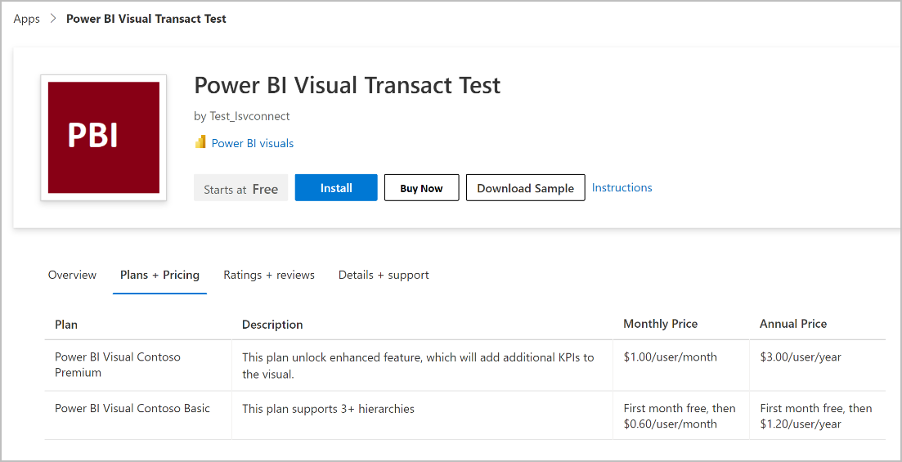

# ISV app license management for Power BI visual offers

Applies to the following offer type:

- Power BI visual

ISV app license management enables independent software vendors (ISVs) who build Power BI visual solutions using Power BI/Power Platform suite of products to manage and enforce licenses for their solutions using systems provided by Microsoft. By adopting this, ISVs can:
- Enable customers to assign and unassign licenses of ISV products using familiar tools such as Microsoft 365 admin center, which customers use to manage Office and Power BI licenses.
- Leverage the runtime Power BI license API to enforce licenses and ensure that only licensed users can access their solutions.
- Save themselves the effort of building and maintaining their own license management and transaction system.

ISV app license management currently supports:
- A named user license model. Each license must be assigned to an Azure AD user or Azure AD security group.

## Pre-requisites

To manage your ISV app licenses, you need to comply with the following pre-requisites.

1. Have a valid [Microsoft Cloud Partner Program account](/partner-center/mpn-create-a-partner-center-account).
1. Be signed up for commercial marketplace program. For more information, see [Create a commercial marketplace account in Partner Center](create-account.md).
1. Your developer team has the development environments and tools required to create Power BI visuals solutions. See [Develop your own Power BI visual and Tutorial: Develop a Power BI circle card visual](/power-bi/developer/visuals/develop-power-bi-visuals).

## High-level process

These steps illustrate the high-level process to manage ISV app licenses:

### Step 1: ISV creates a transactable offer in Partner Center

ISV creates an offer in Partner Center and chooses to transact through Microsoft’s commerce system and enable Microsoft to manage the licenses of these visuals. The ISV also defines at least one plan and configures pricing information and availability.

### Step 2: ISV adds license enforcement to their Power BI visual solution package

ISV creates a Power BI visual solution package for the offer that leverages Power BI runtime license to perform [license enforcement](https://go.microsoft.com/fwlink/?linkid=2201222) as per the plan that the user has access to.

### Step 3: Customers purchase subscription to ISV products

Customers discover ISV’s offer in AppSource. Customers purchase subscription to the offer from [AppSource](https://appsource.microsoft.com/) and get licenses for the Power BI visual.

### Step 4: Customers manage subscription

Customers can manage the subscriptions of these visuals and offers in [Microsoft 365 admin center](https://admin.microsoft.com/Adminportal/Home#/subscriptions), just like they normally do for any of their other subscriptions, such as Office or Power BI subscriptions.

### Step 5: Customers assign licenses

Customers can assign licenses of these Power BI visuals in license pages under the billing node in [Microsoft 365 admin center](https://admin.microsoft.com/Adminportal/Home#/subscriptions). Customers can assign licenses to users or groups. Doing so will enable these users to launch the Power BI visual.

### Step 6: ISV enforces runtime checks

ISV enforces license check based on the plans that user has access to.

### Step 7: ISV can view reports

ISVs can view information on:
- Revenue details and payout information
- Orders purchased / renewed / canceled over time and by geography
- Assigned licenses over time and by geography

<!--- [
| Step | Details |
| ------------ | ------------- |
| ISV creates a transactable offer in Partner Center. | ISV creates an offer in Partner Center and chooses to transact through Microsoft’s commerce system and enable Microsoft to manage the licenses of these visuals. The ISV also defines at least one plan and configures pricing information and availability. |
| ISV adds license enforcement to their Power BI visual solution package | ISV creates a Power BI visual solution package for the offer that leverages Power BI runtime license to perform license enforcement as per the plan that the user has access to. |
| Customers purchase subscription to ISV products | Customers discover ISV’s offer in AppSource. Customers purchase subscription to the offer from [AppSource](https://appsource.microsoft.com/) and get licenses for the Power BI visual. |
| Customers manage subscription | Customers can manage the subscriptions of these visuals and offers in [Microsoft 365 admin center](https://admin.microsoft.com/Adminportal/Home#/subscriptions), just like they normally do for any of their other subscriptions, such as Office or Power BI subscriptions. |
| Customers assign licenses | Customers can assign licenses of these Power BI visuals in license pages under the billing node in [Microsoft 365 admin center](https://admin.microsoft.com/Adminportal/Home#/subscriptions). Customers can assign licenses to users or groups. Doing so will enable these users to launch the Power BI visual. |
| ISV enforces runtime checks | ISV enforces license check based on the plans that user has access to. |
| ISV can view reports | ISVs can view information on: - Revenue details and payout information - Orders purchased / renewed / canceled over time and by geography - Assigned licenses over time and by geography |
]() --->

## Offer listing page on AppSource

After your offer is published, the options you chose will drive which buttons appear to a user. This screenshot shows an offer listing page on AppSource.

## Next steps

- [Plan a Power BI visual offer](marketplace-power-bi-visual.md)
- [Create a Power BI visual offer](power-bi-visual-offer-setup.md)
