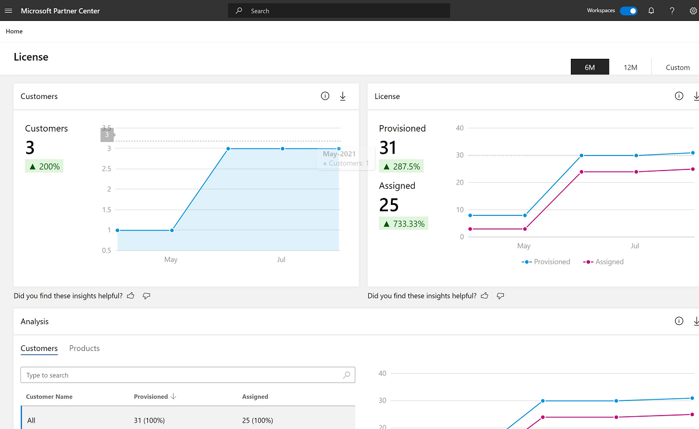
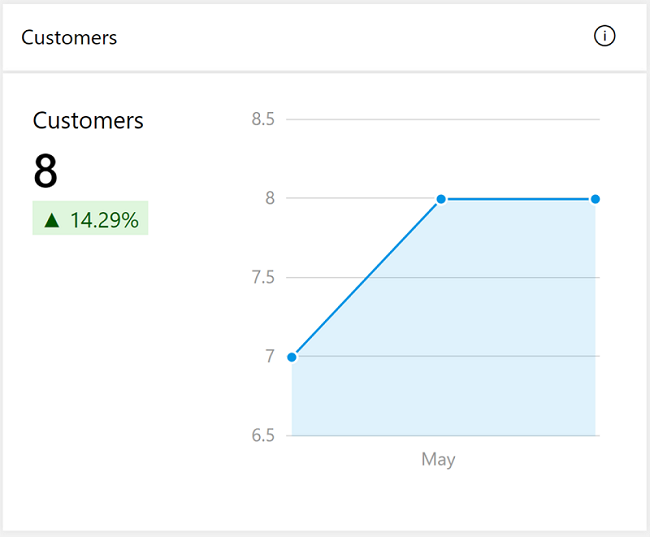
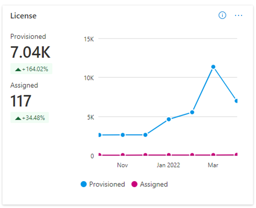
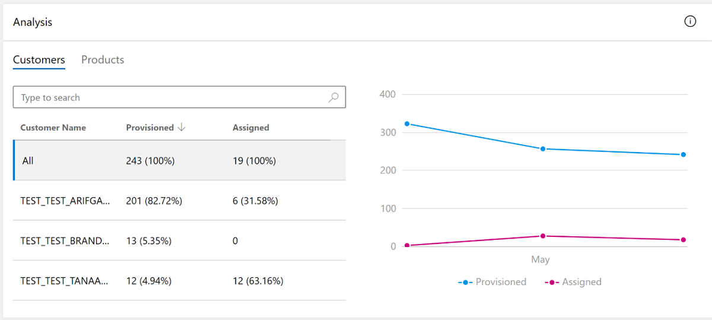
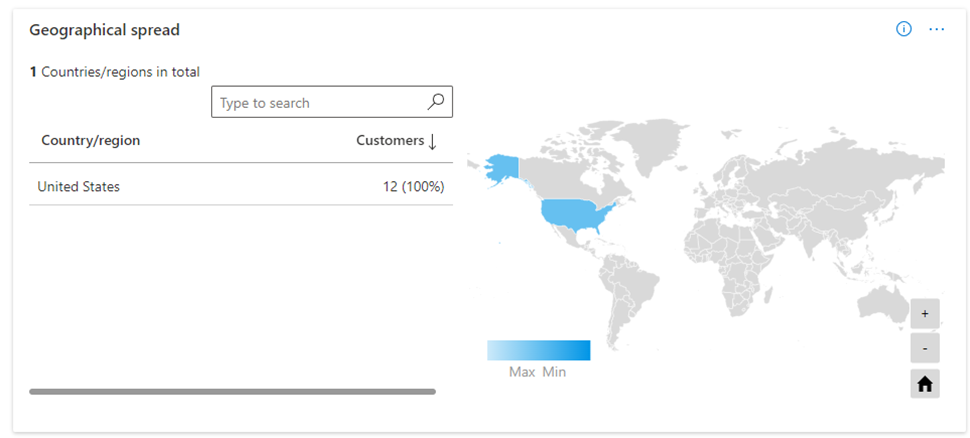

# License dashboard in commercial marketplace analytics

This article provides information about the License dashboard in the commercial marketplace program in Partner Center. The License dashboard shows the following information:

- Number of customers who purchased licenses
- Total number of licenses purchased
- Total number of licenses deployed
- Number of licenses purchased and deployed by the customer
- Distribution of licenses across countries and regions

## Check license usage

To check license usage of ISV apps in Partner Center, do the following:

1. Sign in to [Partner Center](https://partner.microsoft.com/dashboard/home).
1. On the Home page, select the **Insights** tile.

    

1. In the left menu, select **[License](https://partner.microsoft.com/dashboard/insights/commercial-marketplace/analytics/license)**.

    

## Elements of the License dashboard

The following sections describe how to use the License dashboard and how to read the data.

### Download

:::image type="content" source="./media/license-dashboard/button-download.png" alt-text="Screenshot of the Download function in the License dashboard.":::

To download a snapshot of the dashboard, select **Download as PDF**. Alternatively, go to the [Downloads](https://partner.microsoft.com/dashboard/insights/commercial-marketplace/analytics/downloads) dashboard and download the report.

### Share

:::image type="content" source="./media/license-dashboard/button-share.png" alt-text="Screenshot showing the email window option of the Share function on the Insights screen of the License dashboard":::

To email dashboard widgets data, select **Share** and provide the email information. Share report URLs using **Copy link** and **Share to Teams**, or **Copy as image** to send a snapshot of chart data.

:::image type="content" source="./media/license-dashboard/email-window.png" alt-text="Screenshot of the email function on the Insights screen of the License dashboard.":::

### What’s new

:::image type="content" source="./media/license-dashboard/button-what-new.png" alt-text="Screenshot of the What's New function on the Insights screen of the License dashboard.":::

Use this to check on changes and enhancements.

### Data refresh details

:::image type="content" source="./media/license-dashboard/button-data.png" alt-text="Screenshot of the Data function on the Insights screen of the License dashboard.":::

View the data source and the data refresh details, such as frequency of the data refresh.

### Got feedback?

:::image type="content" source="./media/license-dashboard/button-feedback.png" alt-text="Screenshot of the Got Feedback function in the License dashboard.":::

Submit feedback about the report/dashboard along with an optional screenshot.

:::image type="content" source="./media/license-dashboard/feedback.png" alt-text="Screenshot showing the Got Feedback window for the Share function on the Insights screen of the License dashboard.":::

## Month range filter

:::image type="content" source="./media/license-dashboard/month-range.png" alt-text="Screenshot of the month range selections on the License dashboard in Partner Center.":::

A month range selection is at the top-right corner of each page. Customize the output of the graphs by selecting a month range based on the past **six** or **12** months, or by selecting a **custom** month range with a maximum duration of 12 months. The default month range is six months.

### License page dashboard filters

:::image type="content" source="./media/license-dashboard/button-filters.png" alt-text="Screenshot of filter selections on the Insights screen of the License dashboard.":::

The page has dashboard-level filters for the following:

- Offer type
- Offer name
- Offer plan name
- Customer name
- Country

Each filter is expandable with multiple options that are dynamic based on the selected date range.

## Customers widget

The _Customers widget_ shows the current number of customers. The trend chart shows the month-over-month number of customers.

Select the ellipsis (...) to copy the widget image, download aggregated widget data as a .csv file, or download the image as a PDF.

## License widget

This widget shows the current number of provisioned and assigned licenses. The trend chart shows the month-over-month number of provisioned and assigned licenses. View the data for the last **six** or **12** months, or choose a **custom** date range.

Select the ellipsis (...) to copy the widget image, download aggregated widget data as a .csv file, or download the image as a PDF.

## Analysis widget

The _Analysis widget_ shows the number and percentage of provisioned and assigned licenses per offer and plan. The trend chart shows the month-over-month number of provisioned and assigned licenses. Using this widget, you can filter the data by Customers or Products.

Select the ellipsis (...) to copy the widget image, download aggregated widget data as a .csv file, or download the image as a PDF.

## License Distribution widget

The _License Distribution_ widget shows the distribution of licenses across different countries and regions. The colored regions show where the user licenses are distributed. To revert to the default view, select the **Reset zoom** button (Home icon) in the widget.

Select the ellipsis (...) to copy the widget image, download aggregated widget data as a .csv file, or download the image as a PDF.

## Data terms in License report downloads

You can use the download icon in the upper-right corner of any widget to download the data.

| Attribute name | Definition |
| ------------ | ------------- |
| Customer Country | Customer’s billing country |
| Customer Country Code | Customer’s billing country code |
| Customer Name | Customer name |
| Activation Date | Date when licenses were activated |
| Product Display Name | Offer title as shown in AppSource |
| Product ID | Product ID |
| Licenses Provisioned | Number of licenses activated into the customer’s account |
| Licenses Assigned | Number of licenses customer has assigned to their users |
| SKU Name | Name of the plan in the offer |
| Tenant ID | Unique ID of the tenant |
| License State | License state |
| Service ID | Unique identifier used in the package to map the plan with the license checks |

## Next steps

- Overview of analytics reports available in the commercial marketplace: [Access analytic reports for the commercial marketplace in Partner Center](analytics.md).
