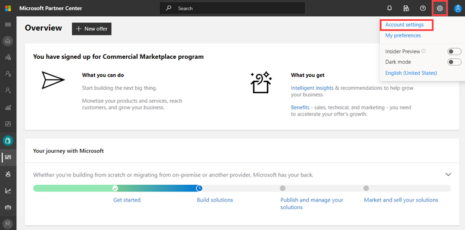
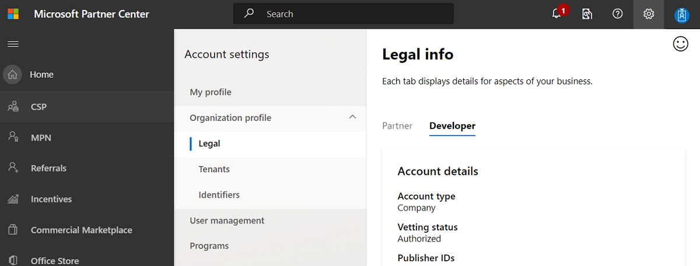

# Manage your commercial marketplace account in Partner Center

**Appropriate roles**

- Owner
- Manager

Once you've [created a Partner Center account](./create-account.md), you can use the [commercial marketplace dashboard](https://partner.microsoft.com/dashboard/commercial-marketplace/overview) to manage your account and offers.

## Access your account settings

If you have not already done so, you (or your organization's administrator) should access the [account settings](https://partner.microsoft.com/dashboard/account/management) for your Partner Center account.

1. Sign in to the [commercial marketplace dashboard](https://partner.microsoft.com/dashboard/commercial-marketplace) in Partner Center with the account you want to access. If you’re part of multiple accounts and have signed in with a different, you can [switch accounts](switch-accounts.md).
1. In the top-right, select **Settings** (gear icon), and then select **Account settings**.

    

1. Under **Account settings** select **Legal**. Then select the **Developer** tab to view details related to your commercial marketplace account.

    

### Account settings page

When you select **Settings** and expand **Account settings**, the default view is **Legal info**. This page can have up to three tabs, depending on the programs you have enrolled in: _Partner_, _Reseller_, and _Developer_.

The **Partner** tab, for partners enrolled in MPN, includes:

- All the legal business information such as registered legal name and address for your company
- Primary contact
- Business locations.

The **Reseller** tab, for partners doing CSP business, includes:

- Primary contact information
- Customer support profile
- Program information

The **Developer** tab, for partners enrolled in any developer program, has the following information:

- **Account details**: Account type and Account status
- **Publisher IDs**: Seller ID, User ID, Publisher ID, Azure AD tenants, and more
- **Contact info**: Publisher display name, seller contact (name, email, phone, and address) and Company approver (name, email, phone)

### Account settings - Developer tab

The following information describes the information on the Developer tab.

#### Account details

In the _Account details_ section of the _Developer_ tab, you can see basic info, such as your **Account type** (Company or Individual) and the **Verification status** of your account. During your account verification process, these settings will display each step required, including email verification, employment verification, and business verification.

#### Publisher IDs

In the Publisher IDs section, you can see your **Symantec ID** (if applicable), **Seller ID**, **User ID**, **MPN ID**, and **Azure AD tenants**. These values are assigned by Microsoft to uniquely identify your developer account and can't be edited.

If you don’t have a Symantec ID, you can select the link to request one.

### Contact info

In the _Contact info_ section, you can see your **Publisher display name**, **Seller contact info** (the contact name, email, phone number, and address for the company seller), and the **Company approver** (the name, email, and phone number of the individual with authority to approve decisions for the company).

You can also select the **Update** link to change your contact info, such as publisher display name and email address.

### Account settings identifiers

Under **Account settings** > **Organization profile**, select **Identifiers** to see the following information:

- **MPN IDs**: Any MPN IDs associated with your account
- **CSP**: MPN IDs associated with the CSP program for this account.
- **Publisher**: Seller IDs associated with your account
- **Tracking GUIDs**: Any tracking GUIDs associated with your account

#### Tracking GUIDs

Globally Unique Identifiers (GUIDs) are unique reference numbers (with 32 hexadecimal digits) that can be used for tracking your Azure usage.

To create GUIDs for tracking, you should use a GUID generator. The Azure Storage team has created a [GUID generator form](https://aka.ms/StoragePartners) that will email you a GUID of the correct format and can be reused across the different tracking systems.

We recommend that you create a unique GUID for every offer and distribution channel for each product. You can opt to use a single GUID for the product's multiple distribution channels if you do not want reporting to be split.

If you deploy a product by using a template and it is available on both the Azure Marketplace and on GitHub, you can create and register two distinct GUIDs:

- Product A in Azure Marketplace
- Product A on GitHub

Reporting is done by the partner value (Microsoft Partner ID) and the GUIDs. You can also track GUIDs at a more granular level aligning to each plan within your offer.

For more information, see the [Tracking Azure customer usage with GUIDs FAQ](azure-partner-customer-usage-attribution.md#faq)).

### Agreements

The **Agreements** page lets you view a list of the publishing agreements that you've authorized. These agreements are listed according to name and version number, including the date it was accepted and the name of the user that accepted the agreement.

To access the Agreements page:

1. Sign in to [Partner Center](https://partner.microsoft.com/dashboard/home).
1. In the top-right, select **Settings** > **Account settings**.
1. Under **Account settings**, select **Agreements**.

**Actions needed** may appear at the top of this page if there are agreement updates that need your attention. To accept an updated agreement, first read the linked Agreement Version, then select **Accept agreement**.

## Set up a payout profile

A payout profile is the bank account to which proceeds are sent from your sales. This bank account must be in the same country or region where you registered your Partner Center account. For more information about a payout profile, see [Create and manage incentives payout and tax profiles in Partner Center](/partner-center/incentives-create-and-manage-your-payout-and-tax-profiles) and [Set up your payout account and tax forms](/partner-center/set-up-your-payout-account).

To set up your payout profile:

1. Go to the [commercial marketplace overview page](https://partner.microsoft.com/dashboard/commercial-marketplace/overview) in Partner Center.
2. In the **Profile** section, next to **Payout Profile**, select **Update**.
3. **Choose a payment method**: Bank account or PayPal.
4. **Add payment information**: This may include choosing an account type (checking or savings), entering the account holder name, account number, and routing number, billing address, phone number, or PayPal email address. For more information about using PayPal as your account payment method and to find out whether it is supported in your market or region, see [PayPal info](/windows/uwp/publish/setting-up-your-payout-account-and-tax-forms#paypal-info).

> [!IMPORTANT]
> Changing your payout account can delay your payments by up to one payment cycle. This delay occurs because we need to verify the account change, just as we do when first setting up the payout account. You'll still get paid for the full amount after your account has been verified; any payments due for the current payment cycle will be added to the next one.  

## Tax profile

Review your current tax profile status, confirming the correct **Entity type** and **Tax Certificate Information** is displayed. Select **Edit** to update or complete any required forms.

In order to establish your tax status, you must specify your country or region of residence and citizenship and complete the appropriate tax forms associated with your country or region.

Regardless of your country or region of residence or citizenship, you must fill out United States tax forms to sell any offers through Microsoft. Partners who satisfy certain United States residency requirements must fill out an IRS W-9 form. Other partners outside the United States must fill out an IRS W-8 form. You can fill out these forms online as you complete your tax profile.

A United States Individual Taxpayer Identification Number (or ITIN) is not required to receive payments from Microsoft or to claim tax treaty benefits.

You can complete and submit your tax forms electronically in Partner Center; in most cases, you don't need to print and mail any forms.

Different countries and regions have different tax requirements. The exact amount that you must pay in taxes depends on the countries and regions where you sell your offers. Microsoft remits sales and uses tax on your behalf in some countries and regions. These countries and regions will be identified in the process of listing your offer. In other countries and regions, depending on where you are registered, you may need to remit sales and use tax for your sales directly to the local taxing authority. In addition, the sales proceeds you receive may be taxable as income. We strongly encourage you to contact the relevant authority for your country or region that can best help you determine the right tax info for your Microsoft sales transactions.

For more information about a tax profile, see [Create and manage incentives payout and tax profiles in Partner Center](/partner-center/incentives-create-and-manage-your-payout-and-tax-profiles) and [Set up your payout account and tax forms](/partner-center/set-up-your-payout-account).

### Withholding rates

The info you submit in your tax forms determines the appropriate tax withholding rate. The withholding rate applies only to sales that you make into the United States; sales made into non-US locations are not subject to withholding. The withholding rates vary, but for most developers registering outside the United States, the default rate is 30%. You have the option of reducing this rate if your country or region has agreed to an income tax treaty with the United States.

### Tax treaty benefits

If you are outside the United States, you may be able to take advantage of tax treaty benefits. These benefits vary from country/region to country/region, and may let you reduce the amount of taxes that Microsoft withholds. You can claim tax treaty benefits by completing Part II of the W-8BEN form. We recommend that you communicate with the appropriate resources in your country or region to determine whether these benefits apply to you.

[Learn more about tax details for Windows app/game developers and Azure Marketplace publishers](/windows/uwp/publish/tax-details-for-paid-apps).

### Payout hold status

By default, Microsoft sends payments on a monthly basis. However, you can optionally put your payouts on hold, which will prevent the sending of payments to your account. If you choose to put your payouts on hold, we'll continue to record any revenue that you earn and provide the details in your **Payout summary**. However, we won't send any payments to your account until you remove the hold.

**To place your payments on hold**:

1. Go to **Account settings**. 
1. In the left-nav expand **Payout and tax** and select **Payout and tax profiles**.
1. Select the program for which you want to hold payments, and then select the **Hold my Payment** check box.

You can change your payout hold status at any time, but be aware that your decision will impact the next monthly payout. For example, if you want to hold April's payout, make sure to set your payout hold status to **On** before the end of March.

After you set your payout hold status to **On**, all payouts will be on hold until you toggle the slider back to **Off**. When you do so, you'll be included during the next monthly payout cycle (provided any applicable payment thresholds have been met). For example, if you've had your payouts on hold, but would like to have a payout generated in June, then make sure to toggle the payout hold status to **Off** before the end of May.

> [!NOTE]
> Your **Payout hold status** selection applies to **all** revenue sources that are paid through Microsoft Partner Center, including Azure Marketplace, Microsoft AppSource, Microsoft Store, advertising, and so on.). You cannot select different hold statuses for each revenue source.

## Devices

The device management settings apply only to universal windows platform (UWP) publishing. [Learn more](/windows/uwp/publish/manage-account-settings-and-profile#additional-settings-and-info).

## Create a billing profile

If you are publishing a [Dynamics 365 for Customer Engagement & Power Apps](dynamics-365-customer-engage-offer-setup.md) or [Dynamics 365 for Operations](./partner-center-portal/create-new-operations-offer.md) offer, you need to complete your *billing profile*.

The billing address is pre-populated from your legal entity, and you can update this address later. The TAX and VAT ID fields are required for some countries and optional for others. The country/region name and company name cannot be edited.

1. Go to **Account settings**.
1. Then in the left-nav expand **Organization profile** and select **Billing profile**.

## Multi-user account management

Partner Center uses [Azure Active Directory](/azure/active-directory/fundamentals/active-directory-whatis) (Azure AD) for multi-user account access and management. Your organization's Azure AD is automatically associated with your Partner Center account as part of the enrollment process.

## Next steps

- [Add and manage users](add-manage-users.md)
