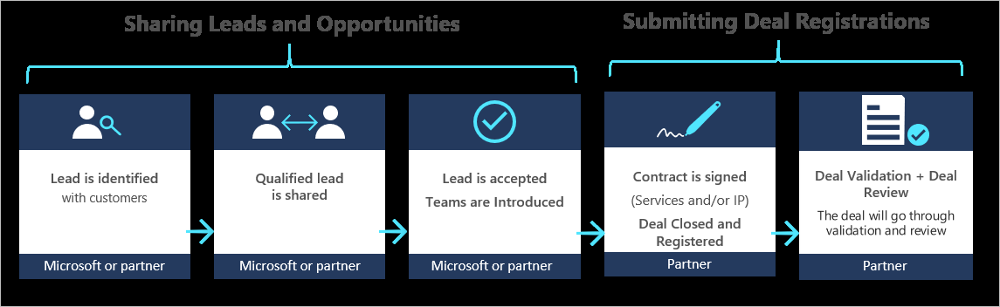

# Co-sell partner engagement

You can use the Co-sell program to work directly with Microsoft sellers on joint selling opportunities and to unlock significant additional commercial and merchandising benefits selling through Commercial Marketplace.

The Co-sell program is available for **software built with your intellectual property (IP) as repeatable, packaged offers** and for **services with Microsoft technology embedded**. Most offer types in the Co-sell program are also available in the commercial marketplace. Offers that meet additional requirements become **Co-sell ready** or **Co-sell incentivized**.

- **Co-sell ready** offers are exposed to Microsoft field sellers. When working with Microsoft sellers, the Co-sell program helps you reach a vast community of Microsoft managed customers to collaborate on sales opportunities that accelerate your business growth.

<ul>

</ul>

- **Co-sell incentivized** IP solutions can earn incentives for Microsoft field sellers when they are sold in collaboration with Microsoft sales teams, in addition to the marketplace benefits listed below.</li></ul>

## Marketplace benefits for incentivized offers

Offers that attain **Azure IP Co-sell incentivized** status gain these additional marketplace benefits:

* The marketplace service fee is reduced from 20% to 10%. This discount applies to your IaaS or SaaS offer sold through the commercial marketplace. See [Reduced Service Fee](marketplace-commercial-transaction-capabilities-and-considerations.md#reduced-service-fee) for more details.
* Cloud Solution Provider (CSP) partners receive a 10% incentive to sell your IaaS or SaaS offer. Learn more about the CSP program at [Cloud Solution Provider program](cloud-solution-providers.md).
* Sales of your offer through commercial marketplace will contribute towards customers’ Azure consumption commitments. Eligible customers will see the offer marked as **"Azure benefit eligible"** in Azure Portal. See [Azure consumption commitment benefit](azure-consumption-commitment-benefit.md) for more details.
* Offers that achieve **Azure IP Co-sell incentivized** or **Business Applications Co-sell incentivized** status will receive a **"Preferred solutions"** badge in the storefronts. The badge promotes an offer's quality, performance, and ability to address customer needs in a certain industry vertical or solution area. Learn more at [Preferred solutions in Microsoft AppSource and Azure Marketplace](preferred-solutions.md).

## Co-sell publishing steps and requirements

The table below lists the steps and requirements to get your marketplace offer co-sell ready or co-sell incentivized. Not all commercial marketplace offer types are configurable for Co-sell yet in Partner Center. You can refer to [Co-sell option in Partner Center](https://docs.microsoft.com/azure/marketplace/partner-center-portal/commercial-marketplace-co-sell) for the latest information. 

|Step    |Offer type    |Requirements    |Co-sell status    |
|----    |-------------    |------------    |---------------   |
|<ol start=1><li> Create an account in Partner Center and publish your offer in the commercial marketplace.</li>|All|<li>The offer meets the commercial marketplace publishing requirements.</li><li>You have a complete business profile in Partner Center.</li>|Not ready|
|<ol start=2><li>Submit required Co-sell materials.</li>|IP offers *with* [Co-sell option in Partner Center](https://docs.microsoft.com/azure/marketplace/partner-center-portal/commercial-marketplace-co-sell)|[Upload required materials in Partner Center](#how-to-submit-co-sell-materials-in-partner-center): <ul><li>Sales contact for each eligible country.</li><li>Bill of materials: customer one-pager, customer presentation deck (optional), solution landing page URL, social media channel URL, or other (for example, a case study).|Co-sell ready|
||IP offers *without* [Co-sell option in Partner Center](https://docs.microsoft.com/azure/marketplace/partner-center-portal/commercial-marketplace-co-sell)|<li>Request to [work with a Cloud Specialist](https://partner.microsoft.com/campaigns/ced-nomination-form/) to provide required Co-sell documentation.|Co-sell ready|
||Consulting Services|<li>Request to [work with a Cloud Specialist](https://partner.microsoft.com/campaigns/ced-nomination-form/) to provide required Co-sell documentation.</li><li>Active Gold competency.</li>|Co-sell ready|
|<ol start=3><li>Qualify for IP Co-sell incentives</li>|Azure Applications, Azure Containers, IoT Edge Modules, SaaS, VMs|After achieving Co-sell ready, there are two additional requirements: <ul> Requirement 1: achieve either:<ul><li>*At the organization level:* meet or exceed $100,000 USD of Azure Consumed Revenue over the trailing 12 months.</li><li>*At the offer level:* cumulative marketplace billed revenue of $100,000 USD.</li></ul> Requirement 2: more than 50% of your offer's infrastructure must run on Azure:<ul><li>IP offers *with* [Co-sell option in Partner Center](https://docs.microsoft.com/azure/marketplace/partner-center-portal/commercial-marketplace-co-sell): upload an architecture diagram with your Co-sell documents in Partner Center for review.</li><li>IP offers *without* [Co-sell option in Partner Center](https://docs.microsoft.com/azure/marketplace/partner-center-portal/commercial-marketplace-co-sell): upload an architecture diagram to OCP GTM.|Azure IP Co-sell incentivized|
||Dynamics|<li>You have an active enrollment in ISV Connect premium tier.</li>|Business Applications Co-sell incentivized|

## How to submit Co-sell materials in Partner Center

Start your co-sell journey directly in Partner Center following the steps below. For more details, see [Co-sell option in Partner Center](./partner-center-portal/commercial-marketplace-co-sell.md).

1. Sign in to [Partner Center](https://partner.microsoft.com/dashboard/home).
1. On the left pane, select **Commercial Marketplace** > **Overview**, then select the offer that you want to co-sell.

    > [!NOTE]
    > You can join the Co-sell program with a new offer not yet published or with an offer that is already published.

1. In the menu on the left, select **Co-sell with Microsoft**.

    

1. Provide details about your offer and upload collateral in the **Documents** section. Microsoft sellers will use this information to recommend and sell your offer.
 
   

1. Upload sales contact information in the **Contacts** section. Microsoft sellers may reach out to these contacts to request additional information about your offer.

     

1. Save the draft before you continue.
1. After you've completed all the required sections of the offer, you can submit it for review and publication. In the upper right, select **Review and publish**. Review the offer details, then select **Publish**.
1. We’ll review the materials you uploaded and determine if your offer qualifies for the Co-sell program.

## Next steps

* Learn more about [selling with Microsoft](https://partner.microsoft.com/membership/sell-with-microsoft).
* Learn more about the [Co-sell option in Partner Center](./partner-center-portal/commercial-marketplace-co-sell.md).
* Read the [Co-sell Playbook](https://aka.ms/Co-sellPartnerengagementguidepartnerlink) (PDF).
