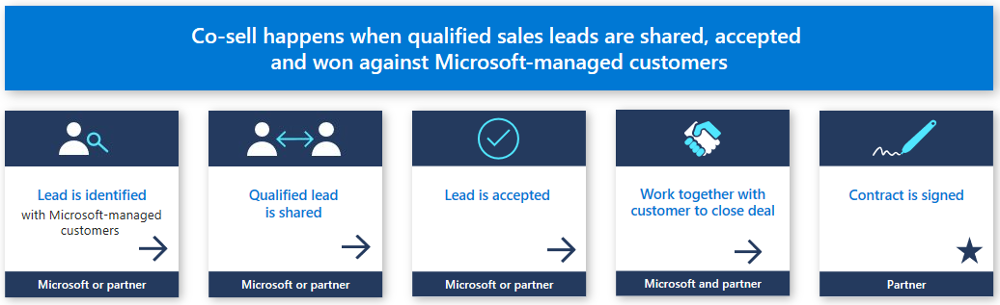

# Co-sell partner engagement

Microsoft's co-sell program enables partners to work directly with Microsoft on joint selling opportunities. You can reach a vast community of customers and create new sales opportunities that can help accelerate business growth.

## Partner selling motions

There are three partner selling motions:

* *Sell through partner*: You can resell Microsoft technology through your own sellers.
* *Services co-sell*: Sellers and partners collaborate to sell your project or managed services with Microsoft technology embedded.
* *IP co-sell*: Sellers/partners collaborate to sell your repeatable, packaged IP solution*.

\* Some of these IP co-sell solutions may receive additional incentives when successfully sold and deployed with Microsoft's field sales teams.

## Next steps

- Learn more about [selling with Microsoft](https://partner.microsoft.com/membership/sell-with-microsoft).
- Learn about the [Co-sell option in Partner Center](./partner-center-portal/commercial-marketplace-co-sell.md) .
