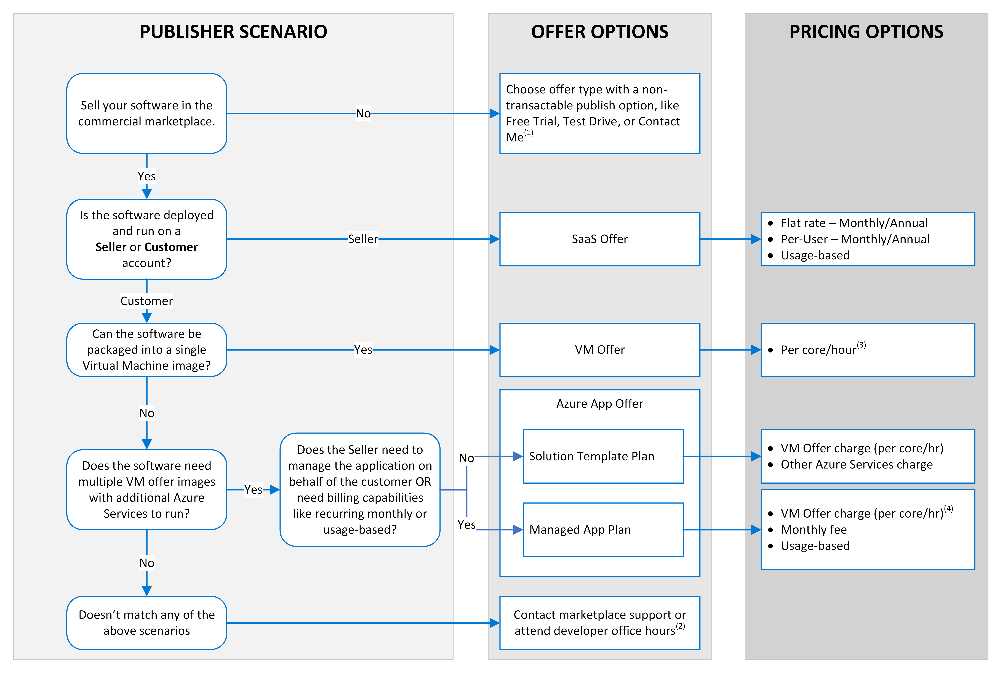

# Commercial marketplace transact capabilities

This article describes pricing, billing, invoicing and payout considerations for *transactable* offers sold through the commercial marketplace. For information about publishing non-transactable (free or BYOL) offers, see [Introduction to listing options](determine-your-listing-type.md).

> [!TIP]
> To see the customer's view of purchasing in the commercial marketplace, see [Azure Marketplace purchasing](/marketplace/azure-purchasing-invoicing). For SaaS offers, see [Purchase SaaS apps on Microsoft AppSource](/marketplace/purchase-software-appsource).

## Transactions by listing option

Either the publisher or Microsoft is responsible for managing software license transactions for offers in the commercial marketplace. The listing option you choose for your offer determines who manages the transaction. For availability and explanations of each publishing option, see [Introduction to listing options](determine-your-listing-type.md).

### Transact publishing option

Choosing to sell through Microsoft takes advantage of Microsoft commerce capabilities and provides an end-to-end experience from discovery and evaluation to purchase and implementation. A *transactable* offer is one in which Microsoft facilitates the exchange of money for a software license on the publisher’s behalf. Transact offers are billed against an existing Microsoft subscription or credit card, allowing Microsoft to host cloud marketplace transactions on behalf of the publisher.

You choose the transact option when you create a new offer in Partner Center. This option will appear only if transact is available for your offer type.

## Transact overview

When using the transact option, Microsoft enables the sale of third-party software and deployment of some offer types to the customer's Azure subscription. The publisher must consider the billing of infrastructure fees and your own software licensing fees when selecting a pricing model for an offer.

The transact publishing option is currently supported for the following offer types:

| Offer type | Billing cadence | Metered billing | Pricing model |
| ------------ | ------------- | ------------- | ------------- |
| Azure Application  (Managed application) | Monthly | Yes | Usage-based and flat rate |
| Azure Container | Monthly [1] | No | Usage-based, BYOL |
| Azure Virtual Machine | Monthly [2] | No | Usage-based, BYOL |
| Software as a service (SaaS) | One-time upfront monthly, annual [3,4] | Yes | Flat rate, per user, usage-based. |
| Dynamics 365 apps on Dataverse and Power Apps [5] | Monthly and annual | No | Per user |
| Power BI visual [6] | Monthly and annual | No | Per user |

[1] Azure Container offers support usage-based billing plans. These plans are billed monthly for hourly use of the usage based on per core, or per every core in cluster.

[2] Azure Virtual Machine offers support usage-based billing plans. These plans are billed monthly for hourly use of the subscription based on per core, per core size, or per market and core size usage.

[3] SaaS plans support monthly, 1-year, 2-year, and 3-year terms that can be billed either monthly or for the entire term upfront. See [Plan a SaaS offer for the commercial marketplace](plan-saas-offer.md#plans).

[4] If you choose to configure a 2-year or 3-year billing term, or a 1-year billing term with a monthly payment option, your offer will be published to Azure Marketplace only. If you update an offer that is currently published live on AppSource with a multi-year billing term, the offer will be delisted from AppSource and published to Azure Marketplace only.

[5] Dynamics 365 apps on Dataverse and Power Apps offers that you transact through Microsoft are automatically enabled for license management. See [ISV app license management for Dynamics 365 apps on Dataverse and Power Apps](isv-app-license.md).

[6] Power BI visual offers that you transact through Microsoft are automatically enabled for license management. See [ISV app license management for Power BI visual offers](isv-app-license-power-bi-visual.md).

### Metered billing

The *Marketplace metering service* lets you specify pay-as-you-go (consumption-based) charges in addition to monthly or annual charges included in the contract (entitlement). You can charge usage costs for marketplace metering service dimensions that you specify such as bandwidth, tickets, or emails processed. For more information about metered billing for SaaS offers, see [Metered billing for SaaS using the commercial marketplace metering service](./partner-center-portal/saas-metered-billing.md). For more information about metered billing for Azure Application offers, see [Managed application metered billing](marketplace-metering-service-apis.md).

### Billing infrastructure costs

For **virtual machines**, **containers**, and **Azure applications**, Azure infrastructure usage fees are billed to the customer's Azure subscription. Infrastructure usage fees are priced and presented separately from the software provider's licensing fees on the customer's invoice.

For **SaaS Apps**, the publisher must account for Azure infrastructure usage fees and software licensing fees as a single cost item. It is represented as a flat fee to the customer. The Azure infrastructure usage is managed and billed to the publisher directly. Actual infrastructure usage fees are not seen by the customer. Publishers typically opt to bundle Azure infrastructure usage fees into their software license pricing. Software licensing fees aren't metered or based on user consumption.

## Pricing models

Depending on the transaction option used, subscription charges are as follows:

- **Subscription pricing**: Software license fees are presented as a recurring subscription fee billed as a flat rate or per-seat:
    -  SaaS plans support monthly, 1-year, 2-year, and 3-year terms that can be billed either monthly or for the entire term upfront. See [Plan a SaaS offer for the commercial marketplace](plan-saas-offer.md#plans).
    - Azure virtual machine plans support monthly, 1-year, and 3-year plans that are billed monthly. See [Plan a virtual machine offer](marketplace-virtual-machines.md#plans-pricing-and-trials).
    - Azure application (Managed application) plans are billed monthly. See [Plan a managed application](plan-azure-app-managed-app.md#define-pricing).
- **Usage-based pricing**: For Azure Virtual Machine and Container offers, customers are charged based on the extent of their use of the offer. For Virtual Machine images and Container offers, customers are charged an hourly Azure Marketplace fee, as set by the publisher, for use of virtual machines and containers deployed from the VM images and Container offers, respectively. Partial hours are charged by the minute. Plans are billed monthly. The hourly fee may be uniform or varied across virtual machine sizes.
- **Metered pricing**: For Azure Application offers and SaaS offers, publishers can use the [Marketplace metering service](marketplace-metering-service-apis.md) to bill for consumption based on the custom meter dimensions they configure. These changes are in addition to the flat rate charges included in the contract (entitlement). Examples of custom meter dimensions are bandwidth, tickets, or emails processed. Publishers can define one or more metered dimensions for each plan but a maximum of 30 per offer. Publishers are responsible for tracking individual customer usage, with each meter defined in the offer. Events should be reported to Microsoft within an hour of occurrence. Microsoft charges customers based on the usage information reported by publishers for the applicable billing period.

> [!NOTE]
> Offers that are billed according to consumption after a solution has been used are not eligible for refunds.

To change the prices associated with an active transactable offer, see [Changing prices in active commercial marketplace offers](price-changes.md).

### Determine offer type and pricing plan

Use this flowchart to determine the appropriate *transactable* offer type and pricing plan to sell your software in the commercial marketplace. This chart assumes you, the publisher, have a clear understanding of your software delivery and licensing/billing models.

Generally, SaaS offers are a good fit if your customers just want to subscribe to your service and use it online. With SaaS, the publisher (you) host the software in your cloud infrastructure, managing technical infrastructure, app software, and data management responsibilities.

Virtual Machine and Azure Application offers are a good fit if you want customers to deploy, manage, and run your packaged app or service (as a VM Image and/or other Azure services in the ARM template) in their own Azure cloud infrastructure.

[1] Attend [Microsoft Office Hours](https://go.microsoft.com/fwlink/?linkid=2185526) or [support](./support.md).

[2] VM offer images can be included in the Azure App offer to increase pricing and deployment flexibility.

[3] This can include your own VM offers.

[4] Customer pays additional infrastructure costs since Azure services are deployed on the customer tenant for VM and Azure App offers.

### Usage-based and subscription pricing

When publishing an offer as a usage-based or subscription transaction, Microsoft provides the technology and services to process software license purchases, returns, and charge-backs. In this scenario, the publisher authorizes Microsoft to act as an agent for these purposes. The publisher allows Microsoft to facilitate the software licensing transaction. The publisher, however, retains the designation as the seller, provider, distributor, and licensor.

Microsoft enables customers to order, license, and use your software, subject to the terms and conditions of both Microsoft's commercial marketplace and your end-user licensing agreement. You must either provide your own end-user licensing agreement or select the [Standard Contract](./standard-contract.md) when creating the offer.

### Free software trials

For transact publishing scenarios, you can make a software license available free for 30 to 120 days, depending on the subscription. Customers will be charged for applicable Azure infrastructure usage.

### Examples of pricing and store fees

**Usage-based**

Usage-based pricing has the following cost structure:

| **Your license cost** | **$1.00 per hour** |
|---------|---------|
| Azure usage cost (D1/1-Core) | $0.14 per hour |
| *Customer is billed by Microsoft* | *$1.14 per hour* |

In this scenario, Microsoft bills $1.14 per hour for use of your published VM image.

| **Microsoft bills** | **$1.14 per hour**  |
|---------|---------|
| Microsoft pays you 97% of your license cost | $0.97 per hour |
| Microsoft keeps 3% of your license cost  |  $0.03 per hour |
| Microsoft keeps 100% of the Azure usage cost | $0.14 per hour |

**Bring Your Own License (BYOL)**

BYOL has the following cost structure:

| **Your license cost** | **License fee negotiated and billed by you** |
|---------|---------|
|Azure usage cost (D1/1-Core)    |   $0.14 per hour     |
| *Customer is billed by Microsoft* | *$0.14 per hour* |

In this scenario, Microsoft bills $0.14 per hour for use of your published VM image.

| **Microsoft bills** | **$0.14 per hour** |
|---------|---------|
| Microsoft keeps the Azure usage cost | $0.14 per hour |
| Microsoft keeps 0% of your license cost | $0.00 per hour |

**SaaS app subscription**

SaaS subscriptions can be priced at a flat rate or per user. If you enable the  **Sell through Microsoft** option for a SaaS offer, you have the following cost structure:

| **Your license cost** | **$100.00 per month** |
|--------------|---------|
| Azure usage cost (D1/1-Core) | Billed directly to the publisher, not the customer |
| *Customer is billed by Microsoft* | *$100.00 per month (publisher must account for any incurred or pass-through infrastructure costs in the license fee)* |

In this scenario, Microsoft bills $100.00 for your software license and pays out $97.00.

| **Microsoft bills** | **$100.00 per month** |
|---------|---------|
| Microsoft pays you 97% of your license cost  | $97.00 per month |
| Microsoft keeps 3% of your license cost | $3.00 per month |

### Commercial marketplace service fees

We charge a 3% standard store service fee when customers purchase your transact offer from the commercial marketplace.

### Customer invoicing, payment, billing, and collections

**Invoicing and payment**: You can use the customer's preferred invoicing method to deliver subscription or [PAYGO](https://azure.microsoft.com/pricing/purchase-options/pay-as-you-go/) software license fees.

**Enterprise Agreement**: If the customer's preferred invoicing method is the Microsoft Enterprise Agreement, your software license fees will be billed using this invoicing method as an itemized cost, separate from any Azure-specific usage costs.

**Credit cards and monthly invoice**: Customers can pay using a credit card and a monthly invoice. In this case, your software license fees will be billed just like the Enterprise Agreement scenario, as an itemized cost, separate from any Azure-specific usage costs.

**Free credits and monetary commitment**: Some customers choose to prepay Azure with a monetary commitment in the Enterprise Agreement or have been provided free credits to use for Azure usage. Although these credits can be used to pay for Azure usage, they can't be used to pay for publisher software license fees.

**Billing and collections**: Publisher software license billing is presented using the customer-selected method of invoicing and follows the invoicing timeline. Customers without an Enterprise Agreement in place are billed monthly for marketplace software licenses. Customers with an Enterprise Agreement are billed monthly via an invoice that is presented quarterly.

When subscription or Pay-as-You-Go (also called usage-based) pricing models are selected, Microsoft acts as the agent of the publisher and is responsible for all aspects of billing, payment, and collection.

### Publisher payout and reporting

Any software licensing fees collected by Microsoft as an agent are subject to a 3% store service fee unless otherwise specified and are deducted at the [time of publisher payout](/partner-center/payout-policy-details).

Customers typically purchase using the Enterprise Agreement or a credit-card enabled pay-as-you-go agreement. The agreement type determines billing, invoicing, collection, and payout timing.

>[!NOTE]
>All reporting and insights for the transact publishing option are available via the Analytics section of Partner Center.

#### Billing questions and support

For more information and legal policies, see the [Microsoft Publisher Agreement](/legal/marketplace/msft-publisher-agreement). For help with billing questions, contact [commercial marketplace publisher support](https://go.microsoft.com/fwlink/?linkid=2165533).

## Transact requirements

This section covers transact requirements for different offer types.

### Requirements for all offer types

- A Microsoft account and financial information are required for the transact publishing option, regardless of the offer's pricing model.
- Mandatory financial information includes payout account and tax profile.

For more information on setting up these accounts, see [Manage your commercial marketplace account in Partner Center](manage-account.md).

### Requirements for specific offer types

The ability to transact through Microsoft is available for the following commercial marketplace offer types only. This list provides the requirements for making these offer types transactable in the commercial marketplace.

- **Azure application (solution template and managed application plans**: In some cases, Azure infrastructure usage fees are passed to the customer separately from software license fees, but on the same billing statement. However, if you configure a managed app plan for ISV infrastructure charges, the Azure resources are billed to the publisher, and the customer receives a flat fee that includes the cost of infrastructure, software licenses, and management services.

- **Azure Container**: If you are publishing container images, you can choose free or BYOL pricing options. If you are publishing Kubernetes apps, then you can choose free, BYOL, per core, or per every core in cluster as the pricing options. On the customer's Azure bill, Microsoft presents the publisher software license fees separately from the underlying Azure infrastructure fees. Azure infrastructure fees are driven by use of the publisher’s software. These plans are billed monthly for hourly use of the usage-based pricing specified by the publisher.

- **Azure Virtual Machine**: Select from free, BYOL, or usage-based pricing models. On the customer's Azure bill, Microsoft presents the publisher software license fees separately from the underlying Azure infrastructure fees. Azure infrastructure fees are driven by use of the publisher’s software.

- **SaaS application**: Must be a multitenant solution, use [Azure Active Directory](https://azure.microsoft.com/services/active-directory/) for authentication, and integrate with the [SaaS Fulfillment APIs](partner-center-portal/pc-saas-fulfillment-apis.md). Azure infrastructure usage is managed and billed directly to you (the publisher), so you must account for Azure infrastructure usage fees and software licensing fees as a single cost item. For detailed guidance, see [How to plan a SaaS offer for the commercial marketplace](plan-saas-offer.md#plans).

- **Dynamics 365 Dataverse apps and Power Apps**: Select “Per user” pricing to enable Dynamics 365 Dataverse apps and Power Apps to be sold in AppSource marketplace. Customers can manage licenses of these offers in Microsoft Admin Center.

- **Power BI visual**: Select "Managing license and selling with Microsoft" to enable your offer to be transactable in Microsoft AppSource and get license management. Customers can manage licenses of these offers in Microsoft Admin Center.

## Private plans

You can create a private plan for an offer, complete with negotiated, deal-specific pricing, or custom configurations.

Private plans enable you to provide higher or lower pricing to specific customers than the publicly available plan. Private plans can be used to discount or add a premium to an offer. Private plans can be made available to one or more customers by listing their Azure subscription at the plan-level.

## Next steps

- For listing and pricing options by online store, see [Introduction to listing options](determine-your-listing-type.md#listing-and-pricing-options-by-online-store).
- [Publishing guide by offer type](publisher-guide-by-offer-type.md).
- [Plans and pricing for commercial marketplace offers](./plans-pricing.md)
