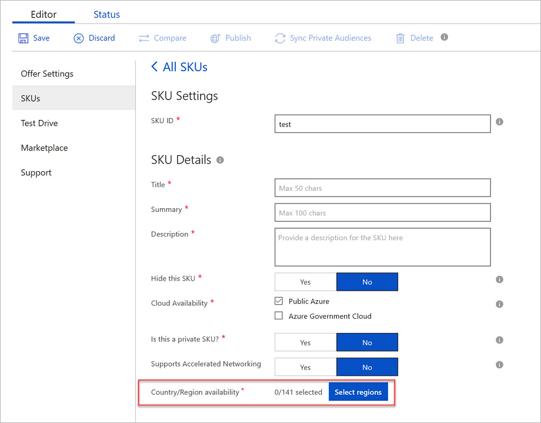
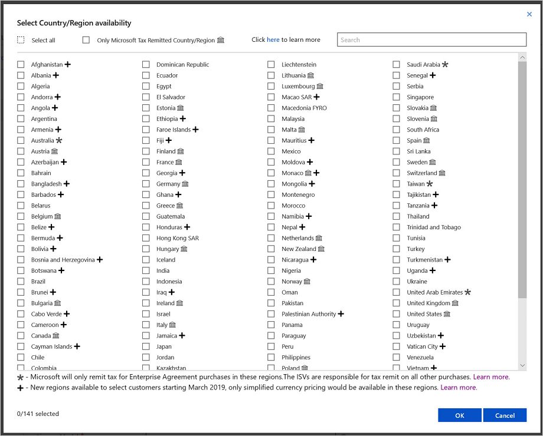

# Marketplace FAQs

Answers to common questions about the Microsoft Azure Marketplace.

## FAQ for customers

### What you need to know about Azure Marketplace

**What is Azure Marketplace?**

[Azure Marketplace](https://azuremarketplace.microsoft.com/marketplace) provides access and information on solutions and services available from Microsoft and our partners. Customers (IT pros and developers) can discover, try to buy cloud software solutions built on or built for Azure. Our catalog of 8,000+ listings provides Azure building blocks, such as Virtual Machines (VMs), APIs, Azure apps, Solution Templates and managed applications, SaaS apps, containers, and consulting services.

**Who are Azure Marketplace customers?**

Azure Marketplace is designed for IT professionals and cloud developers who are interested in commercial IT software and services.

**What type of products are currently available in the Azure Marketplace?**

The Azure Marketplace offers technical solutions and services from Microsoft and partners built to extend Azure products and services. The solution catalog spans several categories, including but not limited to:

* base operating systems
* databases
* security
* identity
* networking
* blockchain
* developer tools
* and more

Azure Marketplace offers SaaS applications, Virtual Machines, Solution Templates, Azure-Managed applications, and consulting services.

### Azure Marketplace for Customers

**How do I get started in Azure Marketplace?**

You can find a wide range of enterprise applications and solutions that are certified and optimized to run on Azure, by visiting [Azure Marketplace](https://azuremarketplace.microsoft.com/marketplace/apps). Azure Marketplace can also be accessed through the [Azure Management Portal](https://portal.azure.com/) under [**Create a Resource**](https://ms.portal.azure.com/#create/hub).

**What are the key benefits of Azure Marketplace?**

With Azure Marketplace, customers can discover technical applications built for or built on Azure. It combines Microsoft Azure's market of solutions and services into a single, unified platform to discover, try, buy, or deploy solutions in just a few clicks.

**How do I purchase products from the Azure Marketplace?**

Azure Marketplace offers can be purchased through:

* [web-based storefront](https://azuremarketplace.microsoft.com/marketplace/apps)
* [Microsoft Azure Management portal](https://portal.azure.com/), or via the [Azure Marketplace Command Line Interface (CLI)](https://docs.microsoft.com/cli/azure/?view=azure-cli-latest)

>[!Note]
>Prepaid credits and other forms of monetary commitment cannot be used to pay for software license fees, but can be used to pay associated Azure usage charges.  Exceptions are listed in [Azure monetary commitment](https://azure.microsoft.com/updates/azure-marketplace-third-party-reseller-services-now-use-azure-monetary-commitment/).

**Can I choose which Microsoft Azure region(s) to deploy my Azure Marketplace purchase?**

The customer has the option of deploying to any Azure data center region they enable. We recommend selecting the data center locations closest to your services to optimize performance and control budget.

**If I accidentally delete an Azure Marketplace purchase, can I "undo" the action?**

No, deletions are final. If a subscription is accidentally deleted, it can be repurchased. Any unused functionality or prepaid services are lost.

**Am I warned if I try to delete an Azure Marketplace purchase that is in use by one of my applications?**

No, Azure provides no warning when deleting a purchase, even if it is currently in use, or an application is dependent upon.

**If my Azure Marketplace purchase has any dependencies on other assets such as an Azure website, do I have to manage them?**

Dependencies are not automatically managed for Azure Marketplace offerings. Carefully review the description of Azure Marketplace purchase before using it to determine if there are any dependencies needed prior to deploying the solution.

**Can I buy Azure Marketplace solutions from an Azure Cloud Solution Provider?**

If the publisher has configured their offering to be available through the CSP channel, it will be available through your reseller.

**What countries/regions are supported for purchasing applications and services sold/provisioned through the Azure Marketplace?**

Azure Marketplace is available to Microsoft Azure customers in the countries/regions listed in the [participation policies](https://docs.microsoft.com/legal/marketplace/participation-policy).

**What currencies are supported by Azure Marketplace?**

Transactions can be conducted in the following 17 currencies: AUD, BRL, CAD, CHF, DKK, EUR, GBP, INR, JPY, KRW, NOK, NZD, RUB, SEK, TWD, USD, RMB.

### Deploying a solution from Azure Marketplace

**I have deployed an Azure Marketplace Virtual Machine (VM) to a subscription, and I now want to migrate the subscription from one Azure account to another. Is this currently supported?**

To migrate an Azure subscription, including Azure Marketplace VMs and services, delete or cancel any prior Azure subscription before associating to the new Azure Account. Once the migration is completed, resulting usage fees are billed using the new registered account’s method of payment.

**I want to migrate an Azure Marketplace Virtual Machine (VM) subscription to my Enterprise Agreement. Is this currently supported?**

To migrate an Azure Marketplace Virtual Machine (VM) subscription to an Enterprise Agreement, stop or cancel any prior subscription before the migration. Once the migration of your Azure account and associated subscriptions are complete, you can repurchase the Azure Marketplace VM or service.  The resulting usage fees are billed quarterly under your Enterprise Agreement.

### Pricing and payment

**How are Azure Marketplace subscriptions priced?**

Pricing varies based on product types and publisher specifications. Software license fees and Azure usage costs are charged separately through your Azure subscription.

*Unbundled:*

*BYOL Model:* Bring-your-own-license. When obtaining a software license directly from the publisher or a reseller, there are no additional software-related charges or fees.

*Bundled:*

Azure subscription is included with the publisher’s Independent Software Vendors (ISV) solution pricing.

*Charged:*

*Free:* Free SKU. No charges are applied for software license fees or usage of the offering.

*Free Software Trial:* An offer that is free for a limited period. There is no charge for the publisher’s software license fees for use during the trial period. Upon expiration, it automatically converts to a paid offer based on standard rates issued by the publisher.

*Usage-Based:* Rates are charged or billed based on the extent usage of the offering. For Virtual Machines Images, it is charged on an hourly fee. For Developer services and APIs, it is charged per unit of measurement as defined by the offering.

*Monthly Fee:* Rates are charged or billed a fixed monthly fee for a subscription to the offering (from the start date of the subscription for that plan). The monthly fee may be prorated for mid-month cancellations or unused services.

Offer specific pricing details can be found on the solution details page on [https://azure.microsoft.com/pricing/](https://azure.microsoft.com/pricing/) or within the [Microsoft Azure Management portal](https://portal.azure.com/).

>[!Note]
> Except for monthly fees, Azure usage charges are applicable to all pricing models unless otherwise stated.

**How should I provide my software license key for BYOL marketplace solutions and what role does Azure Marketplace play?**

Acquisition and enforcement of license credentials for BYOL solutions are the responsibility of the publisher. For Virtual Machine offers, the acquisition of the license key typically occurs in the publisher’s application after the application has started. When using a Virtual Machine offer deployed via an Azure Application Solution Template, the ARM template can be configured to prompt the user for a range of inputs including license credentials.

These are the most common options per offer type:

*Virtual Machine Offer:*

*Option 1:* The acquisition of the license key typically occurs in the publisher’s application after the application has started.

*Option 2:* The license key is entered by the end user (via command line / web interface provided by the offer) after the deployment of the VM offer in the selected subscription. The license can be a key and/or file, as determined by the publisher.

*Azure Apps (Solution Template and Managed Apps):*

*Option 1:* The ARM template can be configured to prompt you for a range of inputs including license credentials. This can be done as a license file (File upload) or a key (textbox input), before the deployment of the offer, in the end-user subscription.

*Option 2:* You can enter the license key via command line / web interface provided by the offer.  It is done  after the deployment of the Azure Apps offer in the selected subscription. The license can be a key and/or file, as determined by the publisher.

**What is the difference between ‘Free Trial’ and ‘Free Software Trial’?**

A ‘Free Trial’ subscription offer is perpetually free.  A ‘Free Software Trial’ ‘(Try It Now’) offer is a paid offer, but free for a limited trial periods.

**Do I need to have a payment instrument (for example, credit card) on file to deploy Free Tier or bring your own license (BYOL) offerings?**

No. A payment instrument is not required to deploy Free Tier or BYOL offerings. However, Free Trial offerings require a payment instrument. Listings that include the **Get it now** or **Free software trial** buttons are deployed into the selected Azure subscription.  These listings are billed using the selected account’s registered method of payment. Azure usage charges are billed separately from software license fees.

**If they have questions about pricing for offers sold on the Azure Marketplace, who does an Enterprise Agreement (EA) indirect customer contact?**

Enterprise Agreement (EA) indirect customers must contact their Licensing Solution Provider (LSP) for all Azure Marketplace pricing questions.

**Can I control my employees' access to Azure Marketplace and purchasing privileges?**

Yes, for Enterprise Agreement (EA) customers, the enrollment administrator may turn off purchase privileges for all accounts on the enrollment and turn it back on long enough to make a purchase. Additionally, all customers can use Azure Policy to restrict deployment options for their Azure subscriptions, including management of Azure Marketplace resources.

**Can I apply Azure subscription credits or monetary commitment funds in my account towards Azure Marketplace offers?**

Specific Azure Marketplace offers can use Azure subscription credits or monetary commitment funds. See [Azure monetary commitment](https://azure.microsoft.com/updates/azure-marketplace-third-party-reseller-services-now-use-azure-monetary-commitment/) for a complete list of products participating in this program. These offers do not include BYOL or BYOS options. All other Azure Marketplace offers cannot use Azure subscription credits or monetary commitment: such as the free one-month trial credit, monthly MSDN credits, credits from Azure promos, monetary commitment balances, and any other free credits provided from Azure.

**Do Volume License discounts apply to Azure Marketplace purchases?**

No. The publisher that owns solutions in Azure Marketplace can set pricing.  Standard Microsoft volume license discounts do not apply towards Azure Marketplace purchases.

**How do I pay for these subscriptions? Do my Azure Marketplace purchases appear on the Azure bill, or is there another bill?**

MOSP - [Microsoft Online Subscription Program](https://azure.microsoft.com/support/legal/subscription-agreement/?country=us&language=en) (i.e. web-direct) customers are charged against the same credit card that is on file for their Azure subscription profile. If you do not have a credit card on file, then you cannot purchase from the Azure Marketplace. In this case, you received a special waiver to have your Azure charges invoiced to you instead.

Enterprise Agreement (EA) customers are charged against their EA. Specific Azure Marketplace offers listed here are first deducted from any available monetary commitment, then billed as an overage on a single quarterly invoice. EA indirect, education, and government customers are billed by their Licensing Solution Provider (LSP).

**Where can I view my Azure Marketplace subscription details and billing information?**

MOSP - [Microsoft Online Subscription Program](https://azure.microsoft.com/support/legal/subscription-agreement/?country=us&language=en) (web direct) customers can view Marketplace purchase details in the Invoices tab of the Cost Management + Billing section of the Azure management portal.

Enterprise Agreement (EA) customers can view Marketplace purchase details in the Invoices tab of the Cost Management + Billing section of the Azure management portal.

Cloud Solution Provider (CSP) partners can view Marketplace purchase details for each customer in Partner Center within the Order History tab after selecting a company in the Customers view.

**How do I cancel an Azure Marketplace add-on to Azure VM?**

Since the add-on is associated to the Azure Virtual Machine (VM), to cancel the Azure Marketplace purchase, first stop the VM by deleting it. Thus stopping all subscription usage and charges on the Azure Marketplace purchase.

**How often am I billed for my Azure Marketplace purchases?**

Enterprise Agreement customers, for the specific services outlined, first have available monetary commitment funds reduced by the total cost for these services in the month they are consumed. All Azure Marketplace offers that do not deduct from monetary commitment, are billed monthly in arrears. Annual SaaS subscriptions are billed once for a full year’s services.

MOSP - [Microsoft Online Subscription Program](https://azure.microsoft.com/support/legal/subscription-agreement/?country=us&language=en) (web direct) customers are charged monthly against the same credit card that is on file for their Azure subscription profile. Annual SaaS subscriptions are billed once for a full year’s services.

**How can I move my Azure Marketplace purchases from my MOSP subscription to my direct Enterprise Agreement (EA) subscription?**

Although most Microsoft subscriptions can be easily converted to an Enterprise Agreement, Azure Marketplace purchases within those subscriptions cannot.

To migrate other services purchased from the Azure Marketplace to an EA subscription, first cancel the applications from within the existing MOSP subscription, and repurchase those applications within the EA subscription. By doing so, you can submit a credit request for a refund during the potential month of overlapping coverage between the Marketplace service subscriptions - create a [support ticket](https://ms.portal.azure.com/#blade/Microsoft_Azure_Support/HelpAndSupportBlade/overview).

**What is the difference between "price", "software price", and "total price" in the cost structure for Virtual Machine offers in the Azure Marketplace?**

"Price" refers to the cost of the Azure Virtual Machine to run the software. "Software price" refers to the cost of the Marketplace publisher's software running on an Azure Virtual Machine. "Total price" refers to the combined total cost of the Azure Virtual Machine and the Marketplace publisher's software running on an Azure Virtual Machine.

**Can I apply Azure subscription credits or monetary funds on my account towards Azure products and services required to run Azure Marketplace offers?**

Yes. Azure subscription credits or monetary commitment funds on the account can be used toward Azure products and Azure Marketplace offers. For example, Azure monetary commitment funds can be applied towards the "price" component of a Virtual Machine offer in the Azure Marketplace. However, Azure subscription credits and monetary commitment funds can only be applied towards certain Marketplace publishers’ software ("software price") running on an Azure Virtual Machine.

**How do I find out how much of my Azure Marketplace purchase I have used?**

An estimated usage information can be found in the [Microsoft Azure management portal](https://portal.azure.com/). Such estimated usage information may not include recent activities, and may be based on projections derived from past consumption. During the public preview, this capability may not be available for all purchases and may vary based on product type.

### Customer support

**Who do I contact for general support issues with Azure Marketplace?**

For general application support regarding usage or troubleshooting, contact the application publisher directly.

For billing and subscription issues with your Azure Marketplace purchase, contact [Azure Support](https://support.microsoft.com/getsupport?oaspworkflow=start_1.0.0.0&wf=0&wfname=productselection&prid=16230&forceorigin=esmc&ccsid=636694515623707953).

**Who do I contact for technical support with a solution purchased in the Azure Marketplace?**

Contact the publisher provider for all technical product support. Publisher contact information and/or a link to the support website can be found on their solution details page on Azure Marketplace.

**Who do I contact for billing support/questions regarding a third-party solution purchased from Marketplace?**

Contact Microsoft Support at [Azure Support](https://support.microsoft.com/getsupport?oaspworkflow=start_1.0.0.0&wf=0&wfname=productselection&prid=16230&forceorigin=esmc&ccsid=636694515623707953).

**Is there a support forum, for Azure Marketplace?**

Yes. Visit the [Azure Marketplace forum](https://social.msdn.microsoft.com/Forums/home?forum=DataMarket) for community support.

**Who do I contact if I have questions about pricing or terms for partner solutions sold on the Azure Marketplace?**

Contact the publisher provider for all technical product support. Publisher contact information and/or a link to the support website can be found on each solution details page on Azure Marketplace.

**If I am not satisfied, can I return a purchase?**

Purchases made from [Azure Marketplace](https://azuremarketplace.microsoft.com/) cannot be returned but can be canceled/deleted. Consumption based offers are billed according to usage, so when it stops, charges stop as well. Subscriptions are canceled and will not be billed past the current billing period. If a subscription is canceled shortly after purchase (24 hours for monthly and 14 days for annual), a full refund is provided.

Customers must directly contact the publisher for any technical issues relating to their Marketplace service or purchase. Publisher contact information and/or a link to the support website can be found on their solution details page on Azure Marketplace.

### Dev Center registration

**Which publishers require a Dev Center account registration?**

Publishers who are publishing in Transact listing type: VM, Azure apps: Solution Templates and managed apps.

**Why is a Dev Center account required?**

A [Dev Center account](https://docs.microsoft.com/azure/marketplace/register-dev-center) is required to enable Microsoft to bill the customer on the publisher’s behalf for a Transact listing type. Dev Center account registration enables Microsoft to validate the legal, tax, and banking information for your company.

**How do I get started with Dev Center registration?**

Start by creating a [Microsoft Partner Network (MPN) ID](https://partner.microsoft.com). Sign in and register as a seller in Dev Center with your MPN ID. To prevent duplication, verify that your company does not already have a [Dev Center account](https://docs.microsoft.com/azure/marketplace/register-dev-center) registered. (Note: complete the Marketplace Registration form to receive a Dev Center promotional code before registration.)

**What should I expect after registration?**

Look for an email from verify@microsoft.com with subject line “Action needed: Verify the account that received the email with Microsoft”. To complete registration, click the time sensitive verification link. If no emails were received within 24 hrs, check the spam folder.

**What are the next steps after Dev Center verification?**

Go to [Your programs](https://developer.microsoft.com/en-us/dashboard/Account/Programs) and log into the Dev Center account. There should be a section titled **Recommended programs for you** and under which, a subsection titled **Azure**. Click **Get Started** and go through the process of setting up an Azure account.

**Why is my Dev Center application rejected?**

Account registrations are based on geographic issues. Companies with subsidiaries based in locations different than the headquarters only need one Dev Center account.

**How do I contact support with issues regarding Dev Center registration?**

To access support, visit the Windows developer support page located at [https://developer.microsoft.com/en-us/windows/support](https://developer.microsoft.com/windows/support).

## FAQ for publishers

### What you need to know about Azure Marketplace

**What is Azure Marketplace?**

[Azure Marketplace](https://azuremarketplace.microsoft.com/marketplace) is an online applications and services marketplace. Customers (mostly IT pros and developers) can discover, and buy cloud software solutions built with or for Azure. Its catalog has over 8,000 listings, such as Azure building blocks like Virtual Machines (VMs), APIs, Solution Templates, SaaS applications, and consulting service offers.

Azure Marketplace is the starting point for all joint Microsoft Go-To-Market activities.  We focus on helping partners to reach more customers. You can publish new listings, and also use Azure Marketplace to conduct promotional and demand generation campaigns, perform joint sales/marketing activities with Microsoft.

**Who are Azure Marketplace customers?**

Azure Marketplace is designed for IT professionals and cloud developers, interested in commercial IT software and services.

### Azure Marketplace for Publishers

**Why should I publish my application on Azure Marketplace and how does it benefit me?**

Azure Marketplace provides a market for Microsoft Partners to promote and sell products and services to Azure customers. Publishers, instantly gain access to 140 global markets, our 300,000+ partners, and Azure’s network of enterprise customers.  The marketplace includes more than 90% of Fortune 500 companies and many of the world’s leading developers. New partners in Azure Marketplace are automatically offered a set of [no-cost Go-To-Market benefits](https://docs.microsoft.com/azure/marketplace/gtm-your-marketplace-benefits#go-to-market-gtm-benefits-in-the-marketplace) to help boost awareness of their offers in Azure’s marketplace.

**What is the differentiating factor between Azure Marketplace and AppSource?**

Microsoft Partners can choose where to publish based on their target audience.

Microsoft provides two distinct cloud marketplace storefronts – Azure Marketplace and AppSource. These storefronts allow customers to find, try, and buy cloud applications and services. Each storefront serves unique customer needs and enables Microsoft Partners to target their solutions or services based on the target audience.

Select [Azure Marketplace](https://azuremarketplace.microsoft.com/marketplace/apps) to target IT professionals and developers, or technical users.

Select [AppSource](https://appsource.microsoft.com/) to target line-of-business decision-makers and business owners.

Review the [Publisher Guide](https://docs.microsoft.com/azure/marketplace/marketplace-publishers-guide) for more details and benefits of Azure Marketplace and AppSource.

**How do I begin to publish in Azure Marketplace?**

Start your Azure Marketplace listing by reviewing the [Azure Marketplace Publisher Guide](https://docs.microsoft.com/azure/marketplace/marketplace-publishers-guide) and [Becoming a Publisher](https://docs.microsoft.com/azure/marketplace/become-publisher). Next, submit your application by [submitting your offer](https://partner.microsoft.com/dashboard/account/v3/enrollment/introduction/azureisv). See how to [create a Partner Center account](https://docs.microsoft.com/azure/marketplace/partner-center-portal/create-account) for more information.

**Do I have to be a member of the Microsoft Partner Network (MPN) to list my applications and services in the Azure Marketplace?**

Yes, an MPN is required to publish in Azure Marketplace. Visit [Microsoft Partner Network](https://partner.microsoft.com/membership) to get started.

**What should I expect after I submit my registration to publish in Azure Marketplace?**

After submitting your registration, the marketplace onboarding team will review and provide a welcome email regarding the next steps within 1-3 business days.

**What is the criterion to publish a solution in Azure Marketplace?**

To publish in Azure Marketplace, partners must demonstrate that their application runs on or extends Azure. Publishers are required to provide customers with a [Service Level Agreement](https://azure.microsoft.com/support/legal/sla/), [privacy policy](https://privacy.microsoft.com/privacystatement), phone and online support. Various workloads have additional requirements. Review the [Azure Marketplace Participation Policies](./marketplace-participation-policy.md) and [Publisher Guide](https://docs.microsoft.com/azure/marketplace/marketplace-publishers-guide) for further guidance.

**Is there a fee to publish in Azure Marketplace?**

There are no publishing fees when uploading a List, Trial, or BYOL (Bring Your Own License) solution via Azure Marketplace.

**Are there any transaction fees for purchases through Azure Marketplace?**

When the solution license is purchased via Azure Marketplace, revenues for the software license are split between the publisher and Microsoft.  This is done in accordance to the terms and conditions in the [Marketplace Publisher Agreement](https://cloudpartner.azure.com/Content/Unversioned/PublisherAgreement2.pdf). Additionally, solutions with BYOL (Bring Your Own License) publishers do not incur transaction fees.

**What is a Standard Contract?**

Microsoft offers Standard Contract terms that a publisher can select to leverage, so that customers have a simplified procurement and legal review process.

**Where do I find guidelines for integrating my application with Azure Active Directory (AAD)?**

Microsoft authenticates all Marketplace users with AAD.  You can be directly provisioned into a Trial without requiring an additional sign-in step.  For example, an authenticated user clicks through a Trial listing in Marketplace, and gets redirected to a Trial environment.

For more information, and to get started enabling a trial with AAD, visit the [Azure Active Directory section in the Publisher Guide](https://docs.microsoft.com/azure/marketplace/enable-trial-using-azure-ad).

**How do I get started with Dev Center registration?**

To get started, publishers should verify that a [Dev Center account](https://docs.microsoft.com/azure/marketplace/register-dev-center) has not already been registered (to prevent duplication). Once confirmed, the next step is to register by [signing in](https://account.microsoft.com/account/) with a Microsoft account, which will be associated with the developer account.

If you don’t already have a Microsoft account, you can [create an account](https://signup.live.com/signup?contextid=AEB123C8F2B1DA7A&bk=1529968434&ru=https%3a%2f%2flogin.live.com%2flogin.srf%3fcontextid%3dAEB123C8F2B1DA7A%26mkt%3dEN-US%26lc%3d1033%26bk%3d1529968434&uiflavor=web&uaid=9987e727fedb459780d95c1b9e46c82c&mkt=EN-US&lc=1033&lic=1) (For example: contoso_marketplace@live.com).

**Why is Dev Center account required?**

A Dev Center account is required to enable Microsoft to bill customers on the publisher's behalf for Transact listing types. Dev Center account registration enables Microsoft to validate the legal, tax, and banking information. For more information, see [register in Dev Center](https://docs.microsoft.com/azure/marketplace/become-publisher).

**Which publishers require a Dev Center account registration?**

Publishers who are publishing Transact listing types: VM, Azure apps, solution templates, and managed apps.

**What are leads and why are they important to me as a publisher in Marketplace?**

Leads are customers who are deploying your products from the Marketplace. Whether your product is listed on [Azure Marketplace](https://azuremarketplace.microsoft.com) or [AppSource](https://appsource.microsoft.com), you are able to receive leads from customers who are interested in your product.  You can set up lead destination on your offer. To learn more, see [Become a Cloud Marketplace Publisher](https://docs.microsoft.com/azure/marketplace/become-publisher).

**Where can I get help in setting up my lead destination?**

Learn more in [Cloud Partner Portal-Get Customer Leads](https://docs.microsoft.com/azure/marketplace/cloud-partner-portal-orig/cloud-partner-portal-get-customer-leads) documentation, or submit a support ticket through [https://aka.ms/marketplacepublishersupport](https://aka.ms/marketplacepublishersupport) by selecting your offer type and lead management.

**Am I required to configure a lead destination to publish an offer on Marketplace?**

Yes, if publishing a **Contact Me**, **SaaS app**, or **consulting services** offer you are required to configure a lead destination.

**How can I confirm that the lead configuration is correct?**

After completing the offer and setting up a lead destination, the listing can properly be published in the [Cloud Partner Portal](https://cloudpartner.azure.com/). Before the listing goes live, you can validate if the lead configuration set-up is working correctly.  Send a test-lead to the lead destination configured in the offer.

**What countries/regions are Azure Marketplace available for publishers to sell from?**

Publishers based in the following countries/regions can currently sell in the Azure Marketplace: Afghanistan, Albania, Algeria, Angola, Antigua and Barbuda, Argentina, Armenia, Australia, Austria, Azerbaijan, Bahrain, Bangladesh, Belarus, Belgium, Benin, Bolivia, Bosnia and Herzegovina, Botswana, Brazil, Bulgaria, Burkina Faso, Burundi, Cambodia, Cameroon, Canada, Central African Republic, Chad, Chile, Colombia, Comoros, Congo, Congo (DRC), Costa Rica, Cote D'Ivoire, Croatia, Cyprus, Czech Republic, Denmark, Dominica, Dominican Republic, Ecuador, Egypt, El Salvador, Eritrea, Estonia, Ethiopia, Fiji Islands, Finland, France, Georgia, Germany, Ghana, Greece, Guatemala, Guinea, Haiti, Honduras, Hong Kong SAR, Hungary, Iceland, India, Indonesia, Iraq, Ireland, Israel, Italy, Jamaica, Japan, Jordan, Kazakhstan, Kenya, Korea (South), Kuwait, Laos, Latvia, Lebanon, Liberia, Liechtenstein, Lithuania, Luxembourg, Madagascar, Malawi, Malaysia, Mali, Malta, Mauritius, Mexico, Monaco, Mongolia, Montenegro, Morocco, Mozambique, Nepal, The Netherlands, New Zealand, Nicaragua, Niger, Nigeria, Norway, Oman, Pakistan, Panama, Paraguay, Peru, Philippines, Poland, Portugal, Qatar, Romania, Russia, Rwanda, Saudi Arabia, Senegal, Serbia, Sierra Leone, Singapore, Slovakia, Slovenia, Somalia, South Africa, Spain, Sri Lanka, Sweden, Switzerland, Tajikistan, Tanzania, Thailand, Timor-Leste, Togo, Tonga, Trinidad and Tobago, Tunisia, Turkey, Turkmenistan, Uganda, Ukraine, United Arab Emirates, United Kingdom, United States, Uruguay, Uzbekistan, Venezuela, Vietnam, Zambia, and Zimbabwe.

**How do I delete a listing from the Azure Marketplace?**

Virtual Machine & Azure Apps:

1. Sign in to the [Cloud Partner Portal](https://cloudpartner.azure.com/).
1. Select the offer from the ‘All Offers’ tab.
1. In the pane on the left side of the screen, select the SKUs tab.
1. Select the SKU for deletion and click the ‘delete’ button for that SKU.
1. [Republish](https://docs.microsoft.com/azure/marketplace/cloud-partner-portal/manage-offers/cpp-publish-offer) the offer to Azure Marketplace.

For more information, see [Deleting an offer](https://docs.microsoft.com/azure/marketplace/cloud-partner-portal/manage-offers/cpp-delete-offer).

Web Apps (SaaS apps, Add-ons) & Consulting Services:
1. In the Cloud Partner Portal, select the question mark icon and then click 'Support'.
1. Go to [https://go.microsoft.com/fwlink/?linkid=844975](https://go.microsoft.com/fwlink/?linkid=844975).
1. On the support page, select the offer type.
1. Select ‘Remove’ a published offer.
1. Create an incident ticket.
1. Submit.

O365 Apps
1.	Sign in to [https://sellerdashboard.microsoft.com](https://sellerdashboard.microsoft.com) with Dev Account.
1.	Withdraw add-in.

NOTE: App will disappear for existing listing after 90 days.

Power BI Apps
* Contact: [Anjana Sompur (Slalom Consulting LLC)](mailto:v-ansomp@microsoft.com).

### Benefits and Go-To-Market (GTM) Resources

**What are some of the Go-To-Market benefits provided for publishers listed on Azure Marketplace?**

Azure Marketplace is the starting point for joint Go-To-Market activities with Microsoft, and the doorway to a Co-Sell Ready partnership. All new listings in Azure Marketplace are automatically offered a set of [no-cost Go-To-Market benefits](https://assetsprod.microsoft.com/mpn/marketplace-gtm-benefits.pdf) to help drive awareness of offers to Microsoft’s customers. Once an offer is published, the Microsoft GTM team contacts you and begins delivering your benefits.

Visit [Microsoft GTM Services](https://partner.microsoft.com/reach-customers/gtm) for more information on our GTM benefits and ways to grow your business in marketplace.

**Where are Azure Marketplace solutions promoted within Microsoft web properties?**

Azure Marketplace solutions are available in the Microsoft [Microsoft Azure management portal](https://portal.azure.com/), and [Azure Marketplace website](https://azuremarketplace.microsoft.com/marketplace/). Cloud Developers and IT Pros using Azure have exposure to partner solutions every time they sign in. A subset of partner solutions is also showcased and rotated on the [Azure Marketplace homepage](https://azuremarketplace.microsoft.com/marketplace) and [Azure solutions page](https://azure.microsoft.com/solutions/).

### Billing and payments

**How do I receive payment for my Azure Marketplace sales?**

All payments from Microsoft are processed via PayPal or Electronic Funds Transfer (EFT) monthly. Payment is made within two months of the date the customer used the service, though the exact timing depends on the payment instrument of the customer. A 45-day escrow period applies to credit card customers.

**For Virtual Machine-based solutions purchased with usage-based billing, when a customer up-sizes or downsizes the underlying Virtual Machine, does the pricing of my software license follow?**

Yes, the new price is billed immediately.  Pricing changes happen when a customer changes the Virtual Machine size, and specifies different prices in the pricing table, which are based on Virtual Machine size.

**Is per-node billing available for Azure Marketplace?**

Azure Marketplace does not currently support per-node billing with Virtual Machines. Publishers can still determine a per-node billing rate with Microsoft VM billing rates.  The calculation is to determine the number of VMs by the number of hours used and rate per hour.

**Who do I contact for billing or offer management questions?**

Log a ticket with [Microsoft Support](https://support.microsoft.com/getsupport?oaspworkflow=start_1.0.0.0&wf=0&wfName=productselection&prid=15635).

### Publisher support

**Who do I contact for general support issues with Azure Marketplace?**

For general application support regarding usability or troubleshooting, contact [Cloud Partner Portal Support](https://support.microsoft.com/getsupport?wf=0&tenant=ClassicCommercial&oaspworkflow=start_1.0.0.0&locale=en-us&supportregion=en-us&pesid=16230&ccsid=636565784998876007).

For billing and subscription issues with your Azure Marketplace purchase, contact [Azure Support](https://portal.azure.com/#blade/Microsoft_Azure_Support/HelpAndSupportBlade/overview).

**Is there a support forum for Azure Marketplace?**

Visit the [Azure Marketplace forum](https://social.msdn.microsoft.com/Forums/azure/home?forum=DataMarket).

**Who do I contact with publishing or offer management questions?**

Visit the [Azure Marketplace Publisher Guide](https://docs.microsoft.com/azure/marketplace/marketplace-publishers-guide) for up-to-date resource and documentations on frequently asked questions. Additionally, you can log a ticket with [Microsoft Support in the Cloud Partner Portal](https://support.microsoft.com/en-us/getsupport?oaspworkflow=start_1.0.0.0&wf=0&wfname=productselection&prid=16230&forceorigin=esmc&ccsid=636694515623707953).

### Azure Marketplace for Customers

**How do I get started in Azure Marketplace?**

Visit the [Azure Marketplace](https://azuremarketplace.microsoft.com/marketplace/) web-based storefront, and browse through the wide range of quality enterprise applications and solutions, certified and optimized to run on Azure. Azure Marketplace can also be accessed through [Azure classic portal](https://portal.azure.com/) under ‘Create a Resource’. To learn more, see [https://azuremarketplace.microsoft.com/about](https://azuremarketplace.microsoft.com/about).

**What are the key benefits of Azure Marketplace?**

Azure Marketplace is the store for IT Pros and Developers to discover technical applications built for or built on Azure. Instantly gain access to [140 global markets](https://azure.microsoft.com/global-infrastructure/regions/) and solutions and offerings from our 300,000+ partner network. It combines Microsoft Azure's marketplace of solutions and services into a single, unified platform for you to discover, trial, and buy solutions in just a few clicks.

**How do I purchase products from the Azure Marketplace?**

You can find Azure Marketplace offers via the [web-based storefront](https://azuremarketplace.microsoft.com/marketplace/), in the [Microsoft Azure Management portal](https://portal.azure.com/), or via the [Azure Marketplace Command Line Interface (CLI)](https://docs.microsoft.com/cli/azure/?view=azure-cli-latest). Once logged into the Azure Marketplace, you can discover and buy Microsoft and Partner solutions. Note: Prepaid credits and other forms of Monetary Commitment are not used for software license fees.  Instead, they cover associated Azure usage charges. Exceptions are listed in [Azure monetary commitment](https://azure.microsoft.com/updates/azure-marketplace-third-party-reseller-services-now-use-azure-monetary-commitment/).

**If I accidentally delete an Azure Marketplace purchase, can I “undo” the action?**

No, deletions are final. If you accidentally delete a subscription, you can easily restart it by purchasing again.  However, any unused functionality or prepaid services are lost, so take care when deleting a subscription.

**Are there warnings, if I try to delete an Azure Marketplace purchase being used by one of my applications?**

No, Azure does not warn you when you delete a purchase that your application depends on.

**If my Azure Marketplace purchase has any dependencies on other assets such as an Azure website, then do I have to manage them?**

Dependencies are not automatically managed for Azure Marketplace offerings. Carefully review the description of your Azure Marketplace purchase before using it.  You should determine if there are any dependencies before deploying the solution.

**Who can purchase applications and services sold/provisioned through the Azure Marketplace?**

The Azure Marketplace is available to Microsoft Azure customers in the following countries/regions:

Algeria, Argentina, Australia, Austria, Bahrain, Belarus, Belgium, Brazil, Bulgaria, Canada, Chile, Colombia, Costa Rica, Croatia, Cyprus, Czech Republic, Denmark, Dominican Republic, Ecuador, Egypt, El Salvador, Estonia, Finland, France, Germany, Greece, Guatemala, Hong Kong, Hungary, Iceland, India, Indonesia, Ireland, Israel, Italy, Japan, Jordan, Kazakhstan, Kenya, Kuwait, Latvia, Liechtenstein, Lithuania, Luxembourg, North Macedonia, Malaysia, Malta, Mexico, Montenegro, Morocco, Netherlands, New Zealand, Nigeria, Norway, Oman, Pakistan, Panama, Paraguay, Peru, Philippines, Poland, Portugal, Puerto Rico, Qatar, Romania, Russia, Saudi Arabia, Serbia, Singapore, Slovakia, Slovenia, South Africa, South Korea, Spain, Sri Lanka, Sweden, Switzerland, Taiwan, Thailand, Trinidad and Tobago, Tunisia, Turkey, Ukraine, United Arab Emirates, United Kingdom, United States, Uruguay, Venezuela.

**How do I define my geographic availability to enable selling in different countries/regions?**

1.  In the Cloud Partner Portal, navigate to the SKU to which you want to add new countries/regions.  Within the "SKU Details" navigate to "Country/Region availability" and click "Select regions."

    

1.  A list will pop up with all available countries/regions to sell to.  Click the checkbox next to each country/region you want to make this SKU available. Click "OK".

    

1.  Finally for the changes to be applied to your live offer, click "Publish."  

>[!Note]
>It will take 24 hours for the changes to take effect.

<!---     -->

**How can a publisher change the geographic availability for an existing offer?**

The publisher can edit an existing offer, select the new countries/regions, and use the spreadsheet download/upload function to set pricing.

**In what countries/regions can customers purchase Azure Marketplace offerings?**

Azure Marketplace supports 141 buy-from geographies as defined by the customer’s billing address. See [participation policies](https://docs.microsoft.com/legal/marketplace/participation-policy) for a list of countries/regions.

**What currencies are supported by Azure Marketplace?**

Transactions can be conducted in the following 17 currencies: AUD, BRL, CAD, CHF, DKK, EUR, GBP, INR, JPY, KRW, NOK, NZD, RUB, SEK, TWD, USD.

### Deploying a solution from Azure Marketplace

**I have deployed an Azure Marketplace Virtual Machine (VM) to a subscription, and I now want to migrate that subscription from one Azure account to another. Is this currently supported?**

To migrate your Azure subscription, Marketplace VMs, and services, you need to delete or cancel them before associating your Azure subscription to the new Azure Account. Once the migration of your Azure subscriptions is complete, you can repurchase the Azure Marketplace services. The resulting usage fees are billed using your account’s registered method of payment. 

**I want to migrate an Azure Marketplace Virtual Machine (VM) subscription to my Enterprise Agreement. Is this currently supported?**

To migrate VMs with BYOL to EA subscription, you don’t need to rebuild them. The MOSP - Microsoft Online Subscription Program (i.e. web-direct) subscription can be converted to EA directly.

### Pricing and Payment

**How are Azure Marketplace subscriptions priced?**

Pricing varies based on product types and publisher specifications. Software license fees and Azure usage costs are charged separately through your Azure subscription. Pricing models include:

* **BYOL Model**: Bring-your-own-license. When you obtain a software license for use on Azure Marketplace directly from the publisher or a reseller, you are not charged any additional software-related fees for use.

* **Free**: Free SKU. You are not charged software license fees for use of the offering.

* **Free Software Trial**: An offer that is free for a limited period of time. You are not charged the publisher’s software license fees for use of the offering through a trial period. Upon expiration of the trial period, you are automatically charged standard rates for use of the offering.

* **Usage-Based**: You are charged or billed based on your usage of the offering. For Virtual Machines Images, you are charged an hourly Azure Marketplace fee. For Developer services, and API, you are charged per unit of measurement as defined by the offering.

* **Monthly Fee**: You are charged or billed a fixed monthly fee for a subscription to the offering, from start of that particular plan. The monthly fee may be prorated for mid-month cancellations or unused services.

Pricing details can be found on the solution details page on [https://azure.microsoft.com/pricing/](https://azure.microsoft.com/pricing/), or within the Microsoft Azure Management portal.

>[!Note]
>Except for monthly fees, Azure usage charges are applicable to all pricing models unless otherwise stated.

**What is the difference between Free Tier and Free Software Trial?**

A Free Tier subscription offering is perpetually free.  A Free Software Trial (Try It Now) offering is a paid subscription, only free for a limited period of time.

**Do I need to have a payment instrument (for example, credit card) on file to deploy Free Tier or bring your own license (BYOL) offerings?**

No. A payment instrument is not required to deploy Free Tier or BYOL offerings. However, Free Trial offerings require a payment instrument.

Listings, with the “GET IT NOW” or “FREE SOFTWARE TRIAL” buttons, are deployed into your Azure subscription, and billed using your account’s registered method of payment. Azure usage charges are billed separately from software license fees.

**If they have questions about pricing for offers sold on the Azure Marketplace, who does an Enterprise Agreement (EA) indirect customer contact?**

EA Indirect customers must contact their Licensing Solution Provider (LSP) for all Azure Marketplace pricing questions.

**Can I control my employees’ access to the Azure Marketplace and purchasing privileges?**

Yes, for EA customers, the enrollment administrator may turn off purchase privileges for all accounts on the enrollment and turn it back on long enough to make a purchase. Additionally, all customers can use [Azure Policy](https://azure.microsoft.com/services/azure-policy/) to restrict deployment options for their Azure subscriptions, including management of Azure Marketplace resources.

**Can I purchase from Azure Marketplace on my Microsoft Volume Licensing / Enterprise Agreement?**

Yes. Enterprise Agreement (EA) customers can purchase applications and services from the Azure Marketplace. Independent Software Vendors (ISVs) that own the applications and services set their own pricing. As a result, standard Microsoft volume license discounts do not apply towards Azure Marketplace offerings.

**Can I apply Azure subscription credits or monetary commitment funds on my account towards Azure Marketplace offers?**

Specific Azure Marketplace offers can use Azure subscription credits or monetary commitment funds. See [Azure monetary commitment](https://azure.microsoft.com/updates/azure-marketplace-third-party-reseller-services-now-use-azure-monetary-commitment/) for a complete list of products participating in this program. These offers do not include BYOL or BYOS options. All other Azure Marketplace offers cannot use Azure subscription credits or monetary commitment: such as the free one-month trial credit, monthly MSDN credits, credits from Azure proms, monetary commitment balances, and any other free credits provided to you from Azure.

**Do Volume License discounts apply to Azure Marketplace purchases?**

No. ISVs who own solutions in the Azure Marketplace can set pricing. Standard Microsoft volume license discounts do not apply towards Azure Marketplace purchases.

**How do I pay for these subscriptions? Do my Azure Marketplace purchases appear on the Azure bill, or there is another bill?**

Azure Marketplace purchases inherit the same payment method as your Azure subscription. They are billed separately from Azure usage unless they are enabled to consume monetary commitment.

MOSP - Microsoft Online Subscription Program (i.e. web-direct) customers are charged against the same credit card that is on file for their Azure subscription profile. If you do not have a credit card on file, then you cannot purchase from the Azure Marketplace. In this case, you received a special waiver to have your Azure charges invoiced to you instead.

Enterprise Agreement (EA) customers are charged against their EA. Specific Azure Marketplace offers listed here are first deducted from any available monetary commitment, then billed as an overage on a single quarterly invoice. EA indirect, education, and government customers are billed by their Licensing Solution Provider (LSP).

**Where can I view my Azure Marketplace subscription details and billing information?**

MOSP, Microsoft Online Subscription Program, (i.e. web direct) customers can view Marketplace subscription details under the ‘Marketplace’ menu in the [Azure billing portal](https://azure.microsoft.com/). Customers that purchased Virtual Machines from the Marketplace can view their estimated accrued charges in the [Microsoft Azure Management portal](https://portal.azure.com/).

Enterprise Agreement (EA) customers can view Marketplace subscription details in the ‘Azure Marketplace’ tab in the Enterprise portal billing and account management view. Note: EA Indirect customers can only see offer and usage information. Pricing details are not available in the Enterprise portal.

**How do I cancel an Azure Marketplace add-on to an Azure VM?**

Since the add-on is associated to the Azure VM, to cancel the Azure Marketplace purchase you must stop running the VM by deleting the VM. This stops all usage and charges from continuing on your Azure Marketplace purchase.

**How often am I billed for my Azure Marketplace purchases?**

Enterprise Agreement customers, for the [specific services outlined](https://azure.microsoft.com/updates/azure-marketplace-third-party-reseller-services-now-use-azure-monetary-commitment/), first have available monetary commitment funds reduced by the total cost for these services on consumption basis. For all Azure Marketplace offers that do not deduct from monetary commitment, customers are billed monthly in arrears.

MOSP (i.e. web-direct) customers are charged monthly, against the same credit card that is on file for their Azure subscription profile.

**How can I move my Azure Marketplace purchases from my MOSP subscription to my direct Enterprise Agreement (EA) subscription?**

Although most Microsoft subscriptions can be easily converted to your Enterprise Agreement, Azure Marketplace purchases within those subscriptions cannot.

To migrate other services purchased from the Azure Marketplace to an EA subscription, first cancel the applications from within the existing MOSP subscription.  Then repurchase those applications within the EA subscription.  After doing so, you can submit a credit request for the potential month of overlapping coverage between the Marketplace service subscriptions - create a [support ticket](https://ms.portal.azure.com/#blade/Microsoft_Azure_Support/HelpAndSupportBlade/overview).

**What is the difference between "price," "software price," and "total price" in the cost structure for Virtual Machine offers in the Azure Marketplace?**

"Price" refers to the cost of the Azure Virtual Machine to run the software. "Software price" refers to the cost of the Marketplace publisher's software running on an Azure Virtual Machine. "Total price" refers to the combined total cost of the Azure Virtual Machine and the Marketplace publisher's software running on an Azure Virtual Machine.

**Can I apply Azure subscription credits or monetary commitment funds in my account toward Azure products and services, which are required to run Azure Marketplace offers?**

Yes. Azure subscription credits or monetary commitment funds on your account can be used toward Azure products and Azure Marketplace offers. For example, you can use Azure monetary commitment funds toward the "price" component of a Virtual Machine offer in the Azure Marketplace. However, Azure subscription credits and monetary commitment funds can only be applied towards certain software price running on an Azure Virtual Machine.

**How do I find out how much of my Azure Marketplace purchase I have used?**

Estimated usage information can be found, when you view the Dashboard of your purchases in the Microsoft Azure management portal. Such usage information do not include recent activities, and are based on projections derived from past consumption. In the public preview, this capability may not be available for all purchases, and can vary based on product type.

### Customer Support

**Who do I contact for general support issues with Azure Marketplace?**

For general application support regarding usage or troubleshooting, contact the application publisher directly.

For billing and subscription issues with your Azure Marketplace purchase, contact [Azure Support](https://portal.azure.com/#blade/Microsoft_Azure_Support/HelpAndSupportBlade/overview).

**Who do I contact for technical support with a solution purchased in the Azure Marketplace?**

Contact your Azure Marketplace publisher for all technical product support. You can find publisher contact information, and/or a link to the support website, on the solution details page.

**Who do I contact for billing support/ questions regarding a third-party solution purchased from Marketplace?**

Contact Microsoft Support at [Azure Support](https://portal.azure.com/#blade/Microsoft_Azure_Support/HelpAndSupportBlade/overview).

**Is there a support forum for Azure Marketplace?**

The Azure Marketplace forum can be found [here](https://social.msdn.microsoft.com/Forums/azure/home?forum=DataMarket).

**Who do I contact if I have questions about pricing or terms for partner solutions sold on the Azure Marketplace?**

Customers must contact the publisher of the solution directly. Their contact information is listed on their solution details page on Azure Marketplace, or a support link is provided to their website.

**If I am not satisfied, can I return a purchase?**

Purchases made from the Azure Marketplace cannot be returned but can be canceled/deleted. Once a subscription is canceled/deleted, you are not charged for subsequent months.

Customers must directly contact the publisher for any technical issues relating to their Marketplace service. On Azure Marketplace, you can find publisher contact information, and/or a link to the support website on the **solution details** page.

## Next steps

Visit the [Azure Marketplace and AppSource Publisher Guide](https://docs.microsoft.com/azure/marketplace/marketplace-publishers-guide) page.

---
