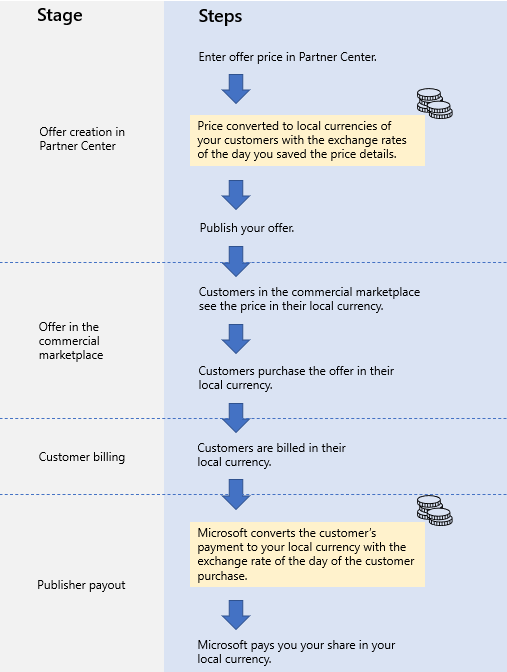

# Geographic availability and currency support for the commercial marketplace

## Supported geographic locations

Commercial marketplace offerings can be purchased in 141 geographies as defined by the customer's billing address, and transactions can be completed in 17 currencies. The following table lists each supported geographic location, its [ISO 3166 two-digit alpha code](https://en.wikipedia.org/wiki/List_of_ISO_3166_country_codes), and the assigned currency.

A CSP can purchase an offer in Partner Center in their end customer's currency so they can bill them in that same currency. For additional information on this, refer to [these FAQs](https://partner.microsoft.com/resources/detail/eu-efta-change-of-partner-billing-currency-faq-pdf).

|   Country/Region Name               |   ISO-2   |   Currency (All offer types)  |    Currency (Consulting service offers only)    |
|-------------------------------------|-----------|--------------|---------------------------------------------|
| Afghanistan                         | AF        | USD          | AFN, EUR, USD |
| Albania                             | AL        | USD          | ALL, EUR, USD |
| Algeria                             | DZ        | USD          | DZD, EUR, USD |
| Andorra                             | AD        | EUR          | EUR, USD |
| Angola                              | AO        | USD          | AOA, EUR, USD |
| Argentina                           | AR        | USD          | ARS, EUR, USD |
| Armenia                             | AM        | USD          | AMD, EUR, USD |
| Australia                           | AU        | AUD          | AUD, EUR, USD |
| Austria                             | AT        | EUR          | EUR, USD  |
| Azerbaijan                          | AZ        | USD          | AZN, EUR, USD |
| Bahrain                             | BH        | USD          | BHD, EUR, USD |
| Bangladesh                          | BD        | USD          | BDT, EUR, USD |
| Barbados                            | BB        | USD          | BBD, EUR, USD |
| Belarus                             | BY        | USD          | BYN, EUR, USD |
| Belgium                             | BE        | EUR          | EUR, USD  |
| Belize                              | BZ        | USD          | BZD, EUR, USD |
| Bermuda                             | BM        | USD          | BMD, EUR, USD |
| Bolivia                             | BO        | USD          | BOB, EUR, USD |
| Bosnia and Herzegovina              | BA        | USD          | BAM, EUR, USD |
| Botswana                            | BW        | USD          | BWP, EUR, USD |
| Brazil                              | BR        | BRL\*        | BRL, EUR, USD |
| Brunei                              | BN        | USD          | BND, EUR, SGD, USD |
| Bulgaria                            | BG        | EUR          | BGN, EUR, USD |
| Cabo Verde                          | CV        | USD          | CVE, EUR, USD |
| Cameroon                            | CM        | USD          | EUR, USD, XAF |
| Canada                              | CA        | CAD          | CAD, EUR, USD |
| Cayman Islands                      | KY        | USD          | EUR, KYD, USD |
| Chile                               | CL        | USD          | CLP, EUR, USD |
| China\**                            | CN        | N/A          | N/A |
| Colombia                            | CO        | USD          | COP, EUR, USD |
| Costa Rica                          | CR        | USD          | CRC, EUR, USD |
| Côte d'Ivoire                       | CI        | USD          | EUR, USD, XOF |
| Croatia                             | HR        | EUR          | EUR, HRK, USD |
| Curaçao                             | CW        | USD          | ANG, EUR, USD |
| Cyprus                              | CY        | EUR          | EUR, USD  |
| Czechia                             | CZ        | EUR          | CZK, EUR, USD |
| Denmark                             | DK        | DKK          | DKK, EUR, USD |
| Dominican Republic                  | DO        | USD          | DOP, EUR, USD |
| Ecuador                             | EC        | USD          | EUR, USD |
| Egypt                               | EG        | USD          | EGP, EUR, USD |
| El Salvador                         | SV        | USD          | EUR, USD |
| Estonia                             | EE        | EUR          | EUR, USD |
| Ethiopia                            | ET        | USD          | ETB, EUR, USD |
| Faroe Islands                       | FO        | DKK          | DKK, EUR, USD |
| Fiji                                | FJ        | AUD          | AUD, EUR, FJD, USD |
| Finland                             | FI        | EUR          | EUR, USD |
| France                              | FR        | EUR          | EUR, USD |
| Georgia                             | GE        | USD          | EUR, GEL, USD |
| Germany                             | DE        | EUR          | EUR, USD |
| Ghana                               | GH        | USD          | EUR, GHS, USD |
| Greece                              | GR        | EUR          | EUR, USD |
| Guatemala                           | GT        | USD          | EUR, GTQ, USD |
| Honduras                            | HN        | USD          | EUR, HNL, USD |
| Hong Kong SAR                       | HK        | USD          | EUR, HKD, USD |
| Hungary                             | HU        | EUR          | EUR, HUF, USD |
| Iceland                             | IS        | EUR          | EUR, ISK, USD |
| India                               | IN        | INR          | EUR, INR, USD |
| Indonesia                           | ID        | USD          | EUR, IDR, USD |
| Iraq                                | IQ        | USD          | EUR, IQD, USD |
| Ireland                             | IE        | EUR          | EUR, USD  |
| Israel                              | IL        | USD          | EUR, ILS, USD |
| Italy                               | IT        | EUR          | EUR, USD |
| Jamaica                             | JM        | USD          | EUR, JMD, USD |
| Japan                               | JP        | JPY          | EUR, JPY, USD |
| Jordan                              | JO        | USD          | EUR, JOD, USD |
| Kazakhstan                          | KZ        | USD          | EUR, KZT, USD |
| Kenya                               | KE        | USD          | EUR, KES, USD |
| Korea (South)                       | KR        | KRW          | EUR, KRW, USD |
| Kuwait                              | KW        | USD          | EUR, KWD, USD |
| Kyrgyzstan                          | KG        | USD          | EUR, KGS, USD |
| Latvia                              | LV        | EUR          | EUR, USD |
| Lebanon                             | LB        | USD          | EUR, LBP, USD |
| Libya                               | LY        | USD          | EUR, LYD, USD |
| Liechtenstein                       | LI        | EUR          | CHF, EUR, USD |
| Lithuania                           | LT        | EUR          | EUR, USD |
| Luxembourg                          | LU        | EUR          | EUR, USD |
| Macao SAR                           | MO        | USD          | EUR, MOP, USD |
| Malaysia                            | MY        | USD          | EUR, MYR, USD |
| Malta                               | MT        | EUR          | EUR, USD |
| Mauritius                           | MU        | USD          | EUR, MUR, USD |
| Mexico                              | MX        | USD          | EUR, MXN, USD |
| Moldova                             | MD        | USD          | EUR, MDL, USD |
| Monaco                              | MC        | EUR          | EUR, USD |
| Mongolia                            | MN        | USD          | EUR, MNT, USD |
| Montenegro                          | ME        | USD          | EUR, USD |
| Morocco                             | MA        | USD          | EUR, MAD, USD |
| Namibia                             | NA        | USD          | EUR, NAD, USD, ZAR |
| Nepal                               | NP        | USD          | EUR, NPR, USD |
| Netherlands                         | NL        | EUR          | EUR, USD |
| New Zealand                         | NZ        | NZD          | EUR, NZD, USD |
| Nicaragua                           | NI        | USD          | EUR, NIO, USD |
| Nigeria                             | NG        | USD          | EUR, NGN, USD |
| North Macedonia                     | MK        | USD          | EUR, MKD, USD |
| Norway                              | NO        | NOK          | EUR, NOK, USD |
| Oman                                | OM        | USD          | EUR, OMR, USD |
| Pakistan                            | PK        | USD          | EUR, PKR, USD |
| Palestinian Authority               | PS        | USD          | EUR, ILS, JOD, USD |
| Panama                              | PA        | USD          | EUR, PAB, USD |
| Paraguay                            | PY        | USD          | EUR, PYG, USD |
| Peru                                | PE        | USD          | EUR, PEN, USD |
| Philippines                         | PH        | USD          | EUR, PHP, USD |
| Poland                              | PL        | EUR          | EUR, PLN, USD |
| Portugal                            | PT        | EUR          | EUR, USD |
| Puerto Rico                         | PR        | USD          | EUR, USD |
| Qatar                               | QA        | USD          | EUR, QAR, USD |
| Romania                             | RO        | EUR          | EUR, RON, USD |
| Russia                              | RU        | RUB          | EUR, RUB, USD |
| Rwanda                              | RW        | USD          | EUR, RWF, USD |
| Saint Kitts and Nevis               | KN        | USD          | EUR, USD, XCD |
| Saudi Arabia                        | SA        | USD          | EUR, SAR, USD |
| Senegal                             | SN        | USD          | EUR, USD, XOF |
| Serbia                              | RS        | USD          | EUR, RSD, USD |
| Singapore                           | SG        | USD          | BND, EUR, SGD, USD |
| Slovakia                            | SK        | EUR          | EUR, USD |
| Slovenia                            | SI        | EUR          | EUR, USD |
| South Africa                        | ZA        | USD          | EUR, USD, ZAR |
| Spain                               | ES        | EUR          | EUR, USD |
| Sri Lanka                           | LK        | USD          | EUR, LKR, USD |
| Sweden                              | SE        | SEK          | EUR, SEK, USD  |
| Switzerland                         | CH        | CHF          | CHF, EUR, USD |
| Taiwan                              | TW        | TWD          | EUR, TWD, USD |
| Tajikistan                          | TJ        | USD          | EUR, TJS, USD |
| Tanzania                            | TZ        | USD          | EUR, TZS, USD |
| Thailand                            | TH        | USD          | EUR, THB, USD |
| Trinidad and Tobago                 | TT        | USD          | EUR, TTD, USD |
| Tunisia                             | TN        | USD          | EUR, TND, USD |
| Turkey                              | TR        | USD          | EUR, TRY, USD |
| Turkmenistan                        | TM        | USD          | EUR, TMT, USD |
| Uganda                              | UG        | USD          | EUR, UGX, USD |
| Ukraine                             | UA        | USD          | EUR, RUB, UAH, USD |
| United Arab Emirates                | AE        | USD          | AED, EUR, USD |
| United Kingdom                      | GB        | GBP          | EUR, GBP, USD |
| United States                       | US        | USD          | EUR, USD |
| U.S. Virgin Islands                 | VI        | USD          | EUR, USD|
| Uruguay                             | UY        | USD          | EUR, USD, UYU |
| Uzbekistan                          | UZ        | USD          | EUR, USD, UZS |
| Vatican City (Holy See)             | VA        | EUR          | EUR, USD |
| Venezuela                           | VE        | USD          | EUR, USD, VES |
| Vietnam                             | VN        | USD          | EUR, USD, VND |
| Yemen                               | YE        | USD          | EUR, USD, YER |
| Zambia                              | ZM        | USD          | EUR, USD, ZMW |
| Zimbabwe                            | ZW        | USD          | EUR, USD|
|   |   |   |

\* For customers in Brazil, the commercial marketplace through Cloud Solution Providers (CSP) uses USD.

\** Free and BYOL VM images only.

## How we convert currency

For all paid offer types, you have the option of entering prices in USD or uploading prices in local currency. Prices entered in USD are automatically converted to local currency when the page is saved. The rates Partner Center uses are updated daily. You can export the prices and review the converted equivalents.

To adjust any price before you publish, just export the pricing spreadsheet, modify it, and upload it with changes.

> [!NOTE]
> After a price for a market in your plan is published, it can't be changed. To ensure that the prices are right before you publish them, export the pricing spreadsheet and review the prices in each market.

The price of an offer is always shown to customers in their local currency. The price you select in Partner Center is converted to the local currency of customers according to the exchange rate at the time you saved the price in Partner Center. The price shown to customers in the online stores doesn't change, unless you republish your offer.

Microsoft receives payments from customers in their local currency, and pays you in the currency you selected in Partner Center. Microsoft converts the customer local currency using the exchange rate of the day of purchase.

> [!NOTE]
> Microsoft converts offer prices using the Microsoft Treasury exchange rates.

## Retrieving currency information by API

Individual prices (which, depending on how they were set, may have been influenced by the exchange rates on the day they were saved) can be retrieved using an API; currency information can't.

For details on how to enter prices for specific offer types, refer to these articles:

- [Create an Azure application offer](create-new-azure-apps-offer.md)
- [Create an Azure container offer](./create-azure-container-offer.md)
- [Create an Azure virtual machine offer](azure-vm-create.md)
- [Create a consulting service offer](./create-consulting-service-offer.md)
- [Create a Dynamics 365 for Customer Engagement & Power Apps offer](dynamics-365-customer-engage-offer-setup.md)
- [Create a Dynamics 365 for Operations offer](partner-center-portal/create-new-operations-offer.md)
- [Create a Dynamics 365 Business Central offer](partner-center-portal/create-new-business-central-offer.md)
- [Create an IoT Edge module offer](partner-center-portal/azure-iot-edge-module-creation.md)
- [Create a Managed Service offer](./plan-managed-service-offer.md)
- [Create a Power BI app](partner-center-portal/create-power-bi-app-offer.md)
- [Create a SaaS offer](./create-new-saas-offer.md)