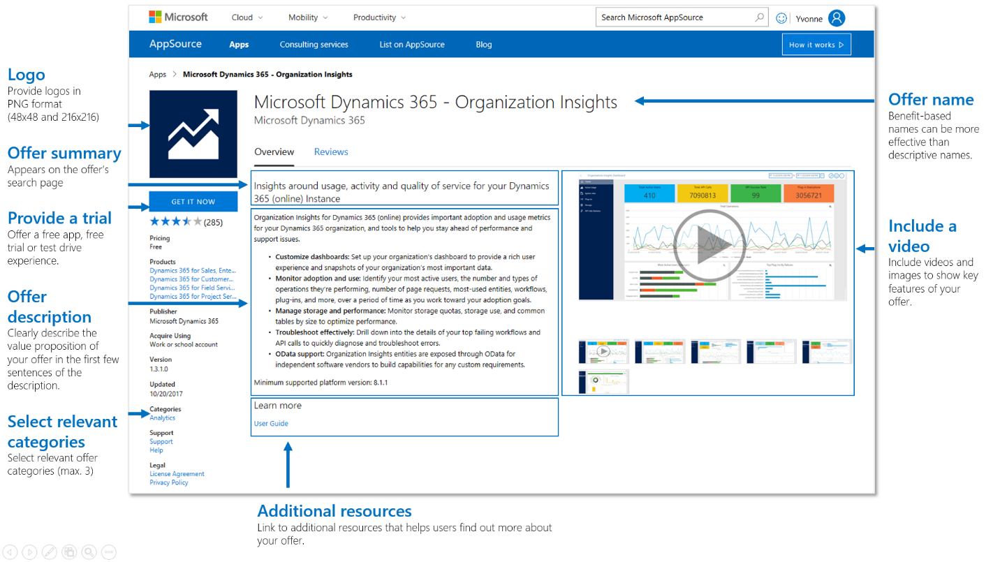

# Grow your business with AppSource
Both Azure Marketplace and AppSource are the launching points for joint go-to-market activities with Microsoft and a flywheel for business growth. Using launch promotion, demand generation, and joint sales and marketing, your marketplace offer can be the centerpiece of your cloud business engine. There are no fees for participating. Microsoft customers visit our cloud marketplaces every day to find the right apps and services to help boost their business. Our goal is to connect organizations with the solutions and services from Microsoft and our partner ecosystem. 

## Business benefits of joining a cloud marketplace
There are many compelling reasons why you should join Microsoft’s cloud marketplaces. Here are the benefits specifically to listing your offers on AppSource to help you grow your business: 
*   **Connect directly with decision-makers** AppSource helps ISVs and system implementors reach potential customers and connect directly with those critical LoB decision-makers, providing a single destination for business users to discover and try LoB SaaS apps.
*   **Reach more customers** AppSource can help you reach business users worldwide in markets you might not have been able to reach before. Customers can easily find apps not only on [https://appsource.microsoft.com](https://appsource.microsoft.com), but also from within the context of Microsoft products they already use — through in-product app galleries. 
*   **Generate leads and sales opportunities** When business users try your application on AppSource we share their contact information with you directly in your CRM system, so you can connect with them and turn them into sales opportunities. 
*   **Extend your sales teams** Your sales teams play a crucial role in your business. When you list your apps on AppSource, you gain another sales channel that empowers business users to find and try business apps. Plus, by listing on AppSource, you can partner with Microsoft sales teams to deliver end-to-end solutions. 
*   **Enhance business value and increase deal size with existing and new customers** Grow deal size and address customer pain points when moving workloads to the cloud. Reduce sales cycles and increase deal profitability by selling complete solutions that target specific workloads or industry scenarios. 
*   **Unlock Microsoft Go-To-Market Services**  Microsoft Go-To-Market (GTM) Services help you open new doors through joint launch planning, global expansion, channel development, lead sharing and more. Depending on the trial experience you offer, and as the use of Microsoft technology grows, you get to unlock more GTM benefits.
*   **List your consulting services offerings** Business users are looking for experienced partners to help them get started with confidence by offering quality consulting services designed to deliver predictable outcomes. List your consulting services offerings to help business users find the offers to help them get started quickly.
*   **Get started with confidence** The Microsoft AppSource team is here to provide a seamless onboarding experience. They are here to help you every step of the way—whether it’s working on the trial or test drive experience, helping you meet the listing criteria and more.
*   **Customize your app listing page** You have flexibility when it comes to deciding how you’d like to market your apps on AppSource. Provide a video, data sheets, documentation, and detailed description—we’ll work with you to present your app on AppSource in a compelling way.
*   **Get actionable insights** Get insights on the performance of your listings via the Cloud Partner Portal or the Office app publishing process. Track how many visitors your app listing gets, and how many try your app. Learn details about the performance of your marketing campaigns and which content performs best.

## How to grow your business with AppSource
Following best practices in marketing your offers on AppSource helps you maximize your business benefits and set you up for success with Go-to-Market and Microsoft Co-Sell initiatives. The [Microsoft Partner Network (MPN)](https://partner.microsoft.com/en-us/membership) is your gateway for all non-Marketplace-related marketing and programmatic resources. 

The quality of your app publication and commitment to customer-centric demand generation and partner engagement help drive customer growth for your business. 

The following checklist provides marketing best practices and resources to consider when creating offers to be published on AppSource:
* **Be aware of Microsoft Trademark & Brand Guidelines.** When naming your app and referring to Microsoft trademarks and the names of Microsoft software, products, and services, follow the [Microsoft Trademark and Brand Guidelines](https://www.microsoft.com/legal/intellectualproperty/trademarks/usage/general.aspx) as well as relevant product-specific guidelines. 
* **Enable a get it now experience, free trial offer, or test drive experience for your app.** Business users want to experience your app first hand. 
* **Build a strong value proposition.** Identify who your potential customer is and what your solution does that is different from how the user is currently doing something.
* **Make your app listing stand out.** Your app landing page is the first impression that a business user gets. Based on your app listing, they’ll decide if they want to learn more and try your apps. 
* **Optimize your listing to help boost search engine rankings.** Make sure you incorporate search keywords in your app name, summary and listing, and include them in the three search keywords.
* **Business users rely on customer feedback.** Remind your customers to submit a rating and review. Users receive an email to share their experience after they started a trial.
* **Promote that your app is available on AppSource.** Link to your app listing on AppSource from your website using the AppSource badge, and use URL tagging every time you link to your app.
* **Build your demand generation plan.** Customers can choose from an overwhelming number of solutions. How do you make them aware of yours? Drive demand with marketing activities.
* **Enable lead sharing.** Receive a user’s contact information when they try your app right in your CRM system. Make sure you have a process in place to follow up on these leads.
* **Review the performance of your app listing.** Use the insights dashboard in the Cloud Partner Portal or the Office app publishing process to review performance.
* **Utilize Go-To-Market services benefits.** When you list an offer on AppSource, you have access to Go-To-Market services. Learn more about benefits available through the Microsoft Partner Network (MPN).
 
 ### App listing best practices
Your listing in AppSource can be your first interaction with a potential customer. Like any first impression, you want to make it strong and something your audience wants to follow up on. Partner with your marketing team to ensure the messaging and supporting content in your listing differentiated and helps your offer stand out. 

Here are some basic things you can do to provide a great first impression. 

The next section walks you through the different steps required to submit your marketplace listing. Read through it carefully as it includes best practices that can help your app stand out and improve search engine rankings. 

The following tables detail each step of filling out your offer listing.

**Offer identity**
| Offer setting       | Best practices          | 
|:---------------------------------------- |:----------------------------------------------------- |
| **Name**    | **Naming your offer**. Choosing a name for your app is a key decision. Benefit-based names are more effective than descriptive names. Your app name should communicate the core value customers receive. Including search keywords in your app title can also help your app to be ranked higher in search engine results. Follow the [Microsoft Trademark and Brand Guidelines](https://www.microsoft.com/legal/intellectualproperty/trademarks/usage/general.aspx) as well as relevant product-specific guidelines when referring to Microsoft trademarks and the names of Microsoft, software, products and services. |

**Storefront details - Offer details**
| Storefront settings       | Best practices          | 
|:---------------------------------------- |:----------------------------------------------------- |
| **Offer name**    | The offer summary appears on the offer’s search page on the AppSource homepage and app gallery. Include search keywords in your offer summary to help improve ranking of your app in search engine results. |
| **Offer description**     | **Provide a good offer description.**   Clearly describe the value proposition of your offer in the first few sentences of your description. Keep in mind that the first few sentences might be displayed in search engine results.  Do not rely on features and functionality to sell your product. Instead, focus on the value you deliver. Use industry-specific vocabulary or benefit-based wording as much as possible.  Core components of your value proposition should include information about: •What is the product •Who will gain from it the most •What need, or pain does it address. Tell the customer how the business or work life can be different after they use your solution. Incorporate search keywords and keyword variations in your offer description to help improve the ranking of your offer in search engine results. Provide the offer description using simple HTML. Here is an example of a simple offer listing page (as shown in the listing example shown above) that provides an offer summary followed by a list of key capabilities. The maximum number of characters is 3,000. _Sample HTML_ &lt;p&gt;Organization Insights for Dynamics 365 (online) provides important adoption and usage metrics for your Dynamics 365 organization, and tools to help you stay ahead of performance and support issues.&lt;/p&gt; &lt;ul&gt; &lt;li&gt;&lt;strong&gt;Customize dashboards:&lt;/strong&gt; Set up your dashboard to provide a rich user experience and snapshots of your important data.&lt;/li&gt; &lt;li&gt;&lt;strong&gt;Monitor adoption and use:&lt;/strong&gt; Identify your most active users, number of page requests, most-used entities, workflows, and more.&lt;/li&gt; &lt;/ul&gt; &lt;p&gt;Minimum supported platform version: 8.1.1&lt;/p&gt; |

**Storefront details - Listing details**
| Storefront settings       | Best practices          | 
|:---------------------------------------- |:----------------------------------------------------- |
| **Industries (max 2)**    | Select up to two industries if your offer addresses industry-specific requirements. Make sure to call out these industry-specific capabilities in the offer description. |
| **Categories (max 3)**     | Select up to three categories that align best with your offer. Choose these categories carefully as users use them to search for relevant apps. Make sure to call out how your offer supports category-specific needs in the offer description. |
| **Products your app works with (max 3)**   | List additional products and technologies that your solution uses. For example, Azure IOT Hub, Azure Machine Learning, etc. |
| **Search keywords (max 3)**       | Search keywords help business users find your offer when searching on AppSource or by using Search Engines. Identity the top 3 search keywords for your offer, incorporate them in your offer summary, description, and list them here. |

**Storefront details - Marketing artifacts**
| Storefront settings       | Best practices          | 
|:---------------------------------------- |:----------------------------------------------------- |
| **Offer logo (.png format, 58x48)**    | Your logo should be designed and optimized for a digital medium. Upload logo in PNG format for the offer’s search page. |
| **Offer logo (.png. 216 x 216)**     | Your logo should be designed and optimized for a digital medium.  Upload logo in PNG format for the offer’s app details listing page. |
| **Learn more**   | Include supporting sales and marketing assets under “Learn more,” for example, white papers, brochures, checklists, PowerPoints, and so on. All files should be in PDF format. Don’t sell, educate the prospect.  Add the link to your app landing page to all your documents and add URL parameters to help you track visitors and trials. |
| **Videos**       | Upload at least one video, up to four videos are permitted. Your video should communicate the value of your offer. Make sure the prospect is the hero of the story, not your company. Your video should speak to the principal challenges and goals of your core decision maker persona.  Recommended length: 60-90 seconds. Incorporate you key search words in the name of the videos. Consider adding additional videos such as a how-to video; a getting started video, or a customer testimonial video. |
| **Screenshots**     | Add up to five screenshots, incorporate key search words in the names. |

### Promote your offer’s availability on AppSource

When your offer is listed on AppSource, you’ve earned the right to display the “Available on AppSource” badge on your website. 
    
Adding this badge to your site promotes that your offer on AppSource, and you can link potential customers directly to the listing page. The AppSource badge is available in three sizes. You can download the badge along with guidance on how to use it at [Promote your app's availability on Microsoft AppSource](https://appsource.microsoft.com/blogs/promote-your-app-s-availability-on-microsoft-appsource).

#### Linking to your app listing page on AppSource from your website 
When you link from the AppSource badge on your site to your listing on AppSource, you must include the following query parameters at the end of the URL:
* **src** — Include the source from where the traffic is routed to AppSource. For example, website, LinkedIn, Facebook, etc.
* **mktcmpid** — Your marketing campaign ID, which can include up to 16 characters using any combination of letter, number, underscore, and hyphen. For example, blogpost_12 

The following example shows a URL that includes the two query parameters:

https://appsource.microsoft.com/product/dynamics-365/mscrm.04931187-431c-415d-8777-f7f482ba8095?src=website&mktcmpid=blogpost_12 

**Important:** When you prepare the URL, do not include the language code, such as /en-us/. 

Adding these parameters to your AppSource URL enables you to review the effectiveness of your campaign in the analytics dashboard in the Cloud Partner Portal. 

#### Marketplace GTM benefits 

New listings in AppSource are eligible to receive free marketplace GTM benefits. Once listed, our team of marketing specialists will reach out to you, and work with your marketing contact to kick-start these activities. 
The activities we provide differ depending on your solution status in our marketplace. Benefits increase for offers that come with a trial experience. Microsoft Gold partners can access additional benefits. 
To maximize the impact of these activities, we encourage you to have your launch plan ready to execute. You may want to leverage your landing page for many of these tactics. Note that One Commercial Partner (OCP) Catalog is a benefit of members in the Microsoft Partner Network. For guidance on how to build a great landing page, see [Build a Great Landing Page](https://docs.microsoft.com/en-us/azure/marketplace/grow-your-business-azure-marketplace#build-a-great-landing-page). 
For additional go-to-market support including templates, web content, training, and tools to promote your business, visit [https://www.MicrosoftGoToMarket.com](https://www.MicrosoftGoToMarket.com). 

#### Enable lead sharing 
Ensure that lead management is enabled in your Marketplace offer so that you receive the contact information of business users that try your apps or are interested in your services. These leads provide the basis for outreach for nurture campaigns, sales motions by your field sales staff, and information about how your offer is performing. 
Best practices for using these leads include:
* Qualifying the leads and scoring them as sales opportunities
* Nurturing them to enter a sales pipeline
* Aligning these efforts with your overall marketing campaign strategy 

These leads demonstrate user interest in your app or consulting services offering. You want to ensure that you have a process in place to follow up with these leads. In addition to creating a lead in your CRM system, a lead might also be created in the Microsoft field seller CRM. 

However, AppSource leads are different from Microsoft seller-qualified leads that are a feature of the Co-Selling program. See below to learn about how to access the Co-Sell program. 

#### Promote Your Business Through Microsoft Programs 
There are many people and teams within Microsoft whose goal is to support our partners and reduce any friction you have in selling with us. By listing in our marketplace, you open access to our marketplace programs and resources. 

If you haven’t already signed up to the [Microsoft Partner Network (MPN)](https://partner.microsoft.com/en-US/), this should be your first step. MPN offers guidance for navigating Microsoft – from new business opportunities and connecting with teams or partners, to information about solutions and training to help grow your skill set. 

Additional steps you can take to open access to even more partner benefits and resources are to do the following. 
1. **Leverage your Core Benefits** - As part of our Microsoft Partner Network, you receive a set of [Core Benefits](https://partner.microsoft.com/en-US/membership/core-benefits) that can help you save time and money while you strengthen your capabilities, better serve customers and build connections to reach your full business potential. 
2. **Earn your Cloud Platform Competency** - Earning [Cloud Platform Competency](https://partner.microsoft.com/en-us/membership/cloud-platform-competency) allows you to differentiate yourself within Microsoft’s expansive partner network as well as demonstrate technical expertise and customer success in market. Earning a Competency is also a pre-requisite for many key partner programs like Co-Sell. 
3. **Become Co-Sell Ready** - The [Co-Sell Ready](https://partner.microsoft.com/en-US/reach-customers/promote-your-business) program allows you to collaborate directly with Microsoft sellers and other partners on target customer opportunities and account planning. Your solution becomes visible to our sellers in their solution catalog.

#### Search engine optimization 
You can influence the ranking of your offer in search engine results. Partner with your marketing team, identify keywords, and make sure to follow the guidance below to help improve your apps search results:
* Name your offer with search keywords in mind.
* Include search keywords in the offer summary.
* List the top three search keywords for your offer in the storefront details.
* Associate your offer with the correct category and industry.
* Regularly tweet about the availability of your offer and include a link to your offer.

#### Merchandising 
Microsoft Gold Partners can become eligible to have their app featured, when providing an app trial experience (free app, free trial, or Test Drive) on AppSource. Apps can be featured by category or industry, and are typically promoted for a minimum of two weeks. 
For more information on how featured apps fit in the context of your Go-To-Market benefits, review the Marketplace GTM Benefits section of this guide.   

