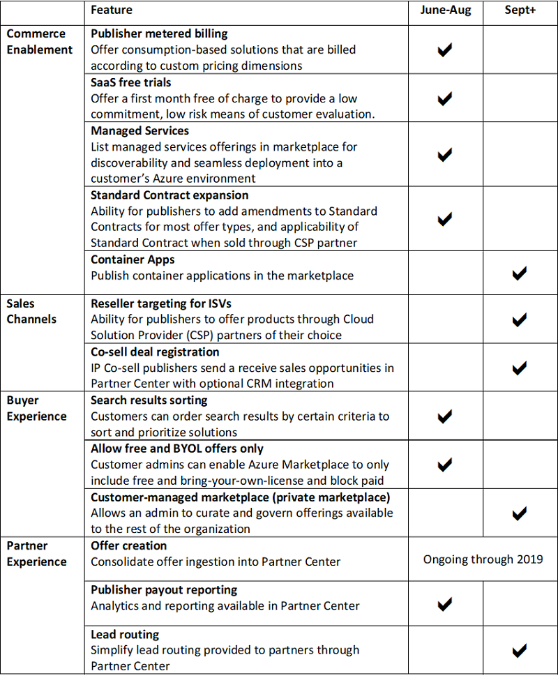

# Azure Marketplace and AppSource roadmap

This document provides a view into what's next for Microsoft’s commercial marketplace for publishers, sellers, and customers. It captures some of the significant features we have committed, a rough time frame for when you can expect to see them and will be refreshed monthly. It is not a comprehensive list of all new features but is intended to provide visibility into our key investments. These feature sets and delivery time frames are current and subject to change.

We welcome your suggestions! Join the conversation in the [Microsoft Partner Community](https://www.microsoftpartnercommunity.com/) to get the latest updates on new capabilities, programs, and events.

## Roadmap

## Recent Releases

Once a capability is live, it will be removed from the roadmap. Functionality that has been added to the Marketplace includes the following.

### For March 2019

* [Marketplace + CSP Update Blog](https://azure.microsoft.com/blog/azure-marketplace-and-cloud-solution-provider-updates-march-2019/)
* [Publish offerings into CSP channel (ISV)](https://docs.microsoft.com/azure/marketplace/cloud-solution-providers)
* [Resell Marketplace offerings (CSP)](https://docs.microsoft.com/partner-center/sell-marketplace-products)
* [Standard Contract](https://docs.microsoft.com/azure/marketplace/standard-contract)
* [SaaS Fulfillment API](https://docs.microsoft.com/azure/marketplace/partner-center-portal/pc-saas-fulfillment-apis)
* [Marketplace Geos and Currencies](https://docs.microsoft.com/azure/marketplace/marketplace-geo-availability-currencies)
* [Seller Insights](https://docs.microsoft.com/azure/marketplace/cloud-partner-portal-orig/si-changes)

### For May 2019

* [Microsoft Build Marketplace Blog](https://azure.microsoft.com/blog/announcing-new-marketplace-revenue-opportunities/)
* [Marketplace May Updates Blog](https://azure.microsoft.com/blog/microsoft-commercial-marketplace-updates-may-2019/)
* Partner Center: [Create Account](https://docs.microsoft.com/azure/marketplace/partner-center-portal/create-account) / [Manage Account](https://docs.microsoft.com/azure/marketplace/partner-center-portal/manage-account) / [Migration from CPP](https://docs.microsoft.com/azure/marketplace/partner-center-portal/account-migration-from-cpp-to-pc)
* Partner Center: [Create SaaS Offer](https://docs.microsoft.com/azure/marketplace/partner-center-portal/create-new-saas-offer) / [Publishing Status](https://docs.microsoft.com/azure/marketplace/partner-center-portal/publishing-status
) / [Update Existing Offer](https://docs.microsoft.com/azure/marketplace/partner-center-portal/update-existing-offer) / [Offer Analytics](https://docs.microsoft.com/azure/marketplace/partner-center-portal/analytics)
* [Get support for marketplace in Partner Center](https://docs.microsoft.com/azure/marketplace/partner-center-portal/support)

## Next steps

Visit the [Azure Marketplace and AppSource Publisher Guide](https://docs.microsoft.com/azure/marketplace/marketplace-publishers-guide) page.
