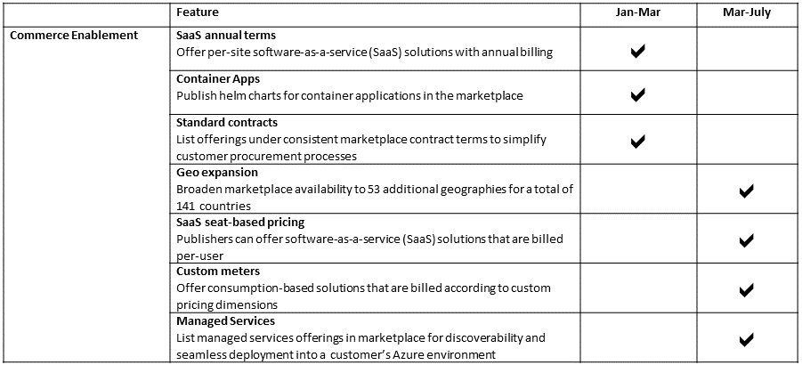
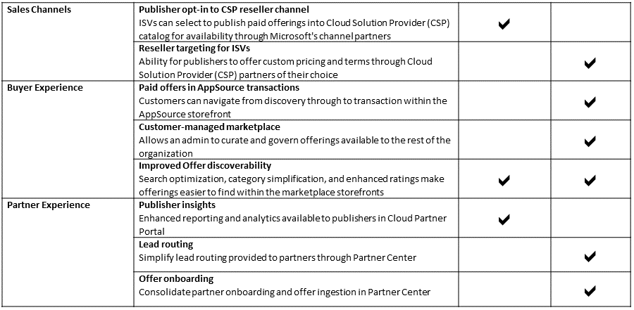

# Azure Marketplace and AppSource roadmap

This document provides a view into what's next for Azure Marketplace, AppSource, and related partner programs. It captures some of the significant features we have committed, a rough time frame for when you can expect to see them. It is not a comprehensive list of all new features, but is intended to provide visibility into our key investments. These feature sets and delivery time frames are current and subject to change.  This page will be refreshed monthly.

We welcome your suggestions! Join the conversation in the [Microsoft Partner Community](https://www.microsoftpartnercommunity.com) to get the latest updates on new capabilities, programs, and events.

## Next step

Visit the [Azure Marketplace and AppSource Publisher Guide](https://docs.microsoft.com/azure/marketplace/marketplace-publishers-guide) page.

---