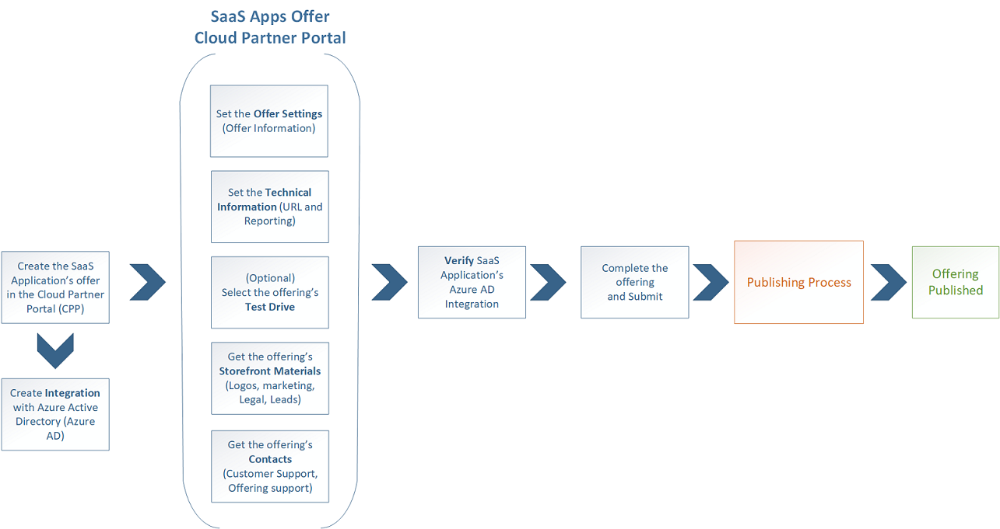

# SaaS applications technical publishing guide

Welcome to the Azure Marketplace SaaS Applications Technical Publishing Guide. This guide is designed to help candidate and existing publishers to list their applications and services in the Azure Marketplace using the SaaS Applications offering. 

To better understand how to publish a SaaS offer, this guide is divided into the following sections:
* Offer Overview
* Business Requirements
* Technical Requirements
* Publishing Process
* Using Azure Active Directory to enable trials
* Certifying your Azure AD integration for Marketplace

## Offer overview  

SaaS applications are available in both Azure Storefronts The following table describes the current available options:

| Storefront option | Listing | Trial/Transact |  
| --- | --- | --- |  
| AppSource | Yes (Contact Me) | Yes (PowerBI/Dynamics) |
| Azure marketplace | No | Yes (SaaS Apps) |   

**Listing:**  The Listing publishing option consists of a Contact Me offer type and is used when a Trial- or Transaction-level participation is not feasible. The benefit of this approach is that it enables publishers with a solution in-market to immediately begin receiving leads that can be turned into deals to increase your business.  
**Trial/Transact:**  The customer has the option to directly buy or request a trial for your solution. Providing a Trial experience increases the engagement level offered to customers and enables customers to explore your solution before buying. With a Trial experience, you will have better chances of promotion in the storefronts, and you should expect more and richer leads from customer engagements. Trials must include free support at least for the duration of the trial period.  

| SaaS Apps Offer | Business Requirements | Technical Requirements |  
| --- | --- | --- |  
| **Contact Us** | Yes | No |  
| **PowerBI / Dynamics** | Yes | Yes (Azure AD integration) |  
| **SaaS Apps**| Yes | Yes (Azure AD integration) |     

For more information about the Marketplace storefronts and a descripiton of each publishing option, see the [Marketplace Publisher Guide](https://aka.ms/sellerguide) and [Publishing Options](https://docs.microsoft.com/azure/marketplace/marketplace-publishers-guide#select-a-publishing-option).

## Business requirements
The SaaS offer business requirements can be completed in parallel with the technical requirements. Most of the business requirements and information is collected when building the SaaS Offer in the Cloud Partner Portal. The business requirements are the following: 
* Agreeing to the Participation policies
* Integration with Microsoft 
* Identify the Offer’s audience
* Define and determine the lead management to be used
* Setting up privacy policy and terms of use
* Defining the Support contacts  

For more information, you  can be found in the topic [Prerequisites for marketplace publishing](https://docs.microsoft.com/azure/marketplace/marketplace-publishers-guide#prerequisites-for-marketplace-publishing)

## Technical requirements

The technical requirements for SaaS applications are simple. Publishers are only required to be integrated with Azure Active Directory (Azure AD) to be published. Azure AD integration with applications is well documented and Microsoft provides multiple SDKs and resources to accomplish this.  

To start, we recommend that you have a subscription dedicated for your Azure Marketplace publishing, allowing you to isolate the work from other initiatives. Once this is done you can start deploying your SaaS application in this subscription to start the development work.  

The best Azure Active Directory documentation, samples and guidance are located at the following sites: 

* [Azure Active Directory Developer's Guide](https://docs.microsoft.com/azure/active-directory/develop/active-directory-developers-guide)

* [Integrating with Azure Active Directory](https://docs.microsoft.com/azure/active-directory/develop/active-directory-how-to-integrate)

* [Integrating Applications with Azure Active Directory](https://docs.microsoft.com/azure/active-directory/develop/active-directory-integrating-applications)

* [Azure Roadmap - Security and Identity](https://azure.microsoft.com/roadmap/?category=security-identity)

For video tutorials, review the following:

* [Azure Active Directory Authentication with Vittorio Bertocci](https://channel9.msdn.com/Shows/XamarinShow/Episode-27-Azure-Active-Directory-Authentication-with-Vittorio-Bertocci?term=azure%20active%20directory%20integration)

* [Azure Active Directory Identity Technical Briefing - Part 1 of 2](https://channel9.msdn.com/Blogs/MVP-Enterprise-Mobility/Azure-Active-Directory-Identity-Technical-Briefing-Part-1-of-2?term=azure%20active%20directory%20integration)

* [Azure Active Directory Identity Technical Briefing - Part 2 of 2](https://channel9.msdn.com/Blogs/MVP-Azure/Azure-Active-Directory-Identity-Technical-Briefing-Part-2-of-2?term=azure%20active%20directory%20integration)

* [Building Apps with Microsoft Azure Active Directory](https://channel9.msdn.com/Blogs/Windows-Development-for-the-Enterprise/Building-Apps-with-Microsoft-Azure-Active-Directory?term=azure%20active%20directory%20integration)

* [Microsoft Azure Videos focused on Active Directory](https://azure.microsoft.com/resources/videos/index/?services=active-directory)

Free Azure Active Directory training is available at  
* [Microsoft Azure for IT Pros Content Series: Azure Active Directory](https://mva.microsoft.com/en-US/training-courses/microsoft-azure-for-it-pros-content-series-azure-active-directory-16754?l=N0e23wtxC_2106218965)

In addition, Azure Active Directory provides a site to check for Service Updates   
* [Azure AD Service updates](https://azure.microsoft.com/updates/?product=active-directory)

For support, you can use the following resources:
* [MSDN Forums](https://social.msdn.microsoft.com/Forums/azure/en-US/home?forum=WindowsAzureAD)
* [StackOverflow](https://stackoverflow.com/questions/tagged/azure-active-directory)

## Publishing process

The SaaS publishing process has both technical and business steps.  Most of the work that is done developing and integrating Azure Active Directory can be done in parallel with the work needed to fulfill the business requirements of the offer. The bulk of the business requirements are part of the SaaS App Offer configuration the Cloud Partner Portal.  
The following diagram shows the main publishing steps for the Trial/Transact offer:  

  

The following table describes each of the main publishing steps:  

| Publishing Step | Description |   
| --- | --- |  
| **Create the SaaS application** | Log in to the Cloud Partner Portal, select **New**, and then select the **SaaS apps** offer. |  
| **Create the Integration with Azure AD** | Follow the technical requirements described in the previous section to integrate your SaaS offering with Azure AD. |  
| **Set the Offer Settings**| Enter all the SaaS offer initial information. The Offer ID and Offer Name you would like to use. |     
| **Set the Technical Information** | Enter the technical information about the offer. For SaaS Applications, the Solution’s URI and type of offer’s acquisition button (Free, Trail, or Contact Me) are required. |  
| **Test Drive(Optional)** | This is an optional type of Trial, needed mostly for other Types of Marketplace Offers. It allows you to have the Trial deployed in the Publisher’s Subscriptions vs. the end customer. |  
| **Set the Offer Storefront Materials**| In this section the publisher will link and upload the Logos, Marketing materials, Legal documents and configure the Leads management system. |
| **Set the Offer Contacts** | Enter both the Engineering contacts and Support contact information for the SaaS Offer. |  
| **Verify SaaS App Azure AD Integration** | Before submitting your SaaS app for publishing, you must verify that the app is integrated with Azure AD |  
| **Publish the Offer**| After the offer and the technical assets are completed, you can submit the offer. This will start the publishing process, in which the solution template is tested, validated, certified and approved for publishing. |

## Using Azure Active Directory to enable trials  

Microsoft authenticates all Marketplace users with Azure AD, hence when an authenticated user clicks through your Trial listing in Marketplace and is redirected to your Trial environment, you can provision the user directly into a Trial without requiring an additional sign-in step. The token that your app receives from Azure AD during authentication includes valuable user information that you can use to create a user account in your app, enabling you to automate the provisioning experience and increase the likelihood of conversion. For more information about the token, see [Sample Tokens](https://docs.microsoft.com/azure/active-directory/develop/active-directory-token-and-claims) .

Using Azure AD to enable 1-click authentication to your app or Trial does the following:  
* Streamlines the customer experience from Marketplace to Trial.  
* Maintains the feel of an 'in-product experience' even when the user is redirected from Marketplace to your domain or Trial environment.  
* Decreases the likelihood of abandonment on redirect because there is not an additional sign-in step.  
* Reduces deployment barriers for the large population of Azure AD users.  

## Certifying your Azure AD integration for Marketplace  

You can certify your Azure AD integration in a few different ways, depending on whether your application is single-tenant or multi-tenant, and whether you are new to Azure AD federated single sign-on (SSO), or already support it.  

**For multi-tenant applications:**  

If you already support Azure AD, do the following:
1.	Register your application in the Azure portal
2.	Enable the multi-tenancy support feature in Azure AD to get a 'one-click' trial experience. More specific information can be found [here](https://docs.microsoft.com/azure/active-directory/develop/active-directory-integrating-applications).  

If you are new to Azure AD Federated SSO, do the following: 
1.  Register your application in the Azure portal
2.  Develop SSO with Azure AD using [OpenID Connect](https://docs.microsoft.com/azure/active-directory/develop/active-directory-protocols-openid-connect-code) or [OAuth 2.0](https://docs.microsoft.com/azure/active-directory/develop/active-directory-protocols-oauth-code).
3.  Enable multi-tenancy support feature in AAD to get 'one-click' trial experience More specific information can be found [here](https://docs.microsoft.com/azure/active-directory/develop/active-directory-devhowto-appsource-certified).  

**For single-tenant application, use any of the following options:**  
* Add users to your directory as guest users using [Azure B2B](https://docs.microsoft.com/azure/active-directory/active-directory-b2b-what-is-azure-ad-b2b)
* Manually provision trials for customers by using 'Contact Me'
* Develop a per-customer 'Test Drive'
* Build a multi-tenant sample demo app with SSO

