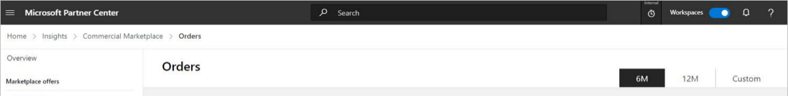
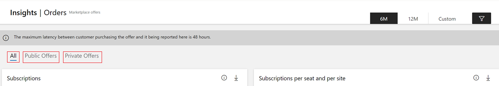
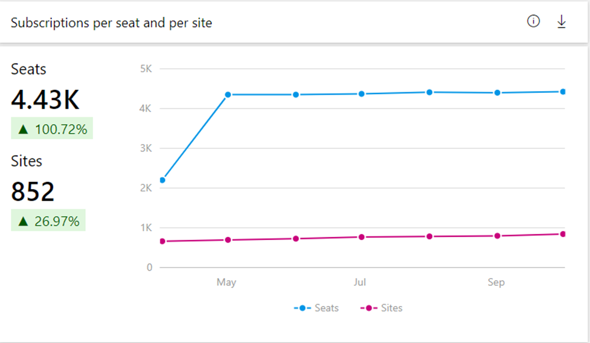
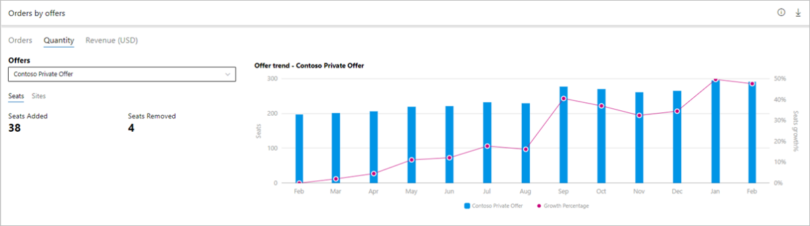
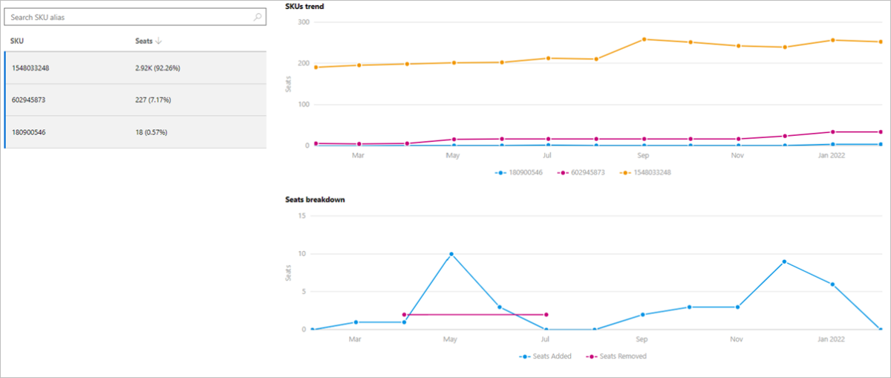
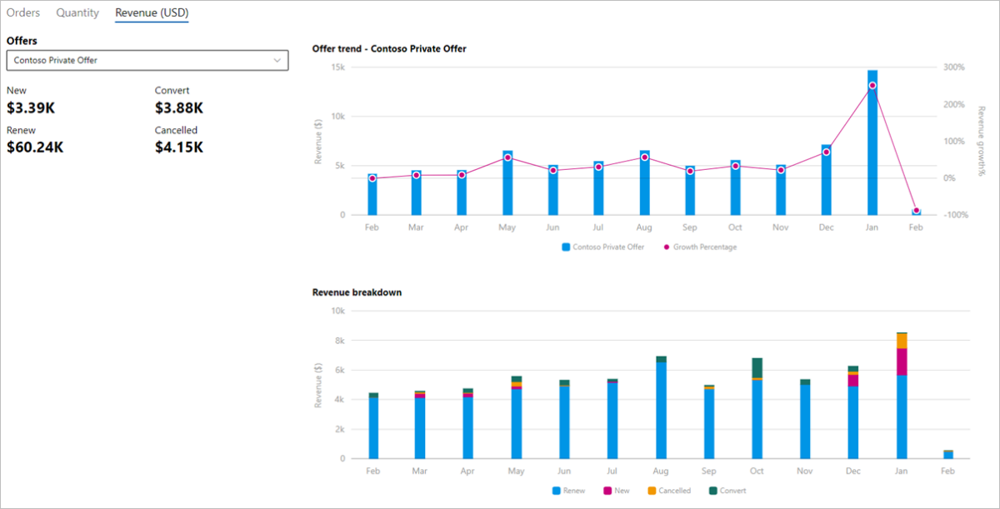
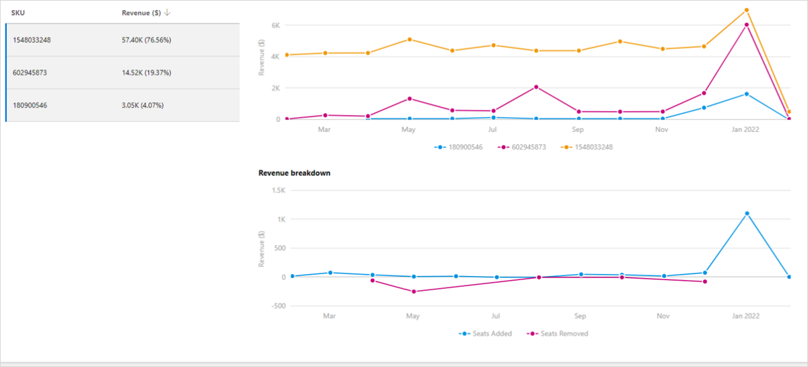

# Orders dashboard in commercial marketplace analytics

This article provides information on the Orders dashboard in Partner Center. This dashboard displays information about your offer - subscriptions, orders, pricing model including growth trends, presented in a graphical and downloadable format.

>[!NOTE]
> For detailed definitions of analytics terminology, see [Commercial marketplace analytics terminology and common questions](./analytics-faq.yml).

## Orders dashboard

The [Orders dashboard](https://go.microsoft.com/fwlink/?linkid=2165914) displays the current orders for all your offers, including software as a service (SaaS), with subscription-based billing model. You can view graphical representations of the following items:

- Subscription trend
- Subscription per seat and site trend
- Orders by offers
- Orders by geography
- Detailed orders table
- Orders page filters

> [!NOTE]
> The maximum latency between customer acquisition and reporting in Partner Center is 48 hours.

## Access the Orders dashboard

1. Sign in to [Partner Center](https://partner.microsoft.com/dashboard/home).
1. On the Home page, select the **Insights** tile.

    

1. In the left menu, select **Orders**.

## Elements of the Orders dashboard

The following sections describe how to use the Orders dashboard and how to read the data.

### Month range

You can find a month range selection at the top-right corner of each page. Customize the output of the **Orders** page graphs by selecting a month range based on the past 6 or 12 months, or by selecting a custom month range with a maximum duration of 12 months. The default month range is six months.

### Public and Private offer
you can choose to view subscription and order details of public offers, private offers, or both by selecting the **Public offer** sub-tab, **Private offer** sub-tab, and the **All** sub-tab respectively.

> [!NOTE]
> All metrics in the visualization widgets and export reports are as per the month range selected by the user.

### Subscription trend

In this section, you will find the **Subscription** chart that shows the trend of your active and canceled subscriptions for the selected month range. Metrics and growth trends are represented by a line chart and will display the value for each month by hovering over the line on the chart. The percentage value below the subscription metrics in the widget represents the amount of growth or decline during the selected month range.

There are two subscription counters: _Active_ and _Canceled_.

- **Active** equals the number of subscriptions that are currently in use by customers for the selected month range.
- **Canceled** equals the total number of subscriptions that were purchased but got canceled during the selected date range.

### Subscription by per seat and site trend

The **Subscriptions by per seat and site-based** line chart represents the metric and trend of per-site (flat rate pricing) and per-seat (per user pricing) customer subscriptions for the selected month range.

Each monthly data point on the line graph represents the total count of seats or sites. The widget includes data for only active subscriptions in the selected month range.

**Tooltips:**

- Seats indicate seat count (asset quantity) of per user-based subscriptions
- Sites indicate site count (asset quantity) of flat rate based subscriptions
- Represents count and trend of change in total seats and site for the month range
- Growth % of these subscription seats and site count for the selected month range
- Month over month trend of these orders for the selected month range

Subscription offers can use one of two pricing models with each plan: either site-based (flat rate) or seat-based (per user).

- **Flat rate**: Enable access to your offer with a single monthly or annual flat rate price. This is sometimes referred to as site-based pricing.
- **Per user**: Enable access to your offer with a price based on the number of users who can access the offer or occupy seats. With this usage-based model, you can set the minimum and maximum number of users supported by the plan. 
You can create multiple plans to configure different price points based on the number of users. These fields are optional during creation of an offer in Partner center. If left unselected, the number of users will be interpreted as not having a limit (min of 1 and max of as many as your service can support). These fields can be edited as part of an update to your plan.
- **Metered Billing**: On top of Flat Rate pricing. With this pricing model, you can optionally define metered plans that use the marketplace metering service API to charge customers for usage that isn't covered by the flat rate. Higher the consumption of metered units may lead to higher charges for the customer.

For more details on seat, site, and metered-based billing, see [How to plan a SaaS offer for the commercial marketplace](plan-saas-offer.md) and [Changing prices in active commercial marketplace offers](price-changes.md).

### Orders by offers

The Orders by offers widget shows information about offers and SKU. This  chart shows the measures and trends of all offers. Orders are categorized under different statuses: New, Convert, Renewed, Canceled.

For different statuses, the _Orders_ sub-tab provides information about the count of orders, _Quantity_ sub-tab provides information about the number of seats added and/or removed by customers for existing subscription assets, and the _Revenue_ sub-tab provides information about the billed revenue of orders for the selected month range. Each order is categorized with one of below statuses:

- **New**: New orders purchased by customers for the selected month range.
- **Convert**: This indicates orders for which customers purchased an offer after its trial period was over
- **Renewed**: This indicates orders that were renewed for the selected month range. They do not include converted orders.
- **Cancelled**: Orders that were canceled during the selected month range. Revenue of canceled orders is calculated using billed revenue of last term before order cancellation.
- **Seats/Sites added**: Seats or Sites that were added by customers to existing subscription orders.
- **Seats/Sites removed**:  Seats or Sites that were removed by customers from existing subscription orders. Seats or sites removed due to orders cancellations are not taken into consideration.

**Additional information:**

- The top offers are displayed in the graph and the rest of the offers are grouped as *Rest All*.
- You can select specific offers in the legend to display only that offer and the associated SKUs in the graph.
- You can select any offer and a maximum of three SKUs of that offer to view the month-over-month trend for the offer, SKUs, and seats.
- Hovering over a slice in the graph displays the number of orders and percentage of that offer compared to your total number of orders across all offers.
- The **orders by offers trend** displays month-by-month growth trends. The month column represents the number of orders by offer name. The line chart displays the growth percentage trend plotted alongside the bar graphs.

### Order by offers - Orders subtab

In this widget you can view information of All offers with different order statuses under the **Orders** subtab.

:::image type="content" source="./media/orders-dashboard/orders-by-offers.png" alt-text="Illustrates the Orders by Offers chart on the Orders dashboard.":::

In this widget you can view information of **a selected offer and its SKU or offer plans** (from the drop-down) with different order statuses under the **Orders** subtab.

:::image type="content" source="./media/orders-dashboard/offer-trends-private.png" alt-text="Illustrates the Orders by Private Offers chart on the Orders dashboard.":::

In this widget you can view information of **All offers** (from the drop-down) with seats/sites added or removed for existing subscriptions.

:::image type="content" source="./media/orders-dashboard/orders-tab-all-offers.png" alt-text="Illustrates the quantity of Orders by Offers chart on the Orders tab of the Orders dashboard.":::

In this widget you can view information of a selected offer and its SKU or offer plans (from the drop-down) with seats and sites added or removed for existing subscriptions.

In this widget you can view information of **All offers** (from the drop-down) with billed revenue of orders purchased in the selected month range.

:::image type="content" source="./media/orders-dashboard/orders-by-offers-revenue.png" alt-text="Illustrates the Orders by Offers revenue chart on the Orders dashboard.":::

In this widget you can view information of **a selected offer and its offer plans** (from the drop-down) with billed revenue of orders purchased in the selected month range.

### Orders by geography

For the selected month range, the heatmap displays the total number of subscriptions, and the growth percentage of newly added subscriptions against a geography.  The light to dark color on the map represents the low to high value of the subscriptions count. Select a record in the table to zoom in on a specific country or region.

Note the following:

- You can move the map to view the exact location.
- You can zoom into a specific location.
- The heatmap has a supplementary grid to view the details of subscriptions count for the specific location.
- You can search and select a country/region in the grid to zoom to the location in the map. Revert to the original view by selecting the **Home** button in the map.

### Orders details table

The Order details table displays a numbered list of the 500 top orders sorted by date of acquisition.

- Each column in the grid is sortable.
- The data can be extracted to a .CSV or .TSV file if the count of the records is less than 500.
- If records number over 500, exported data will be asynchronously placed in a downloads page for the next 30 days.
- Apply filters to the **Order details** table to display only the data you're interested in. Filter by Country/Region, Azure license type, commercial marketplace license type, Offer type, Order status, Free trails, commercial marketplace subscription ID, Customer ID, and Company name.
- When an order is purchased by a protected customer, information in **Orders Detailed Data** is masked (************).

***Table 1: Dictionary of data terms***

| Column name in user interface | Attribute name | Definition | Column name in programmatic access reports |
| ------------ | ------------- | ------------- | ------------- |
| Marketplace Subscription ID | Marketplace Subscription ID | The unique identifier associated with the Azure subscription the customer used to purchase your commercial marketplace offer. For infrastructure offers, this is the customer's Azure subscription GUID. For SaaS offers, this is shown as zeros since SaaS purchases do not require an Azure subscription. | Marketplace Subscription ID |
| MonthStartDate | Month Start Date | Month Start Date represents month of Purchase. The format is yyyy-mm-dd. | MonthStartDate |
| Offer Type | Offer Type | The type of commercial marketplace offering. | OfferType |
| Azure License Type | Azure License Type | The type of licensing agreement used by customers to purchase Azure. Also known as Channel. The possible values are:<ul><li>[Cloud Solution Provider](cloud-solution-providers.md)</li><li>Enterprise</li><li>Enterprise through Reseller</li><li>Pay as You Go</li><li>GTM</li></ul> | AzureLicenseType |
| Marketplace License Type | Marketplace License Type | The billing method of the commercial marketplace offer. The possible values are:<ul><li>Billed through Azure</li><li>Bring Your Own License</li><li>Free</li><li>Microsoft as Reseller</li></ul> | MarketplaceLicenseType |
| SKU | SKU | The plan associated with the offer | SKU |
| Customer Country | Customer Country/Region | The country/region name provided by the customer. Country/region could be different than the country/region in a customer's Azure subscription. | CustomerCountry |
| Is Preview SKU | Is Preview SKU | The value will let you know if you have tagged the SKU as "preview". Value will be "Yes" if the SKU has been tagged accordingly, and only Azure subscriptions authorized by you can deploy and use this image. Value will be "No" if the SKU has not been identified as "preview". | IsPreviewSKU |
| Asset ID | Asset ID | The unique identifier of the customer order for your commercial marketplace service. Virtual Machine usage-based offers are not associated with an order. | AssetId |
| Quantity | Quantity | Number of assets associated with the order ID for active orders | OrderQuantity |
| Cloud Instance Name | Cloud Instance Name | The Microsoft Cloud in which a VM deployment occurred. | CloudInstanceName |
| Is New Customer | Is New Customer | The value identifies whether a new customer acquired one or more of your offers for the first time. Value will be "Yes" if within the same calendar month for "Date Acquired". Value will be "No" if the customer has purchased any of your offers prior to the calendar month reported. | IsNewCustomer |
| Order Status | Order Status | The status of a commercial marketplace order at the time the data was last refreshed. Possible values are: <ul><li>**Active**: Subscription asset is active and used by customer</li><li>**Cancelled**: Subscription of an asset is canceled by customer</li><li>**Expired**: Subscription for an offer expired in the system automatically post trial period</li><li>**Abandoned**: Indicates a system error during offer creation or subscription fulfillment was not completed<li><li>**Warning**: </li>Subscription order is still active but customer has defaulted in payments</ul> | OrderStatus |
| Order Cancel Date | Order Cancel Date | The date the commercial marketplace order was canceled. | OrderCancelDate |
| Customer Company Name | Customer Company Name | The company name provided by the customer. Name could be different than the city in a customer's Azure subscription. | CustomerCompanyName |
| Order Purchase Date | Order Purchase Date | The date the commercial marketplace order was created. The format is yyyy-mm-dd. | OrderPurchaseDate |
| Offer Name | Offer Name | The name of the commercial marketplace offering. | OfferName |
| Is Private Offer | Is Private Offer | Indicates whether a marketplace offer is private or a public offer<ul><li>0 value indicates false</li><li>1 value indicates true</li</ul> | Is Private Offer |
| Term Start Date | TermStartDate | Indicates the start date of a term for an order. | TermStartDate |
| Term End Date | TermEndDate | Indicates the end date of a term for an order. | TermEndDate |
| Not available | purchaseRecordId | The identifier of the purchase record for an order purchase | purchaseRecordId |
| Not available | purchaseRecordLineItemId | The identifier of the purchase record line item related to this order. | purchaseRecordLineItemId |
| Billed Revenue USD | EstimatedCharges | The price the customer will be charged for all order units before taxation. This is calculated in customer transaction currency. In tax-inclusive countries, this price includes the tax, otherwise it does not. | EstimatedCharges |
| Not available | Currency | Billing currency for the order purchase | Currency |
| Not available | HasTrial | Represents whether an offer has trial period enabled | HasTrial |
| Is Trial | IsTrial | Represents whether an offer SKU is in trial period | IsTrial |
| Order Action | Order Action | Indicates the customer action for an offer subscription. Possible values are: <ul><li>**Purchase**: Order was purchased</li><li>**Renewed**: Order was renewed</li><li>**Canceled**: Order was canceled</li></ul> | OrderAction |
| Quantity changed | Quantity changed | The net change in seats added and seats removed for existing subscription orders. Same applies for sites (flat rate) pricing model | QuantityChanged |
| Trial End Date | Trial End Date | The date the trial period for this order will end or has ended. | TrialEndDate |
| Customer ID | Customer ID | The unique identifier assigned to a customer. A customer may have zero or more Azure Marketplace subscriptions. | CustomerID |
| Billing Account ID | Billing Account ID | The identifier of the account on which billing is generated. Map **Billing Account ID** to **customerID** to connect your Payout Transaction Report with the Customer, Order, and Usage Reports. | BillingAccountId |
|||||

### Orders page filters

The **Orders** page filters are applied at the Orders page level. You can select one or multiple filters to render the chart for the criteria you choose to view and the data you want to see in 'Detailed orders data' grid / export. Filters are applied on the data extracted for the month range that you have selected on the top-right corner of the orders page.

> [!TIP]
> You can use the download icon in the upper-right corner of any widget to download the data. You can provide feedback on each of the widgets by clicking on the “thumbs up” or “thumbs down” icon.

## Next steps

- For an overview of analytics reports available in the commercial marketplace, see [Access analytic reports for the commercial marketplace in Partner Center](analytics.md).
- For graphs, trends, and values of aggregate data that summarize marketplace activity for your offer, see [Summary dashboard in commercial marketplace analytics](./summary-dashboard.md).
- For information about your orders in a graphical and downloadable format, see [Orders Dashboard in commercial marketplace analytics](orders-dashboard.md).
- For Virtual Machine (VM) offers usage and metered billing metrics, see [Usage dashboard in commercial marketplace analytics](./usage-dashboard.md).
- For a list of your download requests over the last 30 days, see [Downloads dashboard in commercial marketplace analytics](downloads-dashboard.md).
- To see a consolidated view of customer feedback for offers on Azure Marketplace and AppSource, see [Ratings & Reviews analytics dashboard in Partner Center](ratings-reviews.md).
- For frequently asked questions about commercial marketplace analytics and for a comprehensive dictionary of data terms, see [Commercial marketplace analytics terminology and common questions](./analytics-faq.yml).
