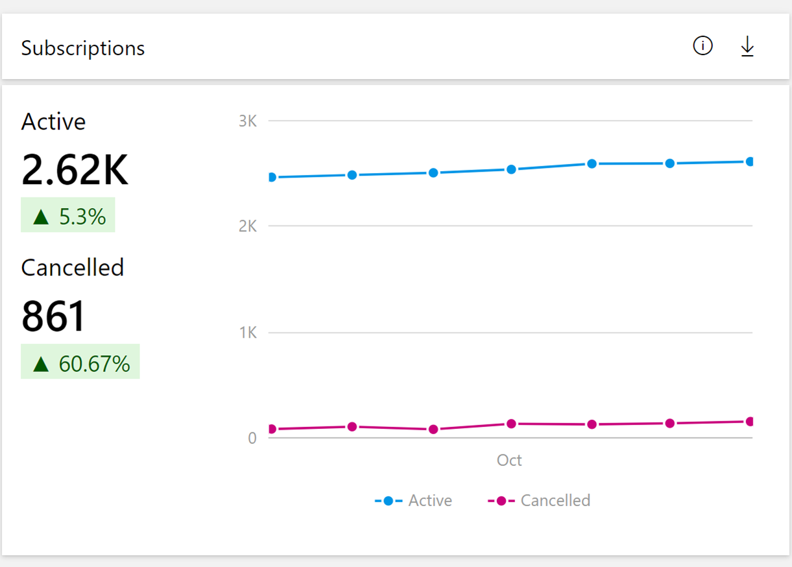
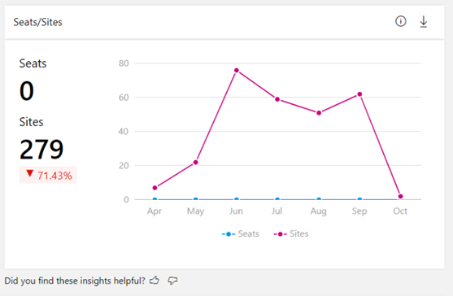

# Orders dashboard in commercial marketplace analytics

This article provides information on the Orders dashboard in Partner Center. This dashboard displays information about your orders, including growth trends, presented in a graphical and downloadable format.

To access the Orders dashboard in the Partner Center, under **Commercial Marketplace**, select **[Analyze](https://partner.microsoft.com/dashboard/commercial-marketplace/analytics/summary)** > **Orders**.

>[!NOTE]
> For detailed definitions of analytics terminology, see [Commercial marketplace analytics terminology and common questions](./partner-center-portal/faq-terminology.md).

## Orders dashboard

The Orders dashboard displays the current orders for all your software as a service (SaaS) offers. You can view graphical representations of the following items:

- Orders trend
- Orders per seat and site trend
- Orders by offers and SKUs
- Orders by geography
- Detailed orders table
- Orders page filters

> [!NOTE]
> The maximum latency between customer acquisition and reporting in Partner Center is 48 hours.

## Elements of the Orders dashboard

TThe following sections describe how to use the Orders dashboard and how to read the data.

### Month range

You can find a month range selection at the top-right corner of each page. Customize the output of the **Orders** page graphs by selecting a month range based on the past 6 or 12 months, or by selecting a custom month range with a maximum duration of 12 months. The default month range (computation period) is six months.

:::image type="content" source="./media/orders-dashboard/month-filters.png" alt-text="Illustrates the month filters on the Orders dashboard.":::

> [!NOTE]
> All metrics in the visualization widgets and export reports honor the computation period selected by the user.

### Orders trend

In this section, you will find the **Orders** chart that shows the trend of your active and cancelled orders for the selected computation period. Metrics and growth trends are represented by a line chart and will display the value for each month by hovering over the line on the chart. The percentage value below the Orders metrics in the widget represents the amount of growth or decline during the selected computation period.

There are two Orders counters: _Active_ and _Cancelled_.

- **Active** equals the number of orders that are currently in use by customers during the selected date range.
- **Canceled** equals the number of orders that were previously purchased and then canceled during the selected date range.

### Orders by per seat and site trend

The **Orders by per seat and site-based** line chart represents the metric and trend of per-site SaaS and per-seat SaaS orders purchased by customers (this chart includes canceled orders).

SaaS offers can use one of two pricing models with each plan: either flat rate (site-based) or per user (seat-based).

- **Flat rate**: Enable access to your offer with a single monthly or annual flat rate price. This is sometimes referred to as site-based pricing.
- **Per user**: Enable access to your offer with a price based on the number of users who can access the offer or occupy seats. With this usage-based model, you can set the minimum and maximum number of users supported by the plan. You can create multiple plans to configure different price points based on the number of users. These fields are optional. If left unselected, the number of users will be interpreted as not having a limit (min of 1 and max of as many as your service can support). These fields can be edited as part of an update to your plan.
- **Metered Billing**: On top of Flat Rate pricing. With this pricing model, you can optionally define metered plans that use the marketplace metering service API to charge customers for usage that isn't covered by the flat rate.

For more details on seat, site and metered based billing, see [How to plan a SaaS offer for the commercial marketplace](plan-saas-offer.md).

### Orders by offers and SKUs

The Orders by Offers and SKU chart shows the measures and trends of all Offers:

- The top offers are displayed in the graph and the rest of the offers are grouped as **Rest All**.
- You can select specific offers in the legend to display only that offer and the associated SKUs in the graph.
- Hovering over a slice in the graph displays the number of orders and percentage of that offer compared to your total number of orders across all offers.
- The **orders by offers trend** displays month-by-month growth trends. The month column represents the number of orders by offer name. The line chart displays the growth percentage trend plotted on a z-axis.

:::image type="content" source="./media/orders-dashboard/orders-by-offers.png" alt-text="Illustrates the Orders by Offers chart on the Orders dashboard.":::

You can select any offer and a maximum of three SKUs of that offer to view the month-over-month trend for the offer, SKUs, and seats.

### Orders by geography

For the selected computation period, the heatmap displays the total number of orders, and the growth percentage of newly added orders against a geography.  The light to dark color on the map represents the low to high value of the customer count. Select a record in the table to zoom in on a specific country or region.

Note the following:

- You can move the map to view the exact location.
- You can zoom into a specific location.
- The heatmap has a supplementary grid to view the details of customer count, order count, and normalized usage hours for the specific location.
- You can search and select a country/region in the grid to zoom to the location in the map. Revert to the original view by selecting the **Home** button in the map.

### Orders details table

The Order details table displays a numbered list of the 1,000 top orders sorted by date of acquisition.

- Each column in the grid is sortable.
- The data can be extracted to a .CSV or .TSV file if the count of the records is less than 1,000.
- If records number over 1,000, exported data will be asynchronously placed in a downloads page for the next 30 days.
- Apply filters to the **Order details** table to display only the data you're interested in. Filter by Country/Region, Azure license type, commercial marketplace license type, Offer type, Order status, Free trails, commercial marketplace subscription ID, Customer ID, and Company name.
- Because SaaS offers purchased through Azure Marketplace or Microsoft AppSource, do not require an Azure subscription, the Marketplace Subscription ID will appear in the form 00000000-0000-0000-0000-000000000000 in the **Detailed orders data** section.
- When an order is purchased by a protected customer, information in **Orders Detailed Data** is masked (************).

***Table 1: Dictionary of data terms***

| Column name | Attribute name | Definition |
| ------------ | ------------- | ------------- |
| Marketplace Subscription Id | Marketplace Subscription ID | The unique identifier associated with the Azure subscription the customer used to purchase your commercial marketplace offer. ID was formerly the Azure Subscription GUID. |
| MonthStartDate | Month Start Date | Month Start Date represents month of Purchase. |
| Offer Type | Offer Type | The type of commercial marketplace offering. |
| Azure License Type | Azure License Type | The type of licensing agreement used by customers to purchase Azure. Also known as Channel. The possible values are:<ul><li>Cloud Solution Provider</li><li>Enterprise</li><li>Enterprise through Reseller</li><li>Pay as You Go</li></ul> |
| Marketplace License Type | Marketplace License Type | The billing method of the commercial marketplace offer. The different values are:<ul><li>Billed Through Azure</li><li>Bring Your Own License</li><li>Free</li><li>Microsoft as Reseller</li></ul> |
| SKU | SKU | The plan associated with the offer |
| Customer Country | Customer Country/Region | The country/region name provided by the customer. Country/region could be different than the country/region in a customer's Azure subscription. |
| Is Preview SKU | Is Preview SKU | The value will let you know if you have tagged the SKU as "preview". Value will be "Yes" if the SKU has been tagged accordingly, and only Azure subscriptions authorized by you can deploy and use this image. Value will be "No" if the SKU has not been identified as "preview". |
| Order Id | Order ID | The unique identifier of the customer order for your commercial marketplace service. Virtual Machine usage-based offers are not associated with an order. |
| Order Quantity | Order Quantity | Number of assets associated with the order ID for active orders |
| Cloud Instance Name | Cloud Instance Name | The Microsoft Cloud in which a VM deployment occurred. |
| Is New Customer | Is New Customer | The value identifies whether a new customer acquired one or more of your offers for the first time. Value will be "Yes" if within the same calendar month for "Date Acquired". Value will be "No" if the customer has purchased any of your offers prior to the calendar month reported. |
| Order Status | Order Status | The status of a commercial marketplace order at the time the data was last refreshed. |
| Order Cancel Date | Order Cancel Date | The date the commercial marketplace order was canceled. |
| Customer Company Name | Customer Company Name | The company name provided by the customer. Name could be different than the city in a customer's Azure subscription. |
| Order Purchase Date | Order Purchase Date | The date the commercial marketplace order was created. |
| Offer Name | Offer Name | The name of the commercial marketplace offering. |
| Trial End Date | Trial End Date | The date the trial period for this order will end or has ended. |
| Customer Id | Customer ID | The unique identifier assigned to a customer. A customer may have zero or more Azure Marketplace subscriptions. |
| Billing Account Id | Billing Account ID | The identifier of the account on which billing is generated. Map **Billing Account ID** to **customerID** to connect your Payout Transaction Report with the Customer, Order, and Usage Reports. |
| AssetCount | Asset Count | The number of assets associated with the order ID. |
||||

### Orders page filters

The **Orders** page filters are applied at the Orders page level. You can select one or multiple filters to render the chart for the criteria you choose to view and the data you want to see in 'Detailed orders data' grid / export. Filters are applied on the data extracted for the month range that you have selected on the top-right corner of the orders page.

> [!TIP]
> You can use the download icon in the upper-right corner of any widget to download the data. You can provide feedback on each of the widgets by clicking on the “thumbs up” or “thumbs down” icon.

## Next steps

- For an overview of analytics reports available in the commercial marketplace, see [Access analytic reports for the commercial marketplace in Partner Center](./partner-center-portal/analytics.md).
- For graphs, trends, and values of aggregate data that summarize marketplace activity for your offer, see [Summary dashboard in commercial marketplace analytics](./summary-dashboard.md).
- For information about your orders in a graphical and downloadable format, see [Orders Dashboard in commercial marketplace analytics](orders-dashboard.md).
- For Virtual Machine (VM) offers usage and metered billing metrics, see [Usage dashboard in commercial marketplace analytics](./usage-dashboard.md).
- For a list of your download requests over the last 30 days, see [Downloads dashboard in commercial marketplace analytics](./partner-center-portal/downloads-dashboard.md).
- To see a consolidated view of customer feedback for offers on Azure Marketplace and AppSource, see [Ratings & Reviews analytics dashboard in Partner Center](./partner-center-portal/ratings-reviews.md).
- For frequently asked questions about commercial marketplace analytics and for a comprehensive dictionary of data terms, see [Commercial marketplace analytics terminology and common questions](./partner-center-portal/faq-terminology.md).
