# Analytics for the Commercial Marketplace in Partner Center

Learn how to access analytic reports in Microsoft Partner Center to monitor sales, evaluate performance, and optimize your offers in the marketplace. As a partner, you can monitor your offer listings using the data visualization and insight graphs supported by Partner Center and find ways to maximize your sales. The improved analytics tools enable you to act on performance results and maintain better relationships with your customers and resellers. 

To access the Partner Center analytics tools, open the **[Analyze](https://partner.microsoft.com/dashboard/commercial-marketplace/analytics/summary)** dashboard under Commercial Marketplace.

|**Dashboard**|**Displayed content**|
|:---|:---|
|[Summary](#summary-dashboard)|Graphs, trends, and values of aggregate data that summarize marketplace activity for your offers|
|[Orders](#orders-dashboard)|Information about your orders in a graphical and downloadable format|
|[Customers](#customer-dashboard)|Information about your customers, including growth trends, presented in a  graphical and downloadable format|
|[Downloads](#downloads-dashboard)|A list of your download requests over the last 30 days|

## Summary dashboard

The **Summary** dashboard presents an overview based on each offer type. **Insights** show critical information at a glance and provide a broad view of the sales activity of your offers. You can visualize these reports using the **Summary** dashboard:

- [Total orders](#totals)
- [Total customers](#totals)
- [Geographic location of your customers](#customers-by-geography)
- [Trends emerging based on your customer and order information](#growth-trend-chart)
- [Customer leaderboard with highest orders](#customer-leaderboard)
- [Number of orders organized by offer name](#offers-by-orders)

### Date range

You can find a date range selection at the top-right corner of each page. The output of the **Summary** page graphs can be customized by selecting a date range based on the past 3, 6, or 12 months, or by selecting a custom date range with a maximum duration of 12 months. The default date range is six months.

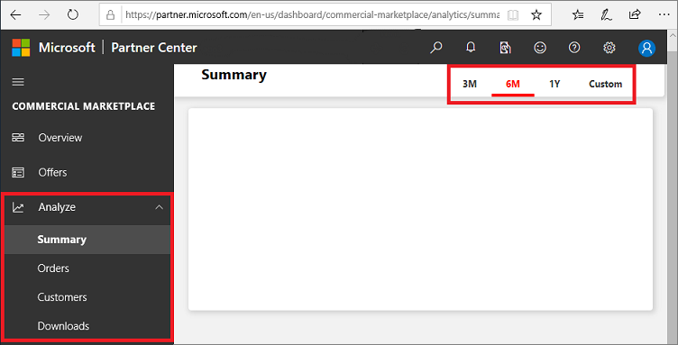

### Totals

The **Totals** section displays a count of all orders created, or customers acquired, during the selected date range. 

- The percentage value next to **Total Orders** and **Total Customers** represents the amount of growth compared to the previous month. 
- A green triangle pointing upward indicates a positive growth trend. A red triangle pointing downward indicates a negative growth trend relative to the previous month. 
- Order and Customer growth trends are represented by bar graphs and will display the value for each month by hovering over the columns of the chart.

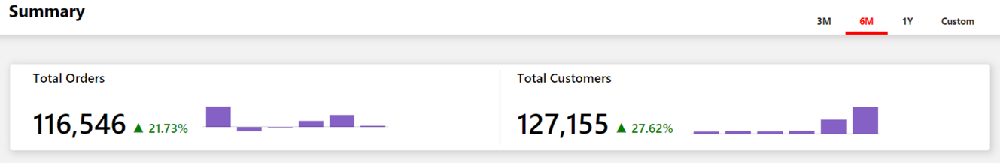

### Customers by geography

The **Customers by geography** heatmap displays a customer count on a world map. 

- You can move the map to view the exact location. 
- You can zoom into a specific location. 
- The heatmap has a supplementary grid to view the details of customer count (or [order count](#orders-by-geography)) in the specific location. 
- You can search and select a country in the grid to zoom to the location in the map. Revert to the original view by pressing the **Home** button in the map.
- A **new** customer has purchased one of your offers for the first time during the month within the selected date range.

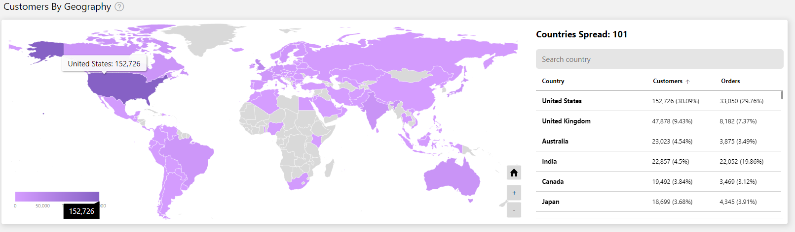

### Growth trend chart

You can view trends based on the growth of your **Orders created** or **Customers acquired**, displayed month by month according to the selected date range. You can further analyze these trends by selecting links below the chart, which navigate to the respective **Order** or **Customer** pages.

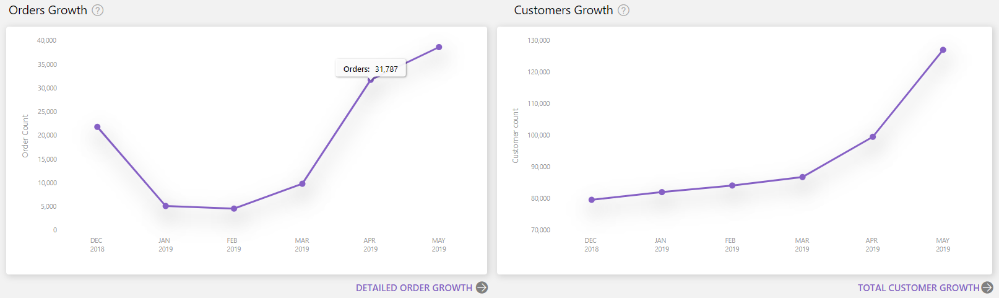

### Customer leaderboard

The top 50 customers with the highest number of orders are displayed on a *leader board*, sorted by highest order count and order percentage. 

- Select a customer to view their profile details, orders organized by offer, or orders organized by Azure license type and pricing channel. 
- The **Offers by orders** donut chart presents the top four offers (by order count) and the remaining offers grouped in as ‘Rest All’.

> [!NOTE]
> Customer personal information will be presented only if the customer has provided consent. You can view this information if you have logged in with an **Owner** role permissions-level. Users with the **Contributor** role will not be able to view this information. [Learn more about user roles and permissions](./manage-account.md#define-user-roles-and-permissions).

### Offers by orders

The **Offers by orders** chart organizes your active orders according to the Offer name. 

- You can drag over slices from the left donut chart to the right donut chart in order to display more details for the offer that you have dragged. These two charts enable you to compare a specific offer with the performance of all of your other offers ('Rest All'). 

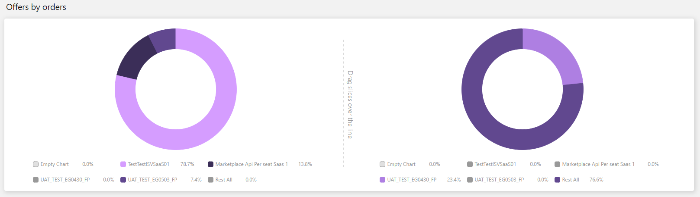

## Orders dashboard

The **Orders** dashboard of the **Analyze** menu displays the current orders for all of your SaaS offers. You can view graphical representations of:

- [Order Totals](#order-totals)
- [Orders by geography](#orders-by-geography)
- [Trends for active and canceled orders](#trends-for-active-and-canceled-orders)
- [Orders organized by marketplace license type](#orders-by-marketplace-license-type)
- [Orders organized by new and existing customers](#orders-by-customer-type)
- [Order details table](#order-details-table)

> [!NOTE]
> There are differences between how analytics reports display in the Cloud Partner Portal (CPP) and the new Commercial Marketplace program in Partner Center. One specific way is that the **Seller Insights** in CPP has a **Orders & Usage** tab, which displays data for usage-based offers and non-usage-based offers. In Partner Center, the **Orders** page has a separate tab for SaaS Offers.

### Order totals

The **Order totals** section displays a count of all orders created, including both **Active** and **canceled** orders, during the selected [date range](#date-range). 

- The percentage value next to **Total Orders** represents the amount of growth compared to the previous month. 
- A green triangle pointing upward indicates a positive growth trend. A red triangle pointing downward indicates a negative growth trend relative to the previous month. 
- Growth trends are represented by bar graphs and will display the value for each month by hovering over the columns of the chart.

### Orders by geography

The **Orders by geography** heatmap displays a count of your orders on a world map and functions the same as the **[Customers by geography heatmap](#customers-by-geography)**.

### Trends for active and canceled orders

The **Active orders by offers** donut graph organizes all of your active orders according to their offer names.

- The top 4 offers are displayed in the graph and the rest of the offers are grouped as ‘Rest All’.
- You can select specific offers in the legend to display only those offers in the graph. 
- Hovering over a slice in the graph will display the number of orders and percentage of that offer compared to your total number of orders across all offers.
- **Orders by offers trend** displays month-by-month growth trends. The month column represents the number of orders by offer name. The line chart displays the growth percentage trend plotted on a z-axis.
- You can use the slider on the top of the chart to scroll right and left along the x-axis and focus on specific data points.
- You can display the trend chart by selecting a specific item on the legend.
- You can also choose to display trends and data for **canceled orders**. The graph will function in the same way as active orders.

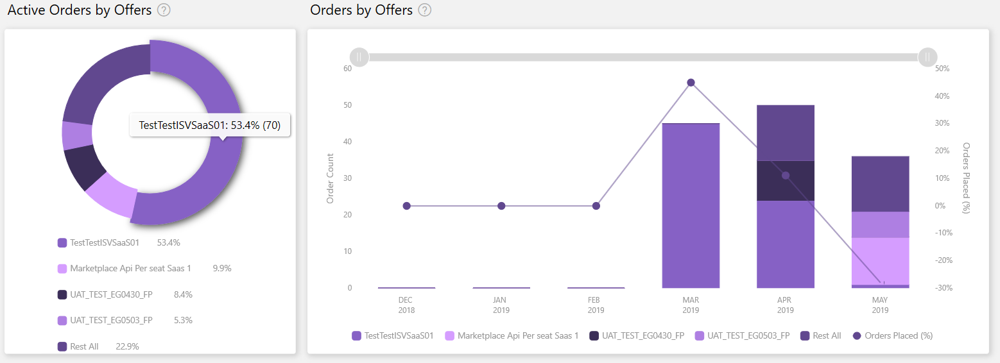

### Orders by marketplace license type
<!-- Section needs review and clarification!  -->
The **Orders by marketplace license type** chart displays a month-by-month order count based on the license type and billing method of the marketplace offer. License types include:

- **Billed through Azure**: Microsoft bills customers on your behalf when you choose to [sell your offer through Microsoft](./create-new-saas-offer.md#sell-through-microsoft) with this license type. Payment types include pay-as-you-go via credit card or Enterprise invoicing.
- **Bring your own license**: Microsoft does not bill customers for their usage of this type of marketplace offer. Listed as **[Get it now (Free)](./create-new-saas-offer.md#get-it-now-free)** in the marketplace.
- **Free**: Microsoft does not bill customers for their usage of this type of marketplace offer. Listed as **[Free trial](./create-new-saas-offer.md##free-trial-listing)** in the marketplace.
- **Microsoft as reseller**: Represents offers sold by Microsoft resellers as a part of the **[Cloud Solution Provider (CSP) program](./create-new-saas-offer.md#csp-program-opt-in)**.

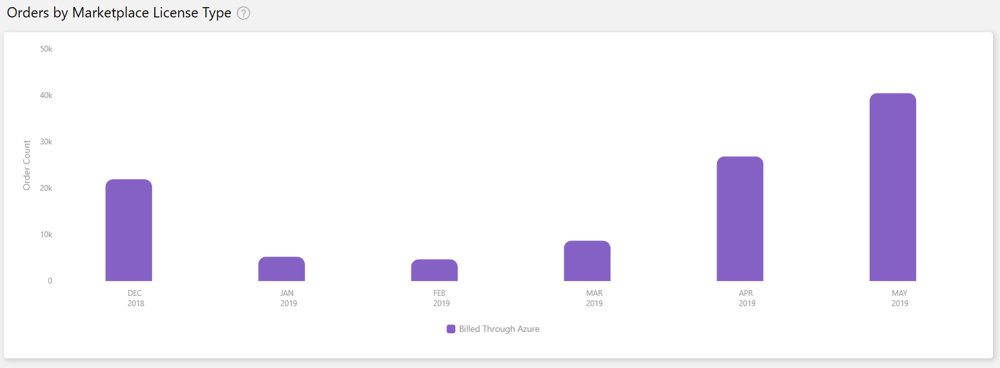

### Orders by customer type

The **Orders by customer type** bar chart displays the number of orders divided between **New Customers** and **Existing Customers**. 

- A **New customer** has acquired one or more of your offers for the first time within the same calendar month (y-axis). An **Existing customer** has previously acquired an offer from you prior to the calendar month reported (on the y-axis). 
- An additional pie chart represents all orders created by the new or existing customer for the date range selected.
- In both charts, you can choose to view only new or only existing customers by selecting the respective legend.

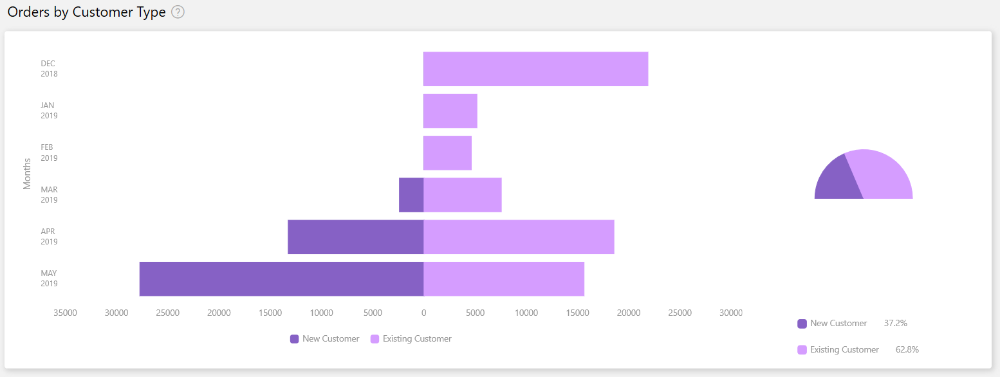

### Order details table

The **Order details table** displays a numbered list of the 1000 top orders sorted by date of acquisition.

- Each column in the grid is sortable.
- The data can be extracted to a TSV file if the count of the records is less than 1000.
- If records number over 1000, exported data will be asynchronously placed in a downloads page for the next 30 days.
- Filters can be applied to the **Order details table** to display only the data that you are interested in. Data can be filtered by Country, Azure license type, Marketplace license type, Offer type, Order status, Free trails, Marketplace subscription ID, Customer ID, and Company name.

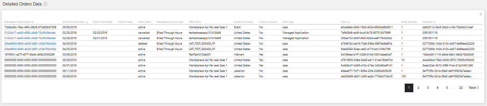

## Customer dashboard

The **Customer** dashboard of the **Analyze** menu displays data for customers who have acquired your offers. You can view graphical representations of:

- [Customer totals](#customer-totals)
- [Customers by geography](#customers-by-geography)
- [Customer trends](#customer-trends)
- [Customers by orders](#customers-by-orders)
- [Customer details table](#customer-details-table)

### Customer totals

The **Customer totals** section displays a count of all customers, including new, existing, and churned, during the selected [date range](#date-range).

- Customers percentage of growth compared to the previous month is indicated by the number and upward indicator in green or downward indicator in red.
- Growth trends are represented by bar graphs and will display the value for each month by hovering over the columns of the chart.

#### Customer types

There are three customer types: new, existing, and churned. 

- A new customer has acquired one or more of your offers for the first time within the selected month.
- An existing customer has acquired one or more of your offers prior to the month selected.
- A churned customer has canceled all offers previously purchased.

### Customer trends

The **Customer trends** chart displays a count of all customers, including new, existing, and churned, with a month-by-month growth trend.

- The line chart represents the overall customer growth percentages. 
- The month column represents the count of customers stacked by new, existing, and churned customers.
- The churned customer count is displayed on the negative direction of Y Axis.
- You can select specific legend items to displayed more detailed views. For example, select new customers from the legend to only display new customers.
- You can use the slider on the top of the chart to scroll right and left on the x-axis and focus on specific data points to view in more detail.
- Hovering over a column of the chart will display details for only that month.

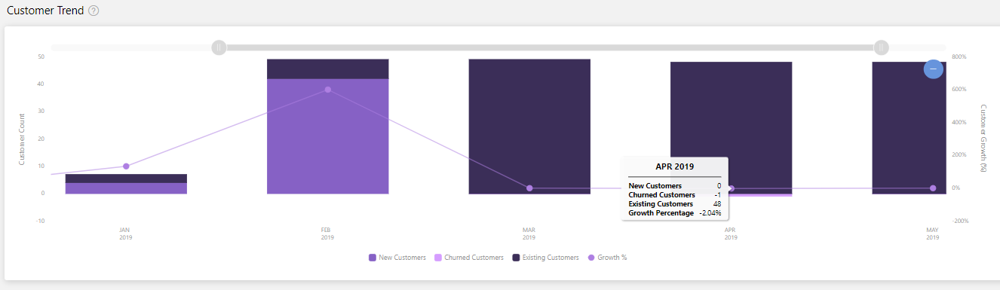

### Customers by orders

The **Customers by orders** chart displays the **Top Customer Percentile** along the x-axis, as determined by their number of orders. The y-axis displays the customer's order count. The z-axis (line graph) displays the cumulative percentage of the total number of orders. You can display details by hovering over points along the line chart.

As an example, you can learn from this customer order data that the top 30% of your customers are contributing to 83% of the orders, equal to 2,130 orders.

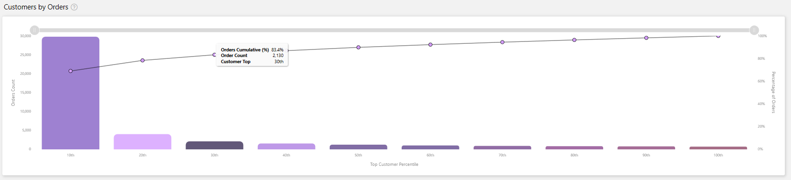

### Customer details table

The **Customer details table** displays a numbered list of the top 1000 customers sorted by the date they first acquired one of your offers.

- Customer personal information will only be available if the customer has provided consent. You can only view this information if you have logged in with an **Owner** role level of permissions. [Learn more about user roles and permissions](./manage-account.md#define-user-roles-and-permissions).
- Each column in the grid is sortable.
- The data can be extracted to a TSV file if the count of the records is less than 1000.
- If records number over 1000, exported data will be asynchronously placed in a downloads page for the next 30 days.
- Filters can be applied to the table to display only the data that you are interested in. Data can be filtered by Company name, Customer ID, Marketplace Subscription ID, Azure License Type, Date Acquired, Date Lost, Customer Email, Customer Country/State/City/Zip, Customer Language, etc.

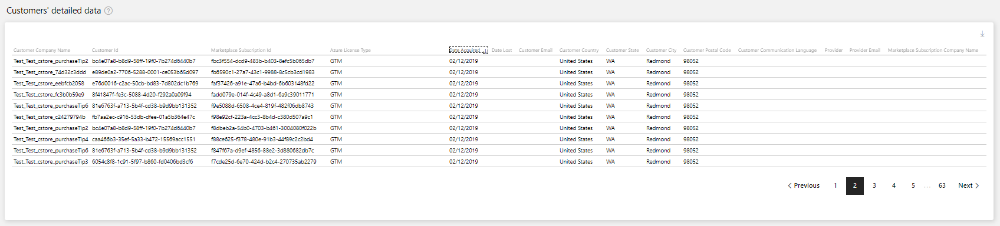

## Downloads dashboard

The **Downloads** dashboard of the **Analyze** menu displays requests for any downloads that contain over 1000 rows of customer or order data.

You will receive a pop-up notification and email containing a link to the **Downloads** dashboard whenever you request a download with over 1000 rows of data. These data downloads will be available for a 30-day period and then removed.

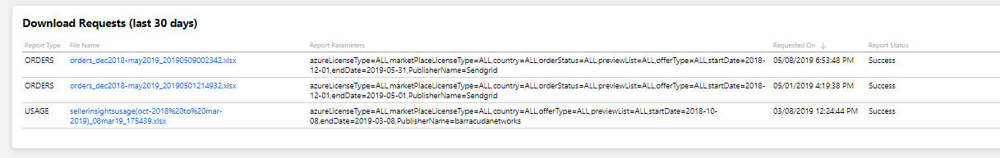

### Dictionary of data terms

| Attribute Name | Reports | Definition|
|---|---|---|
| Azure License Type | Customer, Order | The type of licensing agreement used by customers to purchase Azure. Also known as Channel |
| Azure License Type: Cloud Solution Provider | Customer, Order | The end customer procures Azure and your Marketplace offer through their Cloud Solution Provider, who acts as your reseller.|
| Azure License Type: Enterprise | Customer, Order | The end customer procures Azure and your Marketplace offer through an Enterprise Agreement, signed directly with Microsoft.|
| Azure License Type: Enterprise through Reseller  | Customer, Order | The end customer procures Azure and your Marketplace offer through a reseller who facilitates their Enterprise Agreement with Microsoft.|  |
| Azure License Type: Pay as You Go| Customer, Order | The end customer procures Azure and your Marketplace offer through a “Pay as You Go” agreement, signed directly with Microsoft.||
| Cloud Instance Name| Order| The Microsoft Cloud in which a VM deployment occurred.||
| Cloud Instance Name: Azure Global| Order| The public global Microsoft cloud.|| |
| Cloud Instance Name: Azure Government | Order| Government-specific Microsoft clouds for one of the following governments: China, Germany, or The United States of America.| |
| Customer City| Customer| The city name provided by the customer. City could be different than the city in a customer’s Azure Subscription.||
| Customer Communication Language  | Customer| The language preferred by the customer for communication.||
| Customer Company Name | Customer, Order | The company name provided by the customer. Name could be different than the city in a customer’s Azure Subscription.|  |
| Customer Country | Customer, Order | The country name provided by the customer. Country could be different than the country in a customer’s Azure Subscription.|  |
| Customer Email| Customer| The e-mail address provided by the end customer. Email could be different than the e-mail address in a customer’s Azure Subscription.||
| Customer First Name| Customer| The name provided by the customer. Name could be different than the name provided in a customer’s Azure Subscription.| |
| Customer ID | Customer, Order | The unique identifier assigned to a customer. A customer may have zero or more Azure Marketplace Subscriptions.|  |
| Customer Postal Code  | Customer| The postal code provided by the customer. Code could be different than the postal code provided in a customer’s Azure Subscription.| |
| Customer State| Customer| The state (address) provided by the customer. State could be different than the last name provided in a customer’s Azure Subscription.| |
| Date Acquired| Customer| The first date the customer purchased any offer published by you.| |
| Date Lost| Customer| The last date the customer canceled the last of all offers previously purchased.||
| Is New Customer  | Order| The value will identify a new customer acquiring one or more of your offers for the first time (or not). Value will be “Yes” if within the same calendar month for “Date Acquired”. Value will be “No” if the customer has purchased any of your offers prior to the calendar month reported. |
| Is Preview SKU| Order| The value will let you know if you have tagged the SKU as "preview". Value will be “Yes” if the SKU has been tagged accordingly, and only Azure subscriptions authorized by you can deploy and use this image. Value will be “No” if the SKU has not been identified as “preview”.  |
| Is Promotional Contact Opt In| Customer| The value will let you know if the customer proactively opted in for promotional contact from publishers. At this time, we are not presenting the option to customers, so we have indicated "No" across the board. Once this feature is deployed, we will start updating accordingly.|
| Marketplace License Type| Order| The billing method of the Marketplace offer.||
| Marketplace License Type: Billed Through Azure| Order| Microsoft is your agent for this Marketplace offer and bills customers on your behalf. (Either PAYG Credit Card or Enterprise Invoice)||
| Marketplace License Type: Bring Your Own License | Order| The VM requires a license key provided by the customer to deploy. Microsoft does not bill customers for listing their offers in this way through the marketplace.||
| Marketplace License Type: Free| Order| The offer is configured to be free to all users. Microsoft does not bill customers for their usage of this offer.||
| Marketplace License Type: Microsoft as Reseller  | Order| Microsoft is your reseller for this Marketplace offer.|  |
| Marketplace Subscription ID | Customer, Order | The unique identifier associated with the Azure Subscription the customer used to purchase your Marketplace offer. ID was formerly the Azure Subscription GUID.||
| Offer Name  | Order| The name of the Marketplace offering.|| |
| Offer Type  | Order| The type of Microsoft Marketplace offering.|||
| Offer Type: Managed Application  | Order, | Use the Azure app: managed app offer type when the following conditions are required: You deploy either a subscription-based solution for your customer using either a VM or an entire IaaS-based solution. You or your customer require that the solution be managed by a partner. |
| Offer Type: Azure Application| Order, | Use the Azure Application solution template offer type when your solution requires additional deployment and configuration automation beyond a simple VM.||
| Offer Type: Consulting Service| Order| Consulting Services in Azure Marketplace help to connect customers with services to support and extend their use of Azure.| |
| Offer Type: Container | Order| Use the Container offer type when your solution is a Docker container image provisioned as a Kubernetes-based Azure container service.||
| Offer Type: Dynamics 365 Business Central| Order| Use this offer type when your solution is integrated with Dynamics 365 for Finance and Operations| |
| Offer Type: Dynamics 365 for Customer Engagement | Order| Use this offer type when your solution is integrated with Dynamics 365 for Customer Engagement.||
| Offer Type: IoT Edge Module | Order| Azure IoT Edge modules are the smallest computation units managed by IoT Edge and can contain Microsoft services (such as Azure Stream Analytics), 3rd-party services, or your own solution-specific code. |
| Offer Type: Power BI Application | Order| Use the Power BI Application offer type when you deploy an application integrated with Power BI.|  |
| Offer Type: SaaS Application| Order| Use the SaaS app offer type to enable your customer to buy your SaaS-based, technical solution as a subscription.||
| Offer Type: Virtual Machine | Order| Use the virtual machine offer type when you deploy a virtual appliance to the subscription associated with your customer.||
| Offer Type: Visual Studio Marketplace Extension  | Order| Offer type previously available to Azure DevOps extension developers. Going forward Azure DevOps extension developers can sell their extension directly to customers. Extension offers can be configured as paid or including a trial. |
| Order Cancel Date| Order| The date the Marketplace order was canceled.||
| Order ID| Order| The unique identifier of the customer order for your Marketplace service. Virtual Machine usage-based offers are not associated with an order.| |
| Order Purchase Date| Order| The date the Marketplace Order was created.|||
| Order Status| Order| The status of a Marketplace order at the time the data was last refreshed.|     |
| Order Status: Active  | Order| The customer has purchased an order and has not canceled their order.|         |
| Order Status: canceled | Order| The customer previously purchased an order and subsequently canceled their order.||
| Provider Email| Customer| The email address of the provider involved in the relationship between Microsoft and the end customer. If the customer is an Enterprise through Reseller, this will be the reseller. If a Cloud Solution Provider (CSP) is involved, this will be the CSP.|
| Provider Name| Customer| The name of the provider involved in the relationship between Microsoft and end customer. If the customer is an Enterprise through Reseller, this will be the reseller. If a Cloud Solution Provider (CSP) is involved, this will be the CSP.|
| SKU| Order| SKU name as defined during publishing. An offer may have many SKUs, but a SKU can only be associated with a single offer.||
| Trial End Date| Order| The date the trial period for this order will end or has ended.||