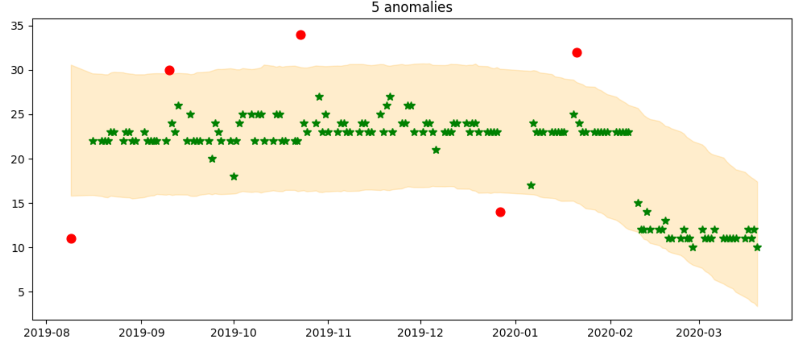
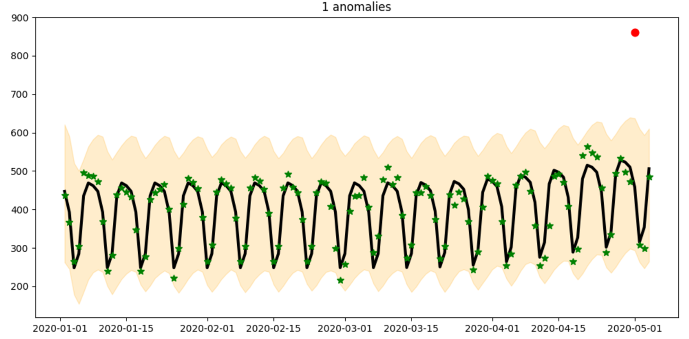

# Anomaly detection service for metered billing

The [Marketplace metering service](https://docs.microsoft.com/azure/marketplace/partner-center-portal/marketplace-metering-service-apis-faq) lets you create offers in the commercial marketplace program that are charged according to non-standard units. With metered billing, you send usage events for your customer’s usage to Microsoft and we prepare the billing based on that usage.

Incorrect usage data could come from a variety of causes, such as bugs, misconfigurations in your consumption tracking, or fraud. Incorrect usage data would result in incorrect customer charges and billing disputes.

To mitigate the risk, our anomaly detection service applies machine learning algorithms to determine normal metered billing behavior, analyze the metered billing usage, and discover anomalies with minimal user intervention.

You are notified if there is anomaly detected in your metered billing usage. This gives you an opportunity to investigate and notify us if an anomaly is confirmed to be a real issue, at which point actions can be taken to address the customer billing issue proactively.

In addition to sudden spikes, dips, and trend changes of metered billing usage, our model also accounts for seasonal effects. Because metered billing is communicated via overage data, our model is also able to gracefully handle long periods of missing data.

Following are examples of anomaly detection results. The expected range shows as a yellow band. Acceptable metered billing usage shows as green stars in the band. Billing usage outside the band displays as a red dot.  

Anomalies detected outside a predictable trend:

Anomalies detected outside a recurring cyclic trend:

Anomalies detected in an upward trend:

## How anomaly detection service works

Anomaly detection is enabled automatically for all metered billing usage. When you submit the usage events to Microsoft, anomaly detection service creates a model of expected values based on past usage data. This model runs weekly.

Anomaly detection functions on a per-meter and per-customer level. This means each meter with each customer will have a model trained based on this customer’s past usage pattern of this meter.

The model works by generating retrospective confidence intervals. The time series forecast is a generalized additive model consisting of a trend prediction part and a seasonality part. Because the model is formulated as a regression task, it can gracefully handle long periods of missing data. If an observation falls outside of the predicted confidence intervals, it means that observation cannot be explained based on historical patterns of the metered billing and therefore may be an anomaly.

## Anomaly detection notification

We email anomaly detection notices on a weekly basis. It includes all the anomalies detected that week for all meters and customers. This email is sent to the **Engineering** and **Support** contacts provided when you created the offer.

You are expected to investigate if detected anomalies are real issues and if so, contact Microsoft to report the incorrect usage (see the support section below).

If you confirm that detected anomalies are normal usage, no further action is needed from you. However, if an anomaly represents potentially high financial risk, we may contact you to confirm the usage.  

## When and how to get support

If you sent the incorrect usage to Microsoft and this did or will result in undercharge of the customer, Microsoft will not initiate a bill to the customer for under-reported usage or pay you for that usage. You will have to bear the loss of revenue due to under-reporting.

If one of the following cases applies, you can open a support ticket to request refund or billing adjustment for your customers:

- You confirmed that one of the anomalies we found is a real issue and the incorrect usage would result in **overcharge** of the customer.
- You discover that you sent incorrect usage to us and the incorrect usage would result in **overcharge** of the customer.
- You would like to request a refund for the charge of your customer’s metered billing usage.

To submit a ticket:

1. Go to the support page. In the **Tell us about your issue box**, enter “wrong usage”.
2. In support topics, in the drop-down of search results, select one of the following:
    - **Commercial Marketplace** > **Metered Billing** > **Wrong usage sent for Azure Applications offer**, or
    - **Commercial Marketplace** > **Metered Billing** > **Wrong usage sent for SaaS offer**
3. Under **Next step**, select the **Review solutions** button to be directed to sign in to Partner Center to submit a support ticket.

For more publisher support options, see [Support for the commercial marketplace program in Partner Center](https://docs.microsoft.com/azure/marketplace/partner-center-portal/support).

## Next step

- Learn about the [Marketplace metering service API](https://docs.microsoft.com/azure/marketplace/partner-center-portal/marketplace-metering-service-apis).
