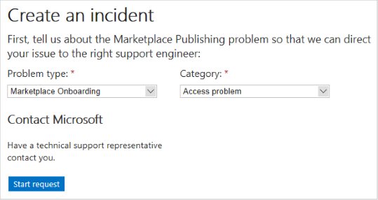

# Handling review feedback

This article explains how to access the Azure DevOps environment used by the Microsoft Azure Marketplace review team. If critical issues are found in your Azure application offer during the **Microsoft review** step, you can sign into this system to view detailed information about these issues (review feedback). After you fix all these issues, you must resubmit your offer to continue to publish it on the Azure Marketplace. The following diagram illustrates how this feedback process relates to the publishing process.

Typically, review issues are referenced as pull request (PR). Each PR is linked to an online [Azure DevOps](https://azure.microsoft.com/services/devops/) (previously named Visual Studio Team Services (VSTS)) item, which contains details about the issue. The following image displays an example of the Partner Center experience if issues are found during reviews. 

The PR that contains specific details about the submission will be mentioned in the “View Certification Report” link. For complex situations, the review and support teams may also email you.

## Azure DevOps access

All users with access to the “developer” role in Partner Center will have access to view the PR items referenced in review feedback.

<!---
To view the PR items referenced in review feedback, publishers must first be granted proper authorization. Otherwise, new publishers receive a 401 - Not Authorized response page when trying to view PRs. To request access to this Azure DevOps repository, perform the following steps:

1. Collect the following information:
    * Your publisher name and ID
    * Offer type (Azure app), offer name, and SKU ID
    * The pull request link, for example: `https://solutiontemplates.visualstudio.com/marketplacesolutions/_git/contoso/pullrequest/<number>`. This URL can be retrieved from the notification message or the address of the 401 response page.
    * The email address(es) of the individuals from your publishing organization that you want access granted to. This list should include the owner address(es) you provided when registering as a publisher on the Cloud Partner Portal (or Partner Center??).
1. Create a support incident. In the title bar of the Cloud Partner Portal (??), select the **Help** button, then choose **Support** from the menu. Your default web browser should launch and navigate to the Microsoft new support incident page. (You may have to sign in first.)
1. Specify the **Problem type** as **marketplace onboarding** and **Category** as **Access problem**, then select **Start request**.

    

1. In **Step 1 of 2** page, supply your contact information and select **Continue**.
1. In **Step 2 of 2** page, specify an incident title (for example Request Azure DevOps access) and supply the information you collected in the first step (above). Read and accept the agreement, then select **Submit**.

If the incident creation was successful, a confirmation page is displayed. Save the confirmation information on this page for your reference. The Microsoft Support Team should reply to your access request within a few business days. --->

## Reviewing the pull request

Use the following procedure to review issues documented in the pull request.

1. In the **Microsoft review** sections of Publishing steps form, click on a PR link to launch your browser and navigate to the **Overview** (home) page for this PR. The following image depicts an example of the critical issue home page for the Contoso sample app offer. This page contains useful summary information about the review issues found in the Azure app.

    
      *Click on the image to expand.*

1. (Optional) On the right side of the window, in the section **Policies**, click on the issue message (in this example: **Policy Validation failed**) to investigate the low-level details of the issue, including the associated log files. Errors are typically displayed at the bottom of the log files.
1. In the menu on the left-side of the home page, select **Files** to display the list files that comprise the technical assets for this offer. The Microsoft reviewers should have added comments describing the discovered critical issues. In the following example, two issues have been discovered.

    
      *Click on the image to expand.*

1. Click on each comment node in the left tree to navigate to the comment in context of the surrounding code. Fix your source code in your team's project to correct the issue described by the comment.

>[!Note]
>You cannot edit your offer's technical assets within the review team's Azure DevOps environment. For publishers, this is a read-only environment for the contained source code. However, you can leave replies to the comments for the benefit of the Microsoft review team.

   In the following example, the publisher has reviewed, corrected, and replied to the first issue.

   

## Next steps

After you correct the critical issues documented in the review PR(s), you must [republish your Azure app offer](./create-new-azure-apps-offer.md#publish).
