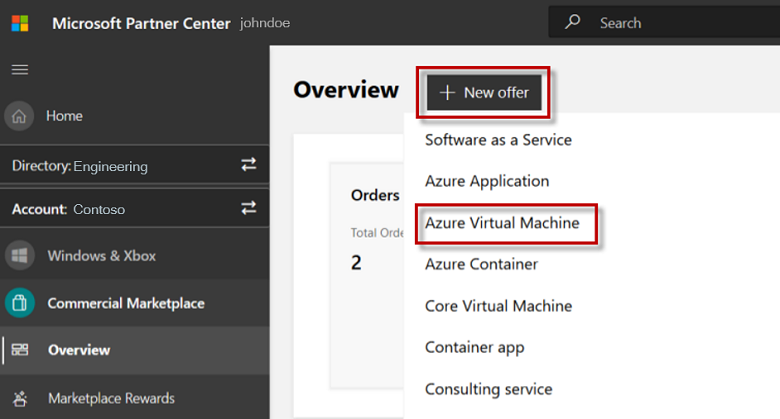
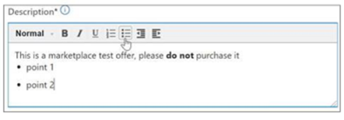
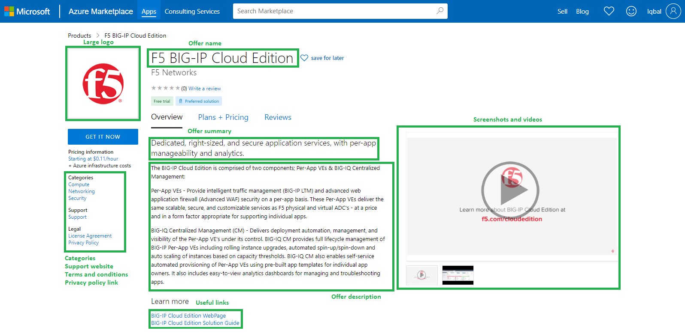
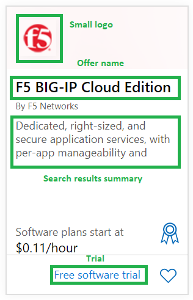
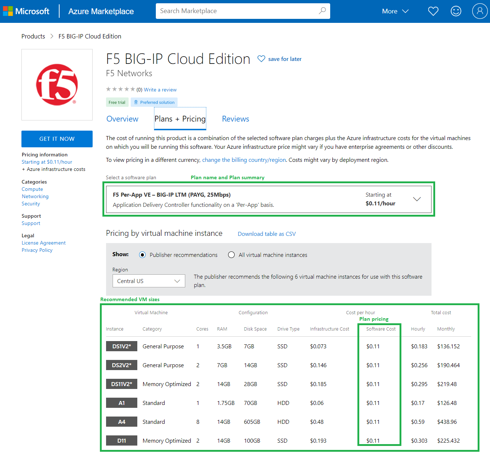
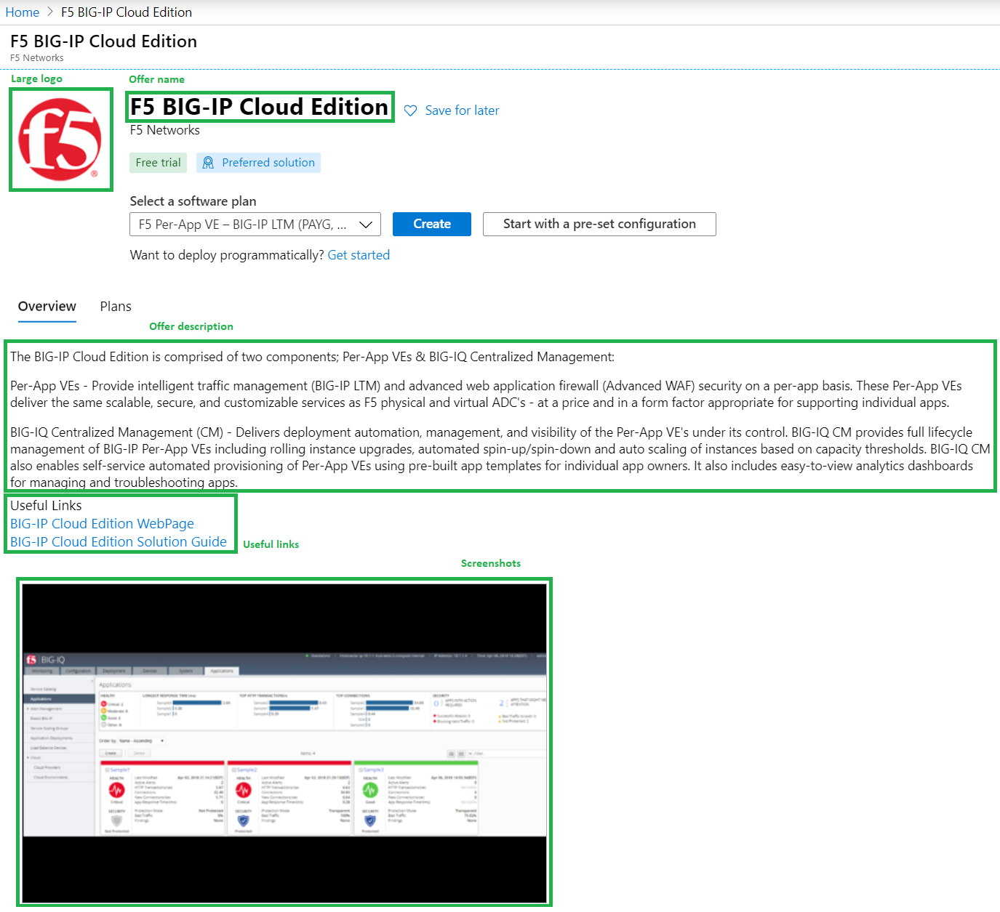
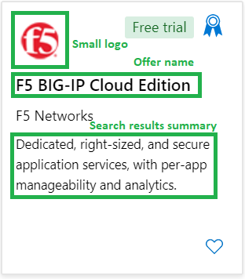
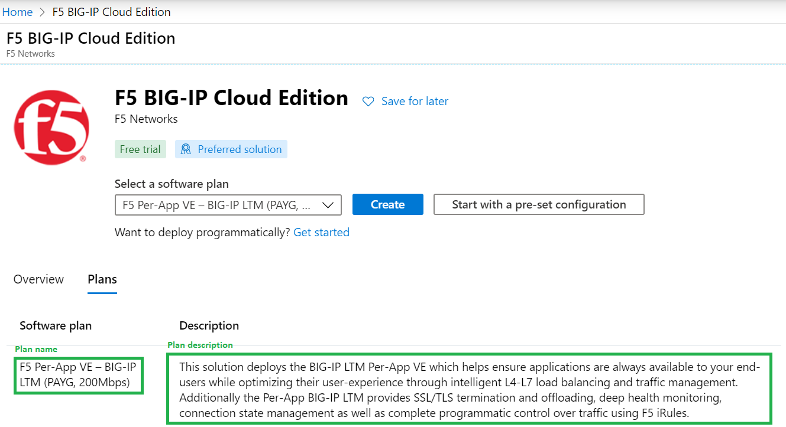

# Create an Azure virtual machine offer

> [!IMPORTANT]
> We're moving the management of your Azure VM offers from Cloud Partner Portal to Partner Center. Until your offers are migrated, please continue to follow the instructions in [Create Virtual Machine offer](https://docs.microsoft.com/azure/marketplace/cloud-partner-portal/virtual-machine/cpp-create-offer) in Cloud Partner Portal to manage your offers.

This article describes how to create and publish an Azure virtual machine offer to [Azure Marketplace](https://azuremarketplace.microsoft.com/). It addresses both Windows- and Linux-based virtual machines that contain an operating system, virtual hard disk (VHD), and up to 16 data disks.

## Introduction

### Publishing benefits

Publishing to Azure Marketplace has the following benefits:

- Promote your company using the Microsoft brand
- Reach over 100 million Office 365 and Dynamics 365 users and more than 200,000 organizations through Azure Marketplace
- Get high-quality leads from these marketplaces
- Get your services promoted by the Microsoft field and telesales teams

### Before you begin

If you haven't done so yet, review the [Virtual machine offer publishing guide](https://aka.ms/Virtualmachineofferpublishingguide) and this Azure virtual machine material:

- Quickstart guides
  - [Azure Quickstart templates](https://azure.microsoft.com/resources/templates/)
  - [GitHub Azure Quickstart templates](https://github.com/azure/azure-quickstart-templates)
- Tutorials
  - [Linux VMs](https://aka.ms/LinuxVMtutorial)
  - [Windows VMs](https://aka.ms/windowsvms)
- Samples
  - [Azure CLI Samples for Linux VMs](https://aka.ms/linuxclisamples)
  - [Azure PowerShell for Linux VMs](https://aka.ms/linuxpowershellsamples)
  - [Azure CLI Samples for Windows VMs](https://aka.ms/windowsclisamples)
  - [Azure PowerShell for Windows VMs](https://aka.ms/windowspowershellvmsamples)

### Fundamentals in technical knowledge

Designing, building, and testing these assets takes time and requires technical knowledge of both the Azure platform and the technologies used to build the offer.

Your engineering team should understand the following Microsoft technologies:

- Basic understanding of [Azure Services](https://azure.microsoft.com/services/)
- How to [design and architect Azure applications](https://azure.microsoft.com/solutions/architecture/)
- Working knowledge of [Azure Virtual Machines](https://azure.microsoft.com/services/virtual-machines/), [Azure Storage](https://azure.microsoft.com/services/?filter=storage#storage), and [Azure Networking](https://azure.microsoft.com/services/?filter=networking#networking)

## Create an Azure virtual machine offer

Before you can create an Azure virtual machine offer, you must have a commercial marketplace account in Partner Center. If you haven't created one yet, see [Create a commercial marketplace account in Partner Center](https://docs.microsoft.com/azure/marketplace/partner-center-portal/create-account).

1. Log in to [Partner Center](https://partner.microsoft.com/dashboard/home), and then from the top menu, select **Dashboard**.
2. In the left-nav bar, select **Commercial Marketplace**, then **Overview**.
3. On the **Overview** page, select **+ New offer**, then **Azure Virtual Machine**. The **New offer** dialog box appears.

## Offer ID and alias

Enter an **Offer ID**. This is a unique identifier for each offer in your account.

- This ID is visible to customers in the web address for the marketplace offer and in Azure PowerShell and Azure CLI, if applicable.
- Use only lowercase letters and numbers. It can include hyphens and underscores, but no spaces, and is limited to 50 characters. For example, if you enter **test-offer-1** here, the offer web address will be `https://azuremarketplace.microsoft.com/marketplace/../test-offer-1`.
- The Offer ID can't be changed after you select **Create**.

Enter an **Offer alias**. This is the name used for the offer in Partner Center. This name isn't used in the marketplace and is different from the offer name and other values shown to customers.

Select **Create** to generate the offer and continue.

## Offer setup

### Setup details

#### Test drive

Set up a demonstration (test drive) that lets customers try your offer before purchasing it. To create a demonstration environment that lets customers try your offer for a fixed period of time, see [Test Drive your offer in the commercial marketplace](https://docs.microsoft.com/azure/marketplace/partner-center-portal/test-drive).

To enable a test drive, select the **Enable a test drive** check box. To remove test drive from your offer, clear this check box.

Additional test drive resources:

- [Technical best practices](https://github.com/Azure/AzureTestDrive/wiki/Test-Drive-Best-Practices)
- [Marketing best practices](https://aka.ms/TestDriveMarketingBestPractices)
- [Test Drives overview](https://assetsprod.microsoft.com/mpn/azure-marketplace-appsource-test-drives.pdf) PDF (make sure your pop-up blocker is off).

### Lead management

When publishing your offer to the commercial marketplace with Partner Center, connect it to your Customer Relationship Management (CRM) system. This lets you receive customer contact information as soon as someone expresses interest in or uses your product. Connecting to a CRM is required if you will enable **Test Drive** (see prior section), otherwise it's optional.

1. Select a lead destination where you want us to send customer leads. Partner Center supports the following CRM systems:
    - [Dynamics 365](https://aka.ms/Dyn365LeadMgmt) for customer engagement
    - [Marketo](https://aka.ms/LeadMgmtMarketo)
    - [Salesforce](https://aka.ms/LeadMgmtSalesforce)

    > [!NOTE]
    > If your CRM system isn't listed above, use [Azure Table](https://aka.ms/AzureTableLeadMgmt) or [Https Endpoint](https://aka.ms/LeadMgmtHTTPS) to store customer lead data. Then export the data to your CRM system.

2. Connect your offer to the lead destination when publishing in Partner Center.
3. Confirm that the connection to the lead destination is configured properly. After you publish it in Partner Center, we'll validate the connection and send you a test lead. While you preview the offer before it goes live, you can also test your lead connection by trying to deploy the offer yourself in the preview environment.
4. Ensure the connection to the lead destination stays updated so you don't lose any leads.

Select **Save draft** before continuing.

## Properties

This page lets you define the categories and industries used to group your offer on the marketplace, your app version, and the legal contracts that support your offer.

### Category

Select a minimum of one and a maximum of three categories. These categories are used to place your offer in the appropriate marketplace search areas. In the offer description, explain how your offer supports these categories. Virtual machine offers appear under the **Compute** category in Azure Marketplace.

### Legal

You must provide terms and conditions for the offer. You have two options:

- Use your own terms and conditions
- Use the Standard Contract for the Microsoft commercial marketplace

#### Use your own terms and conditions

To provide your own custom terms and conditions, enter up to 10,000 characters of text in the **Terms and conditions** box. If you require a longer description, enter a single web address that points to where your terms and conditions can be found. It will display to customers as an active link.

Customers must accept these terms before they can try your offer.

#### Use the Standard Contract for the Microsoft commercial marketplace

To simplify the procurement process for customers and reduce legal complexity for software vendors, Microsoft offers a Standard Contract for the commercial marketplace. When you offer your software under the Standard Contract, customers only need to read and accept it once, and you don't have to creating custom terms and conditions.

Use the Standard Contract by selecting the **Use the Standard Contract for Microsoft's commercial marketplace** check box and then **Accept** on the pop-up window (you may have to scroll up to see it).

> [!NOTE]
> After you publish an offer using the Standard Contract for commercial marketplace, you can't use your own custom terms and conditions. Either offer your solution under the Standard Contract **or** under your own terms and conditions.

To learn more about the Standard Contract, see Standard Contract for the Microsoft [commercial marketplace](https://docs.microsoft.com/azure/marketplace/standard-contract). You can download the [Standard Contract](https://go.microsoft.com/fwlink/?linkid=2041178) as a PDF (make sure your pop-up blocker is off).

##### Standard Contract Amendments

Standard Contract Amendments let you select the Standard Contract terms for simplicity and create the terms for your product or business. Customers only need to review the amendments to the contract if they have already reviewed and accepted the Microsoft Standard Contract. There are two kinds of amendments available: universal and custom.

**Universal Amendments** – These are applied universally to the Standard Contract for all customers. They are shown to every customer of the offer in the purchase flow. Customers must accept the terms of the Standard Contract and the amendment(s) before they can use your offer. You can provide a single universal amendment per offer. You can enter an unlimited number of characters in this box. These terms are displayed to customers in AppSource, Azure Marketplace, and/or Azure portal during the discovery and purchase flow.

**Custom Amendments** – These are special amendments to the Standard Contract that are targeted to specific customers through Azure tenant IDs. You can choose the tenant you want to target. Only customers from the tenant will be presented with the custom amendment terms in the offer's purchase flow. Customers must accept the terms of the Standard Contract and the amendment(s) before they can use your offer.

Start by selecting **Add custom amendment terms (Max 10)**. You can provide up to ten custom amendment terms per offer.

- **Custom amendment terms** – Enter your own amendment terms in the custom amendment terms box. You can enter an unlimited number of characters. Only customers from the tenant IDs you specify for these custom terms will see these in the offer's purchase flow in the Azure portal.
- **Tenant IDs** (required) – Each custom amendment can be targeted to up to 20 tenant IDs. If you add a custom amendment, you must provide at least one tenant ID, which identifies your customer in Azure. your customer can find for you in the Azure  under, then Properties. The directory ID value is the tenant ID (for example, 50c464d3-4930-494c-963c-1e951d15360e). You can also find the organization's tenant ID of your customer by using their domain name web address at [What is my Microsoft Azure and Office 365 tenant ID?](https://www.whatismytenantid.com/).
- **Description** (optional) – Provide a friendly description for the tenant ID that helps you identify the customer you're targeting with the amendment.

> [!NOTE]
> These two types of amendments stack on top of each other. Customers targeted with custom amendments will also get the universal amendment to the Standard Contract during purchase.

Select **Save draft** before continuing.

## Offer listing

This page lets you define offer details such as offer name, description, links, and contacts.

> [!NOTE]
> Offer listing content (such as the description, documents, screenshots, and terms of use) is not required to be in English, as long as the offer description begins with the phrase, "This application is available only in [non-English language]." You can also provide a _Useful Link web address_ to offer content in a language other than the one used in the Offer listing content.

### Marketplace details

#### Name

The name you enter here is shown to customers as the title of your offer listing. This field is pre-filled with the text you entered in the **Offer alias** box when you created the offer. You can change this name later.

The name:

- Can be trademarked (and you can include trademark and copyright symbols)
- Can't be more than 50 characters long
- Can't include emojis.

#### Search results summary

A short description of your offer. This can be up to 100 characters long and is used in marketplace search results.

#### Long summary

Provide a longer description of your offer. This can be up to 256 characters long and is used in marketplace search results.

#### Description

Provide a detailed description of your offer, up to 3,000 characters. This is displayed to customers in the commercial marketplace listing overview.

Include one or more of the following in your description:

- The value and key benefits of your offer
- Category or industry associations, or both
- In-app purchase opportunities
- Any required disclosures

Here are some tips for writing your description:

- Clearly describe the value proposition of your offer in the first few sentences of your description. Include the following items:
  - Description of your offer.
  - The type of user that benefits from your offer.
  - Customer needs or issues that the offer addresses.
- Remember that the first few sentences might be displayed in search engine results.
- Don't rely on features and functionality to sell your offer. Instead, focus on the value your offer provides.
- Use industry-specific or benefit-based words.

To make your offer description more engaging, use the rich text editor to format your description. The rich text editor lets you add numbers, bullets, bold, italics, and indents to make your description more readable.

#### Privacy policy link

Enter the web address (URL) to your organization's privacy policy. Ensure your offer complies with privacy laws and regulations. You must also post a valid privacy policy on your website.

### Useful links

Provide supplemental online documents about your offer. To add a link, select **+ Add a link** and then complete the following fields:

- **Name** – Customers will see the offer name on the details page.
- **Link (URL)** – Enter a link for customers to view your online document.

#### Contact Information

Provide support links and contact information for your offer.

#### Customer support links

Provide the support website where customers can reach your support team.

- Azure Global support website
- Azure Government support website
- more?

#### Partner support contact

Provide contact information for Microsoft partners to use when your customers open a support ticket. This will not be listed in the marketplace.

- Name
- Email
- Phone

#### Engineering contact

Provide contact information for Microsoft to use when there are issues with your offer, including issues with certification. This will not be listed in the marketplace.

- Name
- Email
- Phone

### Marketplace media

Provide logos and images to use with your offer. All images must be in PNG format. Blurry images will cause your submission to be rejected.

#### Marketplace logos

Provide PNG files of your offer's logo in the following four pixel sizes:

- **Small** (48 x 48)
- **Medium** (90 x 90)
- **Large** (216 x 216)
- **Wide** (255 x 115)

All four logos are required and are used in different places in the marketplace listing.

#### Screenshots

Add up to five screenshots that show how your offer works. Each screenshot must be 1280 x 720 pixels in size and in PNG format. You must also add a caption to describe your screenshot.

#### Videos

Add up to five videos that demonstrate your offer. These should be hosted on an external video service. Enter each video's name, web address, and a thumbnail PNG image of the video at 1280 x 720 pixels in size.

### Additional marketplace listing resources

- [Best practices for marketplace offer listings](https://aka.ms/LdMgmtOfferListingBestPractices)

Select **Save draft** before continuing.

## Preview

On the Preview tab, choose a limited **Preview Audience** for validating your offer before you publish it live to the broader marketplace audience.

> [!IMPORTANT]
> After checking your offer in Preview, select **Go live** to publish your offer to the commercial marketplace public audience.

Your preview audience is identified by Azure subscription ID GUIDs, along with an optional description for each. Neither of these fields can be seen by customers. You can find your Azure subscription ID on the **Subscriptions** page in Azure portal.

Add at least one Azure subscription ID, either individually (up to 10) or by uploading a CSV file (up to 100). By adding these subscription IDs, you define who can preview your offer before it is published live. If your offer is already live, you may still define a preview audience for testing offer changes or updates to your offer.

> [!NOTE]
> A preview audience differs from a private audience. A preview audience can access to your offer _before_ it's published live in the marketplaces. They can see and validate all plans, including those which will be available only to a private audience after your offer is fully published to the marketplace. A private audience (defined in the plan Availability tab) has exclusive access to a particular plan.

Select **Save draft** before proceeding to the next section, Plan overview.

## Plan overview

You can provide different plan options within the same offer in Partner Center. These plans were previously referred to as SKUs. An offer requires at least one plan, which can differ in terms of monetization audience, Azure clouds, features, or VM images.

After you create your plans, the **Plan overview** tab shows:

- Plan names
- License models
- Audience (public or private)
- Current publishing status
- Available actions

Actions available in the Plan overview vary depending on the current status of your plan. They include:

- **Delete draft** – If the plan status is a draft
- **Stop sell plan** or **Sync private audience** – If the plan status is published live

### Create new plan

Select **+ Create new plan** at the top. The **New plan** dialog box appears.

In the **Plan ID** box, create a unique plan ID for each plan in this offer. This ID will be visible to customers in the product web address. Use only lowercase letters and numbers, dashes, or underscores, and a maximum of 50 characters.

> [!NOTE]
> The plan ID can't be changed after you select **Create**.

In the **Plan name** box, enter a name for this plan. Customers see this name when deciding which plan to select within your offer. Create a unique name that clearly points out the differences of each plan. For example, you might use **Windows Server** with plans **Pay-as-you-go**, **BYOL**, **Advanced**, and **Enterprise**.

Select **Create**.

### Plan setup

Set the high-level configuration for the type of plan, whether it reuses technical configuration from another plan, and in what clouds the plan should be available. Your selections here determine which fields are displayed on other tabs for the same plan.

#### Reuse technical configuration

If you have more than one plan of the same type, and the packages are identical between them, you can select **this plan reuses technical configuration from another plan**. This option lets you select one of the other plans of the same type for this offer and reuse its technical configuration.

> [!NOTE]
> When you reuse the technical configuration from another plan, the entire **Technical configuration** tab disappears from this plan. The Technical configuration details from the other plan, including any updates you make in the future, will be used for this plan as well. This setting can't be changed after this plan is published.

#### Cloud availability

Your plan must be made available in at least one cloud.

Select the **Azure Global** option to make your plan available to customers in all public Azure regions that have commercial marketplace integration. For details, see [Geographic availability and currency support](https://aka.ms/AzureGovCurrencies).

Select the **Azure Government Cloud** option to make your plan available in the [Azure Government Cloud](https://aka.ms/WhatIsAzureGovernment). this is a government-community cloud with controlled access for customers from U.S. federal, state, local or tribal agencies as well as partners eligible to serve these entities. As the publisher, you're responsible for any compliance controls, security measures, and best practices to serve this cloud community. Azure Government uses physically isolated data centers and networks (located in the U.S. only).

Before publishing to [Azure Government](https://aka.ms/azuregovpublish), test and validate your plan in the environment as certain endpoints may differ. To set up and test your plan, request a trial account from [Microsoft Azure Government trial](https://aka.ms/AzureGovernmentTrial).

> [!NOTE]
> After your plan is published and available in a specific cloud, you can't remove that cloud.

#### Azure Government Cloud certifications

This option is only visible if **Azure Government Cloud** is selected under **Cloud availability**.

Azure Government services handle data that is subject to certain government regulations and requirements. For example, FedRAMP, NIST 800.171 (DIB), ITAR, IRS 1075, DoD L4, and CJIS. To bring awareness to your certifications for these programs, you can provide up to 100 links that describe them. These can be either links to your listing on the program directly or links to descriptions of your compliance with them on your own websites. These links visible to Azure Government Cloud customers only.

Select **Save draft** before continuing.

### Plan listing

This tab displays specific information that can differ between plans in the same offer.

#### Plan name

This is pre-filled in with the name you gave your plan when you created it. This name appears in the marketplace as the title of this plan and is limited to 100 characters.

#### Plan summary

Provide a short summary of your plan (not the offer). This summary is limited to 100 characters.

#### Plan description

Describe what makes this software plan unique, as well as differences between plans within your offer. Don't describe the offer, just the plan. The plan description can contain up to 2,000 characters.

Select **Save draft** before continuing.

### Pricing and availability

On this tab, you'll configure the following:

- Markets this plan will be available in
- The price per hour
- Whether to make the plan visible to everyone or only to specific customers (a private audience)

#### Markets

Every plan must be available in at least one market. Select the check box for every market location where this plan should be available for purchase (users in these markets can still deploy the offer to all Azure regions for the clouds selected). The **Tax Remitted** button shows countries in which Microsoft remits sales and use tax on your behalf. Publishing to China is limited to plans that are either **Free** or **Bring your own license** (BYOL).

If you've already set prices for your plan in United States Dollars (USD) and add another market location, the price for the new market will be calculated according to current exchange rates. Always review the price for each market before publishing. Review prices using the **Export prices (xlsx)** link after saving your changes.

#### Pricing

**License model** – Select **Usage-based monthly billed plan** to configure pricing for this plan or **Bring your own license** to let customers use this plan with their existing license.

For a Usage-based monthly billed plan, use one of the following three pricing options:

- **Per core** – Provide the price per core in United States Dollars (USD). We'll calculate the pricing per core size and convert into local currencies using the current exchange rate.
- **Per core size** – Provide prices per core size in USD. We'll convert the prices into local currencies using the current exchange rate.
- **Per market and core size** – Provide prices for each core size for all markets. You may import prices from a spreadsheet.

> [!NOTE]
> Save pricing changes to enable the export of pricing data.

Make sure these prices are right before publishing by exporting the pricing spreadsheet and reviewing the price in each market.

> [!NOTE]
> After a price for a market in your plan is published, it can't be changed later.

#### Free trial

You can offer a one-month or three-month free trial to your customers.

#### Plan visibility

You can design each plan to be visible to everyone or to only a preselected audience. Assign memberships in this restricted audience using Azure subscription IDs.

**Public** – Your plan can be seen by everyone.

**Private audience** – Make your plan visible only to a preselected audience. After it's published as a private plan, you can update the audience or change it to public. After you make a plan public, it must remain public; you can't change it back to private.

**Restricted Audience (Azure subscription IDs)** – Assign the audience that will have access to this private plan using Azure subscription IDs. Optionally, include a description of each Azure subscription ID you assigned. Add up to 10 subscription IDs manually or 20,000 if importing a CSV spreadsheet. Azure subscription IDs are represented as GUIDs and letters must be lowercase.

> [!NOTE]
> A private or restricted audience is different from the preview audience you defined on the **Preview** tab. A preview audience can access your offer _before_ its published live in the marketplace. While the private audience choice only applies to a specific plan, the preview audience can view all plans (private or not) for validation purposes.

#### Hide plan

If your virtual machine is meant to be used only indirectly when referenced through another virtual machine or managed application, select this box to publish it but hide it from customers searching and browsing for it directly. Hidden plans do not support preview links.

Select **Save draft** before continuing.

### Technical configuration

Provide the images and other technical properties associated with this plan.

> [!NOTE]
> This tab isn't shown if you configured this plan to reuse packages from another plan on the **Plan setup** tab.

#### Operating System

- **Operating system family** – Select from **Windows** or **Linux** operating system
- **Release** or **Vendor** – Choose the Windows release or Linux vendor
- **OS friendly name** – Choose a friendly operating system name. This name is visible to customers

#### Recommended VM Sizes

Select up to six recommended virtual machine sizes to display in Azure Marketplace.

#### Open ports

Open public or private ports on a deployed virtual machine.

**Disk deployment option** – Select what kind of disk deployment your users can use when using the virtual machine. Microsoft recommends limiting the deployment to Managed disk deployment only.

#### Properties

**Support accelerated networking** – Select if your VM supports [accelerated](https://go.microsoft.com/fwlink/?linkid=2124513)[networking](https://go.microsoft.com/fwlink/?linkid=2124513).

#### VM Images

Provide a disk version and the SAS URI for the virtual machine images. Add up to 16 data disks for each VM image. Provide only one new image version per plan in a given submission. After an image has been published you can't edit it, but you can delete it. Deleting a version will prevent your users from deploying a new instance of the deleted version.

- **Disc version** is the version of the image you are providing.
- **SAS URI** is the location in Azure Storage where you have stored the operating system VHD.
- Data disk images are also VHD SAS URIs stored in their Azure storage.
- Add only one image per submission in a plan.

Select **Save draft** before continuing and return to **Plan overview**.

## Resell through CSPs

Expand the reach of your offer by making it available to partners in the Cloud Solution Providers (CSP) program. All Bring Your Own License (BYOL) plans are automatically opted in; you can choose to opt in your non-BYOL plans.

Select **Save draft** before continuing.

## Test drive

Set up a demonstration (test drive) that lets customers try your offer before purchasing it. To create a demonstration environment that lets customers try your offer for a fixed period of time, see [Test Drive your offer in the commercial marketplace](https://docs.microsoft.com/azure/marketplace/partner-center-portal/test-drive).

To enable a test drive, select the Enable a test drive check box on the [Offer setup](#test-drive) tab. To remove test drive from your offer, clear this check box.

Additional test drive resources:

- Technical best practices
- Marketing best practices
- Test Drives overview PDF (make sure your pop-up blocker is off).

Select **Save draft** before continuing.

## Review and publish

After you've completed all the required sections of the offer, you can submit it to review and publish.

In the top-right corner of the portal, select **Review and publish**.

If this is your first time publishing this offer, you can:

- See the completion status for each section of the offer.
  - **Not started** – The section has not been started and needs to be completed.
  - **Incomplete** – The section has errors that must be fixed or requires that you provide more information. See the sections earlier in this document for guidance about how to update this section.
  - **Complete** – The section is complete and there are no errors. All sections of the offer must be complete before you can submit the offer.
- **Notes for certification** – Provide testing instructions to the certification team to ensure your app is tested correctly. Provide any supplementary notes helpful for understanding your app.

To submit the offer for publishing, select **Review and publish**.

We'll send you an email to let you know when a preview version of the offer is available to review and approve. To publish your offer to the public (or if a private offer, to a private audience), go to Partner Center, locate your offer's **Overview** page, and select **Go-live**. The status of your offer will appear on the top of the page when publishing is in progress.

### Errors and review feedback

The **Manual validation** step in the publishing process represents an extensive review of your offer and its associated technical assets. If this process uncovers errors with your offer, you will receive a certification report that details the issues. Simply make the required corrections and republish your offer.

## Offer overview

The **Offer overview** page shows a visual representation of the steps required to publish this offer (both completed and in progress) and how long each step should take to complete.

This page includes links to perform operations on this offer based on the selection you make. For example:

- If the offer is a draft - [Delete draft offer](https://docs.microsoft.com/azure/marketplace/partner-center-portal/update-existing-offer#delete-a-draft-offer)
- If the offer is live - [Stop selling the offer](https://docs.microsoft.com/azure/marketplace/partner-center-portal/update-existing-offer#stop-selling-an-offer-or-plan)
- If the offer is in preview - [Go-live](https://docs.microsoft.com/azure/marketplace/partner-center-portal/publishing-status#publisher-approval)
- If you haven't completed publisher sign-off - [Cancel publishing](https://docs.microsoft.com/azure/marketplace/partner-center-portal/update-existing-offer#cancel-publishing)

## Marketplace examples

These examples show how the offer appears in Azure Marketplace.

### Azure Marketplace offer details

### Azure Marketplace search results

### Azure Marketplace plan details

### Azure portal offer details

### Azure portal search results

### Azure portal plan details

## Next step

- [Update an existing offer in the commercial marketplace](https://aka.ms/UpdateOfferCM)
