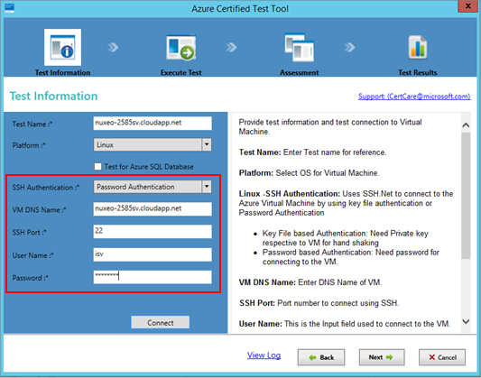
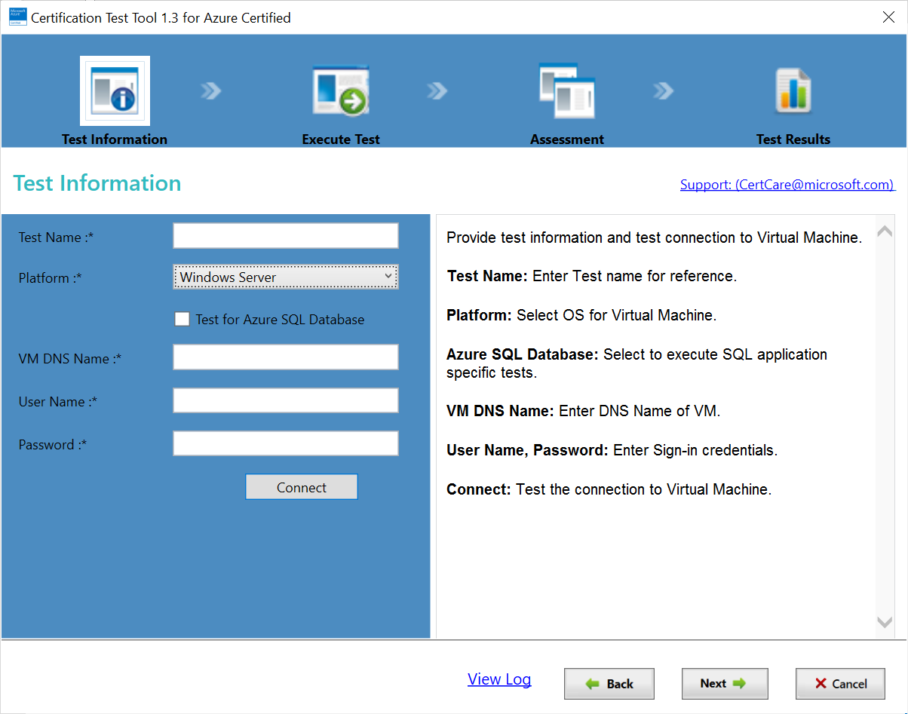

# Azure virtual machine (VM) image certification

This article describes how to test and submit a virtual machine (VM) image in the commercial marketplace to ensure it meets the latest Azure Marketplace publishing requirements.

Complete these steps before submitting your VM offer:

1. Create and deploy certificates.
2. Deploy an Azure VM using your generalized image.
3. Run validations.

## Create and deploy certificates for Azure Key Vault

This section describes how to create and deploy the self-signed certificates required to set up Windows Remote Management (WinRM) connectivity to an Azure-hosted virtual machine.

### Create certificates for Azure Key Vault

This process consists of three steps:

1. Create the security certificate.
2. Create the Azure Key Vault to store the certificate.
3. Store the certificates to the key vault.

You can use either a new or an existing Azure resource group for this work.

#### Create the security certificate

Edit and run the following Azure PowerShell script to create the certificate file (.pfx) in a local folder. Replace the values for the parameters shown in the following table.

| **Parameter** | **Description** |
| --- | --- |
| $certroopath | Local folder to save the .pfx file to. |
| $location | One of the Azure standard geographic locations. |
| $vmName | Name of the planned Azure virtual machine. |
| $certname | Name of the certificate; must match the fully qualified domain name of the planned VM. |
| $certpassword | Password for the certificates, must match the password used for the planned VM. |
| | |

```PowerShell
   # Certification creation script

    # pfx certification stored path
    $certroopath = "C:\certLocation"

    # location of the resource group
    $location = "westus"

    # Azure virtual machine name that we are going to create
    $vmName = "testvm000000906"

    # Certification name - should match with FQDN of Windows Azure creating VM
    $certname = "$vmName.$location.cloudapp.azure.com"

    # Certification password - should be match with password of Windows Azure creating VM
    $certpassword = "SecretPassword@123"

    $cert=New-SelfSignedCertificate -DnsName "$certname" -CertStoreLocation cert:\LocalMachine\My
    $pwd = ConvertTo-SecureString -String $certpassword -Force -AsPlainText
    $certwithThumb="cert:\localMachine\my\"+$cert.Thumbprint
    $filepath="$certroopath\$certname.pfx"
    Export-PfxCertificate -cert $certwithThumb -FilePath $filepath -Password $pwd
    Remove-Item -Path $certwithThumb

```

> [!TIP]
> Keep the same Azure PowerShell console session open and running during these steps to retain the values of the various parameters.

> [!WARNING]
> If you save this script, only save it in a secure location because it contains security information (a password).

#### Create the Azure key vault to store the certificate

Copy the contents of the template below to a file on your local machine. In the example script below, this resource is `C:\certLocation\keyvault.json`).

```json
{
  "$schema": "https://schema.management.azure.com/schemas/2015-01-01/deploymentTemplate.json#",
  "contentVersion": "1.0.0.0",
  "parameters": {
    "keyVaultName": {
      "type": "string",
      "defaultValue":"isvkv0001",
      "metadata": {
        "description": "Name of the Vault"
      }
    },
    "tenantId": {
      "type": "string",
      "defaultValue":"72f988bf-86f1-41af-91ab-2d7cd011db47",
      "metadata": {
        "description": "Tenant Id of the subscription. Get using Get-AzureSubscription cmdlet or Get Subscription API"
      }
    },
    "objectId": {
      "type": "string",
      "defaultValue":"d55739bf-d5d6-4ce0-be1c-49ade53c4315",
      "metadata": {
        "description": "Object Id of the AD user. Get using Get-AzureADUser or Get-AzureADServicePrincipal cmdlets"
      }
    },
    "keysPermissions": {
      "type": "array",
      "defaultValue": ["all"],
      "metadata": {
        "description": "Permissions to keys in the vault. Valid values are: all, create, import, update, get, list, delete, backup, restore, encrypt, decrypt, wrapkey, unwrapkey, sign, and verify."
      }
    },
    "secretsPermissions": {
      "type": "array",
      "defaultValue": ["all"],
      "metadata": {
        "description": "Permissions to secrets in the vault. Valid values are: all, get, set, list, and delete."
      }
    },
    "skuName": {
      "type": "string",
      "defaultValue": "Standard",
      "allowedValues": [
        "Standard",
        "Premium"
      ],
      "metadata": {
        "description": "SKU for the vault"
      }
    },
    "enableVaultForDeployment": {
      "type": "bool",
      "defaultValue": true,
      "allowedValues": [
        true,
        false
      ],
      "metadata": {
        "description": "Specifies if the vault is enabled for a VM deployment"
      }
    }
  },
  "resources": [
    {
      "type": "Microsoft.KeyVault/vaults",
      "name": "[parameters('keyVaultName')]",
      "apiVersion": "2015-06-01",
      "location": "[resourceGroup().location]",
      "properties": {
        "enabledForDeployment": "[parameters('enableVaultForDeployment')]",
        "tenantId": "[parameters('tenantId')]",
        "accessPolicies": [
          {
            "tenantId": "[parameters('tenantId')]",
            "objectId": "[parameters('objectId')]",
            "permissions": {
              "keys": "[parameters('keysPermissions')]",
              "secrets": "[parameters('secretsPermissions')]"
            }
          }
        ],
        "sku": {
          "name": "[parameters('skuName')]",
          "family": "A"
        }
      }
    }
  ]
}

```

Edit and run the following Azure PowerShell script to create an Azure Key Vault and the associated resource group. Replace the values for the parameters shown in the following table

| **Parameter** | **Description** |
| --- | --- |
| $postfix | Random numeric string attached to deployment identifiers. |
| $rgName | Azure resource group (RG) name to create. |
| $location | One of the Azure standard geographic locations. |
| $kvTemplateJson | Path of file (keyvault.json) containing Resource Manager template for key vault. |
| $kvname | Name of the new key vault.|
|   |   |

```PowerShell
    # Creating Key vault in resource group

    # "Random" number for deployment identifiers
    $postfix = "0101048"

    # Resource group name
    $rgName = "TestRG$postfix"

    # Location of Resource Group
    $location = "westus"

    # Key vault template location
    $kvTemplateJson = "C:\certLocation\keyvault.json"

    # Key vault name
    $kvname = "isvkv$postfix"

    # code snippet to get the Azure user object ID
    try
       {
        $accounts = Get-AzureAccount
        $accountNum = 0
        $accounts.Id | %{ ++$accountNum; Write-Host $accountNum $_}
        Write-Host "`nPlease select User, e.g. 1:" -ForegroundColor DarkYellow
        [Int] $accountChoice = Read-Host

        While($accountChoice -lt 1 -or $accountChoice -gt $accounts.Length)
        {
            Write-Host "incorrect input" -ForegroundColor Red
            Write-Host "`nPlease select User, e.g. 1:" -ForegroundColor DarkYellow
            [Int] $accountChoice = Read-Host
        }

        $accountSelected = $accounts[$accountChoice-1]
        echo $accountSelected
        $id = $accountSelected.Id

        Write-Host "User $id Selected"
        $myobjectId=(Get-AzADUser -Mail $id)[0].Id
      }
      catch
      {
      Write-Host $_.Exception.Message
      Break
      }

    # code snippet to get Azure User Tenant Id
      # SELECT Subscriptions
        #**************************************
        try
        {
        $subslist=Get-AzureSubscription
        for($i=1; $i -le $subslist.Length;$i++)
        {
           Write-Host ($i.ToString() +":"+ $subslist[$i-1].SubscriptionName)
        }
        Write-Host "`nPlease pick subscription from above, e.g. 1:" -ForegroundColor DarkYellow
        [int] $selectedsub=Read-Host

        While($selectedsub -lt 1 -or $selectedsub -gt $subslist.Length)
        {
            Write-Host "incorrect input" -ForegroundColor Red
            for($i=1; $i -le $subslist.Length;$i++)
             {
              Write-Host ($i.ToString() +":"+ $subslist[$i-1].SubscriptionName)
             }
            Write-Host "`nPlease pick subscription from above, e.g. 1:" -ForegroundColor DarkYellow
           [int] $selectedsub=Read-Host
        }
        if($selectedsub -ge 1 -and $selectedsub -le $subslist.Length)
        {
        $mysubid=$subslist[$selectedsub-1].SubscriptionId
        $mysubName=$subslist[$selectedsub-1].SubscriptionName
        $mytenantId=$subslist[$selectedsub-1].TenantId
        Write-Host "$mysubName selected"
        }
        }
        catch
        {
        Write-Host $_.Exception.Message
        Break
        }

    # Create a resource group
     Write-Host "Creating Resource Group $rgName"
     Create-ResourceGroup -rgName $rgName -location $location
     Write-Host "-----------------------------------"

    # Create key vault and configure access
    New-AzResourceGroupDeployment -Name "kvdeploy$postfix" -ResourceGroupName $rgName -TemplateFile $kvTemplateJson -keyVaultName $kvname -tenantId $mytenantId -objectId $myobjectId

    Set-AzKeyVaultAccessPolicy -VaultName $kvname -ObjectId $myobjectId -PermissionsToKeys all -PermissionsToSecrets all

```

#### Store the certificates to the key vault

Store the certificates contained in the .pfx file to the new key vault using this script:

```PowerShell
     $fileName =$certroopath+"\$certname"+".pfx"

     $fileContentBytes = get-content $fileName -Encoding Byte
     $fileContentEncoded = [System.Convert]::ToBase64String($fileContentBytes)

            $jsonObject = @"
    {
    "data": "$filecontentencoded",
    "dataType" :"pfx",
    "password": "$certpassword"
    }
"@
            echo $certpassword
            $jsonObjectBytes = [System.Text.Encoding]::UTF8.GetBytes($jsonObject)
            $jsonEncoded = [System.Convert]::ToBase64String($jsonObjectBytes)
            $secret = ConvertTo-SecureString -String $jsonEncoded -AsPlainText -Force
            $objAzureKeyVaultSecret=Set-AzureKeyVaultSecret -VaultName $kvname -Name "ISVSecret$postfix" -SecretValue $secret
            echo $objAzureKeyVaultSecret.Id

```

## Deploy an Azure VM using your generalized image

This section describes how to deploy a generalized VHD image to create a new Azure VM resource. For this process, we'll use the supplied Azure Resource Manager template and Azure PowerShell script.

### Prepare an Azure Resource Manager template

Copy the following Azure Resource Manager template for VHD deployment to a local file named VHDtoImage.json. The next script will request the location on the local machine to use this JSON.

```JSON
{
    "$schema": "https://schema.management.azure.com/schemas/2014-04-01-preview/deploymentTemplate.json",
    "contentVersion": "1.0.0.0",
    "parameters": {
        "userStorageAccountName": {
            "type": "string"
        },
        "userStorageContainerName": {
            "type": "string",
            "defaultValue": "vhds"
        },
        "dnsNameForPublicIP": {
            "type": "string"
        },
        "adminUserName": {
            "defaultValue": "isv",
            "type": "string"
        },
        "adminPassword": {
            "type": "securestring",
            "defaultValue": "Password@123"
        },
        "osType": {
            "type": "string",
            "defaultValue": "windows",
            "allowedValues": [
                "windows",
                "linux"
            ]
        },
        "subscriptionId": {
            "type": "string"
        },
        "location": {
            "type": "string"
        },
        "vmSize": {
            "type": "string"
        },
        "publicIPAddressName": {
            "type": "string"
        },
        "vmName": {
            "type": "string"
        },
        "virtualNetworkName": {
            "type": "string"
        },
        "nicName": {
            "type": "string"
        },
        "vaultName": {
            "type": "string",
            "metadata": {
                "description": "Name of the KeyVault"
            }
        },
        "vaultResourceGroup": {
            "type": "string",
            "metadata": {
                "description": "Resource Group of the KeyVault"
            }
        },
        "certificateUrl": {
            "type": "string",
            "metadata": {
                "description": "Url of the certificate with version in KeyVault e.g. https://testault.vault.azure.net/secrets/testcert/b621es1db241e56a72d037479xab1r7"
            }
        },
        "vhdUrl": {
            "type": "string",
            "metadata": {
                "description": "VHD Url..."
            }
        }
    },
        "variables": {
            "addressPrefix": "10.0.0.0/16",
            "subnet1Name": "Subnet-1",
            "subnet2Name": "Subnet-2",
            "subnet1Prefix": "10.0.0.0/24",
            "subnet2Prefix": "10.0.1.0/24",
            "publicIPAddressType": "Dynamic",
            "vnetID": "[resourceId('Microsoft.Network/virtualNetworks',parameters('virtualNetworkName'))]",
            "subnet1Ref": "[concat(variables('vnetID'),'/subnets/',variables('subnet1Name'))]",
            "osDiskVhdName": "[concat('http://',parameters('userStorageAccountName'),'.blob.core.windows.net/',parameters('userStorageContainerName'),'/',parameters('vmName'),'osDisk.vhd')]"
        },
        "resources": [
            {
                "apiVersion": "2015-05-01-preview",
                "type": "Microsoft.Network/publicIPAddresses",
                "name": "[parameters('publicIPAddressName')]",
                "location": "[parameters('location')]",
                "properties": {
                    "publicIPAllocationMethod": "[variables('publicIPAddressType')]",
                    "dnsSettings": {
                        "domainNameLabel": "[parameters('dnsNameForPublicIP')]"
                    }
                }
            },
            {
                "apiVersion": "2015-05-01-preview",
                "type": "Microsoft.Network/virtualNetworks",
                "name": "[parameters('virtualNetworkName')]",
                "location": "[parameters('location')]",
                "properties": {
                    "addressSpace": {
                        "addressPrefixes": [
                            "[variables('addressPrefix')]"
                        ]
                    },
                    "subnets": [
                        {
                            "name": "[variables('subnet1Name')]",
                            "properties": {
                                "addressPrefix": "[variables('subnet1Prefix')]"
                            }
                        },
                        {
                            "name": "[variables('subnet2Name')]",
                            "properties": {
                                "addressPrefix": "[variables('subnet2Prefix')]"
                            }
                        }
                    ]
                }
            },
            {
                "apiVersion": "2015-05-01-preview",
                "type": "Microsoft.Network/networkInterfaces",
                "name": "[parameters('nicName')]",
                "location": "[parameters('location')]",
                "dependsOn": [
                    "[concat('Microsoft.Network/publicIPAddresses/', parameters('publicIPAddressName'))]",
                    "[concat('Microsoft.Network/virtualNetworks/', parameters('virtualNetworkName'))]"
                ],
                "properties": {
                    "ipConfigurations": [
                        {
                            "name": "ipconfig1",
                            "properties": {
                                "privateIPAllocationMethod": "Dynamic",
                                "publicIPAddress": {
                                    "id": "[resourceId('Microsoft.Network/publicIPAddresses',parameters('publicIPAddressName'))]"
                                },
                                "subnet": {
                                    "id": "[variables('subnet1Ref')]"
                                }
                            }
                        }
                    ]
                }
            },
            {
                "apiVersion": "2015-06-15",
                "type": "Microsoft.Compute/virtualMachines",
                "name": "[parameters('vmName')]",
                "location": "[parameters('location')]",
                "dependsOn": [
                    "[concat('Microsoft.Network/networkInterfaces/', parameters('nicName'))]"
                ],
                "properties": {
                    "hardwareProfile": {
                        "vmSize": "[parameters('vmSize')]"
                    },
                    "osProfile": {
                        "computername": "[parameters('vmName')]",
                        "adminUsername": "[parameters('adminUsername')]",
                        "adminPassword": "[parameters('adminPassword')]",
                        "secrets": [
                            {
                                "sourceVault": {
                                    "id": "[resourceId(parameters('vaultResourceGroup'), 'Microsoft.KeyVault/vaults', parameters('vaultName'))]"
                                },
                                "vaultCertificates": [
                                    {
                                        "certificateUrl": "[parameters('certificateUrl')]",
                                        "certificateStore": "My"
                                    }
                                ]
                            }
                        ],
                        "windowsConfiguration": {
                            "provisionVMAgent": "true",
                            "winRM": {
                                "listeners": [
                                    {
                                        "protocol": "http"
                                    },
                                    {
                                        "protocol": "https",
                                        "certificateUrl": "[parameters('certificateUrl')]"
                                    }
                                ]
                            },
                            "enableAutomaticUpdates": "true"
                        }
                    },
                    "storageProfile": {
                        "osDisk": {
                            "name": "[concat(parameters('vmName'),'-osDisk')]",
                            "osType": "[parameters('osType')]",
                            "caching": "ReadWrite",
                            "image": {
                                "uri": "[parameters('vhdUrl')]"
                            },
                            "vhd": {
                                "uri": "[variables('osDiskVhdName')]"
                            },
                            "createOption": "FromImage"
                        }
                    },
                    "networkProfile": {
                        "networkInterfaces": [
                            {
                                "id": "[resourceId('Microsoft.Network/networkInterfaces',parameters('nicName'))]"
                            }
                        ]
                    },
                "diagnosticsProfile": {
                    "bootDiagnostics": {
                        "enabled": true,
                        "storageUri": "[concat('http://', parameters('userStorageAccountName'), '.blob.core.windows.net')]"
                    }
                }
                }
            }
        ]
    }

```

Edit this file to provide values for these parameters:

| **Parameter** | **Description** |
| --- | --- |
| ResourceGroupName | Existing Azure resource group name. Typically, use the same RG as your key vault. |
| TemplateFile | Full pathname to the file VHDtoImage.json. |
| userStorageAccountName | Name of the storage account. |
| sNameForPublicIP | DNS name for the public IP; must be lowercase. |
| subscriptionId | Azure subscription identifier. |
| Location | Standard Azure geographic location of the resource group. |
| vmName | Name of the virtual machine. |
| vaultName | Name of the key vault. |
| vaultResourceGroup | Resource group of the key vault. |
| certificateUrl | Web address (URL) of the certificate, including version stored in the key vault, for example: `https://testault.vault.azure.net/secrets/testcert/b621es1db241e56a72d037479xab1r7`. |
| vhdUrl | Web address of the virtual hard disk. |
| vmSize | Size of the virtual machine instance. |
| publicIPAddressName | Name of the public IP address. |
| virtualNetworkName | Name of the virtual network. |
| nicName | Name of the network interface card for the virtual network. |
| adminUserName | Username of the administrator account. |
| adminPassword | Administrator password. |
|   |   |

### Deploy an Azure VM

Copy and edit the following script to provide values for the `$storageaccount` and `$vhdUrl` variables. Execute it to create an Azure VM resource from your existing generalized VHD.

```PowerShell

# storage account of existing generalized VHD

$storageaccount = "testwinrm11815"

# generalized VHD URL

$vhdUrl = "https://testwinrm11815.blob.core.windows.net/vhds/testvm1234562016651857.vhd"

echo "New-AzResourceGroupDeployment -Name "dplisvvm$postfix" -ResourceGroupName "$rgName" -TemplateFile "C:\certLocation\VHDtoImage.json" -userStorageAccountName "$storageaccount" -dnsNameForPublicIP "$vmName" -subscriptionId "$mysubid" -location "$location" -vmName "$vmName" -vaultName "$kvname" -vaultResourceGroup "$rgName" -certificateUrl $objAzureKeyVaultSecret.Id  -vhdUrl "$vhdUrl" -vmSize "Standard\_A2" -publicIPAddressName "myPublicIP1" -virtualNetworkName "myVNET1" -nicName "myNIC1" -adminUserName "isv" -adminPassword $pwd"

# deploying VM with existing VHD

New-AzResourceGroupDeployment -Name"dplisvvm$postfix" -ResourceGroupName"$rgName" -TemplateFile"C:\certLocation\VHDtoImage.json" -userStorageAccountName"$storageaccount" -dnsNameForPublicIP"$vmName" -subscriptionId"$mysubid" -location"$location" -vmName"$vmName" -vaultName"$kvname" -vaultResourceGroup"$rgName" -certificateUrl$objAzureKeyVaultSecret.Id  -vhdUrl"$vhdUrl" -vmSize"Standard\_A2" -publicIPAddressName"myPublicIP1" -virtualNetworkName"myVNET1" -nicName"myNIC1" -adminUserName"isv" -adminPassword$pwd

```

## Run validations

There are two ways to run validations on the deployed image:

- Use Certification Test Tool for Azure Certified
- Use the self-test API

### Download and run the certification test tool

The Certification Test Tool for Azure Certified runs on a local Windows machine but tests an Azure-based Windows or Linux VM. It certifies that your user VM image can be used with Microsoft Azure and that the guidance and requirements around preparing your VHD have been met. The output of the tool is a compatibility report that you will upload to the Partner Center portal to request VM certification.

1. Download and install the most recent [Certification Test Tool for Azure Certified](https://www.microsoft.com/download/details.aspx?id=44299).
2. Open the certification tool, then select **Start New Test**.
3. From the **Test Information** screen, enter a **Test Name** for the test run.
4. Select the **Platform** for your VM, either Windows Server or Linux. Your platform choice affects the remaining options.
5. If your VM is using this database service, select the **Test for Azure SQL Database** check box.

### Connect the certification tool to a VM image

The tool connects to Windows-based VMs with [Azure PowerShell](https://docs.microsoft.com/powershell/) and connects to Linux VMs through [SSH.Net](https://www.ssh.com/ssh/protocol/).

### Connect the certification tool to a Linux VM image

1. Select the **SSH Authentication** mode: Password Authentication or Key File Authentication.
2. If using password-­based authentication, enter values for the **VM DNS Name**, **User name**, and **Password**. You can also change the default **SSH Port** number.

    

3. If using key file-based authentication, enter values for the **VM DNS Name**, **User name**, and **Private key** location. You can also include a **Passphrase** or change the default **SSH Port** number.

### **Connect the certification tool to a Windows-based VM image**

1. Enter the fully qualified **VM DNS name** (for example, MyVMName.Cloudapp.net).
2. Enter values for the **User Name** and **Password**.

    

### Run a certification test

After you've given the parameter values for your VM image in the certification tool, select **Test Connection** to create a valid connection to your VM. After a connection is verified, select **Next** to start the test. When the test is complete, the test results are shown in a table. The Status column shows (Pass/Fail/Warning) for each test. If any of the tests fail, your image is _not_ certified. In this case, review the requirements and failure messages, make the suggested changes, and run the test again.

After the automated test completes, provide additional information about your VM image on the two tabs of the **Questionnaire** screen, **General Assessment** and **Kernel Customization**, and then select **Next**.

The last screen lets you provide more information, such as SSH access information for a Linux VM image, and an explanation for any failed assessments if you're looking for exceptions.

Finally, select **Generate Report** to download the test results and log files for the executed test cases along with your answers to the questionnaire. Save the results in the same container as your VHDs.

## Next step

- [Generate a uniform resource identifiers (URI) for each VHD](https://docs.microsoft.com/azure/marketplace/cloud-partner-portal/virtual-machine/cpp-get-sas-uri)
