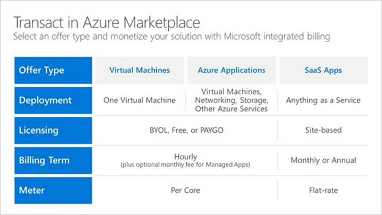

# Commercial marketplace billing

This article covers commerce-related topics for the commercial marketplace:

- [Marketplace publishing options](#marketplace-publishing-options)
- [Transact general overview](#transact-general-overview)
- [Transact billing models](#transact-billing-models)

## Marketplace publishing options

Commercial marketplace offers several publishing options for publishers.

### List and trial publishing options

Publishers can leverage the list, trial, and bring your own license (BYOL) publishing options for promotional and user acquisition purposes. With these options, Microsoft doesn't participate directly in the publisher's software license transactions, and there is no associated transaction fee. Publishers are responsible for supporting all aspects of the software license transaction, including but not limited to: order, fulfillment, metering, billing, invoicing, payment, and collection. With the list and trial publishing options, publishers keep 100% of publisher software licensing fees collected from the customer.

### Transact publishing option

In addition to the list and trial publishing options, the transact publishing option is available to publishers. This option takes advantage of Microsoft's globally available commerce capabilities and allows Microsoft to host cloud marketplace transactions on behalf of the publisher.

## Transact general overview

When using the transact publishing option, Microsoft enables the sale of third-party software, and deployment of some offer types to the customer's Azure subscription. The publisher must consider the billing of infrastructure fees, and the publisher's own software licensing fees, when selecting a billing model and offer type.

The Transact publishing option is currently supported for the following offer types: virtual machines, Azure applications, and SaaS applications.

### Billing infrastructure costs

#### For virtual machines and Azure applications

For virtual machines and Azure applications, the Azure infrastructure usage fees are billed to the customer's Azure subscription. Infrastructure usage fees are priced and presented separately from the software provider's licensing fees on the customer's invoice.

#### For SaaS apps

For SaaS Apps, the publisher must account for Azure infrastructure usage fees, and software licensing fees as a single cost item. It is represented as a flat fee to the customer. The Azure infrastructure usage is managed and billed to the partner directly. Actual infrastructure usage fees are not seen by the customer. Publishers typically opt to bundle Azure infrastructure usage fees into their software license pricing. Software licensing fees aren't metered or consumption based.

## Transact billing models

Depending on the transaction option used, the publisher's software license fees can be presented as follows:

- *Free*: No charge for software licenses.
- *Bring your own license (BYOL)*: Any applicable charges for software licenses are managed directly between the publisher and customer. Microsoft only passes through Azure infrastructure usage fees. (Virtual Machines and Azure Applications only.)
- *Pay-as-you-go*: Software license fees are presented as a per-hour, per-core (vCPU) pricing rate based on the Azure infrastructure used. This model only applies to virtual machines and Azure applications.
- *Subscription pricing*: Software license fees are presented as a monthly or annual, recurring fee billed as a flat rate or per-seat. This model only applies to SaaS Apps and Azure Applications - Managed Apps.
- *Free software trial*: No charge for software licenses for 30-days or 90-days.

### Free and bring-your-own-license (BYOL) pricing

When publishing a free or bring-your-own-license transaction offer, Microsoft does not play a role in facilitating the sales transaction for your software license fees. Like the list and trial publishing options, the publisher keeps 100% of software license fees.

### Pay-as-you-go and subscription (site-based) pricing

When publishing a pay-as-you-go or subscription transaction offer, Microsoft provides the technology and services to process software license purchases, returns, and charge backs. In this scenario, the publisher authorizes Microsoft to act as an agent for these purposes. The publisher allows Microsoft to facilitate the software licensing transaction, while retaining their designation as the seller, provider, distributor, and licensor.

Microsoft enables customers to order, license, and use publisher software, subjecting to the terms and conditions of both Microsoft's commercial Marketplace and the publisher's end-user licensing agreement. Publishers must provide their end-user licensing agreement or select the [Standard Contract](https://docs.microsoft.com/azure/marketplace/standard-contract) when creating the offer.

### Free software trials

For transact publishing scenarios, the publisher can make a software license available free for 30-days or 90 days. This discounting capability does not include the cost of Azure infrastructure usage that is driven by use of the partner solution.

### Private offers

In addition to using offer types and billing models to monetize an offer, publishers can transact a private offer, complete with negotiated and deal-specific pricing, or custom configurations. Private offers are supported by all 3 transact publishing options.

This option allows higher or lower pricing than the publicly available offering. Private offers can be used to discount or add a premium for an offer. Private offers can be made available to one or more customers by white listing their Azure subscription at the offer level.

### Examples

#### Pay as you go

* If you enable the Pay-As-You-Go option, then you have the following cost structure.

|Your license cost  | $1.00 per hour  |
|---------|---------|
|Azure usage cost (D1/1-Core)    |   $0.14 per hour     |
|*Customer is billed by Microsoft*    |  *$1.14 per hour*       |

* In this scenario, Microsoft bills $1.14 per hour for use of your published VM image.

|Microsoft bills  | $1.14 per hour  |
|---------|---------|
|Microsoft pays you 80% of your license cost|   $0.80 per hour     |
|Microsoft keeps 20% of your license cost  |  $0.20 per hour       |
|Microsoft keeps 100% of the Azure usage cost | $0.14 per hour |

### Bring Your Own License (BYOL)

* If you enable the BYOL option, then you have the following cost structure.

|Your license cost  | License fee negotiated and billed by you  |
|---------|---------|
|Azure usage cost (D1/1-Core)    |   $0.14 per hour     |
|*Customer is billed by Microsoft*    |  *$0.14 per hour*       |

* In this scenario, Microsoft bills $0.14 per hour for use of your published VM image.

|Microsoft bills  | $0.14 per hour  |
|---------|---------|
|Microsoft keeps the Azure usage cost    |   $0.14 per hour     |
|Microsoft keeps 0% of your license cost   |  $0.00 per hour       |

### SaaS App subscription

This option must be configured to sell through Microsoft and can be priced at a flat rate or per user on a monthly or annual basis.

•	If you enable the Sell through Microsoft option for a SaaS offer, then you have the following cost structure.

|Your license cost       | $100.00 per month  |
|--------------|---------|
|Azure usage cost (D1/1-Core)    | Billed directly to the publisher, not the customer |
|*Customer is billed by Microsoft*    |  *$100.00 per month (note: publisher must account for any incurred or pass-through infrastructure costs in the license fee)*  |

* In this scenario, Microsoft bills $100.00 for your software license and pays out $80.00 to the publisher.
* Partners who have qualified for the Reduced Marketplace Service Fee will see a reduced transaction fee on the SaaS offers from May 2019 until June 2020. In this scenario, Microsoft bills $100.00 for your software license and pays out $90.00 to the publisher.

|Microsoft bills  | $100.00 per month  |
|---------|---------|
|Microsoft pays you 80% of your license cost   \* Microsoft pays you 90% of your license cost for any qualified SaaS apps   |   $80.00 per month   \* $90.00 per month    |
|Microsoft keeps 20% of your license cost   \* Microsoft keeps 10% of your license cost for any qualified SaaS apps.  |  $20.00 per month   \* $10.00     |

**Reduced Marketplace Service Fee:** For certain SaaS Products that you publish on our Commercial Marketplace, Microsoft will reduce its Marketplace Service Fee from 20% (as described in the Microsoft Publisher Agreement) to 10%.  In order for your Product to qualify, at least one of your products must be designated by Microsoft as either IP co-sell ready or IP co-sell prioritized. To receive this reduced Marketplace Service Fee for the month, eligibility must be met at least five (5) business days before the end of the previous calendar month. Reduced Marketplace Service fee will not apply to VMs, Managed Apps or any other products made available through our Commercial Marketplace.  This Reduced Marketplace Service Fee will be available to qualified offers, with license charges collected by Microsoft between May 1, 2019 and June 30, 2020.  After that time, the Marketplace Service Fee will return to its normal amount.
