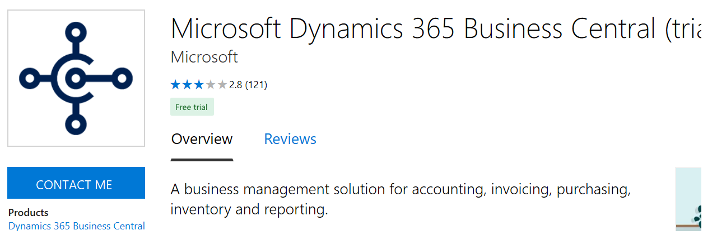
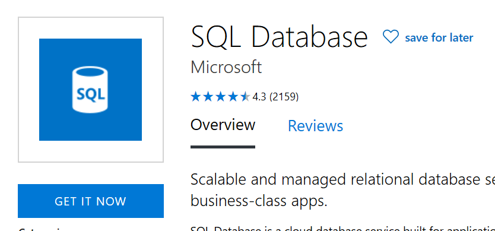
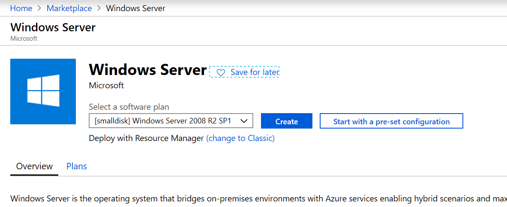
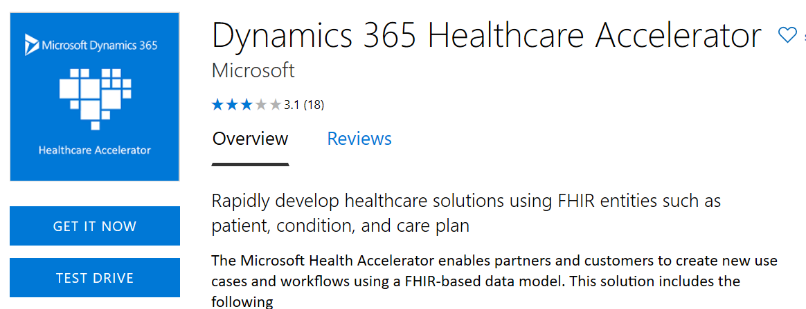
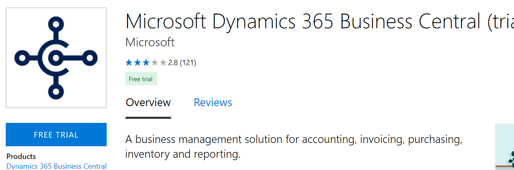

# Customer leads from your commercial marketplace offer

Leads are customers interested in or deploying your offers from [Microsoft AppSource](https://appsource.microsoft.com) and [Azure Marketplace](https://azuremarketplace.microsoft.com). You can receive customer leads after your offer is published to the commercial marketplace. This article explains the following lead management concepts:

* How your commercial marketplace offer generates customer leads to ensure that you don't miss business opportunities. 
* How to connect your customer relationship management (CRM) system to your offer so that you can manage your leads in one central location.
* The lead data we send you so that you can follow up on customers who reached out to you.

## Generate customer leads

Here are places where a lead is generated:

- A customer consents to sharing their information after they select **Contact me** from the commercial marketplace. This lead is an *initial interest* lead. We share information with you about the customer who has expressed interest in getting your product. The lead is the top of the acquisition funnel.

    

- A customer selects **Get It Now** (or selects **Create** in the [Azure portal](https://portal.azure.com/)) to get your offer. This lead is an *active* lead. We share information with you about the customer who has started to deploy your product.

    

    

- A customer selects **Test Drive** or **Free Trial** to try out your offer. Test drives or free trials are accelerated opportunities for you to share your business instantly with potential customers without any barriers of entry.

    

    

## Connect to your CRM system

[!INCLUDE [Test drive content](./includes/connect-lead-management.md)]

## Understand lead data

Each lead you receive during the customer acquisition process has data in specific fields. The first field to look out for is the `LeadSource` field, which follows this format: **Source-Action** | **Offer**.

**Sources**: The value for this field is populated based on the marketplace that generated the lead. Possible values are `"AzureMarketplace"`, `"AzurePortal"`, and `"AppSource (SPZA)"`.

**Actions**: The value for this field is populated based on the action the customer took in the marketplace that generated the lead.

Possible values are:

- **"INS"**: Stands for *installation*. This action is in Azure Marketplace or AppSource when a customer acquires your product.
- **"PLT"**: Stands for *partner-led trial*. This action is in AppSource when a customer selects the **Contact me** option.
- **"DNC"**: Stands for *do not contact*. This action is in AppSource when a partner who was cross-listed on your app page gets requested to be contacted. We share a notification that this customer was cross-listed on your app, but they don't need to be contacted.
- **"Create"**: This action is only inside the Azure portal and is generated when a customer purchases your offer to their account.
- **"StartTestDrive"**: This action is only for the **Test Drive** option and is generated when a customer starts their test drive.

**Offers**: You might have multiple offers in the commercial marketplace. The value for this field is populated based on the offer that generated the lead. The publisher ID and offer ID are both sent in this field and are values you provided when you published the offer to the marketplace.

The following examples show values in the expected format `publisherid.offerid`: 

- `checkpoint.check-point-r77-10sg-byol`
- `bitnami.openedxcypress`
- `docusign.3701c77e-1cfa-4c56-91e6-3ed0b622145`

## Customer information

The customer's information is sent via multiple fields. The following example shows the customer information that's contained in a lead:

- FirstName: John
- LastName: Smith
- Email: jsmith\@microsoft.com
- Phone: 1234567890
- Country: US
- Company: Microsoft
- Title: CTO

>[!NOTE]
>Not all the data in the previous example is always available for each lead. Because you'll get leads from multiple steps as mentioned in the "Generate customer leads" section, the best way to handle the leads is to de-duplicate the records and personalize the follow-ups. This way each customer gets an appropriate message, and you create a unique relationship.

## Best practices for lead management

Here are some recommendations for driving leads through your sales cycle:

- **Process**: Define a clear sales process, with milestones, analytics, and clear team ownership.
- **Qualification**: Define prerequisites, which indicate whether a lead was fully qualified. Make sure sales or marketing representatives qualify leads carefully before taking them through the full sales process.
- **Follow-up**: Don't forget to follow up within 24 hours. You will get the lead in your CRM of choice immediately after the customer deploys a test drive; email them within while they are still warm. Request scheduling a phone call to better understand if your product is a good solution for their problem. Expect the typical transaction to require numerous follow-up calls.
- **Nurture**: Nurture your leads to get you on the way to a higher profit margin. Check in, but don't bombard them. We recommend you email leads at least a few times before you close them out; don't give up after the first attempt. Remember, these customers directly engaged with your product and spent time in a free trial; they are great prospects.

## Common questions about lead management

### Where can I get help in setting up my lead destination?

Follow the steps in the section [Connect to your CRM system](#connect-to-your-crm-system), or submit a support ticket through [Partner Center Help and support](https://aka.ms/marketplacepublishersupport). Then select **Offer creation** > **Your type of offer** > **Lead management configuration**.

### Am I required to configure a lead destination in order to publish an offer in the commercial marketplace?

The answer depends on the type of offer you're publishing. Software as a service (SaaS) and Dynamics 365 Customer Engagement use **Contact Me** to list all Dynamics 365 for Finance and Operations offers, all Dynamics 365 Business Central offers, and all Consulting Service offers. As a result, they require a connection to a lead destination. If your offer type wasn't listed, a connection to a lead destination isn't required. We recommend that you configure a lead destination so you don't miss business opportunities.

### How can I find the test lead?

Search for `"MSFT_TEST"` in your lead destination. Here's a sample test lead from Microsoft:

```
company = MSFT_TEST_636573304831318844
country = US
description = MSFT_TEST_636573304831318844
email = MSFT_TEST_636573304831318844@test.com
encoding = UTF-8
encoding = UTF-8
first_name = MSFT_TEST_636573304831318844
last_name = MSFT_TEST_636573304831318844
lead_source = MSFT_TEST_636573304831318844-MSFT_TEST_636573304831318844|<Offer Name>
oid = 00Do0000000ZHog
phone = 1234567890
title = MSFT_TEST_636573304831318844
```

### I have a live offer, but why am I not seeing any leads?

Make sure your connection to the lead destination is valid. We'll send you a test lead after you select **Publish** on your offer in Partner Center. If you see the test lead, the connection is valid. You can also test your lead connection by trying to acquire the offer preview during the preview step. Select **Get It Now**, **Contact Me**, or **Free Trial** on the listing in the commercial marketplace.

Also, make sure you're looking for the right data. The content in the [Understand lead data](#understand-lead-data) section of this article describes the lead data we send to your lead destination.

### I configured Azure Blob storage as my lead destination, but why don't I see the lead?

Azure Blob storage is no longer supported as a lead destination, so you're missing any customer leads generated by your offer. Switch to any of the other [lead destination options](./commercial-marketplace-get-customer-leads.md). 

### I received an email from the commercial marketplace, but why can't I find the lead in my CRM?

It's possible that the end user's email domain is from .edu. For privacy reasons, we don't pass personal information from the .edu domain. Submit a support ticket through [Partner Center Help and support](https://aka.ms/marketplacepublishersupport).

### I configured an Azure table as my lead destination. How can I view the leads?

You can access the lead data stored in the Azure table from the Azure portal. You can also download and install [Azure Storage Explorer](https://azure.microsoft.com/features/storage-explorer/) for free to view your Azure storage account's table data.

### I configured an Azure table as my lead destination. Can I get notified whenever a new commercial marketplace lead is sent?

Yes. Follow the instructions in [Configure lead management by using an Azure table](./commercial-marketplace-lead-management-instructions-azure-table.md) to set up a Microsoft flow that sends an email if a lead is added to the Azure table.

### I configured Salesforce as my lead destination, but why can't I find the leads?

Check if the web-to-lead form is a mandatory field based on a pick list. If it is, switch the field to a nonmandatory text field.

### There was an issue with my lead destination, and I missed some leads. Can I have them sent to me in an email?

Due to personal information policies, we can't share lead information through unsecured email.

### I configured an Azure table as my lead destination. How much will it cost?

Lead generation data is low. It's less than 1 GB for almost all publishers. The cost depends on the number of leads received. For example, if 1,000 leads are received in a month, the cost is around 50 cents. For more information about storage pricing, see [Azure Storage overview pricing](https://azure.microsoft.com/pricing/details/storage/).

If your question isn't answered, contact Microsoft Support through [Partner Center Help and support](https://aka.ms/marketplacepublishersupport). Then select **Offer creation** > **Your type of offer** > **Lead management configuration**.

### I'm receiving email notifications when new customer leads are received. How can I configure someone else to receive these emails?

Access your offer in Partner Center, and go to the **Offer setup** page > **Lead Management** > **Edit**. Update the email addresses under the **Contact email** field.

## Next steps

After the technical setup is in place, incorporate these leads into your current sales and marketing strategy and operational processes. We're interested in better understanding your overall sales process and want to work closely with you to provide high-quality leads and enough data to make you successful. We welcome your feedback on how we can optimize and enhance the leads we send you with additional data to help make these customers successful. Let us know if you're interested in [providing
feedback](mailto:AzureMarketOnboard@microsoft.com) and suggestions to enable your sales team to be more successful with commercial marketplace leads.
