# Use Azure Table storage to manage commercial marketplace leads

If your customer relationship management (CRM) system isn't explicitly supported in Partner Center to receive Microsoft AppSource and Azure Marketplace leads, you can use Azure Table storage to handle these leads. You can then choose to export the data and import it into your CRM system. This article explains how to create an Azure storage account and a table under that account. In addition, you can create a new flow by using Power Automate to send an email notification when your offer receives a lead.

## Configure an Azure storage account

1. If you don't have an Azure account, you can [create a free trial account](https://azure.microsoft.com/pricing/free-trial/).
1. After your Azure account is active, sign in to the [Azure portal](https://portal.azure.com).
1. In the Azure portal, create a storage account by using the following procedure:

    1. Select **+ Create a resource** in the left menu bar. The **New** pane appears to the right.
    1. Select **Storage** in the **New** pane. A **Featured** list appears to the right.
    1. Select **Storage account** to begin account creation. Follow the instructions in [Create a storage account](https://docs.microsoft.com/azure/storage/common/storage-quickstart-create-account?tabs=azure-portal).

        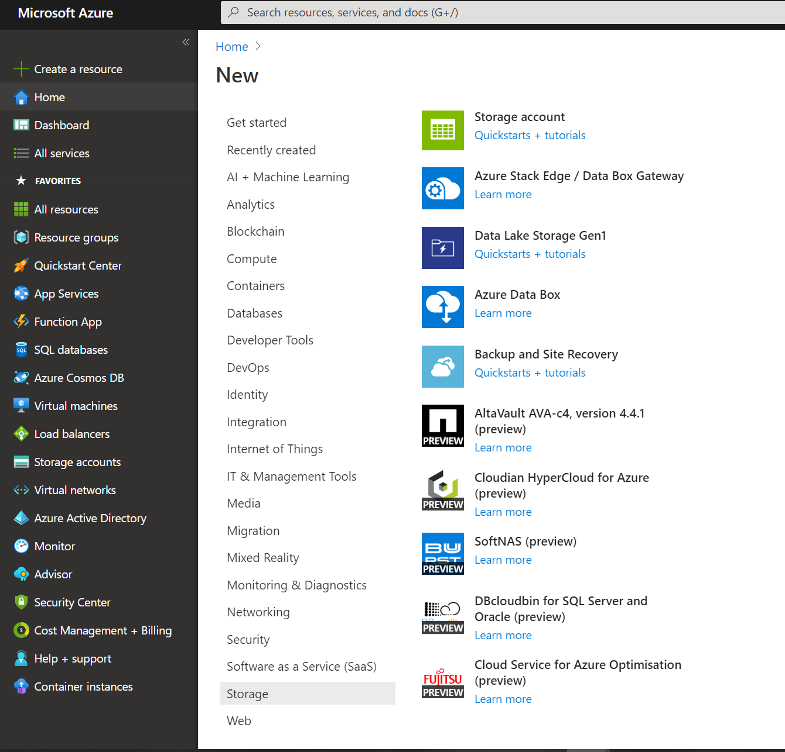

        For more information about storage accounts, see [Quickstart tutorial](https://docs.microsoft.com/azure/storage/). For more information about storage pricing, see [Storage pricing](https://azure.microsoft.com/pricing/details/storage/).

1. Wait until your storage account is provisioned. This process typically takes a few minutes. 

## Create a table in your storage account

1. From the **Home** page of the Azure portal, selecting **See all your resources** to access your storage account. You can also select **All resources** from the left menu bar of the Azure portal.

    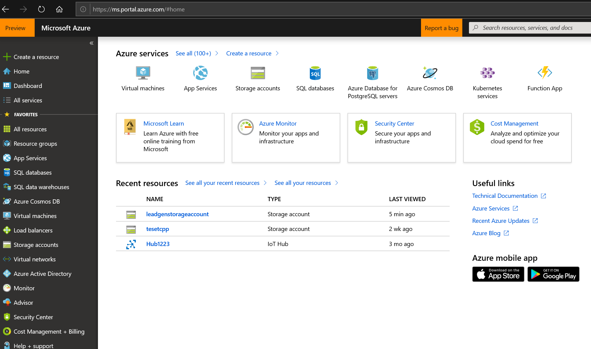

1. From your storage account pane, select **Access keys** and copy the **Connection string** value for the key. Save this value because it's the **Storage Account Connection String** value that you'll need to provide in the publishing portal to receive leads for your Azure Marketplace offer. 

    Here's an example of a connection string.

    ```sql
    DefaultEndpointsProtocol=https;AccountName=myAccountName;AccountKey=myAccountKey;EndpointSuffix=core.screens.net
    ```

    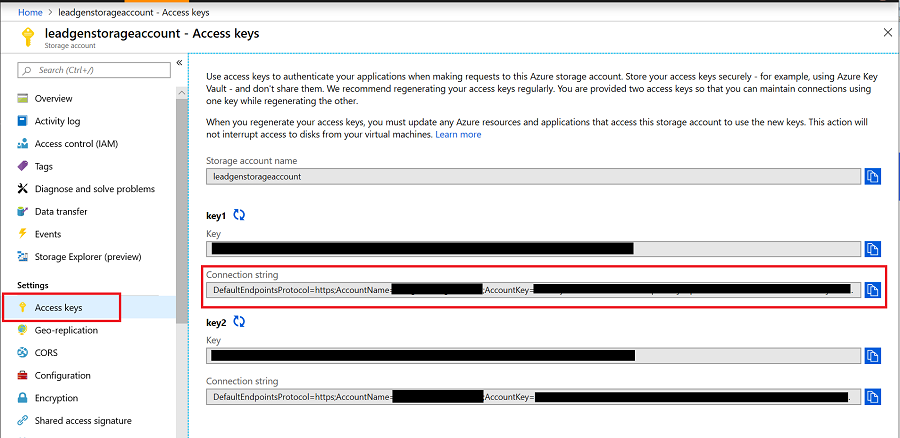

1. From your storage account pane, select **Tables**, and select **+ Table** to create a table. Enter a name for your table, and select **OK**. Save this value because you'll need it if you want to configure a flow to receive email notifications when leads are received.

    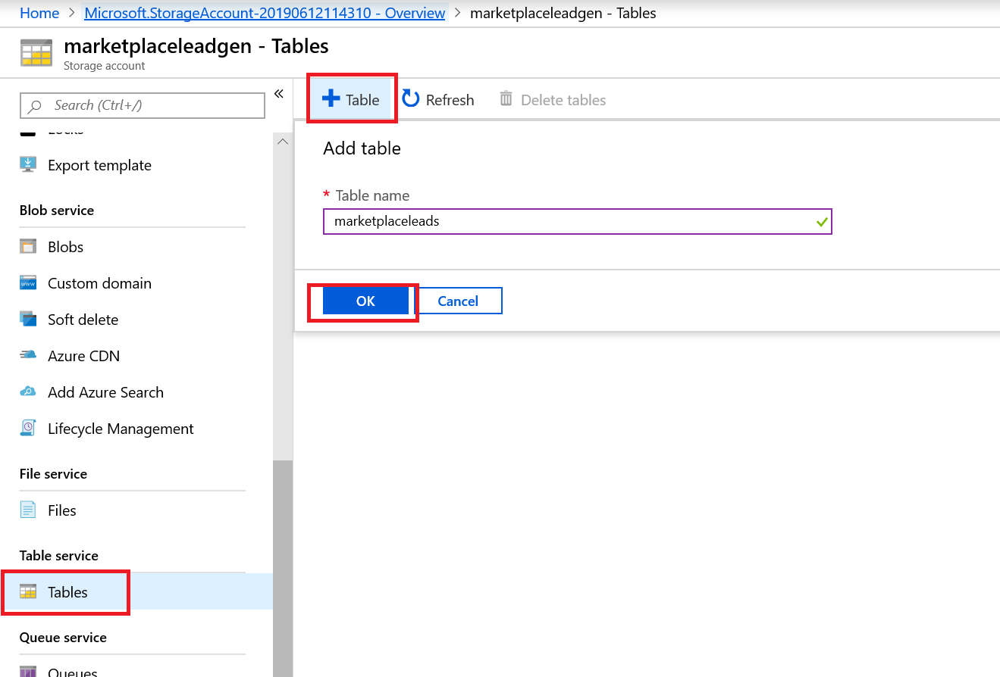

    You can use [Azure Storage Explorer](https://archive.codeplex.com/?p=azurestorageexplorer) or any other tool to see the data in your storage table. You can also export the data in the Azure table. 

## (Optional) Use Power Automate to get lead notifications

You can use [Power Automate](https://docs.microsoft.com/flow/) to automate notifications every time a lead is added to your Azure Storage table. If you don't have an account, you can [sign up for a free account](https://flow.microsoft.com/).

### Lead notification example

The example creates a flow that automatically sends an email notification when a new lead is added to Azure Table storage. This example sets up a recurrence to send lead information every hour if the table storage is updated.

1. Sign in to your Power Automate account.
1. On the left bar, select **My flows**.
1. On the top bar, select **+ New**. 
1. In the drop-down list, select **+ Scheduled--from blank**.

   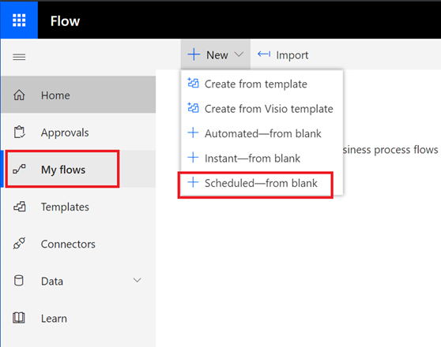

1. In the **Build a scheduled flow** window, for **Repeat every**, select **1** for the interval and **Hour** for the frequency. Also, give the flow a name if you want. Select **Create**.

   >[!NOTE]
   >Although this example uses a one-hour interval, you can select the interval and frequency that's best for your business needs.

   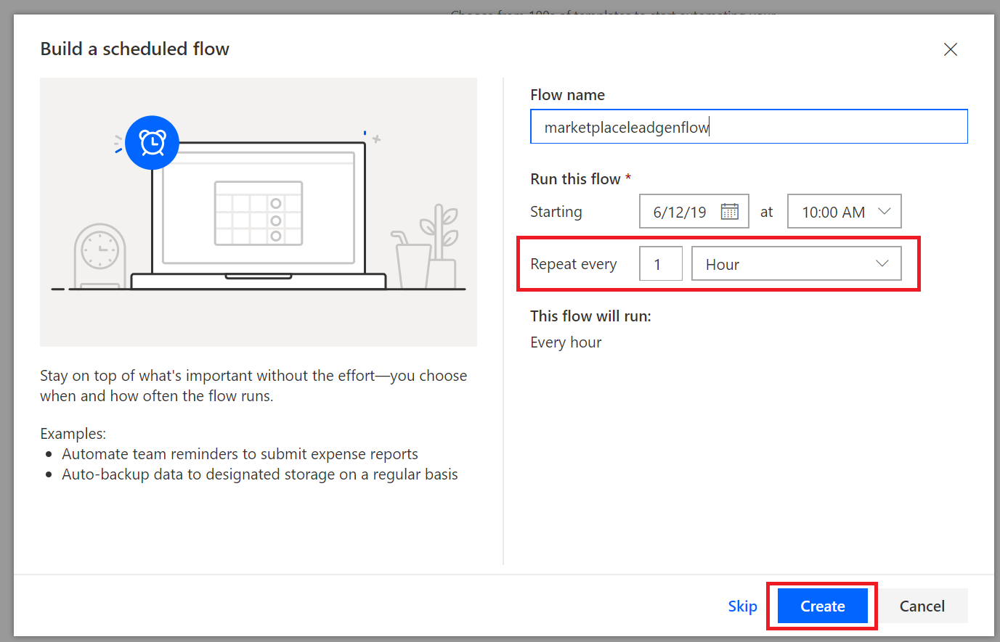

1. Select **+ New step**.
1. In the **Choose an action** window, search for **get past time**. Then under **Actions**, select **Get past time**.

   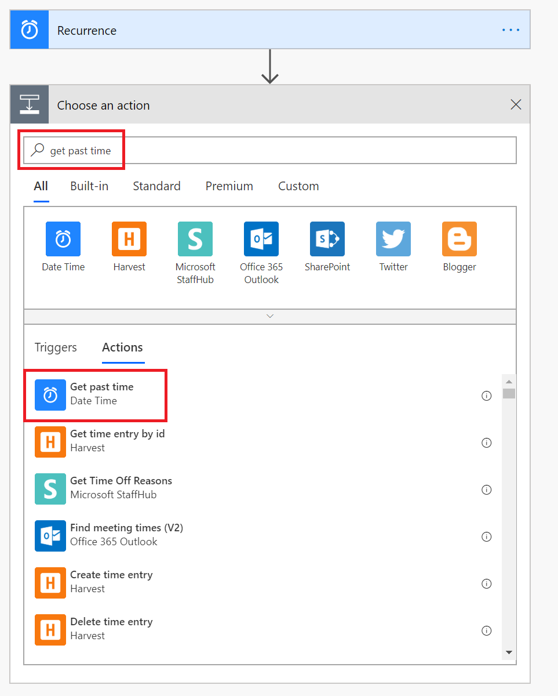

1. In the **Get past time** window, set **Interval** to **1**. From the **Time unit** drop-down list, select **Hour**.

    >[!IMPORTANT]
    >Make sure that the interval and time unit you sent in Step 8 match the interval and frequency that you configured for recurrence in Step 5.

    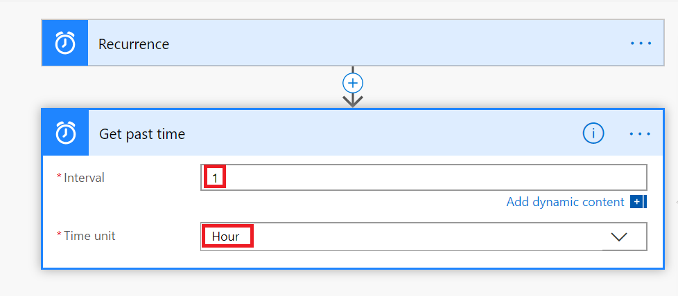

   >[!TIP] 
   >You can check your flow at any time to verify each step is configured correctly. To check your flow, select **Flow checker** from the **Flow** menu bar.

   In the next set of steps, you'll connect to your table and set up the processing logic to handle new leads.

1. Select **+ New step**. Then search for **Get entities** In the **Choose an action** window.
1. Under **Actions**, select **Get entities (Azure Table Storage)**.
1. In the **Azure Table Storage** window, provide information for the following boxes and select **Create**:

    * **Connection Name**: Provide a meaningful name for the connection you're establishing between this flow and the table.
    * **Storage Account Name**: Provide the name of the storage account for your table. You can find this name on the storage account's **Access keys** page.
    * **Shared Storage Key**: Provide the key value for your store account for your table. You can find this value on the storage account's **Access keys** page.

      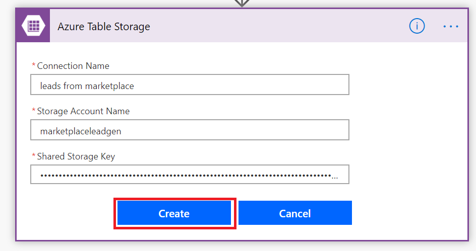

   After you select **Create**, the **Get entities** window appears. Here, select **Show advanced options**, and provide information for the following boxes:

   * **Table**: Select the name of your table (from [Create a table](#create-a-table-in-your-storage-account)). The following image shows the prompt when "marketplaceleads" table is selected for this example.

     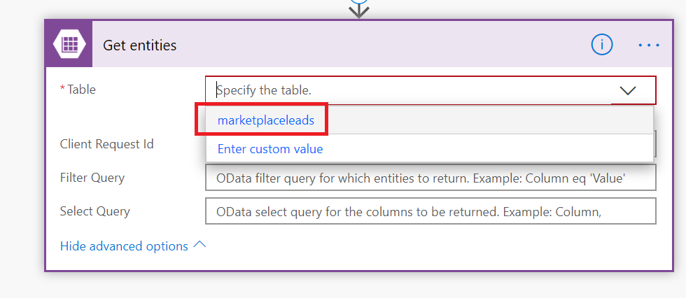

   * **Filter Query**: Select this box, and paste this function into the box: `Timestamp gt datetime'@{body('Get_past_time')}'`

     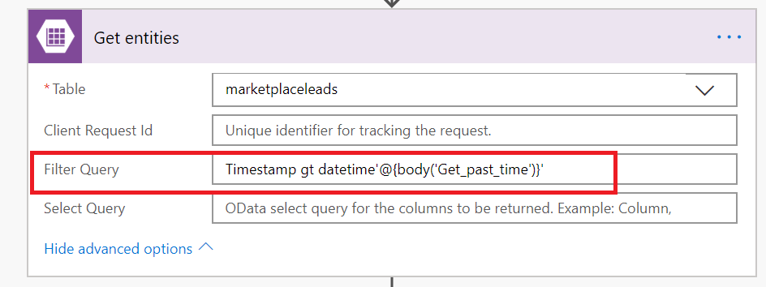

1. Now that you've completed setting up the connection to the Azure table, select **New step** to add a condition to scan the Azure table for new leads.

1. In the **Choose an action** window, select **Actions**. Then select **Condition Control**.

    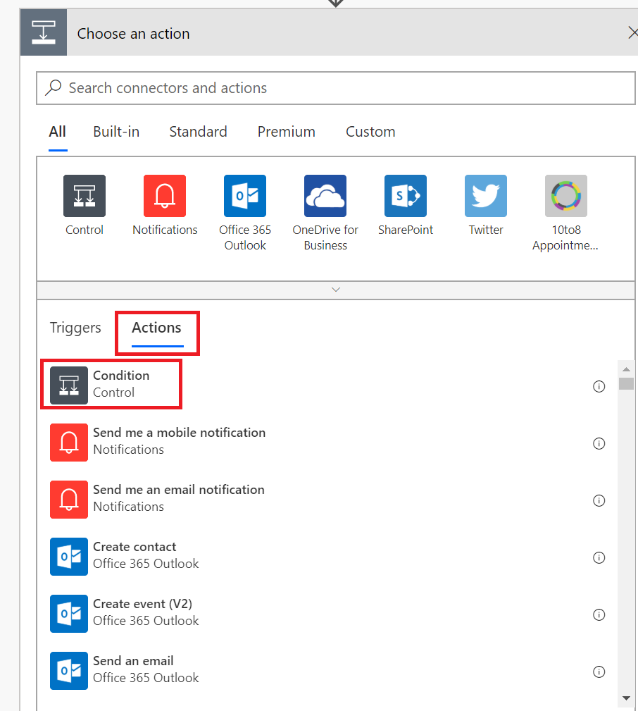

1. In the **Condition** window, select **Choose a value**. Then select **Expression** in the pop-up window.

1. Paste `length(body('Get_entities')?['value'])` into the **fx** box. Select **OK** to add this function. 

1. To finish setting up the condition:
    1. Select **is greater than** from the drop-down list.
    2. Enter **0** as the value.

        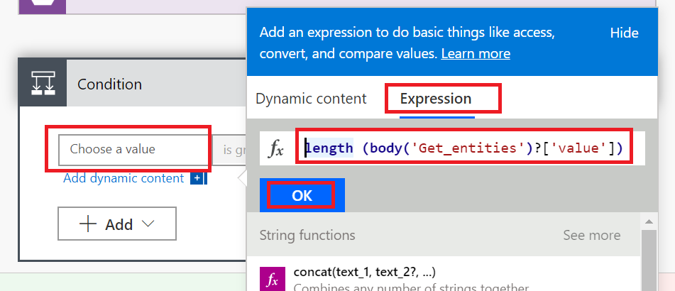

   In the next few steps, you set up the action to take based on the result of the condition:

   * If the condition resolves to **If no**, don't do anything.
   * If the condition resolves to **If yes**, trigger an action that connects your Office 365 account to send an email. 

1. Select **Add an action** under **If yes**.

    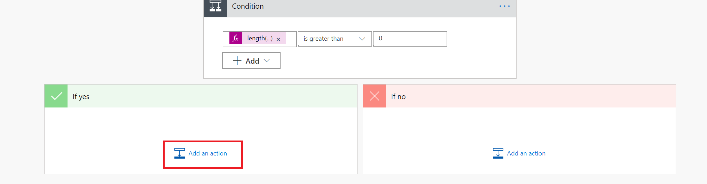

1. Select **Send an email (Office 365 Outlook)**.

    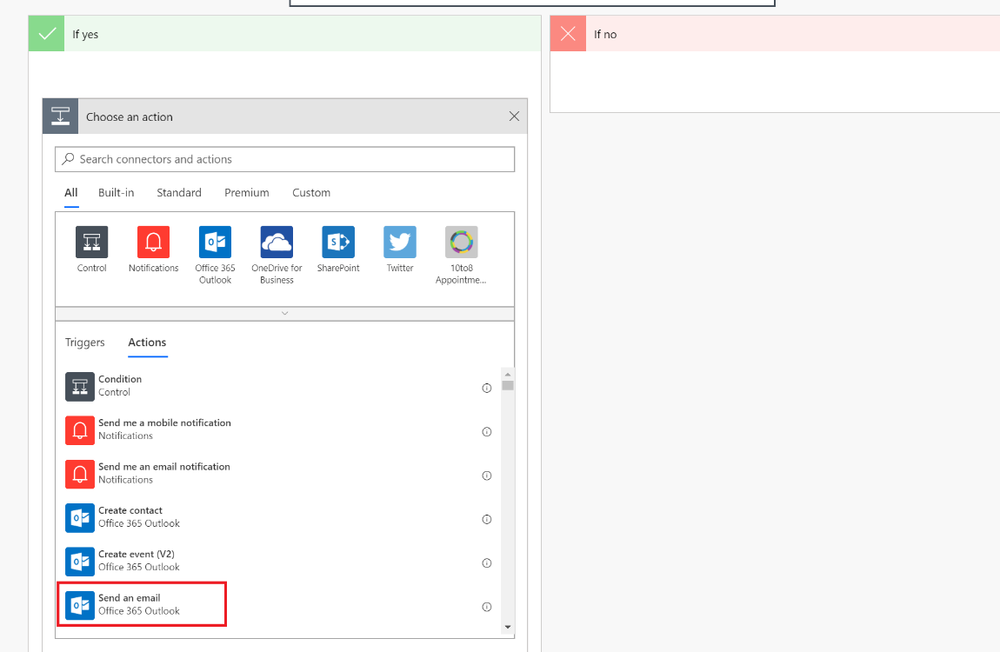

    >[!NOTE]
    >To use a different email provider, search for and select **Send an email notification (Mail)** as the action instead. The instructions show you how to configure by using Office 365 Outlook, but the instructions are similar for a different email provider.

1. In the Office 365 Outlook window, provide information for the following boxes:

    1. **To**: Enter an email address for everyone who will get this notification.
    1. **Subject**: Provide a subject for the email. An example is **New leads!**
    1. **Body**: Add the text that you want to include in each email (optional), and then paste in `body('Get_entities')?['value']`.

    >[!NOTE]
    >You can insert additional static or dynamic data points to the body of this email.

    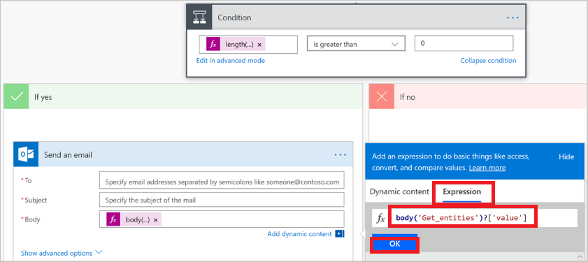

1. Select **Save** to save the flow. Power Automate automatically tests the flow for errors. If there aren't any errors, your flow starts running after it's saved.

The following image shows an example of how the final flow should look.


### Manage your flow

Managing your flow after it's running is easy. You have complete control over your flow. For example, you can stop it, edit it, see a run history, and get analytics. The following image shows the options that are available to manage a flow.

 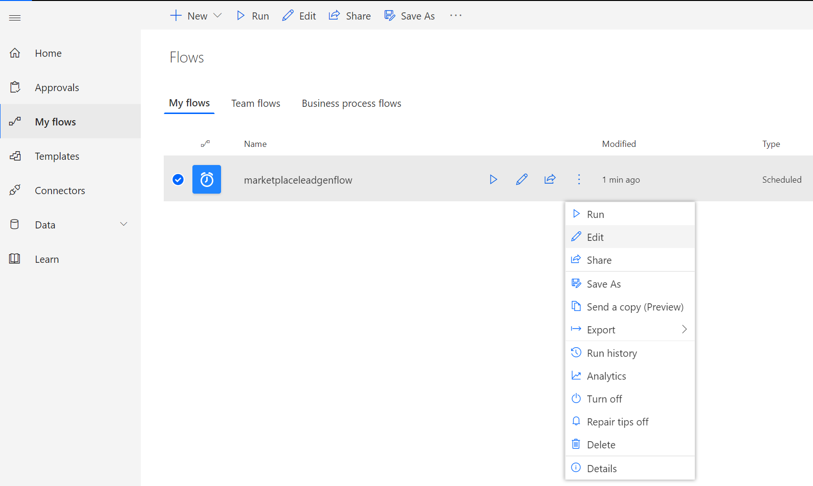

The flow keeps running until you stop it by using the **Turn flow off** option.

If you're not getting any lead email notifications, it means that new leads haven't been added to the Azure table. If there are any flow failures, you'll get an email like this example.

 

## Configure your offer to send leads to the Azure table

When you're ready to configure the lead management information for your offer in the publishing portal, follow these steps.

1. Go to the **Offer setup** page for your offer.

1. Under the **Customer leads** section, select **Connect**.

    :::image type="content" source="./media/commercial-marketplace-lead-management-instructions-azure-table/customer-leads.png" alt-text="Customer leads":::

1. In the **Connection details** pop-up window, select **Azure Table** for the **Lead destination**. 
     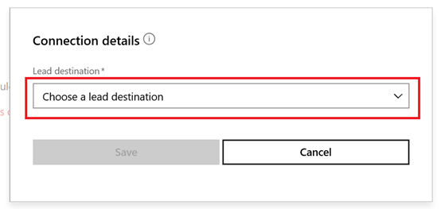

1. Paste in the connection string from the Azure storage account you created by following earlier steps in the **Storage account connection string** box.
     

1. **Contact email**: Provide emails for people in your company who should receive email notifications when a new lead is received. You can provide multiple emails by separating them with semicolons.

1. Select **OK**.

To make sure you have successfully connected to a lead destination, select the **Validate** button. If successful, you'll have a test lead in the lead destination.

>[!NOTE]
>You must finish configuring the rest of the offer and publish it before you can receive leads for the offer.

When leads are generated, Microsoft sends leads to the Azure table. If you configured a flow, an email will also be sent to the email address you configured.
