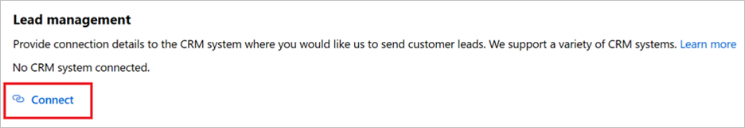

# Configure lead management using an Azure Table

If your Customer Relationship Management (CRM) system is not explicitly supported in Partner Center for receiving Azure Marketplace and AppSource leads, you can use an Azure Table to handle these leads. You can then choose to export the data and import it into your CRM system. The instructions in this article will walk you through the process of creating an Azure Storage account, and an Azure Table under that account. In addition, you can create a new flow using Microsoft Flow to send an email notification when your offer receives a lead.

## Configure Azure Table

1. If you don't have an Azure account, you can [create a free trial account](https://azure.microsoft.com/pricing/free-trial/).
2. After your Azure account is active, sign in to the [Azure portal](https://portal.azure.com).
3. In the Azure portal, create a storage account using the following procedure.  
    1. Select **+Create a resource** in the left menu bar.  The **New** pane (blade) will be displayed to the right.
    2. Select **Storage** in the **New** pane.  A **Featured** list is displayed to the right.
    3. Select **Storage Account** to begin account creation.  Follow the instructions in the article [Create a storage account](https://docs.microsoft.com/azure/storage/common/storage-quickstart-create-account?tabs=azure-portal).

        

        For more information about storage accounts, select [Quickstart tutorial](https://docs.microsoft.com/azure/storage/).  For more information about storage pricing, see [storage pricing](https://azure.microsoft.com/pricing/details/storage/).

4. Wait until your storage account is provisioned, a process that typically takes a few minutes.  Then access your storage account from the **Home** page of the Azure portal by selecting **See all your resources** or by selecting **All resources** from the left navigation menu bar of the Azure portal.

    

5. From your storage account pane, select **Access keys** and copy the *Connection string* value for the key. Save this value as this is the *Storage Account Connection String* value that you will need to provide in the publishing portal to receive leads for your marketplace offer. 

    An example of a connection sting is:

    ```sql
    DefaultEndpointsProtocol=https;AccountName=myAccountName;AccountKey=myAccountKey;EndpointSuffix=core.windows.net
    ```

    

6. From your storage account pane, select **Tables** and select **+Table** to create a table. Enter a name for your table and select **OK**. Save this value as you will need it if you want to configure a MS Flow to receive email notifications when leads are received.

    

    You can use [Azure storage explorer](https://archive.codeplex.com/?p=azurestorageexplorer) or any other tool to see the data in your storage table. You can also export the data in the Azure Table. 

## (Optional) Use Microsoft Flow with an Azure Table  

You can use [Microsoft Flow](https://docs.microsoft.com/flow/) to automate notifications every time a lead is added to Azure table. If you don't have an account, you can [sign up for a free account](https://flow.microsoft.com/).

### Lead notification example

Use this example as a guide to create a simple flow that automatically sends an email notification when a new lead is added to an Azure table. This example sets up a recurrence to send lead information every hour if the table storage is updated.

1. Sign into your Microsoft Flow account.
2. On the left navigation bar, select **My flows**.
3. On the top navigation bar, select **+ New**.  
4. On the dropdown list, select **+ Scheduled - from blank**

   

5.	On the *Build a scheduled flow* window under *Repeat every* select "1" for interval and "hour" for frequency. Also, give the flow a name if you like. Select **Create**.

    >[!Note]
    >Although this example uses a 1-hour interval, you can select the interval and frequency that's best for your business needs.

    

6. Select **+ New step**.
7. On the *Choose an action* window search for "get past time," and then select **Get past time** under Actions.

   

8. In the **Get past time** window, set the **Interval** to 1. From the **Time unit** dropdown list, select **Hour**.

    >[!Important]
    >Make sure that this Interval and Time unit matches the Interval and Frequency you configured for Recurrence in step 5.

    

>[!TIP] 
>You can check your flow at any time to verify each step is configured correctly. To check your flow, select **Flow checker** from the Flow menu bar.

In next set of steps, you'll connect to your Azure table, and set up the processing logic to handle new leads.

9. After the Get past time step, select **+ New step**, and then search for "Get entities" on the *Choose an action* window.
10. Under **Actions**, select **Get entities (Azure Table Storage)**.
11.	In the **Azure Table Storage** window, provide information for the following fields and select **Create**:

    * *Connection Name* - provide a meaningful name for the connection you are establishing between this flow and the Azure Table.
    * *Storage Account Name* - provide the name of the storage account for your Azure table. You can find this in the storage account's **Access keys** page.
    * *Shared Storage Key* - provide the key value for your store account for your Azure table. You can find this in the storage account's **Access keys** page.

        

    After clicking Create you will see a *Get entities* window. Here select **Show advanced options** and provide information for the following fields:

       * *Table* - Select the name of your Azure Table Storage (from step 6 of instructions on how to configure an Azure table). The next screen capture shows the prompt when "marketplaceleads" table is selected for this example.

            

        * *Filter Query* - Select this field and paste this function into the field: `Timestamp gt datetime'@{body('Get_past_time')}'`

            

12. Now that you've completed setting up the connection to the Azure table, select **New step** to add a condition to scan the Azure table for new leads. 

13. In the **Choose an action** window, select **Actions**, and then select the **Condition control**.

    

14. In the **Condition** window, select the **Choose a value** field, and then select **Expression** in the popup window.

15. Paste `length(body('Get_entities')?['value'])` into the ***fx*** field. Select **OK** to add this function. 

16. To finish setting up the condition:
    1. Select "is greater than" from the dropdown list.
    2. Enter 0 as the value

        

In the next few steps you will set up the action to take based on the result of the condition.

* If the condition resolves to **If no**, don't do anything.
* If the condition resolves to **If yes**, trigger an action that connects your Office 365 account to send an email. 

17. Select **Add an action** under **If yes**.

    

18. Select **Send an email (Office 365 Outlook)**.

    

    >[!Note]
    >If you want to use a different email provider search for and select Send an email notification (Mail) as the action instead. The instructions will show you how to configure using Office 365 Outlook but the instructions are similar for a different email provider.

19. In the **Office 365 Outlook** window, provide information for the following fields:

    1. **To** - Enter an email address for everyone that will get this notification.
    1. **Subject** - Provide a subject for the email. For example: New leads!
    1. **Body** - Add the text that you want to include in each email (optional), and then paste in body `body('Get_entities')?['value']`.

    >[!Note]
    >You can insert additional static or dynamic data points to the body of this email.

    

20. Select **Save** to save the flow. Microsoft Flow will automatically test the flow for errors. If there aren't any errors, your flow starts running after it's saved.

The next screen capture shows an example of how the final flow should look.


### Manage your flow

Managing your flow after it's running is easy. You have complete control over your flow. For example, you can stop it, edit it, see a run history, and get analytics. The next screen capture shows the options that are available to manage a flow. 

 

The flow keeps running until you stop it by using the **Turn flow off** option.

If you're not getting any lead email notifications, it means that new leads haven't been added to the Azure table. If there are any flow failures, you'll get an email like the example in the next screen capture.

 

## Configure your offer to send leads to the Azure Table

When you are ready to configure the lead management information for your offer in the publishing portal, follow the steps below:

1. Navigate to the **Offer setup** page for your offer.
2. Select **Connect** under the Lead Management section.
3. On the Connection details pop-up window, select **Azure Table** for the **Lead Destination**, and paste in the connection string from the Azure storage account you created by following earlier steps into the **Storage account connection string** field.
4. Select **Save**. 

>[!Note]
>You must finish configuring the rest of the offer and publish it before you can receive leads for the offer.

When leads are generated, Microsoft sends leads to the Azure Table. If you configured a flow, an email will also be sent to the email address you configured.




