# Configure lead management for Dynamics 365 Customer Engagement

This article describes how to set up Dynamics 365 Customer Engagement (previously named Dynamics CRM Online). Read more about the change in [Configure server-based authentication with Customer Engagement and SharePoint Online](https://docs.microsoft.com/dynamics365/customerengagement/on-premises/admin/on-prem-server-based-sharepoint-online) to process sales leads from your commercial marketplace offer.

>[!NOTE]
>These instructions are specific for the Microsoft-hosted cloud environment for Dynamics 365 Customer Engagement. Connecting directly to a Dynamics on-premises environment isn't currently supported. There are other options for you to receive leads, such as configuring an [HTTPS endpoint](./commercial-marketplace-lead-management-instructions-https.md) or an [Azure table](./commercial-marketplace-lead-management-instructions-azure-table.md).

## Prerequisites

The following user permissions are necessary to complete the steps in this article:

* Administrator rights on your Dynamics 365 Customer Engagement instance to be able to install a solution.
* Tenant admin rights to create a new service account for the lead service used to send leads from commercial marketplace offers.
* Access to the Office 365 admin portal.
* Access to the Azure portal.

## Install the solution

1. Download the [Microsoft Marketplace Lead Writer solution](https://mpsapiprodwus.blob.core.windows.net/documentation/MicrosoftMarketplacesLeadIntegrationSolution_1_0_0_0_target_CRM_6.1_managed.zip), and save it locally to your computer.

1. Open Dynamics 365 Customer Engagement by going to the URL for your Dynamics instance, such as `https://tenant.crm.dynamics.com`.

1. Select the gear icon on the top bar, and then select **Advanced Settings**.
 
    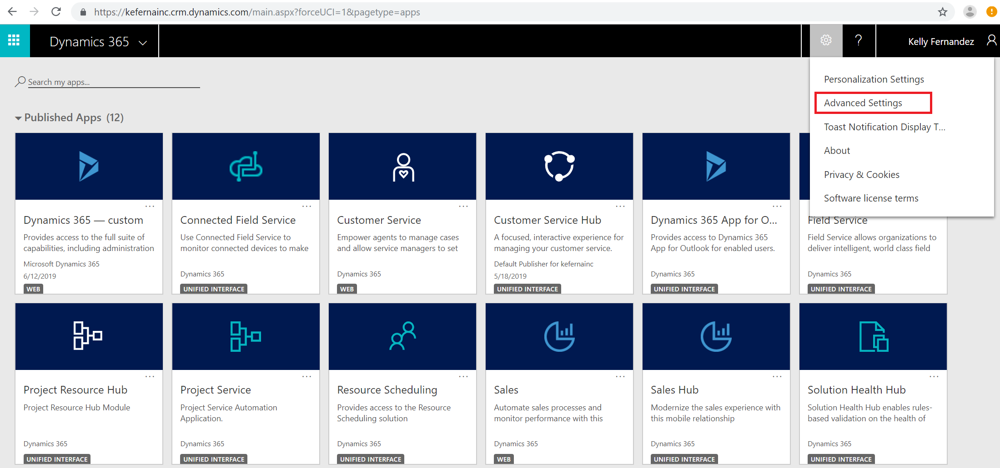

1. On the **Settings** page, open the **Settings** menu on the top bar and select **Solutions**.

    >[!NOTE]
    >If you don't see the options in the following screen, you don't have the permissions you need to proceed. Contact an admin on your Dynamics 365 Customer Engagement instance.

    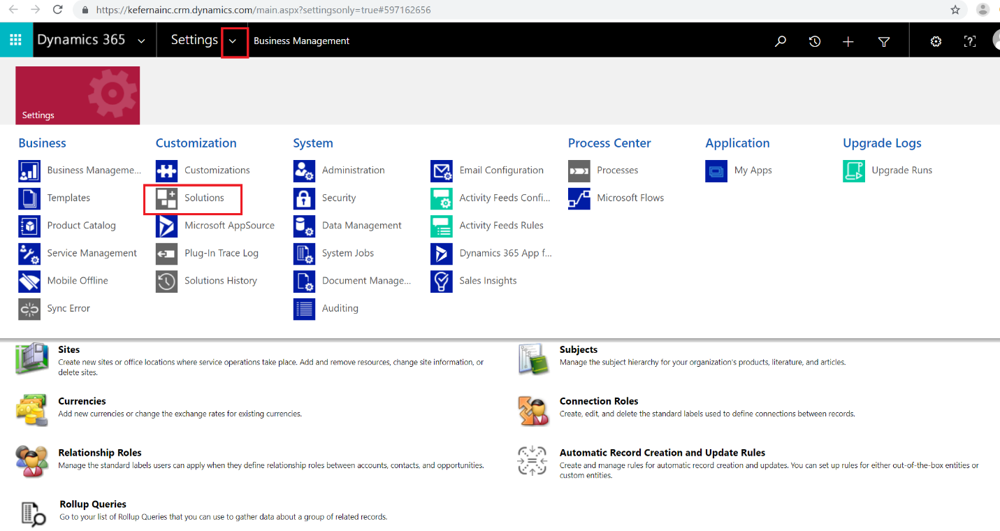

1. On the **Solutions** page, select **Import** and go to where you saved the **Microsoft Marketplace Lead Writer** solution that you downloaded in step 1.

    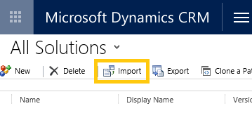

1. Complete importing the solution by following the Import solution wizard.

## Configure user permissions

To write leads into your Dynamics 365 Customer Engagement instance, you must share a service account with Microsoft and configure permissions for the account.

Use the following steps to create the service account and assign permissions. You can use Azure Active Directory or Office 365.

>[!NOTE]
>Skip to the corresponding instructions based on the authentication option you select. See [Azure Active Directory](https://docs.microsoft.com/azure/marketplace/partner-center-portal/commercial-marketplace-lead-management-instructions-dynamics#azure-active-directory) or [Office 365](https://docs.microsoft.com/azure/marketplace/partner-center-portal/commercial-marketplace-lead-management-instructions-dynamics#office-365).

### Azure Active Directory

We recommend this option because you never need to update your username or password to keep getting leads. To use the Azure Active Directory option, you provide the App ID, Application Key, and Directory ID from your Active Directory application.

To configure Azure Active Directory for Dynamics 365 Customer Engagement:

1. Sign in to the [Azure portal](https://portal.azure.com/). In the left pane, select **Azure Active Directory**.

1. Select **Properties**, and copy the **Directory ID** value on the **Directory properties** page. Save this value because you'll need to provide it in the publishing portal to receive leads for your marketplace offer.

    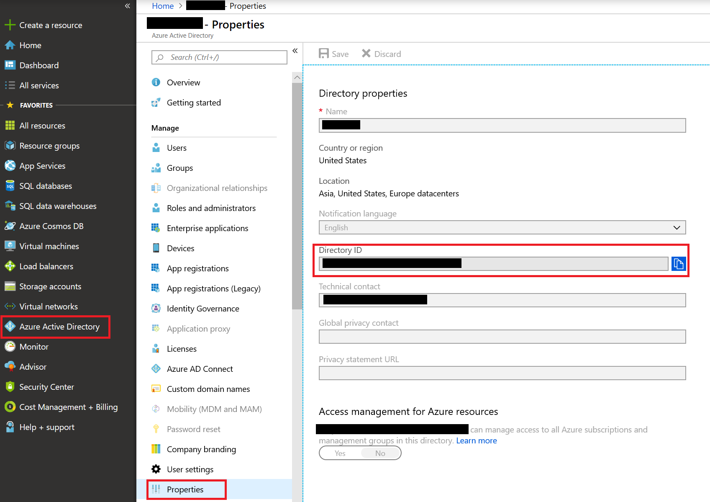

1. Select **App registrations** from the Azure Active Directory left pane, and then select **New registration** on that page.
1. Enter a meaningful name for the application name.
1. Under **Supported account types**, select **Accounts in any organizational directory**.
1. Under **Redirect URI (optional)**, select **Web** and enter a URI, such as `https://contosoapp1/auth`. 
1. Select **Register**.

    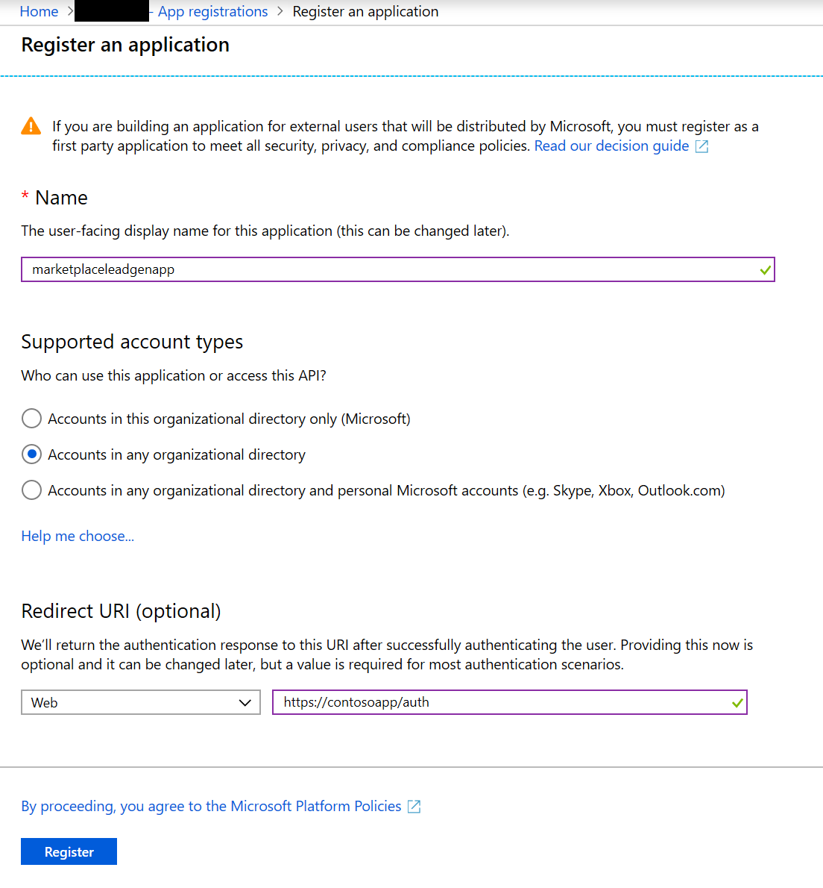

1. Now that your application is registered, access the application's overview page. Copy the **Application (client) ID** value on that page. Save this value because you'll need to provide it in the publishing portal and in Dynamics 365 to receive leads for your marketplace offer.

    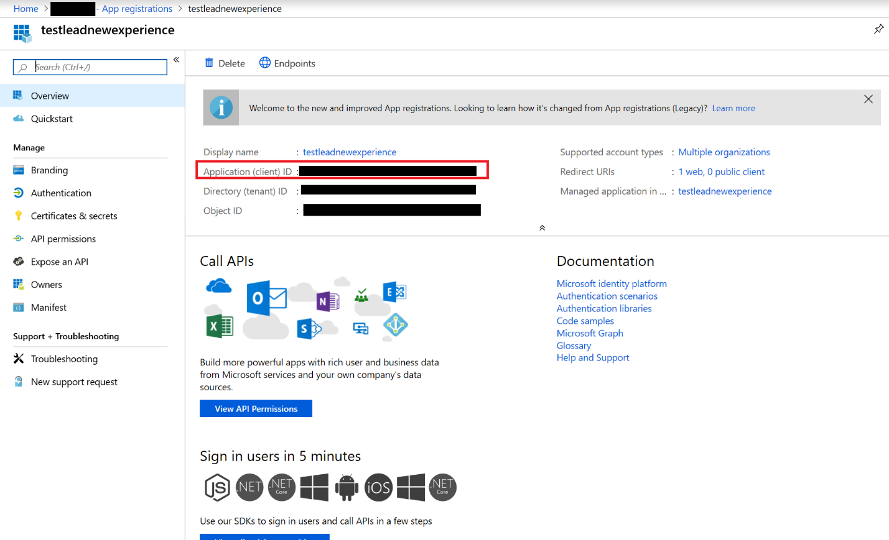

1. Select **Certificates & secrets** from the app's left pane, and select the **New client secret** button. Enter a meaningful description for the client secret, and select the **Never** option under **Expires**. Select **Add** to create the client secret.

    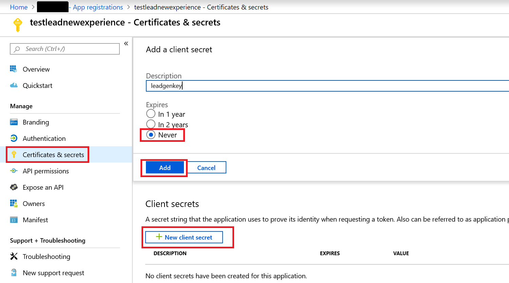

1. As soon as the client secret is successfully created, copy the **Client secret** value. You won't be able to retrieve the value after you leave the page. Save this value because you'll need to provide it in the publishing portal to receive leads for your marketplace offer. 
1. Select **API permissions** from the app's left pane, and then select **+ Add a permission**.
1. Select **Microsoft APIs**, and then select **Dynamics CRM** as the API.
1. Under **What type of permissions does your application require?**, make sure **Delegated permissions** is selected. 
1. Under **Permission**, select the **user_impersonation** check box for **Access Common Data Service as organization users**. Then select **Add permissions**.

    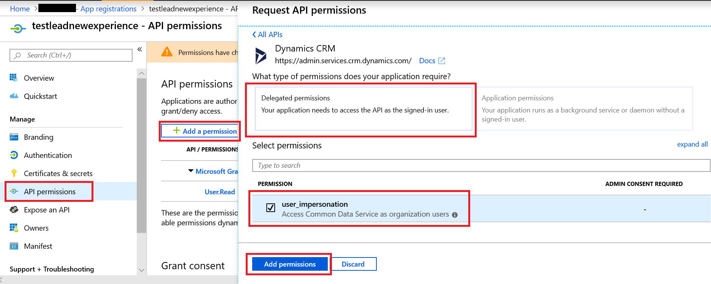

1. After you complete steps 1 through 14 in the Azure portal, go to your Dynamics 365 Customer Engagement instance by going to the URL, such as `https://tenant.crm.dynamics.com`.
1. Select the gear icon on the top bar, and then select **Advanced Settings**.
1. On the **Settings** page, open the **Settings** menu on the top bar and select **Security**.
1. On the **Security** page, select **Users**. On the **Users** page, select the **Enabled Users** drop-down and then select **Application Users**.
1. Select **New** to create a new user. 

    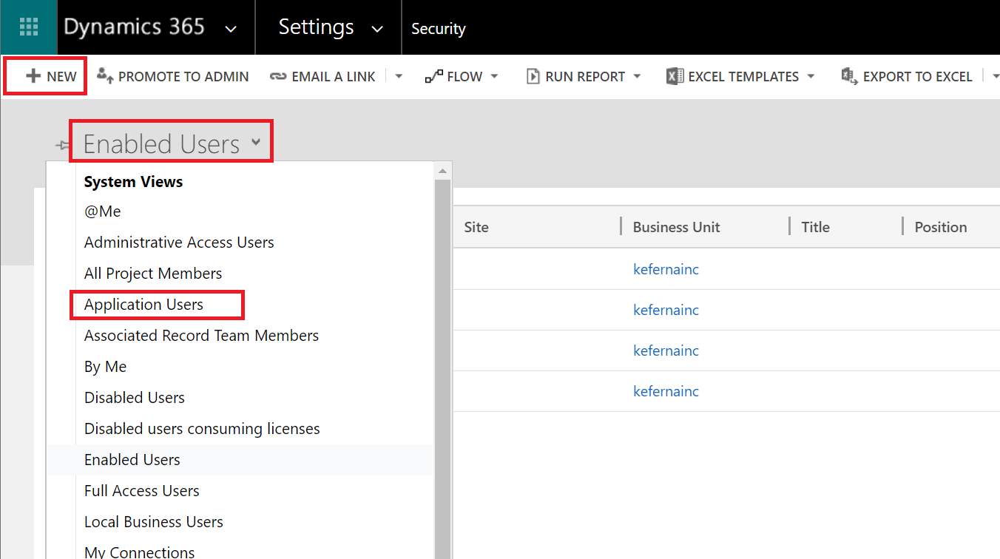

1. In the **New User** pane, make sure that **USER: APPLICATION USER** is selected. Provide a username, full name, and email address for the user that you want to use with this connection. Also, paste in the **Application ID** for the app you created in the Azure portal from step 8. Select **Save & Close** to finish adding the user.

    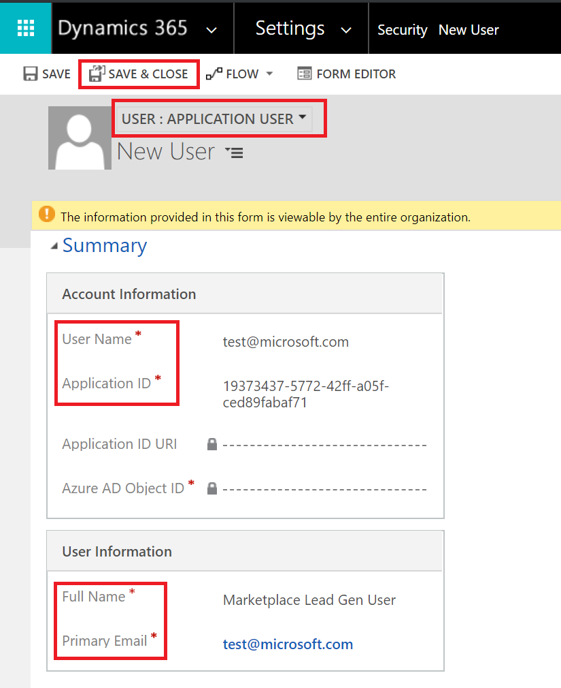

1. Go to the "Security settings" section in this article to finish configuring the connection for this user.

### Office 365

If you don't want to use Azure Active Directory, you can register a new user on the Microsoft 365 admin center. You'll be required to update your username and password every 90 days to continue getting leads.

To configure Office 365 for Dynamics 365 Customer Engagement:

1. Sign in to the [Microsoft 365 admin center](https://admin.microsoft.com).

1. Select **Add a user**.

    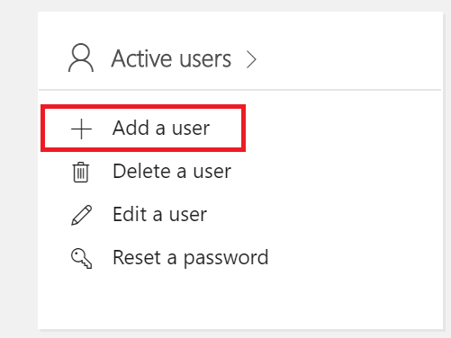

1. Create a new user for the lead writer service. Configure the following settings:

    * Enter a username.
    * Enter a password, and clear the **Make this user change their password when they first sign in** option.
    * Select **User (no administrator access)** as the role for the user.
    * Select **Dynamics 365 Customer Engagement Plan** as the product license, as shown in the following screen. You'll be charged for the license you choose. 

Save these values because you'll need to provide the **Username** and **Password** values in the publishing portal to receive leads for your marketplace offer.

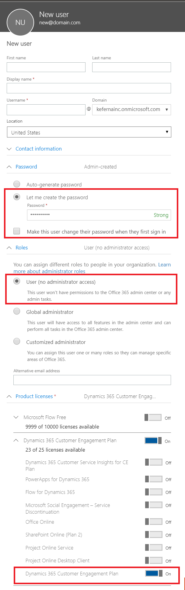

## Security settings

The final step is to enable the user you created to write the leads.

1. Open Dynamics 365 Customer Engagement by going to the URL for your Dynamics instance, such as `https://tenant.crm.dynamics.com`.
1. Select the gear icon on the top bar, and then select **Advanced Settings**.
1. On the **Settings** page, open the **Settings** menu on the top bar and select **Security**.
1. On the **Security** page, select **Users** and select the user that you created in the "Configure user permissions" section of this document. Then select **Manage Roles**. 

    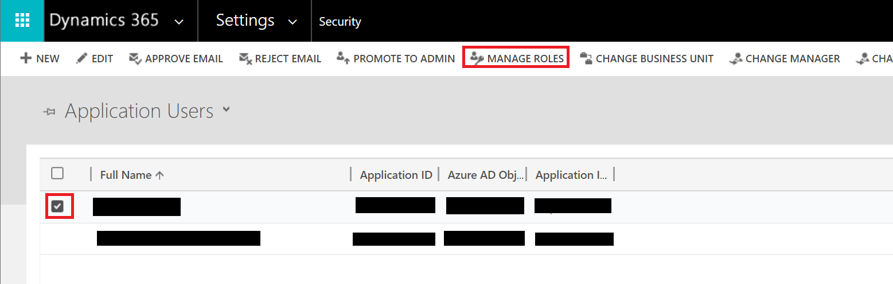

1. Search for the role name **Microsoft Marketplace Lead Writer**, and select it to assign the user the role.

    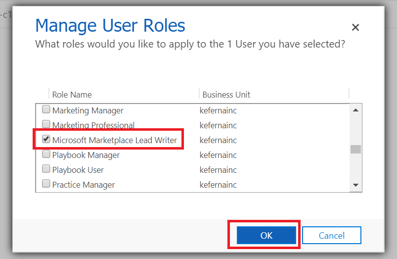

    >[!NOTE]
    >This role is created by the solution that you imported and only has permissions to write the leads and to track the solution version to ensure compatibility.

1. Go back to the **Security** page, and select **Security Roles**. Search for the role **Microsoft Marketplace Lead Writer**, and select it.

    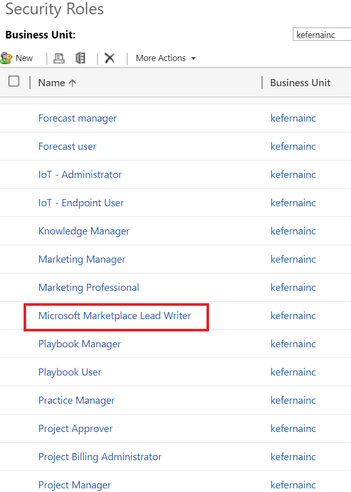

1. In the security role, select the **Core Records** tab. Search for the **User Entity UI Settings** item. Enable the Create, Read, and Write permissions to User (1/4 yellow circle) for that entity by clicking once in each of the corresponding circles.

    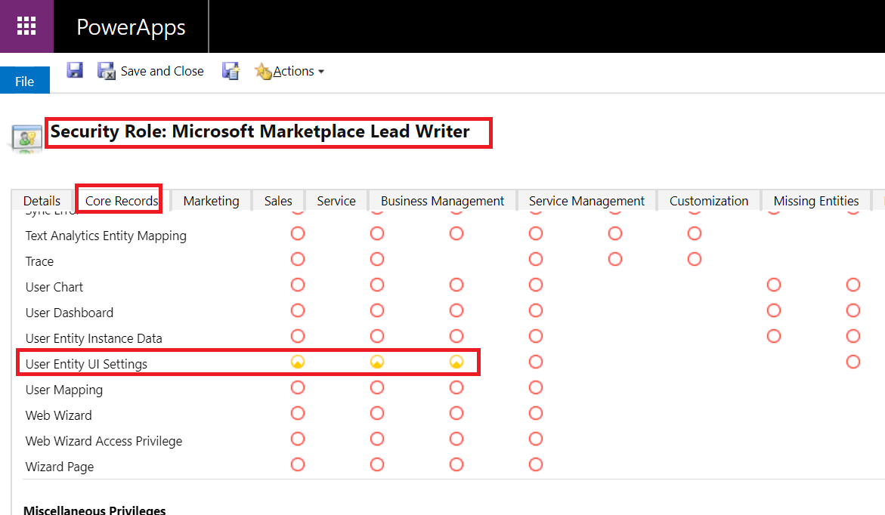

1. On the **Customization** tab, search for the **System Job** item. Enable the Read, Write, and AppendTo permissions to Organization (solid green circles) for that entity by clicking four times in each of the corresponding circles.

    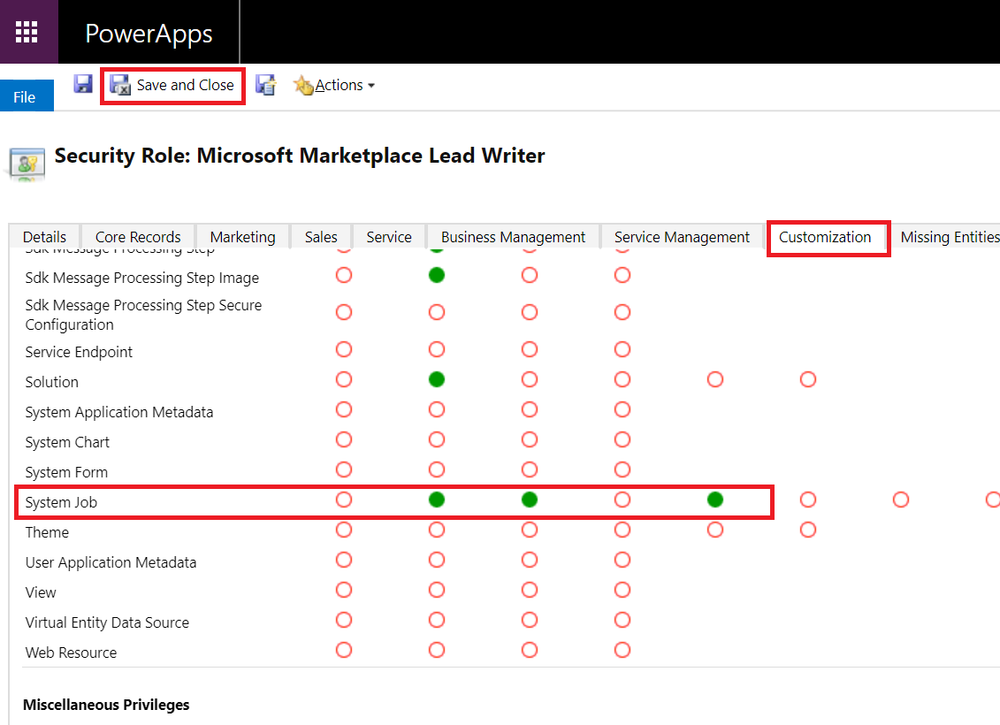

1. Select **Save and close**.

## Configure your offer to send leads to Dynamics 365 Customer Engagement 

To configure the lead management information for your offer in the publishing portal:

1. Go to the **Offer setup** page for your offer.
1. Under the **Customer leads** section, select **Connect**.

    :::image type="content" source="./media/commercial-marketplace-lead-management-instructions-dynamics/customer-leads.png" alt-text="Customer leads":::

1. In the Connection details pop-up window, select **Dynamics 365 Customer Engagement** for the lead destination.

    

1. Enter the **URL** for the Dynamics 365 instance, such as `https://contoso.crm4.dynamics.com`.

1. Select the method of **Authentication**, either Azure Active Directory or Office 365. 
1. If you selected **Azure Active Directory**, enter the **Application (client) ID** (for example, `23456052-aaaa-bbbb-8662-1234df56788f`), **Directory ID** (for example, `12345678-8af1-4asf-1234-12234d01db47`), and **Client secret** (for example, `1234ABCDEDFRZ/G/FdY0aUABCEDcqhbLn/ST122345nBc=`).

    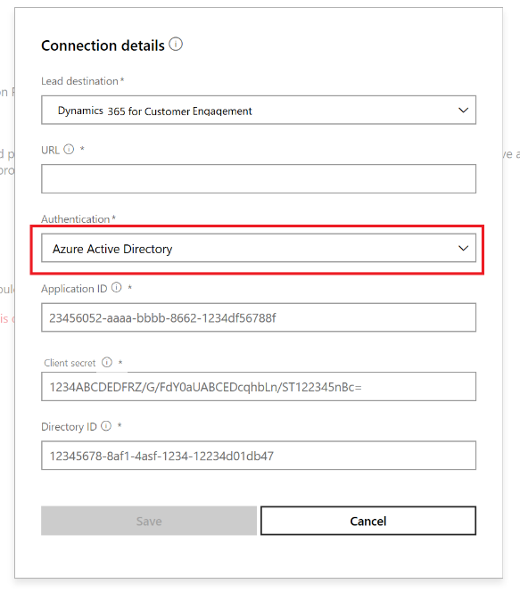

1. If you selected **Office 365**, enter the **User name** (for example, `contoso@contoso.onmicrosoft.com`) and **Password** (for example, `P@ssw0rd`).

    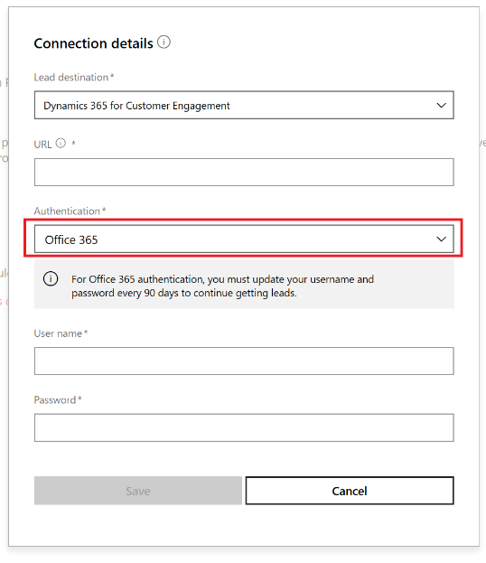

1. For **Contact email**, enter email addresses for people in your company who should receive email notifications when a new lead is received. You can enter multiple email addresses by separating them with semicolons.
1. Select **OK**.

To make sure you've successfully connected to a lead destination, select the **Validate** button. If successful, you'll have a test lead in the lead destination.

>[!NOTE]
>You must finish configuring the rest of the offer and publish it before you can receive leads for the offer.
