# Use an HTTPS endpoint to manage commercial marketplace leads

If your customer relationship management (CRM) system isn't explicitly supported in Partner Center to receive Microsoft AppSource and Azure Marketplace leads, you can use an HTTPS endpoint in [Power Automate](https://powerapps.microsoft.com/automate-processes/) to handle these leads. With an HTTPS endpoint, commercial marketplace leads can be sent out as an email notification or they can be written to a CRM system supported by Power Automate.

This article explains how to create a new flow in Power Automate to generate the HTTP POST URL that you'll use to configure leads in Partner Center. It also includes steps to test your flow with [Postman](https://www.getpostman.com/downloads/).

>[!NOTE]
>The Power Automate connector used in these instructions requires a paid subscription to Power Automate. Make sure you account for this before you configure this flow.

## Create a flow by using Power Automate

1. Open the [Power Automate](https://flow.microsoft.com/) webpage. Select **Sign in**. If you don't already have an account, select **Sign up free** to create a free Power Automate account.

1. Sign in, and select **My flows** in the menu.

    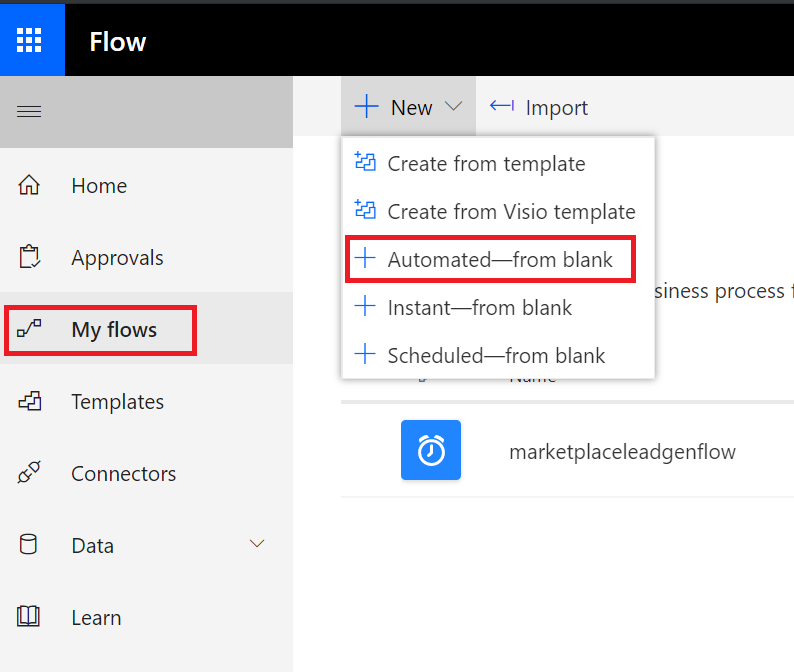

1. Under **+ New**, select **+ Instant—from blank**.

    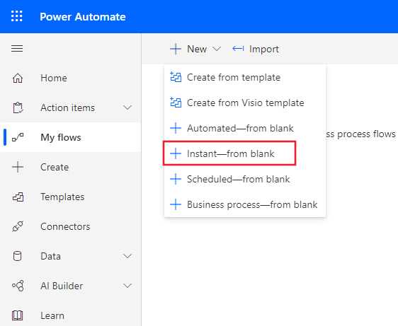

1. Name your flow, and then under **Choose how to trigger this flow**, select **When a HTTP request is received**.

    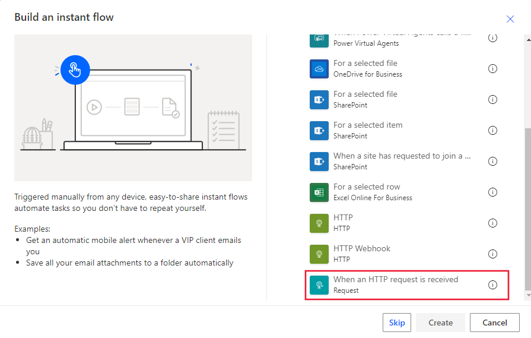

1. Click the flow step to expand it.

    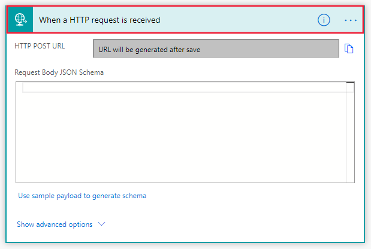

1. Use one of the following methods to configure the **Request Body JSON Schema**:

    - Copy the JSON schema into the **Request Body JSON Schema** text box.
    - Select **Use sample payload to generate schema**. In the **Enter or paste a sample JSON payload** text box, paste in the JSON example. Select **Done** to create the schema.

    **JSON schema**

    ```JSON
    {
      "$schema": "https://json-schema.org/draft-04/schema#",
      "definitions": {},
      "id": "http://example.com/example.json",
      "properties": {
        "ActionCode": {
          "id": "/properties/ActionCode",
          "type": "string"
        },
        "OfferTitle": {
          "id": "/properties/OfferTitle",
          "type": "string"
        },
        "LeadSource": {
          "id": "/properties/LeadSource",
          "type": "string"
        },
        "UserDetails": {
          "id": "/properties/UserDetails",
          "properties": {
            "Company": {
              "id": "/properties/UserDetails/properties/Company",
              "type": "string"
            },
            "Country": {
              "id": "/properties/UserDetails/properties/Country",
              "type": "string"
            },
            "Email": {
              "id": "/properties/UserDetails/properties/Email",
              "type": "string"
            },
            "FirstName": {
              "id": "/properties/UserDetails/properties/FirstName",
              "type": "string"
            },
            "LastName": {
              "id": "/properties/UserDetails/properties/LastName",
              "type": "string"
            },
            "Phone": {
              "id": "/properties/UserDetails/properties/Phone",
              "type": "string"
            },
            "Title": {
              "id": "/properties/UserDetails/properties/Title",
              "type": "string"
            }
          },
          "type": "object"
        }
      },
      "type": "object"
    }
    ```

    **JSON example**
    
    ```json
    {
      "UserDetails": {
        "FirstName": "Some",
        "LastName": "One",
        "Email": "someone@contoso.com",
        "Phone": "16175555555",
        "Country": "USA",
        "Company": "Contoso",
        "Title": "Esquire"
     },
      "LeadSource": "AzureMarketplace",
      "ActionCode": "INS",
      "OfferTitle": "Test Microsoft",
      "Description": "Test run through Power Automate"
    }
    ```

>[!NOTE]
>At this point in the configuration, you can select to either connect to a CRM system or configure an email notification. Follow the remaining instructions based on your choice.

### Connect to a CRM system

1. Select **+ New step**.
1. Choose the CRM system of your choice by searching for it where it says **Search connectors and actions**. Select it on the **Actions** tab with the action to create a new record. The following screen shows **Create a new record (Dynamics 365)** as an example.

    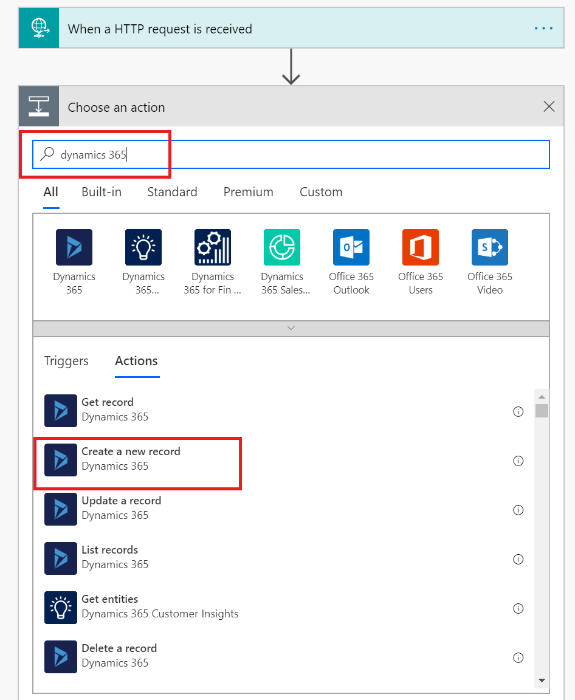

1. Provide the **Organization Name** associated with the CRM system. Select **Leads** from the **Entity Name** drop-down list.

    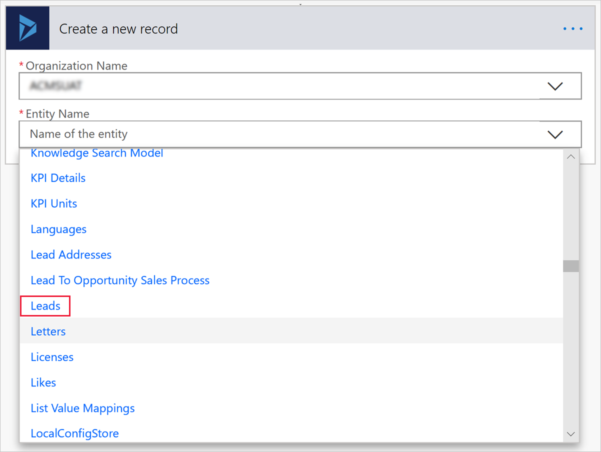

1. Power Automate shows a form for providing lead information. You can map items from the input request by choosing to add dynamic content. The following screen shows **OfferTitle** as an example.

    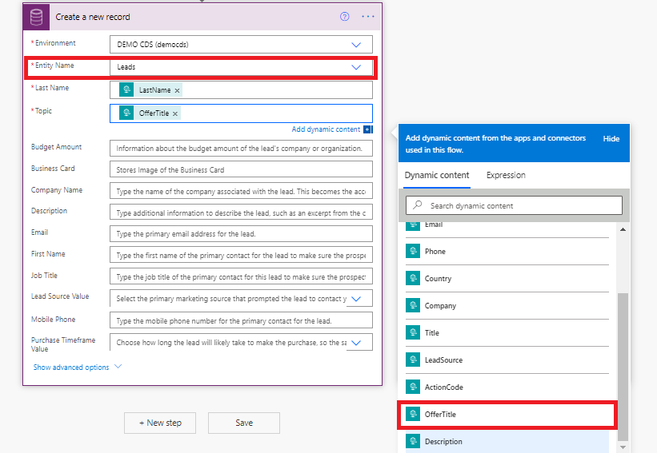

1. Map the fields you want, and then select **Save** to save your flow. An HTTP POST URL is created and is accessible in the **When an HTTP request is received** window. Copy this URL by using the copy control, which is located to the right of the HTTP POST URL. Using the copy control is important so that you don't miss any part of the entire URL. Save this URL because you'll need it when you configure lead management in the publishing portal.

    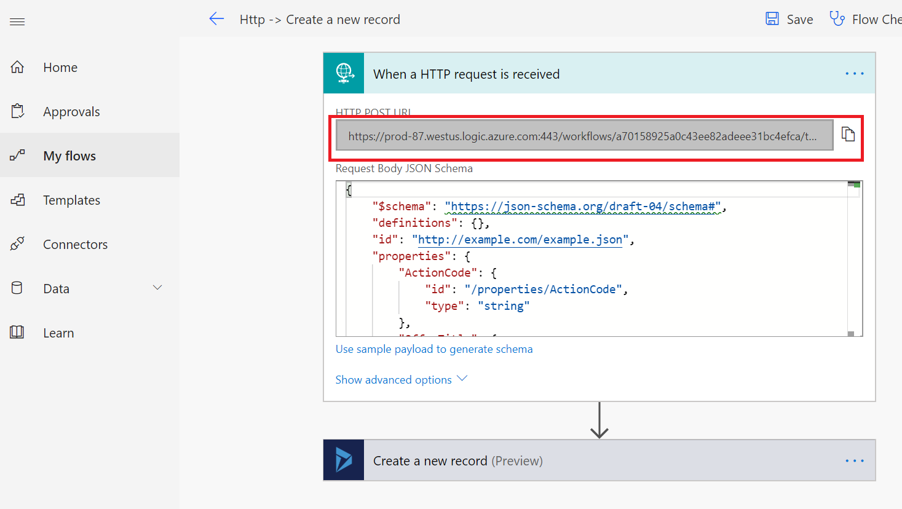

### Set up email notification

1. Now that you've finished the JSON schema, select **+ New step**.
1. Under **Choose an action**, select **Actions**.
1. On the **Actions** tab, select **Send an email (Office 365 Outlook)**.

    >[!NOTE]
    >If you want to use a different email provider, search for and select **Send an email notification (Mail)** as the action instead.

    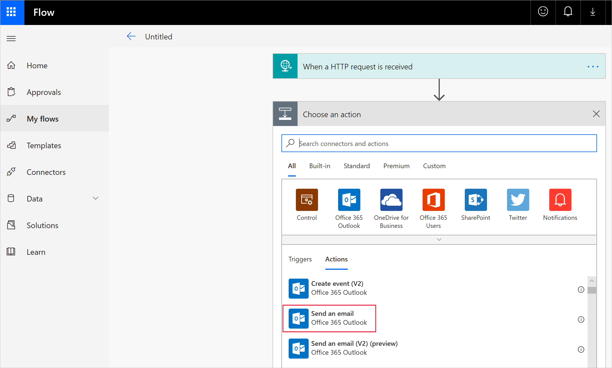

1. In the **Send an email** window, configure the following required fields:

   - **To**: Enter at least one valid email address where the leads will be sent.
   - **Subject**: Power Automate gives you the option of adding dynamic content, like **LeadSource** shown in the following screen. Start by entering a field name. Then select the dynamic content pick list from the pop-up window. 

        >[!NOTE] 
        > When you add field names, you can follow each name with a colon (:) and then select **Enter** to create a new row. After you have your field names added, you can then add each associated parameter from the dynamic pick list.

        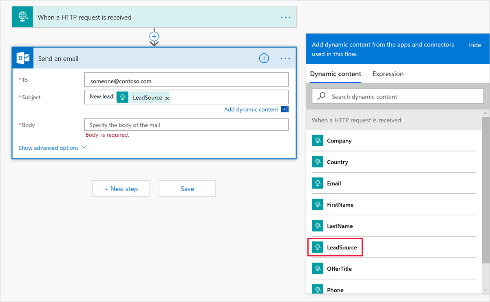

   - **Body**: From the dynamic content pick list, add the information you want in the body of the email. For example, use LastName, FirstName, Email, and Company. When you're finished setting up the email notification, it looks like the example in the following screen.


       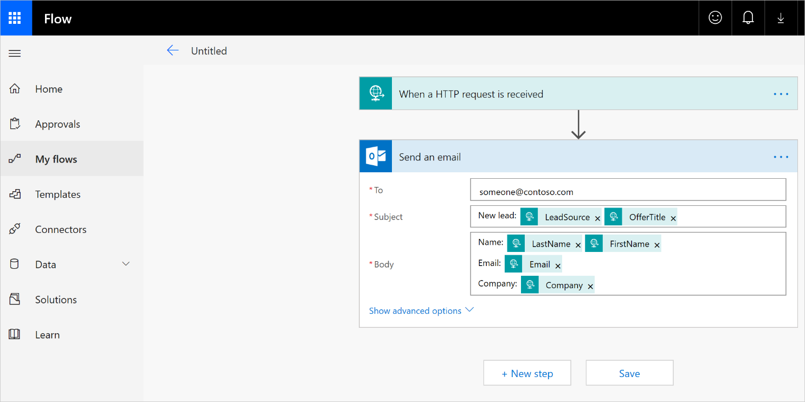

1. Select **Save** to finish your flow. An HTTP POST URL is created and is accessible in the **When an HTTP request is received** window. Copy this URL by using the copy control, which is located to the right of the HTTP POST URL. Using this control is important so that you don't miss any part of the entire URL. Save this URL because you'll need it when you configure lead management in the publishing portal.

   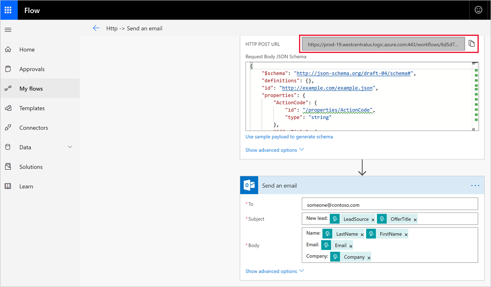

### Testing

You can test your configuration with [Postman](https://app.getpostman.com/app/download/win64). An online download of Postman is available for Windows. 

1. Start Postman, and select **New** > **Request** to set up your test tool. 

   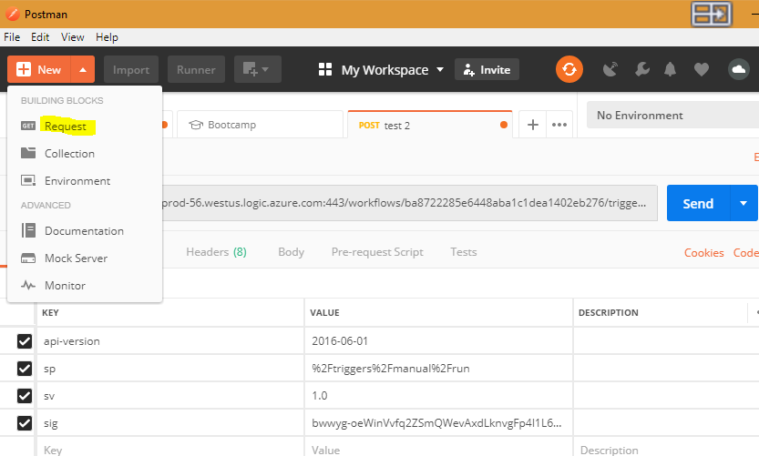

1. Fill in the **Save Request** form, and then save to the folder you created.

   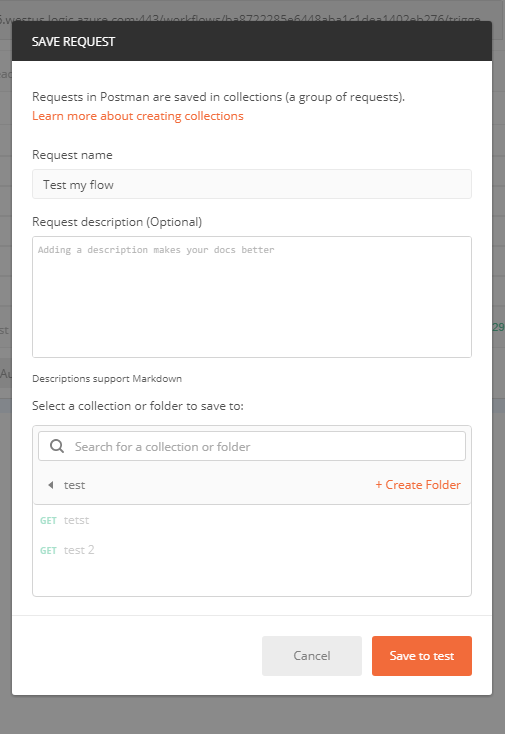

1. Select **POST** from the drop-down list. 

   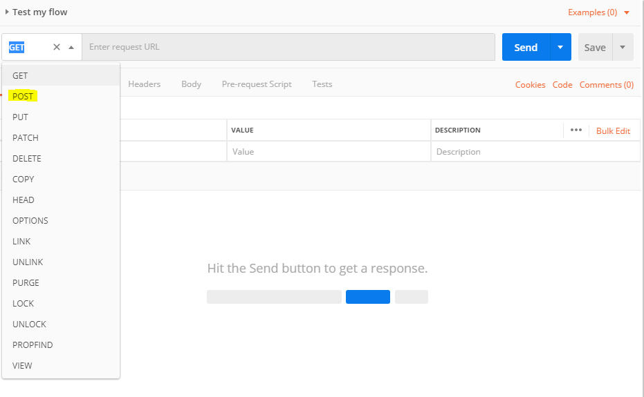

1. Paste the HTTP POST URL from the flow you created in Power Automate where it says **Enter request URL**.

   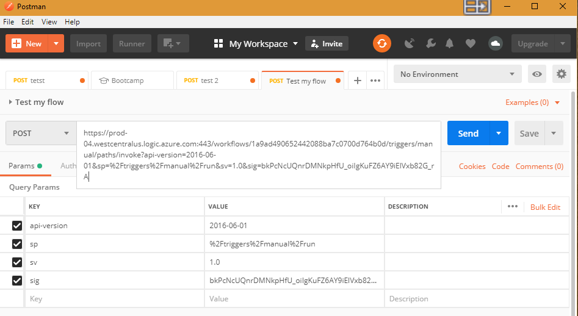

1. Go back to [Power Automate](https://flow.microsoft.com/). Find the flow you created to send leads by going to **My Flows** from the Power Automate menu bar. Select the ellipsis next to the flow name to see more options, and select **Edit**.


1. Select **Test** in the upper-right corner, select **I'll perform the trigger action**, and then select **Test**. You'll see an indication at the top of the screen that the test has started.

   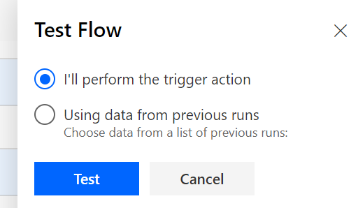

1. Go back to your Postman app, and select **Send**.

   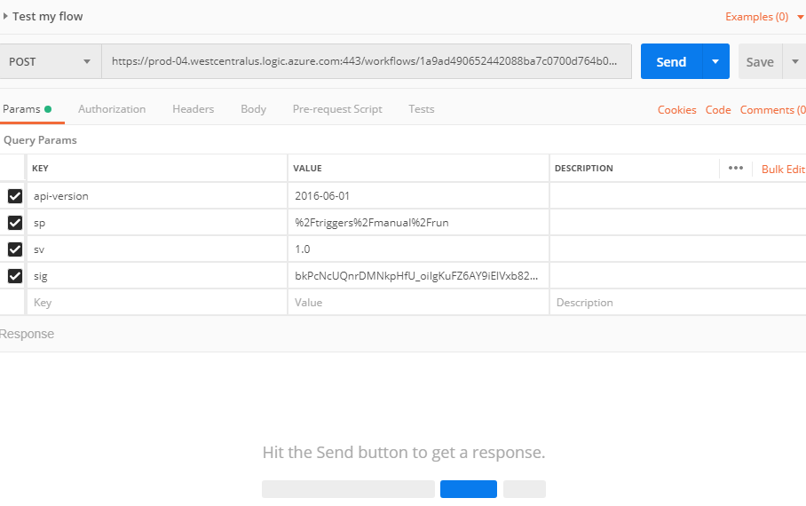

1. Go back to your flow and check the result. If everything works as expected, you'll see a message that indicates the flow was successful.

   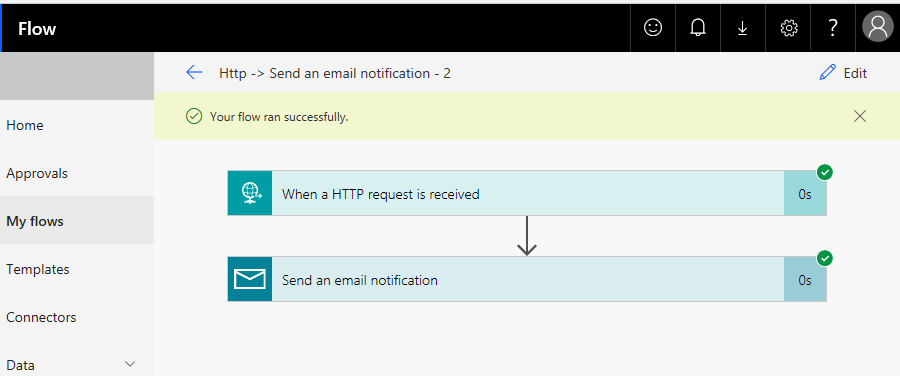

1. You should have also received an email. Check your email inbox. 

    >[!NOTE] 
    >If you don't see an email from the test, check your spam and junk folders. In the following screen, you'll notice just the field labels you added when you configured the email notification. If this were an actual lead generated from your offer, you would also see the actual information from the lead contact in the body and in the subject line.

   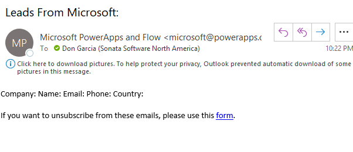

## Configure your offer to send leads to the HTTPS endpoint

When you're ready to configure the lead management information for your offer in the publishing portal, follow these steps.

1. Sign in to [Partner Center](https://partner.microsoft.com/dashboard/home).

1. Select your offer, and go to the **Offer setup** tab.

1. Under the **Customer leads** section, select **Connect**.

    :::image type="content" source="./media/commercial-marketplace-lead-management-instructions-https/customer-leads.png" alt-text="Customer leads":::

1. In the **Connection details** pop-up window, select **HTTPS Endpoint** for the **Lead Destination**. Paste the HTTP POST URL from the flow you created by following earlier steps into the **HTTPS endpoint URL** field.
    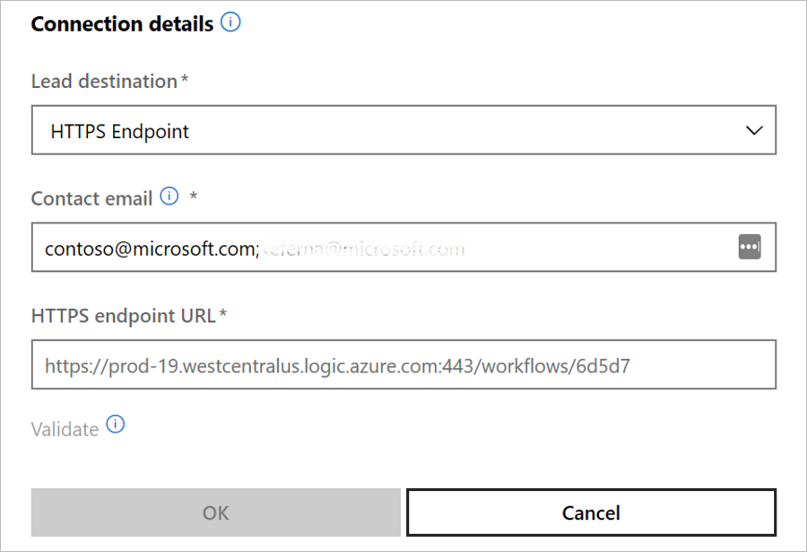

1. Under **Contact email**, enter email addresses for people in your company who should receive email notifications when a new lead is received. You can provide multiple emails by separating them with a semicolon.

1. Select **OK**.

To make sure you have successfully connected to a lead destination, select the **Validate** button. If successful, you'll have a test lead in the lead destination.

>[!NOTE] 
>You must finish configuring the rest of the offer and publish it before you can receive leads for the offer.

When leads are generated, Microsoft sends leads to the flow. The leads get routed to the CRM system or email address you configured.
