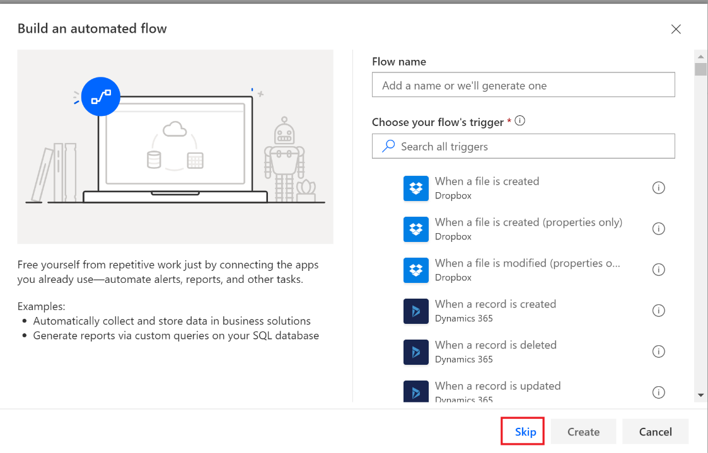
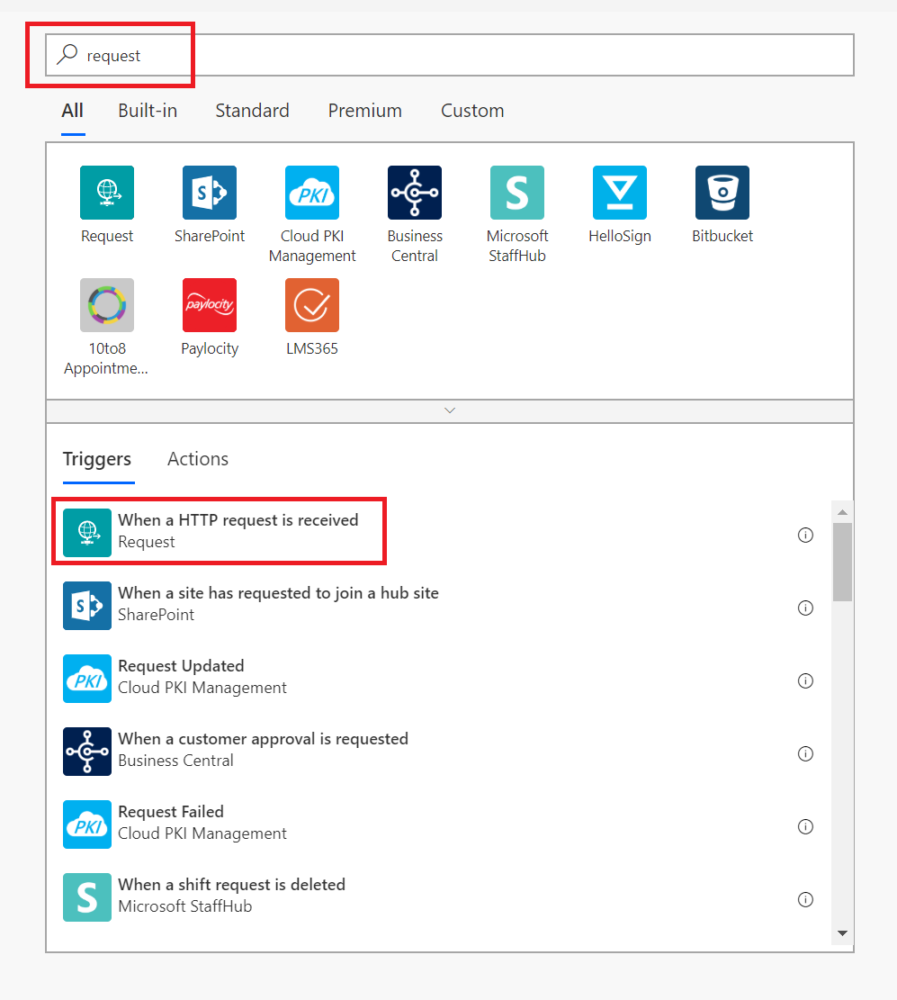
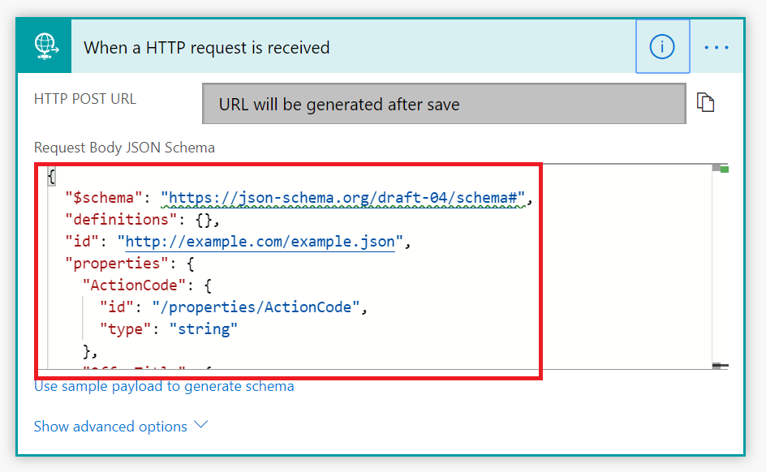
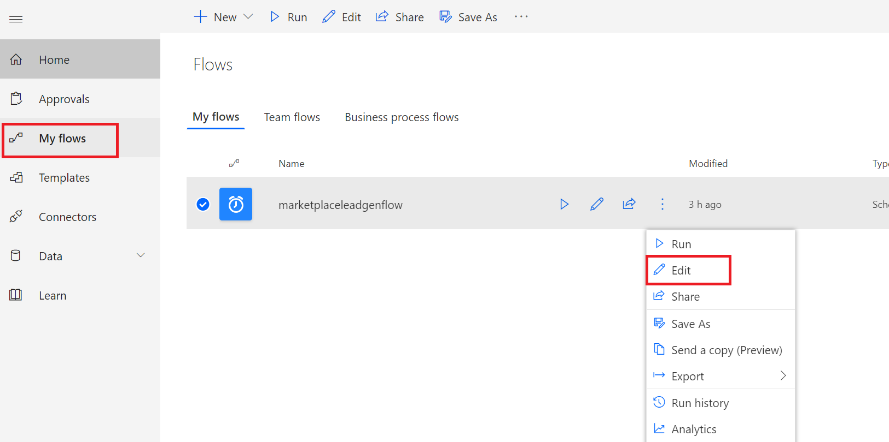
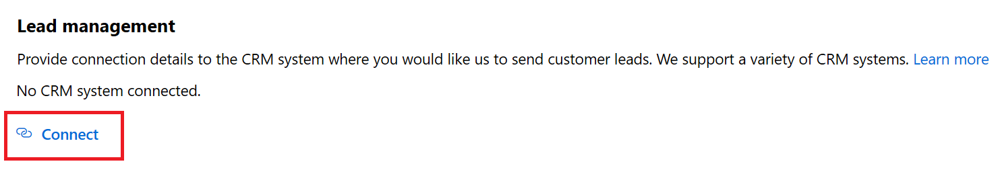
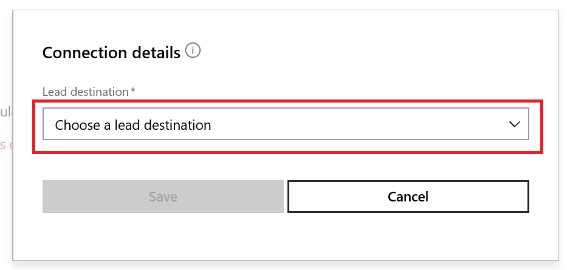

# Configure lead management using an HTTPS endpoint

>[!Note]
>The Power Automate connector used in these instructions requires a paid subscription to Power Automate. Please account for this before following the instructions in this document.

If your Customer Relationship Management (CRM) system is not explicitly supported in Partner Center for receiving Azure Marketplace and AppSource leads, you can use an HTTPS endpoint in Power Automate to handle these leads. With a HTTPS endpoint, these leads can be sent out as an email notification, or can be written to a Customer Relationship Management (CRM) system supported by Power Automate. The instructions in this article will walk you through the basic process to create a new flow using Power Automate, which will generate the HTTP POST URL that you will enter into the publishing portal for the Lead Management > **HTTPS Endpoint URL** field. Also, included are instructions on how you can test your flow with the help of a tool called [Postman](https://www.getpostman.com/downloads/) which can be found online.

## Create a flow using Power Automate

1. Open the [Flow](https://flow.microsoft.com/) webpage. Select **Sign in**, or if you don't already have an account, select **Sign up free** to create a free Flow account.

2. Sign in and select **My flows** on the menu bar.

3. Select **+Automated - from blank**.

    

4. In the *Build an automated flow* window, select **Skip**. 

    

5. In the **Search connectors and triggers** field, type "request" to find the Request connector.
6. Under *Triggers*, select **When a HTTP request is received**. 

    

7. On the *When a HTTP request is received* window copy and paste the JSON schema below into the **Request Body JSON Schema** text box. This schema is used by Microsoft to contain your lead data.

    

    **JSON schema**

    ```JSON
    {
      "$schema": "https://json-schema.org/draft-04/schema#",
      "definitions": {},
      "id": "http://example.com/example.json",
      "properties": {
        "ActionCode": {
          "id": "/properties/ActionCode",
          "type": "string"
        },
        "OfferTitle": {
          "id": "/properties/OfferTitle",
          "type": "string"
        },
        "LeadSource": {
          "id": "/properties/LeadSource",
          "type": "string"
        },
        "UserDetails": {
          "id": "/properties/UserDetails",
          "properties": {
            "Company": {
              "id": "/properties/UserDetails/properties/Company",
              "type": "string"
            },
            "Country": {
              "id": "/properties/UserDetails/properties/Country",
              "type": "string"
            },
            "Email": {
              "id": "/properties/UserDetails/properties/Email",
              "type": "string"
            },
            "FirstName": {
              "id": "/properties/UserDetails/properties/FirstName",
              "type": "string"
            },
            "LastName": {
              "id": "/properties/UserDetails/properties/LastName",
              "type": "string"
            },
            "Phone": {
              "id": "/properties/UserDetails/properties/Phone",
              "type": "string"
            },
            "Title": {
              "id": "/properties/UserDetails/properties/Title",
              "type": "string"
            }
          },
          "type": "object"
        }
      },
      "type": "object"
    }
    ```

>[!Note]
>At this point in the configuration you can select to either connect to a CRM system or configure an email notification. Follow the remaining instructions based on your choice.

### To connect to a CRM system

1. Select **+ New step**.
2. Choose the CRM system of your choice by searching for it where it says *Search connectors and actions*, and select it under the *Actions* section with the action to create a new record. The following screen capture shows **Dynamics 365 - Create** a new record as an example.

    

3. Provide the **Organization Name** associated with the CRM system. Select **Leads** from the **Entity Name** dropdown list.

    

4. Flow shows a form for providing lead information. You can map items from the input request by choosing to add Dynamic Content. The following screen capture shows **OfferTitle** as an example.

    

5. Map the fields you want and then select **Save** to save your flow. An HTTP POST URL is created, and is accessible in the *When an HTTP request is received* window. Copy this URL by using the copy control which is located to the right of the HTTP POST URL - this is important so that you do not mistakenly miss any part of the entire URL. Save this URL as you will need it when you are configuring lead management in the publishing portal.

    

### To set up email notification

1. Now that you have completed the JSON schema, select **+ New step**.
2. Under **Choose an action**, select **Actions**.
3. Under **Actions**, select **Send an email (Office 365 Outlook)**.

    >[!Note]
    >If you want to use a different email provider search for and select *Send an email notification (Mail)* as the action instead.

    

4. In **Send an email** window, configure the following required fields:

   - **To** - Enter at least one valid email address, where the leads will be sent.
   - **Subject** - Flow gives you the option of adding Dynamic content, like **LeadSource** in the following screen capture. Start by typing in a field name followed by clicking on the Dynamic Content pick list from the popup window. 

        >[!Note] 
        > When adding field names, you can follow each with a ":" and then Enter to create a new row. Once you have your field names added you can then add each associated parameter from the dynamic pick list.

        

   - **Body** - From the Dynamic Content pick list, add the information you want in the body of the email. For example, LastName, FirstName, Email, and Company. <br> <br> When you're finished setting up the email notification, it will look like the example in the following screen capture.


       

5. Select **Save** to finish your flow. An HTTP POST URL is created and is accessible in the *When an HTTP request is received* window. Copy this URL by using the copy control which is located to the right of the HTTP POST URL - this is important so that you do not mistakenly miss any part of the entire URL. Save this URL as you will need it when you are configuring lead management in the publishing portal.

   

### Testing

You can test that everything works as expected using the following steps using a tool called [Postman](https://app.getpostman.com/app/download/win64), which can be downloaded online. This is available for Windows. 

1. Launch Postman and select **New** > **Request** to set up your test tool. 

   

2. Fill in the *Save Request* form and then **Save** to the folder you created.

   

3. Select **POST** from the drop-down list. 

   

4. Paste the HTTP POST URL from the flow you created in Power Automate where it says *Enter request URL*.

   

5. Go back to [Flow](https://flow.microsoft.com/) and find the flow you created to send leads, by going to **My Flows** from the Flow menu bar.  Select the 3 dots next to the flow name and select **Edit**.

   

6. Select **Test** in the upper right-hand corner, select "I'll perform the trigger action" then select **Test**. You will see an indication in the top of the screen indicating that the test has started

   

7. Go back to your Postman app and select **Send** next to the where you pasted the HTTPS URL.

   

8. Go back to your flow and check the result. If everything works as expected you will see a message indicating it was successful.

   

9. You should have also received an email. Check your email inbox. 

    >[!Note] 
    >If you do not see an email from the test, then check your spam and junk folders. Below you will notice just the field labels you added when configuring the email notification. If this were an actual lead generated from your offer, you would also see the actual information from the Lead Contact in the body and in the Subject line.

   

## Configure your offer to send leads to the HTTPS endpoint

When you are ready to configure the lead management information for your offer in the publishing portal, follow the below steps:

1. Navigate to the **Offer setup** page for your offer.
2. Select **Connect** under the Lead Management section.
3. On the Connection details pop-up window, select **HTTPS Endpoint** for the **Lead Destination** and paste in the HTTP POST URL from the flow you created by following earlier steps into the **HTTPS endpoint URL** field.
4. **Contact email** - Provide emails for people in your company who should receive email notifications when a new lead is received. You can provide multiple emails by separating them with a semicolon.
5. Select **OK**.

To make sure you have successfully connected to a lead destination, click on the validate button. If successful, you will have a test lead in the lead destination.

>[!Note] 
>You must finish configuring the rest of the offer and publish it before you can receive leads for the offer.

When leads are generated, Microsoft sends leads to the Flow, which get routed to the CRM system or email address you configured.






