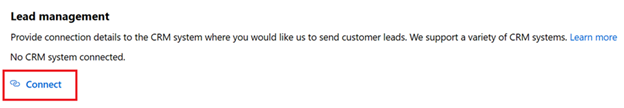

# Configure lead management in Marketo

This article describes how to set up your Marketo CRM system to process sales leads from your marketplace offer.

1. Sign in to Marketo.
2. Select **Design Studio**.
    

3.  Select **New Form**.
    

4.  Fill the required fields in the New Form and then select **Create**.
    

5.  On Field Details, select **Finish**.
    

6.  Approve and Close.

7. On the *MarketplaceLeadBacked* tab, select **Embed Code**. 

    

8. Marketo Embed Code displays code similar to the following example.

    ```
    <script src="//app-ys12.marketo.com/js/forms2/js/forms2.min.js"></script>
    ```

    Copy 
    ```
    <form id="mktoForm_1179"></form>
    <script>MktoForms2.loadForm("("//app-ys12.marketo.com", "123-PQR-789", 1179);</script>
    ```

9. Copy the values shown in Embed Code. You will use these values to configure your offer to receive leads in the next step. Use the next example as a guide for getting the Ids you need from the Marketo Embed Code example.

    - Server ID = **ys12**
    - Munchkin ID = **123-PQR-789**
    - Form ID = **1179**\

    **Another way to figure out these values**

    - Server ID is found in the URL of your Marketo instance,  for example, "`serverID.marketo.com`".
    - Get your subscription’s Munchkin ID by going to your Admin>Munchkin menu in the “Munchkin Account ID” field, or from the first part of your Marketo REST API host subdomain: `https://{Munchkin ID}.mktorest.com`.
    - Form ID is the ID of the Embed Code form you created in step 7 to route leads from our marketplace.

## Configure your offer to send leads to Marketo

When you are ready to configure the lead management information for your offer in the publishing portal, follow the below steps: 

1. Navigate to the **Offer setup** page for your offer.
1. Select **Connect** under the Lead Management section. 

    

1. On the Connection details pop-up window, select **Marketo** for the Lead Destination.

    

4. Provide the **Server Id**, **Munchkin account Id**, and **Form Id**.

    >[!Note]
    >You must finish configuring the rest of the offer and publish it before you can receive leads for the offer. 

