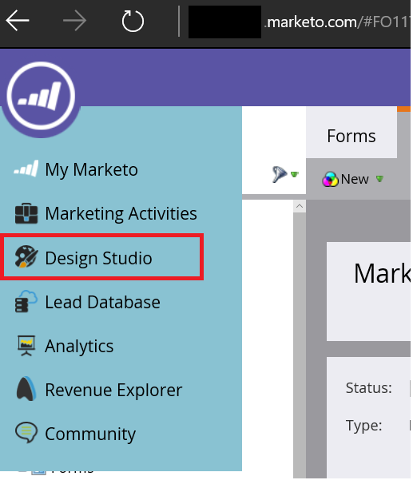
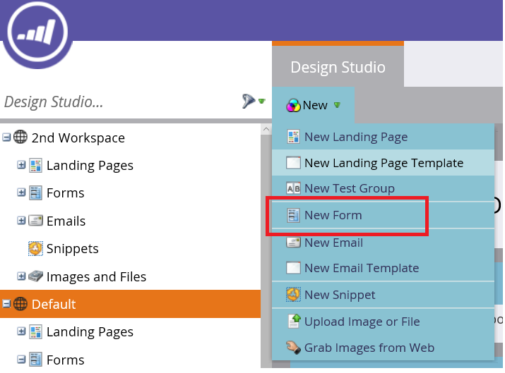
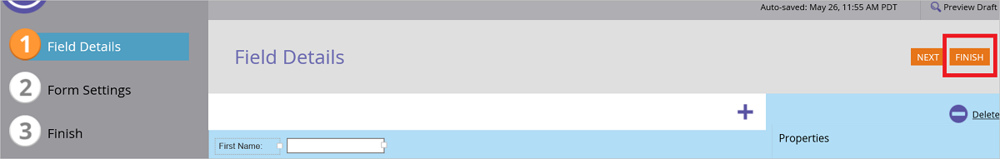
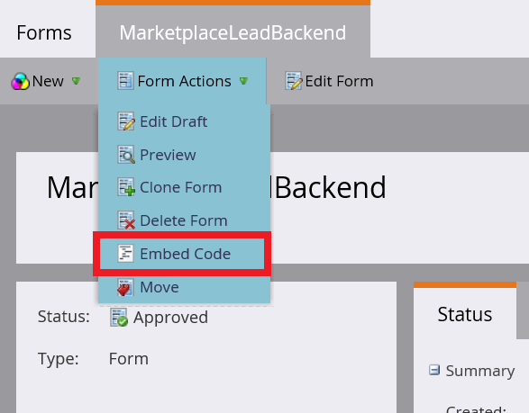
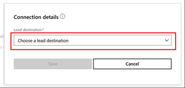
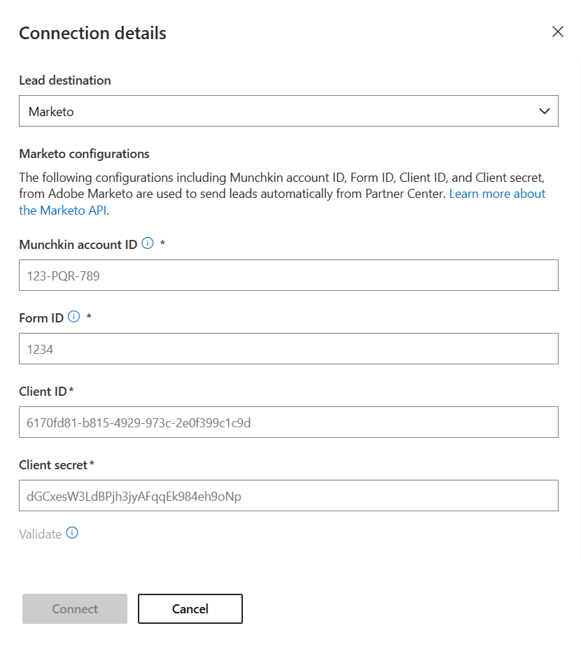

# Use Marketo to manage commercial marketplace leads

This article describes how to set up your Marketo CRM system to process sales leads from your offers in Microsoft AppSource and Azure Marketplace.

## Set up your Marketo CRM system

1. Sign in to Marketo.

1. Select **Design Studio**.

    

1.  Select **New Form**.

    

1.  Fill in the required fields in the **New Form** dialog box, and then select **Create**.

    

1.  On the **Field Details** page, select **Finish**.

    

1.  Approve and close.

1. On the **MarketplaceLeadBackend** tab, select **Embed Code**. 

    

1. Marketo Embed Code displays code similar to the following example.

    ```html
    <form id="mktoForm_1179"></form>
    <script>MktoForms2.loadForm("("//app-ys12.marketo.com", "123-PQR-789", 1179);</script>
    ```

1. Copy the values for the following fields shown in the Embed Code form. You'll use these values to configure your offer to receive leads in the next step. Use the next example as a guide for getting the IDs you need from the Marketo Embed Code example.

    - Server ID = **ys12**
    - Munchkin ID = **123-PQR-789**
    - Form ID = **1179**

    Another way to figure out these values:

    - Server ID is found in the URL of your Marketo instance, for example, `serverID.marketo.com`.
    - Get your subscription's Munchkin ID by going to your **Admin** > **Munchkin** menu in the **Munchkin Account ID** field, or from the first part of your Marketo REST API host subdomain: `https://{Munchkin ID}.mktorest.com`.
    - Form ID is the ID of the Embed Code form you created in step 7 to route leads from the marketplace.

## Configure your offer to send leads to Marketo

When you're ready to configure the lead management information for your offer in the publishing portal, follow these steps. 

1. Sign in to [Partner Center](https://partner.microsoft.com/dashboard/home).

1. Select your offer, and go to the **Offer setup** tab.

1. Under the **Customer leads** section, select **Connect**.

    :::image type="content" source="./media/commercial-marketplace-lead-management-instructions-marketo/customer-leads.png" alt-text="Customer leads":::

1. On the **Connection details** pop-up window, select **Marketo** for the **Lead destination**.

    

1. Provide the **Server ID**, **Munchkin account ID**, and **Form ID**.

    > [!NOTE]
    > You must finish configuring the rest of the offer and publish it before you can receive leads for the offer. 

1. Under **Contact email**, enter email addresses for people in your company who should receive email notifications when a new lead is received. You can provide multiple email addresses by separating them with a semicolon.

1. Select **OK**.

   To make sure you've successfully connected to a lead destination, select **Validate**. If successful, you'll have a test lead in the lead destination.

   
