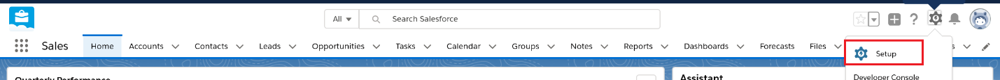
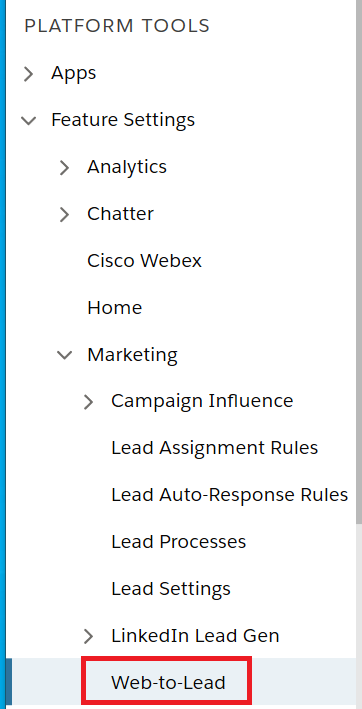
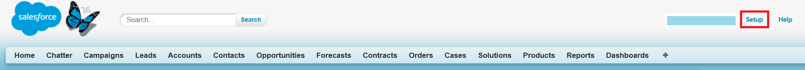
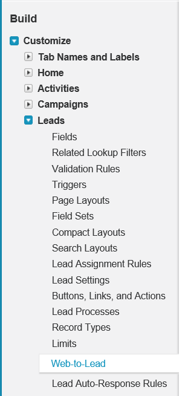
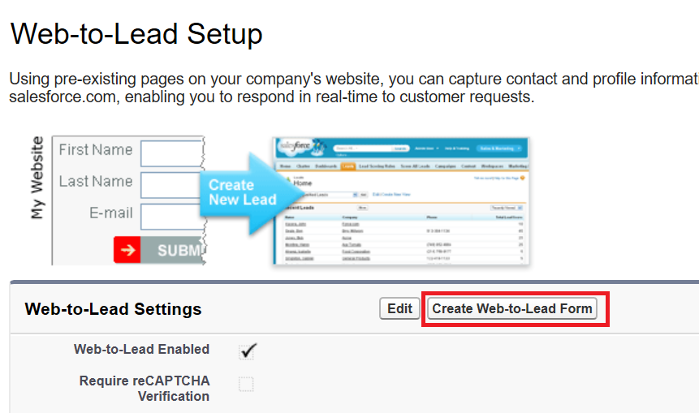
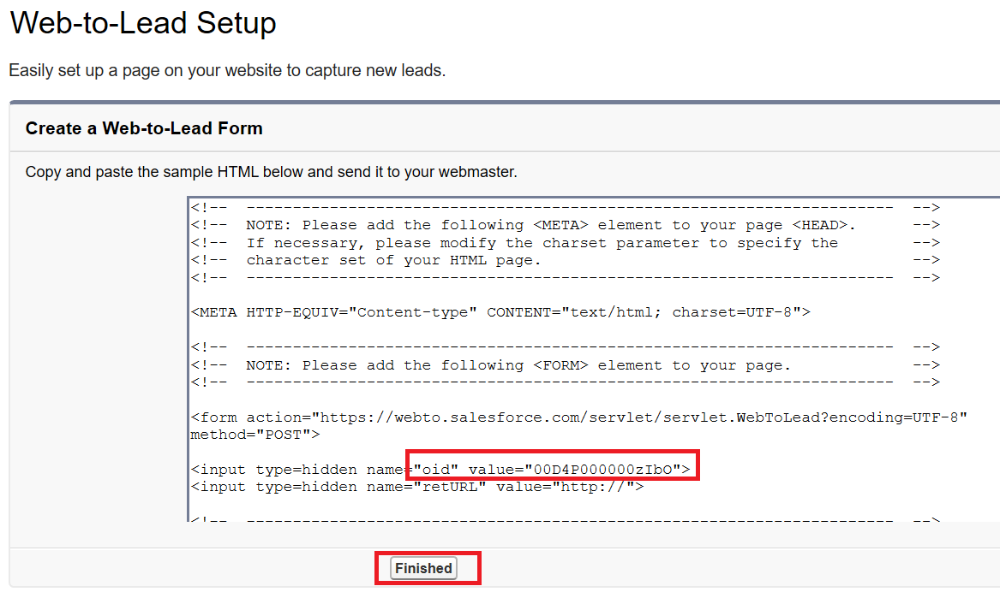
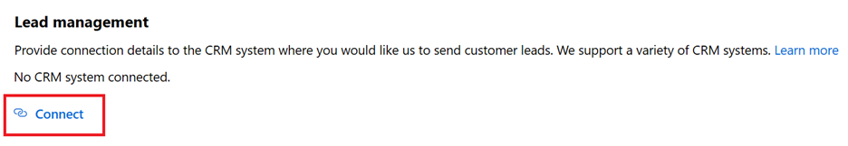
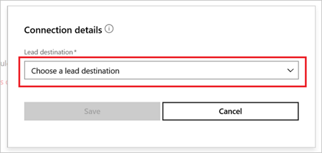

# Configure lead management for Salesforce

This article describes how to set up your Salesforce system to process sales leads from your commercial marketplace offer.

> [!Note]
> Marketplace does not support pre-populated lists, such as a list of values for the **Country** field. Make sure there are no lists set up before you continue. Alternatively, you can configure an [HTTPS endpoint](./commercial-marketplace-lead-management-instructions-https.md) or an [Azure table](./commercial-marketplace-lead-management-instructions-azure-table.md) to receive leads.

## Set up your Salesforce system

1. Sign in to Salesforce.
2. If you are using the Salesforce lighting experience.
    1. Select **Setup** from Salesforce Home page.
    

    1. From the Setup page, navigate via the left navigation to **Platform Tools->Feature Settings->Marketing->Web-to-Lead**.

        

3. If you are using the Salesforce Classic experience:
    1. Select **Setup** from Salesforce Home page.
    

    1. From the Setup page, navigate via the left navigation to **Build ->Customize->Leads->Web-to-Lead**.

        

The rest of the instructions are the same irrespective of which Salesforce experience you are using.

4. On the **Web-to-Lead Setup page**, select the **Create Web-to-Lead Form** button.
5. On **Web-to-Lead Setup**, select **Create Web-to-Lead Form**.
    

6. On the **Create a Web-to-Lead Form**, make sure `the Include reCAPTCHA in HTML` setting is unchecked and select **Generate**. 
    

7. You will be presented with some HTML text. Search for the text "oid" and copy the **oid value** from the HTML text (only the text in between quotation marks) and save it. You'll paste this value in the **Organization Identifier** field on the publishing portal.
    

8. Selected **Finished**.

## Configure your offer to send leads to Salesforce

When you are ready to configure the lead management information for your offer in the publishing portal, follow the below steps:

1. Navigate to the **Offer setup** page for your offer.
1. Select **Connect** under the Lead Management section.
    

1. On the Connection details pop-up window, select **Salesforce** for the **Lead Destination** and paste in the `oid` from web-to-lead form you created by following earlier steps into the **Organization identifier** field.

1. **Contact email** - Provide emails for people in your company who should receive email notifications when a new lead is received. You can provide multiple emails by separating them with semicolon.

1. Select **Ok**.

To make sure you have successfully connected to a lead destination, click on the validate button. If successful, you will have a test lead in the lead destination.

>[!Note]
>You must finish configuring the rest of the offer and publish it before you can receive leads for the offer.

