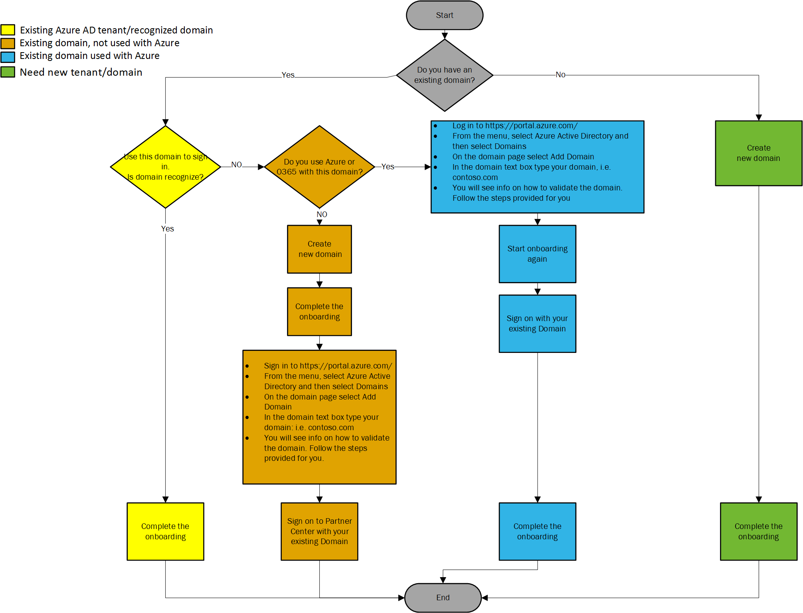

# Company work accounts and Partner Center

Partner Center uses company work accounts, also known as Azure Active Directory (AD) tenants, to manage account access for multiple users, control permissions, host groups and applications, and maintain profile data. By linking your company's work email account domain to your Partner Center account, employees of your company can sign in to Partner Center to manage marketplace offers using their own work account usernames and passwords.

## Check whether your company already has a work account

If your company has subscribed to a Microsoft cloud service such as Azure, Microsoft Intune, or Office 365, then you already have a work email account domain (also referred to as an Azure Active Directory tenant) that can be used with Partner Center.

Follow these steps to check:
1. Sign in to the Azure admin portal at https://portal.azure.com.
2. Select **Azure Active Directory** from the left-navigation menu and then select **Custom domain names**.
3. If you already have a work account, your domain name will be listed.

If your company doesn’t already have a work account, one will be created for you during the Partner Center enrollment process.

## Set up multiple work accounts

Before deciding to use an existing work account, consider how many users in the work account will need to access Partner Center. If you have users in the work account who won’t need to access Partner Center, you may want to consider creating multiple work accounts, so that only those users who will need to access Partner Center are represented on a particular account.

## Create a new work account

To create a new work account for your company, follow the steps below. You may need to request assistance from whoever has administrative permissions on your company's Microsoft Azure account.

1. Sign in to the [Microsoft Azure portal](https://portal.azure.com).
2. From the left navigation menu, select the **Azure Active Directory** -> **Users**.
3. Select **New user** and create a new Azure work account by entering a name and email address. Ensure that the **Directory role** is set to **User** and select the **Show Password** checkbox at the bottom to view and make a note of the autogenerated password.
4. Select **Create** to save the new user.

The email address for the user account must be a verified domain name in your directory. You can list all the verified domains in your directory by selecting **Azure Active Directory** -> **Custom domain names** in the left-navigation menu.

To learn more about adding custom domains in Azure Active Directory, see [Add or associate a domain in Azure AD](https://docs.microsoft.com/azure/active-directory/active-directory-add-domain).

## Troubleshoot work email sign-in

If you’re having trouble signing in to your work account (also known as your Azure AD tenant), find the scenario on the diagram below that best matches your situation and follow the recommended steps.

## Next steps

- [Manage your Commercial Marketplace account in Partner Center](./manage-account.md) 
