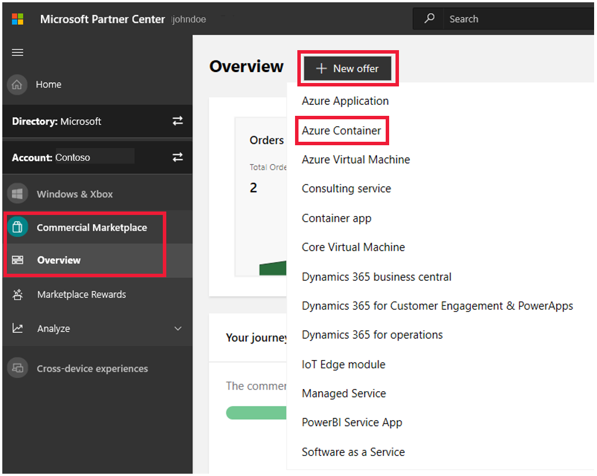

# Create an Azure container offer in Azure Marketplace

This article describes how to create and publish a container offer for Azure Marketplace. Before starting, [Create a Commercial Marketplace account in Partner Center](create-account.md) if you haven't done so yet. Ensure your account is enrolled in the commercial marketplace program.

## Create a new offer

1. Sign in to [Partner Center](https://partner.microsoft.com/dashboard/home).

2. In the left-nav menu, select **Commercial Marketplace** > **Overview**.

3. On the Overview page, select **+ New offer** > **Azure Container**.

   

> [!TIP]
> After an offer is published, edits made to it in Partner Center only appear in storefronts after republishing the offer. Make sure you always republish after making changes.

### Offer ID and alias

Enter an **Offer ID**. This is a unique identifier for each offer in your account.

- This ID is visible to customers in the web address for the marketplace offer and Azure Resource Manager templates, if applicable.
- Use only lowercase letters and numbers. It can include hyphens and underscores, but no spaces, and is limited to 50 characters. For example, if you enter **test-offer-1**, the offer web address will be `https://azuremarketplace.microsoft.com/marketplace/../test-offer-1`.
- The Offer ID can't be changed after you select **Create**.

Enter an **Offer alias**. This is the name used for the offer in Partner Center.

- This name isn't used in the marketplace and is different from the offer name and other values shown to customers.
- This can't be changed after you select **Create**.

Select **Create** to generate the offer and continue.

## Offer overview

The **Offer overview** page shows a visual representation of the steps required to publish this offer (both completed and upcoming) and how long each step should take to complete.

This page shows different links based on the current status of the offer. For example:

- If the offer is a draft - [Delete draft offer](update-existing-offer.md#delete-a-draft-offer)
- If the offer is live - [Stop selling the offer](update-existing-offer.md#stop-selling-an-offer-or-plan)
- If the offer is in preview - [Go-live](publishing-status.md#publisher-approval)
- If you haven't completed publisher sign-out - [Cancel publishing](update-existing-offer.md#cancel-publishing)

## Offer setup

Follow these steps to set up your offer.

### Customer leads – optional

When publishing your offer to the commercial marketplace with Partner Center, you can
connect it to your Customer Relationship Management (CRM) system. This lets you receive customer contact information as soon as someone expresses interest in or uses your product.

1. **Select a lead destination where you want us to send customer leads**. Partner Center supports the following CRM systems:

   - [Dynamics 365](commercial-marketplace-lead-management-instructions-dynamics.md) for Customer Engagement
   - [Marketo](commercial-marketplace-lead-management-instructions-marketo.md)
   - [Salesforce](commercial-marketplace-lead-management-instructions-salesforce.md)

   > [!NOTE]
   > If your CRM system isn't listed above, use [Azure Table](commercial-marketplace-lead-management-instructions-azure-table.md) or [Https Endpoint](commercial-marketplace-lead-management-instructions-https.md) to store customer lead data, then export the data to your CRM system.

2. Connect your offer to the lead destination when publishing in Partner Center.
3. Confirm the connection to the lead destination is configured properly. After you publish it in Partner Center, we'll validate the connection and send you a test lead. While you preview the offer before it goes live, you can also test your lead connection by trying to purchase the offer yourself in the preview environment.
4. Make sure the connection to the lead destination stays updated so you don't lose any leads.

Here are some additional lead management resources:

- [Lead management overview](commercial-marketplace-get-customer-leads.md)
- [Lead management FAQs](https://docs.microsoft.com/azure/marketplace/lead-management-for-cloud-marketplace#frequently-asked-questions)
- [Common lead configuration errors](https://docs.microsoft.com/azure/marketplace/lead-management-for-cloud-marketplace#publishing-config-errors)
- [Lead Management Overview](https://assetsprod.microsoft.com/mpn/cloud-marketplace-lead-management.pdf) PDF (Make sure your pop-up blocker is turned off)

Select **Save draft** before continuing.

### Properties

This page lets you define the categories used to group your offer on the marketplace and the legal contracts that support your offer.

#### Category

Select a minimum of one and a maximum to five categories. These categories are used to place your offer in the appropriate marketplace search areas, and are shown on your offer details page. In the offer description, explain how your offer supports these categories. Containers appear under **Containers** and then the **Container Images** category.

#### Legal

You must provide terms and conditions for the offer. There are two options:

- Use the Standard Contract for the Microsoft commercial marketplace.
- Provide your own terms and conditions.

##### Standard contract for the Microsoft commercial marketplace

We offer a Standard Contract template to help facilitate transactions in the commercial marketplace. You can choose to offer your solution under the Standard Contract, which customers only need to check and accept once. This is a good option if you don't want to create custom terms and conditions.

To learn more about the Standard Contract, see [Standard Contract for the Microsoft commercial marketplace](https://docs.microsoft.com/azure/marketplace/standard-contract). You can also download the [Standard Contract](https://go.microsoft.com/fwlink/?linkid=2041178) PDF (make sure your pop-up blocker is off).

To use the Standard Contract, select the **Use the Standard Contract for Microsoft's commercial marketplace** check box, and then click **Accept**.

> [!NOTE]
> After you publish an offer using the Standard contract for Microsoft commercial marketplace, you can't use your own custom terms and conditions. Either offer your solution under the Standard Contract or under your own terms and conditions.

:::image type="content" source="media/azure-create-container-offer-images/azure-create-1-standard-contract.png" alt-text="Illustrates the Using the Standard Contract for Microsoft's commercial marketplace checkbox.":::

##### Your own terms and conditions

To provide your own custom terms and conditions, enter them in the **Terms and conditions** box. You can enter an unlimited amount of characters of text in this box. Customers must accept these terms before they can try your offer.

Select **Save draft** before continuing to the next section, Offer listing.

## Offer listing

This page lets you define the offer details that are displayed in the commercial marketplace. This includes the offer name, description, and images.

> [!NOTE]
> Offer details aren't required to be in English if the offer description begins with the phrase,"This application is available only in [non-English language]." It's also okay to provide a Useful Link to offer content in a language that's different from the one used in the Offer listing details.

### Name

The name you enter here displays as the title of your offer. This field is pre-filled with the text you entered in the **Offer alias** box when you created the offer. You can change this name later.

The name:

- May be trademarked (and you may include trademark and copyright symbols).
- Can't be more than 50 characters long.
- Can't include emojis.

### Search results summary

A short description of your offer. This can be up to 100 characters long and is used in marketplace search results.

### Long summary

A more detailed description of your offer. This can be up to 256 characters long and is used in marketplace search results.

### Description

[!INCLUDE [Long description-1](./includes/long-description-1.md)]

[!INCLUDE [Long description-2](./includes/long-description-2.md)]

[!INCLUDE [Long description-3](./includes/long-description-3.md)]

#### Privacy policy link

Enter the web address of your organization's privacy policy. You're responsible for ensuring that your offer complies with privacy laws and regulations. You're also responsible for posting a valid privacy policy on your website.

#### Useful links

Provide supplemental online documents about your offer. You can add up to 25 links. To add a link, select **+ Add a link** and then complete the following fields:

- **Title** – Customers will see this on your offer's details page.
- **Link (URL)** – Enter a link for customers to view your online document. The link must start with http:// or https://.

### Contact Information

You must provide the name, email, and phone number for a **Support contact** and an **Engineering contact**. This information isn't shown to customers but it is available to Microsoft. It may also be provided to Cloud Solution Provider (CSP) partners.

- Support contact (required): For general support questions.
- Engineering contact (required): For technical questions and certification issues.
- CSP Program contact (optional): For reseller questions related to the CSP program.

In the **Support contact** section, provide the **Support website** where partners can find support for your offer based on whether the offer is available in global Azure, Azure Government, or both.

In the **CSP Program contact** section, provide the link ( **CSP Program Marketing Materials** ) where CSP partners can find marketing materials for your offer.

#### Additional marketplace listing resources

To learn more about creating offer listings, see [Offer listing best practices](https://docs.microsoft.com/azure/marketplace/gtm-offer-listing-best-practices)

### Marketplace images

Provide logos and images to use with your offer. All images must be in PNG format. Blurry images will be rejected.

>[!Note]
>If you have an issue uploading files, make sure your local network does not block the https://upload.xboxlive.com service used by Partner Center.

#### Store logos

 Provide PNG files of your offer's logo in each of the following four pixel sizes:

- **Small** (48 x 48)
- **Medium** (90 X 90)
- **Large** (216 x 216)
- **Wide** (255 X 115)

All four logos are required and are used in different places in the marketplace listing.

#### Screenshots (optional)

Add up to five screenshots that show how your offer works. Each must be 1280 x 720 pixels in size and in PNG format.

#### Videos (optional)

Add up to five videos that demonstrate your offer. Enter the video's name, its web address, and a thumbnail PNG image of the video at 1280 x 720 pixels in size.

#### Offer examples

The following examples show how the offer listing fields appear in different places of the offer.

This shows the **Offer listing** page in Azure Marketplace:

:::image type="content" source="media/azure-create-container-offer-images/azure-create-6-offer-listing-mkt-plc.png" alt-text="Illustrates the Offer listing page in Azure Marketplace." :::

This shows search results in Azure Marketplace:

:::image type="content" source="media/azure-create-container-offer-images/azure-create-7-search-results-mkt-plc.png" alt-text="Illustrates the search results in Azure Marketplace.":::

This shows the **Offer listing** page in Azure portal:

:::image type="content" source="media/azure-create-container-offer-images/azure-create-8-offer-listing-portal.png" alt-text="Illustrates the Offer listing page in Azure portal.":::

This shows search results in Azure portal:

:::image type="content" source="media/azure-create-container-offer-images/azure-create-9-search-results-portal.png" alt-text="Illustrates the search results in Azure portal.":::

## Preview

On the Preview tab, you can choose a limited **Preview Audience** for validating your offer before publishing it live.

> [!IMPORTANT]
> After you view your offer in **Preview**, you must select **Go live** to publish your offer to the public.

Specify your preview audience using Azure subscription ID GUIDs, along with an optional description for each. Neither of these fields can be seen by customers.

> [!NOTE]
> You can find your Azure subscription ID on the Subscriptions page in Azure portal.

Add at least one Azure subscription ID, either individually (up to 10) or by uploading a CSV file (up to 100). By adding these subscription IDs, you determine who can preview your offer before it's published live. If your offer is already live, you can choose a preview audience to test changes or updates to your offer.

Select **Save draft** before continuing.

### Plan overview

This tab lets you provide different plan options within the same offer. These plans were previously referred to as SKUs, or stock keeping units. Plans can differ in terms of what clouds are available, such as global clouds, Government clouds, and the image referenced by the plan. To list your offer in the commercial marketplace, you must set up at least one plan.

After you create your plans, the **Plan overview** tab shows:

- Plan names
- Pricing model
- Cloud availability (Global or Government)
- Current publishing status
- Any available actions

The actions available in the Plan overview vary depending on the current status of your plan. They include:

- **Delete draft** – If the plan status is a Draft.
- **Stop sell plan** – If the plan status is published live.

#### Create new plan

Select **Create new plan**. The **New plan** dialog box appears.

In the **Plan ID** box, create a unique plan identifier for each plan in this offer. This ID will be visible to customers in the product's web address. Use only lowercase letters and numbers, dashes, or underscores, and a maximum of 50 characters.

> [!NOTE]
> The plan ID can't be changed after you select **Create**.

In the **Plan name** box, enter a name for this plan. Customers see this name when deciding which plan to select within your offer. Create a unique name for each plan in this offer. For example, you might use an offer name of **Windows Server** with plans **Windows Server 2016** and **Windows Server 2019**.

### Plan setup

This tab lets you choose which clouds the plan is available in. Your answers on this tab affect which fields are displayed on other tabs.

#### Azure regions

All plans for Azure Container offers are automatically made available in **Azure Global**.  Your plan can be used by customers in all global Azure regions that use the commercial marketplace. For details, see [Geographic availability and currency support](https://docs.microsoft.com/azure/marketplace/marketplace-geo-availability-currencies).

Select the [**Azure Government**](https://docs.microsoft.com/azure/azure-government/documentation-government-welcome) option to make your solution appear here. This is a government community cloud with controlled access for customers from U.S. federal, state, and local or tribal government agencies, as well as partners eligible to serve them. As the publisher, you're responsible for any compliance controls, security measures, and best practices for this cloud community. Azure Government uses physically isolated data centers and networks (located in the U.S. only).

Before [publishing](https://docs.microsoft.com/azure/azure-government/documentation-government-manage-marketplace-partners) to Azure Government, test and confirm your solution within that area as the results may be different. To create and test your solution, request a trial account from [Microsoft Azure Government trial](https://azure.microsoft.com/global-infrastructure/government/request/).

> [!NOTE]
> After your plan is published and available in a specific region, you can't remove that region.

#### Azure Government certifications

This option can only be seen if **Azure Government** is selected under **Cloud availability**.

Azure Government services handle data that's subject to certain government regulations and requirements. For example, FedRAMP, NIST 800.171 (DIB), ITAR, IRS 1075, DoD L4, and CJIS.

To show your certifications for these programs, you can provide up to 100 links that describe them. These can be links to your listings on the program directly or to your own website. These links are visible to Azure Government customers only.

## Plan listing

This tab displays specific information for each different plan within the current offer.

### Plan name

This is pre-filled with the name you gave your plan when you created it. You can change this name as needed. It can be up to 50 characters long. This name appears as the title of this plan in Azure Marketplace and Azure portal. It's used as the default module name after the plan is ready to be used.

### Plan summary

A short summary of your software plan (not the offer). This summary appears in Azure Marketplace search results and can contain up to 100 characters.

### Plan description

Describe what makes this software plan unique, as well as differences between plans within your offer. Don't describe the offer, just the plan. This description will appear in Azure Marketplace and in the Azure portal on the **Offer listing** page. It can be the same content you provided in the plan summary and contain up to 2,000 characters.

Select **Save** after completing these fields.

#### Plan examples

The following examples show how the plan listing fields appear in different views.

These are the fields in Azure Marketplace when viewing plan details:

:::image type="content" source="media/azure-create-container-offer-images/azure-create-10-plan-details-mtplc.png" alt-text="Illustrates the fields you see when viewing plan details in Azure Marketplace.":::

These are plan details on the Azure portal:

:::image type="content" source="media/azure-create-container-offer-images/azure-create-11-plan-details-portal.png" alt-text="Illustrates plan details on the Azure portal.":::

## Plan availability

If you want to hide your published offer so customers can't search, browse, or purchase it in the marketplace, select the **Hide plan** check box on the **Availability** tab.

This field is used when:

- The offer is intended to be used indirectly when referenced through another application.
- The offer should not be purchased individually.
- The plan was used for initial testing and is no longer relevant.
- The plan was used for temporary or seasonal offers and should no longer be offered.

## Technical configuration

Container images must be hosted in a private [Azure Container Registry](https://azure.microsoft.com/services/container-registry/). On the **Technical Configuration** tab, provide reference information for your container image repository inside the Azure Container Registry.

After the offer is published, your container image is copied to Azure Marketplace in a specific public container registry. All requests to use your container image are served from the Azure Marketplace public container registry, not your private one. For details, see [Prepare your Azure Container technical assets](create-azure-container-technical-assets.md).

### Image repository details

Provide the following information on the **Image repository details** tab.

**Azure subscription ID** – Provide the subscription ID where usage is reported and services are billed for the Azure Container Registry that includes your container image. You can find this ID on the [Subscriptions page](https://ms.portal.azure.com/#blade/Microsoft_Azure_Billing/SubscriptionsBlade) in the Azure portal.

**Azure resource group name** – Provide the [resource group](https://docs.microsoft.com/azure/azure-resource-manager/management/manage-resource-groups-portal) name that contains the Azure Container Registry with your container image. The resource group must be accessible in the subscription ID (above). You can find the name on the [Resource groups](https://ms.portal.azure.com/#blade/HubsExtension/BrowseResourceGroups) page in the Azure portal.

**Azure Container Registry name** – Provide the name of the [Azure Container Registry](https://docs.microsoft.com/azure/container-registry/container-registry-intro) that has your container image. The container registry must be in the Azure resource group you provided earlier. Include only the registry name, not the full login server name. Be sure to omit **azurecr.io** from the name. You can find the registry name on the [Container Registries page](https://ms.portal.azure.com/#blade/HubsExtension/BrowseResourceBlade/resourceType/Microsoft.ContainerRegistry%2Fregistries) in the Azure portal.

**Admin username for the Azure Container Registry** – Provide the [admin username](https://docs.microsoft.com/azure/container-registry/container-registry-authentication#admin-account) linked with the Azure Container Registry that has your container image. The username and password are required to ensure your company has access to the registry. To get the admin username and password, set the **admin-enabled** property to **True** using the Azure Command-Line Interface (CLI). You can optionally set **Admin user** to **Enable** in Azure portal.

 :::image type="content" source="media/azure-create-container-offer-images/azure-create-12-update-container-registry-edit.png" alt-text="Illustrates the Update container registry dialog box.":::

**Password for the Azure Container Registry** – Provide the password for the admin username that's associated with the Azure Container Registry and has your container image. The username and password are required to ensure your company has access to the registry. You can get the password from the Azure portal by going to **Container Registry** > **Access Keys** or with Azure CLI using the [show command](https://docs.microsoft.com/cli/azure/acr/credential?view=azure-cli-latest#az-acr-credential-show).

:::image type="content" source="media/azure-create-container-offer-images/azure-create-13-access-keys.png" alt-text="Illustrates the Access Key menu.":::

**Repository name within the Azure Container Registry**. Provide the name of the Azure Container Registry repository that has your image. Include the name of the repository when you push the image to the registry. You can find the name of the repository by going to the [Container Registry](https://azure.microsoft.com/services/container-registry/) > **Repositories** page. For more information, see [View container registry repositories in Azure portal](https://docs.microsoft.com/azure/container-registry/container-registry-repositories).

> [!NOTE]
> After the name is set, it can't be changed. Use a unique name for each offer in your account.

### Image tags for new versions of your offer

Customers must be able to automatically get updates from the Azure Marketplace when you publish an update. If they don't want to update, they must be able to stay on a specific version of your image. You can do this by adding new image tags each time you make an update to the image.

### Image tag

This field must include a **latest** tag that points to the latest version of your image on all supported platforms. It must also include a version tag (for example, starting with xx.xx.xx, where xx is a number). Customers should use [manifest tags](https://github.com/estesp/manifest-tool) to target multiple platforms. All tags referenced by a manifest tag must also be added so we can upload them.

All manifest tags (except the latest tag) must start with either X.Y **-** or X.Y.Z- where X, Y, and Z are integers. For example, if a **latest** tag points to 1.0.1-linux-x64, 1.0.1-linux-arm32, and 1.0.1-windows-arm32, these six tags need to be added to this field. For details, see [Prepare your Azure Container technical assets](create-azure-container-technical-assets.md).

> [!NOTE]
> Remember to add a test tag to your image so you can identify the image during testing.

## Review and publish

After you've completed all the required sections of the offer, you can submit it to review and publish.

In the top-right corner of the portal, select **Review and** **publish**.

On the review page you can:

- See the completion status for each section of the offer. You can't publish until all sections of the offer are marked as complete.
  - **Not started** – Hasn't been started and needs to be completed.
  - **Incomplete** – Has errors that need to be fixed or requires that you provide more information. See the sections earlier in this document for help.
  - **Complete** – Includes all required data with no errors. All sections of the offer must be complete before you can submit the offer.
- Provide testing instructions to the certification team to ensure your offer is tested correctly. Also, provide any supplementary notes that are helpful for understanding your offer.

To submit the offer for publishing, select **Publish**.

We'll send you an email to let you know when a preview version of the offer is available to review and approve.

To publish your offer to the public, go to Partner Center and select **Go-live**.

## Next step

- [Update an existing offer in the commercial marketplace](update-existing-offer.md)
