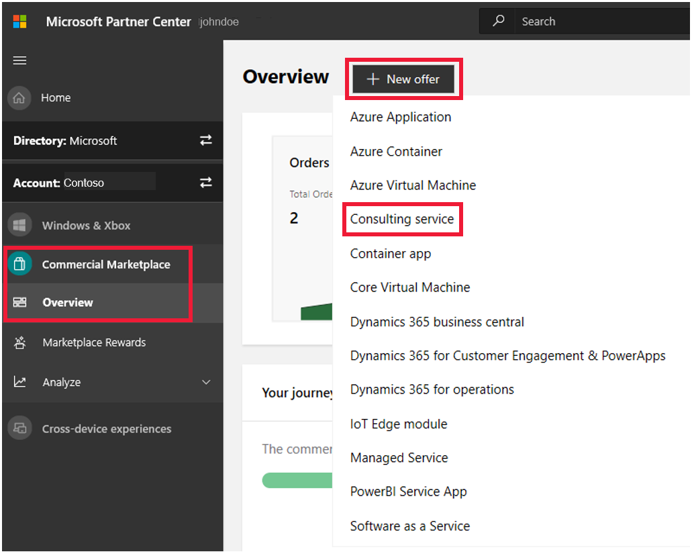

# Create a consulting service offer

This article describes how to publish a consulting service offer to either [Microsoft AppSource](https://appsource.microsoft.com/) or [Azure Marketplace](https://azuremarketplace.microsoft.com/). List consulting service offers based on Microsoft [Dynamics 365](https://dynamics.microsoft.com/) and Power Platform on AppSource. List Consulting service offers based on Microsoft Azure on Azure Marketplace. Before starting, [Create a commercial marketplace account in Partner Center](https://docs.microsoft.com/azure/marketplace/partner-center-portal/create-account) if you haven't done so yet. Ensure your account is enrolled in the commercial marketplace program.

Before you create your offer, review the prerequisites in [Consulting service prerequisites](https://docs.microsoft.com/azure/marketplace/partner-center-portal/consulting-service-prerequisites).

## Publishing benefits

Benefits of publishing to the commercial marketplace:

- Promote your company by using the Microsoft brand.
- Potentially reach more than 100 million Office 365 and Dynamics 365 users on AppSource and more than 200,000 organizations through Azure Marketplace.
- Receive high-quality leads from these marketplaces.
- Have your services promoted by the Microsoft field and telesales teams

## Create a new offer

1. Sign in to [Partner Center](https://partner.microsoft.com/dashboard/home).
2. In the left-nav menu, select **Commercial Marketplace** > **Overview**.
3. On the Overview page, select **+ New offer** > **Consulting Service**.

    

>[!NOTE]
>After an offer is published, edits made to it in Partner Center only appear in storefronts after republishing the offer. Make sure you always republish after making changes.

## New offer

Enter an **Offer ID**. This is a unique identifier for each offer in your account.

- This ID is visible to customers in the web address for the marketplace offer.
- Use only lowercase letters and numbers. It can include hyphens and underscores, but no spaces, and is limited to 50 characters. For example, if you enter **test-offer-1**, the offer web address will be `https://azuremarketplace.microsoft.com/marketplace/../test-offer-1`.
- The Offer ID can't be changed after you select **Create**.

Enter an **Offer alias**. This is the name used for the offer in Partner Center.

- This name isn't used in the marketplace and is different from the offer name and other values shown to customers.
- The Offer alias can't be changed after you select **Create**.

Select **Create** to generate the offer and continue.

## Offer setup

### Connect lead management

When publishing your offer to the marketplace with Partner Center, you _must_ connect it to a Customer Relationship Management (CRM) or marketing automation system. This lets you receive customer contact information as soon as someone expresses interest in or uses your product.

1. Select **Connect** to specify where you want us to send customer leads. Partner Center supports the following systems:

    - [Dynamics 365](https://docs.microsoft.com/azure/marketplace/partner-center-portal/commercial-marketplace-lead-management-instructions-dynamics) for Customer Engagement
    - [Marketo](https://docs.microsoft.com/azure/marketplace/partner-center-portal/commercial-marketplace-lead-management-instructions-marketo)
    - [Salesforce](https://docs.microsoft.com/azure/marketplace/partner-center-portal/commercial-marketplace-lead-management-instructions-salesforce)

    > [!NOTE]
    > If your CRM system isn't listed above, use [Azure Table](https://docs.microsoft.com/azure/marketplace/partner-center-portal/commercial-marketplace-lead-management-instructions-azure-table) or [Https Endpoint](https://docs.microsoft.com/azure/marketplace/partner-center-portal/commercial-marketplace-lead-management-instructions-https) to store customer lead data, then export the data to your CRM system.

2. Connect your offer to the lead destination when publishing in Partner Center.
3. Confirm that the connection to the lead destination is configured properly. After you publish it in Partner Center, we'll validate the connection and send you a test lead. While you preview the offer before it goes live, you can also test your lead connection by trying to purchase the offer yourself in the preview environment.
4. Make sure the connection to the lead destination stays updated so you don't lose any leads.

Here are some additional lead management resources:

- [Lead management overview](https://docs.microsoft.com/azure/marketplace/partner-center-portal/commercial-marketplace-get-customer-leads)
- [Lead management FAQs](https://docs.microsoft.com/azure/marketplace/lead-management-for-cloud-marketplace#frequently-asked-questions)
- [Common lead configuration errors](https://docs.microsoft.com/azure/marketplace/lead-management-for-cloud-marketplace#publishing-config-errors)
- [Lead Management Overview](https://assetsprod.microsoft.com/mpn/cloud-marketplace-lead-management.pdf) PDF (Make sure your pop-up blocker is turned off)

Select **Save draft** before continuing.

### Properties

This page lets you set the primary product that your consulting service offer best covers, set a consulting service type, and choose applicable products.

1. Select a **Primary product** from the drop-down list.
2. Select a **Consulting service type** from the drop-down list:

    - **Assessment**: An evaluation of a customer's environment to determine the applicability of a solution and provide an estimate of cost and timing.
    - **Briefing**: An introduction to a solution or a Consulting service to draw customer interest by using frameworks, demos, and customer examples.
    - **Implementation**: A complete installation that results in a fully working solution. Limit to solutions that can be implemented in two weeks or less.
    - **Proof of concept**: A limited-scope implementation to determine whether a solution meets customer requirements.
    - **Workshop**: An interactive engagement conducted on a customer's premises. It can involve training, briefings, assessments, or demos built on the customer's data or environment.

3. If you selected a primary product of **Azure**, select up to three **Solution Areas**. These make it easier for customers in Azure Marketplace to find your offer. If you didn't choose Azure, skip this step.
4. If you selected a primary product _other_ than Azure, select up to three **Applicable products**. These make it easier for customers in AppSource to find your offer. For details, see [Microsoft AppSource Consulting Service Listing Guidelines](https://go.microsoft.com/fwlink/?LinkId=828734&amp;clcid=0x409) (PDF).
5. Select up to six **Industries** that your offer applies to. This will make it easier for customers to find your offer.
6. Add up to three **Competencies** that your company has earned to display on your consulting service offer listing. At least one competency is required except for Azure Expert MSPs and Azure Networking MSPs.

Select **Save draft** before continuing.

## Offer listing

Here you'll define the offer details that are displayed in the marketplace. This includes the offer name, description, images, and so on. Be sure to follow the policies detailed on the [commercial marketplace certification policies page](https://docs.microsoft.com/legal/marketplace/certification-policies#800-consulting-services) while configuring this offer.

> [!NOTE]
> Offer details aren't required to be in English if the offer description begins with the phrase, &quot;This application is available only in [non-English language].&quot; It's also okay to provide a Useful Link to offer content in a language that's different from the one used in the Offer listing details.

Here's an example of how offer information appears in Azure Marketplace:

:::image type="content" source="media/example-consulting-service-offer.png" alt-text="Illustrates how this offer appears in Azure Marketplace.":::

#### Call-out descriptions

1. Logo
2. Price
3. Solution areas
4. Industries
5. Offer name
6. Summary
7. Screenshots/videos
8. Description

 Here's an example of how offer information appears in Microsoft AppSource:

:::image type="content" source="media/example-consulting-service-offer-appsource.png" alt-text="Illustrates how this offer appears in Microsoft AppSource.":::

#### Call-out descriptions

1. Logo
2. Price
3. Products
4. Industries
5. Offer name
6. Summary
7. Description
8. Screenshots/videos
9. Documents

### Name

The name you enter here displays as the title of your offering. This field is pre-filled with the text you entered in the **Offer alias** box when you created the offer. You can change this name later.

The name:

- Can be trademarked (and you may include trademark or copyright symbols).
- Can't be more than 50 characters long.
- Can't include emojis.

### Search results summary

Provide a short description of your offer. This can be up to 100 characters long and is used in marketplace search results.

### Description

[!INCLUDE [Long description-1](./includes/long-description-1.md)]

[!INCLUDE [Long description-2](./includes/long-description-2.md)]

[!INCLUDE [Long description-3](./includes/long-description-3.md)]

### Keywords

Enter up to three search keywords that are relevant to your primary product and consulting service. These will make it easier to find your offer.

### Duration

Set the expected duration of this engagement with your customer.

### Contact Information

You must provide the name, email, and phone number for a **Primary** and **Secondary contact**. This information isn't shown to customers. It is available to Microsoft and may be provided to Cloud Solution Provider (CSP) partners.

### Supporting documents

Add up to three (but at least one) supporting PDF documents for your offer.

### Marketplace images

Provide logos and images to use with your offer. All images must be in .png format. Blurry images will be rejected.

>[!Note]
>If you have an issue uploading files, make sure your local network does not block the https://upload.xboxlive.com service used by Partner Center.

#### Store logos

Provide PNG files of your offer's logo in each of the following pixel sizes:

- **Small (48 x 48)**
- **Large (216 x 216)**

All logos are required and are used in different places in the marketplace listing.

#### Screenshots (optional)

Add up to five screenshots that show how your offer works. Each must be 1280 x 720 pixels in size and in PNG format.

#### Videos (optional)

Add up to four videos that demonstrate your offer. Enter the video's name, its web address (URL), and a thumbnail PNG image of the video at 1280 x 720 pixels in size.

Select **Save draft** before continuing.

## Pricing and availability

Here you'll define elements such as pricing, market, and a private key.

1. **Market**: Set the market your offer will be available in. You may only select one market per offer.
    1. For the United States or Canada markets, select **Edit states** (or **provinces**) to specify where your offer will be available.
2. **Preview Audience**: Configure the **Hide Key** used to set the private audience for your offer.
3. **Pricing**: Specify whether your offer is a **Free** or **Paid** offer.

    > [!NOTE]
    > Consulting service offers are for the listing only. Any transactions will happen directly, outside of the commercial marketplace.

4. For a paid offer, specify the **Price and currency** and whether the price is **Fixed** or **Estimated**. If Estimated, you must specify in the description what factors will affect the price.
5. Select **Save draft** before continuing.

## Review and publish

After you've completed all the required sections of the offer, you can submit your offer to review and publish.

1. When you're ready to publish your consulting service offer, click **Review and publish**.
2. Review the details on the final submission page.
3. If necessary, write a note to the certification team if you believe any of the details of your offer require explanation.
4. When you're ready, select **Submit**.
5. The **Offer overview** page shows what publishing stage your offer is in.

For more information about how long you can expect your offer to be in each publishing stage, see [Check the publishing status of your Commercial Marketplace offer](https://docs.microsoft.com/azure/marketplace/partner-center-portal/publishing-status).

## Update your existing consulting service offers

- [Update an existing offer in the commercial marketplace](https://docs.microsoft.com/azure/marketplace/partner-center-portal/update-existing-offer)
