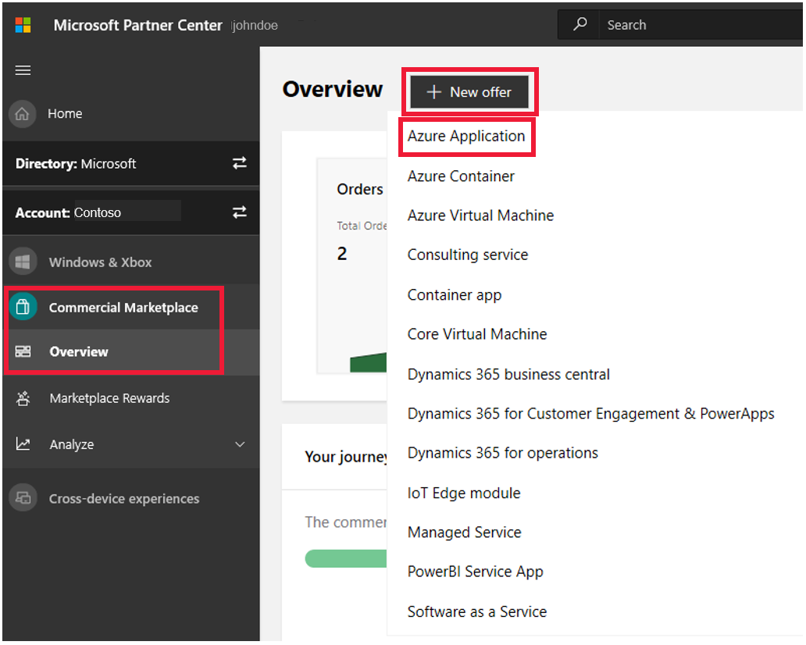

# Create an Azure application offer

This article explains the steps and considerations for creating a new Azure application offer in the commercial marketplace. You should be familiar with these concepts before you create a new Azure application offer.

Before you can publish a new Azure application offer, [create a commercial marketplace account in Partner Center](https://docs.microsoft.com/azure/marketplace/partner-center-portal/create-account) and make sure your account is enrolled in the commercial marketplace program.

## Before you begin

Designing, building, and testing Azure application offers requires technical knowledge of both the Azure platform and the technologies used to build the offer. Your engineering team should have knowledge about the following Microsoft technologies:

* Basic understanding of [Azure Services](https://azure.microsoft.com/services/).
* How to [design and architect Azure applications](https://azure.microsoft.com/solutions/architecture/).
* Working knowledge of [Azure Virtual Machines](https://azure.microsoft.com/services/virtual-machines/), [Azure Storage](https://azure.microsoft.com/services/?filter=storage#storage), and [Azure Networking](https://azure.microsoft.com/services/?filter=networking#networking).
* Working knowledge of [Azure Resource Manager](https://azure.microsoft.com/features/resource-manager/).
* Working knowledge of [JSON](https://www.json.org/).

### Technical documentation and resources

Review the following resources as you prepare your Azure application offer for the commercial marketplace.

* [Understand Azure Resource Manager Templates](https://docs.microsoft.com/azure/azure-resource-manager/resource-group-authoring-templates)

* Quickstarts:

    * [Azure Quickstart templates](https://azure.microsoft.com/documentation/templates/)
    * [Azure templates best practices guide](https://github.com/Azure/azure-quickstart-templates/blob/master/1-CONTRIBUTION-GUIDE/best-practices.md)
    * [Publish application definition](https://docs.microsoft.com/azure/managed-applications/publish-service-catalog-app)
    * [Deploy service catalog app](https://docs.microsoft.com/azure/managed-applications/deploy-service-catalog-quickstart)

* Tutorials:

    * [Create definition files](https://docs.microsoft.com/azure/managed-applications/publish-service-catalog-app)
    * [Publish marketplace application](https://docs.microsoft.com/azure/managed-applications/publish-marketplace-app)

* Samples:

    * [Azure CLI](https://docs.microsoft.com/azure/managed-applications/cli-samples)
    * [Azure PowerShell](https://docs.microsoft.com/azure/managed-applications/powershell-samples)
    * [Managed application solutions](https://docs.microsoft.com/azure/managed-applications/sample-projects)

The video [Building Solution Templates, and Managed Applications for the Azure Marketplace](https://channel9.msdn.com/Events/Build/2018/BRK3603) gives a comprehensive introduction to the Azure application offer type:

* What offer types are available;
* What technical assets are required;
* How to author an Azure Resource Manager template;
* Developing and testing the app UI;
* How to publish the app offer;
* The application review process.

### Suggested tools

Choose one or both of the following scripting environments to help manage your Azure application:

* [Azure PowerShell](https://docs.microsoft.com/powershell/azure/overview)
* [Azure CLI](https://docs.microsoft.com/cli/azure)

We recommend adding the following tools to your development environment:

* [Azure Storage Explorer](https://docs.microsoft.com/azure/vs-azure-tools-storage-manage-with-storage-explorer)
* [Visual Studio Code](https://code.visualstudio.com/) with the following extensions:
    * Extension: [Azure Resource Manager Tools](https://marketplace.visualstudio.com/items?itemName=msazurermtools.azurerm-vscode-tools)
    * Extension: [Beautify](https://marketplace.visualstudio.com/items?itemName=HookyQR.beautify)
    * Extension: [Prettify JSON](https://marketplace.visualstudio.com/items?itemName=mohsen1.prettify-json)

You can review the available tools in the [Azure Developer Tools](https://azure.microsoft.com/tools/) page. Also if you are using Visual Studio, the [Visual Studio Marketplace](https://marketplace.visualstudio.com/).

## Types of Azure application plans

There are two kinds of Azure application plans: solution templates and managed applications.

* **Solution template** is one of the main ways to publish a solution in the Marketplace. Use this plan type when your solution requires additional deployment and configuration automation beyond a single virtual machine (VM). With a solution template, you can automate providing of more than one resource, including VMs, networking, and storage resources to provide complex IaaS solutions.  For more information about building solution templates, see [Azure Resource Manager](https://docs.microsoft.com/azure/azure-resource-manager/resource-group-overview).

* **Managed application** is similar to solution templates, with one key difference. In a managed application, the resources are deployed to a resource group that's managed by the publisher of the app. The resource group is present in the consumer's subscription, but an identity in the publisher's tenant has access to the resource group. As the publisher, you specify the cost for ongoing support of the solution. Use Managed applications to easily build and deliver fully managed, turnkey applications to your customers.  For more information about the advantages and types of managed applications, see the [Azure managed applications overview](https://docs.microsoft.com/azure/managed-applications/overview).

## Technical requirements

All Azure applications include at least two files in the root folder of a `.zip` archive:

* A Resource Manager template file named [mainTemplate.json](https://docs.microsoft.com/azure/azure-resource-manager/resource-group-overview).  This template defines the resources to deploy into the customer's Azure subscription. For examples of Resource Manager templates, see the [Azure Quickstart Templates gallery](https://azure.microsoft.com/resources/templates/) or the corresponding [GitHub: Azure Resource Manager Quickstart Templates](https://github.com/azure/azure-quickstart-templates) repo.

* A user interface definition for the Azure application creation experience named [createUiDefinition.json](https://docs.microsoft.com/azure/managed-applications/create-uidefinition-overview).  In the user interface, you specify elements that enable consumers to provide parameter values.

All new Azure application offers must include an [Azure partner customer usage attribution GUID](https://docs.microsoft.com/azure/marketplace/azure-partner-customer-usage-attribution). 

To learn about publishing requirements for each application plan, see [Solution template offer publishing requirements](../marketplace-solution-templates.md) and [Managed application offer publishing requirements](../marketplace-managed-apps.md).

## Create a new offer

>[!NOTE]
>After an offer is published, edits you make to it in Partner Center will not appear in storefronts until you republish the offer. Make sure to always republish you offer after making changes.

1. Sign in to [Partner Center](https://partner.microsoft.com/dashboard/home).

1. In the left menu, select **Commercial Marketplace** > **Overview**.

1. On the Overview page, select **+ New offer** > **Azure Application**.

    

1. On the **New offer** page, enter an **Offer ID**. This is a unique identifier for each offer in your account.

     * This ID is visible to customers in the web address for the marketplace offer and Azure Resource Manager templates, if applicable.
     * Use only lowercase letters and numbers. It can include hyphens and underscores, but no spaces, and is limited to 50 characters. For example, if you enter **test-offer-1**, the offer web address will be `https://azuremarketplace.microsoft.com/marketplace/../test-offer-1`.
     * The Offer ID can't be changed after you select **Create**.

1. Enter an **Offer alias**. This is the name used for the offer in Partner Center.

     * This name isn't used in the marketplace and is different from the offer name and other values shown to customers.
     * The Offer alias can't be changed after you select **Create**.

1. Select **Create** to generate the offer and continue.

## Offer setup

The **Offer setup** page is where you can configure a test drive and lead management for your offer.

### Test drive

A test drive is a great way to showcase your offer to potential customers by giving them the option to "try before you buy", resulting in increased conversion and the generation of highly qualified leads. [Learn more about test drives](https://docs.microsoft.com/azure/marketplace/cloud-partner-portal/test-drive/what-is-test-drive).

To enable a test drive for a fixed period of time, select the **Enable a test drive** check box. To remove test drive from your offer, clear this check box. Configure the test drive environment in the [Test drive technical configuration](#test-drive-technical-configuration) section later in this topic.

For additional information, see [Test drive your offer in the commercial marketplace](https://docs.microsoft.com/azure/marketplace/partner-center-portal/test-drive). You can also read about [test drive best practices](https://github.com/Azure/AzureTestDrive/wiki/Test-Drive-Best-Practices) and download the [Test drives overview PDF](https://assetsprod.microsoft.com/mpn/azure-marketplace-appsource-test-drives.pdf) (make sure your pop-up blocker is off)

>[!Note]
>Because all Azure applications are implemented using an Azure Resource Manager template, the only type of test drive available for an Azure Application is an [Azure Resource Manager based test drive](https://docs.microsoft.com/azure/marketplace/cloud-partner-portal/test-drive/azure-resource-manager-test-drive).

### Customer leads

[!INCLUDE [Connect lead management](./includes/connect-lead-management.md)]

For more information, see [Lead management overview](./commercial-marketplace-get-customer-leads.md).

Select **Save draft** before continuing.

## Properties

The **Properties** page is where you define the categories and industries used to group your offer on the marketplace, your app version, and the legal contracts supporting your offer.

Select at least one and up to three categories to place your offer in the appropriate marketplace search areas. Be sure to describe how your offer supports these categories in the offer description.

### Legal

[!INCLUDE [Commercial marketplace Standard Contract](./includes/marketplace-contract-text.md)]

## Offer listing

This page is where you manage the copy and images for your commercial marketplace offer.

### Marketplace details

> [!NOTE]
> Offer listing content (such as the description, documents, screenshots, and terms of use) is not required to be in English, as long as the offer description begins with the phrase, "This application is available only in [non-English language]." It is also acceptable to provide a *Useful Link URL* to offer content in a language other than the one used in the Offer listing content.

Here's an example of how offer information appears in Azure Marketplace (any listed prices are for example purposes only and not intended to reflect actual costs):

:::image type="content" source="media/example-azure-marketplace-app.png" alt-text="Illustrates how this offer appears in Azure Marketplace.":::

#### Call-out descriptions

1. Logo
2. Categories
3. Support address (link)
4. Terms of use
5. Privacy policy address (link)
6. Offer name
7. Summary
8. Description
9. Screenshots/videos

 Here's an example of how offer information appears in the Azure portal:

:::image type="content" source="media/example-virtual-machine-container-iot-edge-saas.png" alt-text="Illustrates how this offer appears in the Azure portal.":::

#### Call-out descriptions

1. Title
2. Description
3. Useful links
4. Screenshots

#### Name

The name you enter here will be shown to customers as the title of your offer listing. This field is pre-populated with the text you entered for **Offer alias** when you created the offer, but you can change this value. This name may be trademarked (and you may include trademark or copyright symbols). The name can't be more than 50 characters and can't include any emojis.

#### Search results summary

Provide a short description of your offer, up to 100 characters. This description may be used in search results.

#### Long summary

Provide a longer description of your offer, up to 256 characters. This description may be used in search results.

#### Description

[!INCLUDE [Long description-1](./includes/long-description-1.md)]

[!INCLUDE [Long description-2](./includes/long-description-2.md)]

[!INCLUDE [Rich text editor](./includes/rich-text-editor.md)]

#### Search keywords

You can optionally enter up to three search keywords to help customers find your offer in the marketplace. For best results, also use these keywords in your description.

#### Privacy policy link

Enter the URL to your organization's privacy policy. You are responsible for ensuring your app complies with privacy laws and regulations, and for providing a valid privacy policy.

### Useful links

Add links to optional supplemental online documents about your solution by selecting **+ Add a link**.

### Contact information

Provide the name, email, and phone number for a **Support contact**, **Engineering contact**, and **CSP Program contact**. This info is not shown to customers, but will be available to Microsoft and may be provided to CSP partners. Some contacts may require additional information.

### Marketplace media

Provide logos and images to use with your offer. All images must be in PNG format. Blurry images will cause your submission to be rejected.

>[!Note]
>If you have an issue uploading files, ensure your local network does not block the https://upload.xboxlive.com service used by Partner Center.

#### Store logos

Provide PNG files of your offer's logo in the following three pixel sizes:

- **Small** (48 x 48)
- **Medium** (90 x 90)
- **Large** (216 x 216)
- **Wide** (255 x 115)

All three logos are required and are used in different places in the listing.

#### Screenshots

Add up to five screenshots that show how your offer works. Each screenshot must be 1280 x 720 pixels in size and in PNG format. Each screenshot must include a caption.

#### Videos

Add up to five videos that demonstrate your offer. These should be hosted on an external video service. Enter each video's name, web address, and a thumbnail PNG image of the video at 1280 x 720 pixels.

#### Additional marketplace listing resources

- [Best practices for marketplace offer listings](https://docs.microsoft.com/azure/marketplace/gtm-offer-listing-best-practices)

Select **Save draft** before continuing.

## Preview audience

On the Preview tab, choose a limited **Preview Audience** for validating your offer before you publish it live to the broader marketplace audience.

> [!IMPORTANT]
> After checking your offer in Preview, select **Go live** to publish your offer to the commercial marketplace public audience.

Your preview audience is identified by Azure subscription ID GUIDs, along with an optional description for each. Neither of these fields can be seen by customers. You can find your Azure subscription ID on the **Subscriptions** page in Azure portal.

Add at least one Azure subscription ID, either individually (up to 10) or by uploading a CSV file (up to 100). By adding these subscription IDs, you define who can preview your offer before it is published live. If your offer is already live, you may still define a preview audience for testing offer changes or updates to your offer.

> [!NOTE]
> A preview audience differs from a private audience. A preview audience can access to your offer _before_ it's published live in the marketplaces. They can see and validate all plans, including those which will be available only to a private audience after your offer is fully published to the marketplace. A private audience (defined in the plan **Pricing and Availability** tab) has exclusive access to a particular plan.

Select **Save draft** before continuing.

## Technical configuration

Complete this section only if your offer includes a managed application that will emit metering events using the Marketplace Metering Service API. Enter the **Azure Active Directory tenant ID** and **Azure Active Directory application ID** your service will use when emitting metering events.

Select **Save draft** before continuing.

## Technical configuration (offer level)

>[!Note]
>Offer-level technical details are optional.  You only need to configure these details if you are publishing a managed application with metered billing and have a service which will be authenticating with an Azure AD security token. For more information, see [authentication strategies](./marketplace-metering-service-authentication.md) on the different authentication options.

The technical configuration defines the details (tenant ID, and app ID) used to identity your service, which will emit metering events for a managed application using the [Marketplace metering service APIs](./marketplace-metering-service-apis.md).  Enter the identity that your service will use when emitting metering events.

* **Azure AD tenant ID** (required): Inside the Azure portal, you must [create an Azure Active Directory (AD) app](https://docs.microsoft.com/azure/active-directory/develop/howto-create-service-principal-portal) so we can validate the connection between our two services is behind an authenticated communication. To find the [tenant ID](https://docs.microsoft.com/azure/active-directory/develop/howto-create-service-principal-portal#get-values-for-signing-in), go to your Azure Active Directory and select **Properties**, then look for the **Directory ID** number listed (for example 50c464d3-4930-494c-963c-1e951d15360e).
* **Azure AD app ID** (required): You also need your [application ID](https://docs.microsoft.com/azure/active-directory/develop/howto-create-service-principal-portal#get-values-for-signing-in) and an authentication key. To get those values, go to your Azure Active Directory and select **App registrations**, then look for the **Application ID** number listed (for example 50c464d3-4930-494c-963c-1e951d15360e). To find the authentication key, go to **Settings** and select **Keys**. You will need to provide a description and duration and will then be provided a number value.

>[!Note]
>The Azure application ID will be associated to your publisher ID, and can only be re-used within this publisher account.

>[!Note]
>This configuration is required if you want to use [Batch usage event](https://docs.microsoft.com/azure/marketplace/partner-center-portal/marketplace-metering-service-apis#batch-usage-event).  In case you want to submit [usage event](https://docs.microsoft.com/azure/marketplace/partner-center-portal/marketplace-metering-service-apis#usage-event), you can also use the [instance metadata service](https://docs.microsoft.com/azure/active-directory/managed-identities-azure-resources/overview) to get the [JSON web token (JWT) bearer token](https://docs.microsoft.com/azure/marketplace/partner-center-portal/pc-saas-registration#get-a-token-based-on-the-azure-ad-app).

## Plan overview

This tab enables you to provide different plan options within the same offer. These plans (referred to as SKUs in the Cloud Partner Portal) can differ in terms of plan type (solution template vs. managed application), monetization, or audience.  Configure at least one plan in order to list your offer in the marketplace.

Once created, you will see your plan names, IDs, plan type, availability (Public or Private), current publishing status, and any available actions on this tab.

**Actions** available in the **Plan overview** vary depending on the current status of your plan and may include:

* If the plan status is **Draft** – Delete draft.
* If the plan status is **Live** – Stop sell plan or Sync private audience.

### Create new plan

***Plan ID*** – Create a unique plan ID for each plan in this offer. This ID will be visible to customers in the product URL.  Use only lowercase, alphanumeric characters, dashes, or underscores. A maximum of 50 characters are allowed for this plan ID. This ID cannot be modified after selecting create.

***Plan name*** - Customers will see this name when deciding which plan to select within your offer. Create a unique offer name for each plan in this offer. The plan name is used to differentiate software plans that may be a part of the same offer (For example, offer name: Windows Server; plans: Windows Server 2016, Windows Server 2019).

### Plan setup

This tab enables you to set the high-level configuration for the type of plan, whether it reuses packages from another plan, and what clouds the plan should be available in. Your answers on this tab will affect which fields are displayed on other tabs for the same plan.

#### Plan type
Select the type of plan for your offer. A **Solution template** plan is managed entirely by the customer. A **Managed application** plan enables publishers to manage the application on behalf of the customer. For details, see [Types of Azure application plans](#types-of-azure-application-plans).

#### Re-use technical configuration

If you have more than one plan of the same type and the packages are identical between them, you may select **this plan reuses packages from another plan**.  When you select this option, you will be able to select one of the other plans of the same type for this offer to reuse packages from. 

>[!Note]
>When you re-use packages from another plan, the entire Technical configuration tab will disappear from this plan. The Technical configuration details from the other plan, including any updates that you make in the future, will be used for this plan as well.  This setting cannot be changed after this plan is published.

#### Azure regions (cloud)

Your plan must be made available in at least one Azure region.

Select the **Azure Global** option to make your plan available to customers in all Azure Global regions that have commercial marketplace integration. For details, see [Geographic availability and currency support](https://docs.microsoft.com/azure/marketplace/marketplace-geo-availability-currencies).

Select the **Azure Government** option to make your plan available in the [Azure Government](https://docs.microsoft.com/azure/azure-government/documentation-government-welcome) region. This region provides controlled access for customers from  U.S. federal, state, local, or tribal entities, as well as partners eligible to serve them. You, as the publisher, are responsible for any compliance controls, security measures, and best practices. Azure Government uses physically isolated data centers and networks (located in the U.S. only).

Before publishing to [Azure Government](https://docs.microsoft.com/azure/azure-government/documentation-government-manage-marketplace-partners), test and validate your plan in the environment as certain endpoints may differ. To set up and test your plan, request a trial account from [Microsoft Azure Government trial](https://azure.microsoft.com/global-infrastructure/government/request/).

>[!NOTE]
>After your plan is published and available in a specific Azure region, you can't remove that region.

#### Azure Government certifications

This option is only visible if you selected **Azure Government**.

Azure Government services handle data that is subject to certain government regulations and requirements. For example, FedRAMP, NIST 800.171 (DIB), ITAR, IRS 1075, DoD L4, and CJIS. To bring awareness to your certifications for these programs, you can provide up to 100 links that describe them. These can be either links to your listing on the program directly or links to descriptions of your compliance with them on your own websites. These links visible to Azure Government customers only.

Select **Save draft** before continuing.

### Plan listing

This is where you configure listing details of the plan. This tab displays specific information that can differ between plans in the same offer.

#### Plan name

This is pre-filled in with the name you gave your plan when you created it. This name appears in the marketplace as the title of this plan and is limited to 100 characters.

#### Plan summary

Provide a short summary of your plan (not the offer). This summary is limited to 100 characters.

#### Plan description

Describe what makes this software plan unique, as well as differences between plans within your offer. Don't describe the offer, just the plan. The plan description can contain up to 2,000 characters.

Select **Save draft** before continuing.

### Availability (solution template plans only)

You can make the plan visible to everyone, only to specific customers (a private audience), and whether to make the plan hidden for use by other solution template or managed applications only.

#### Plan visibility

You can configure each plan to be visible to everyone or to only a specific audience of your choosing. You can assign membership in this restricted audience using Azure subscription IDs.

Select **This is a private plan** to make your plan private and visible only to the restricted audience of your choosing. Once published as a private plan, you can update the audience or choose to make the plan available to everyone. Once a plan is published as visible to everyone, it must remain visible to everyone; it cannot be reconfigured as a private plan.

If you make the plan private, enter an **Azure subscription IDs** and its description. Each is an audience that will have access to this private plan. Access is assigned using Azure subscription IDs with the option to include a description of each Azure subscription ID assigned. Add up to 10 customers subscription IDs individually, or 20,000 by importing a CSV file. Azure subscription IDs are represented as GUIDs and letters must be lowercase.

>[!Note]
>A private or restricted audience is different from the preview audience you defined on the **Preview** tab. A preview audience can access your offer _before_ its published live in the marketplace. While the private audience choice only applies to a specific plan, the preview audience can view all plans (private or not) for validation purposes.

#### Hide plan

If your solution template is intended to be deployed only indirectly when referenced though another solution template or managed application, check this box to publish your solution template but hide it from customers searching and browsing for it directly.

Select **Save draft** before continuing.

### Pricing and availability (managed application plans only)

Use it to configure the **Markets** this plan will be available in, the **Pricing** per month of the management of the solution, and the **Plan visibility** if only specific customers should see it (a private audience).

Select **Save draft** before continuing.

#### Markets

Every plan must be available in at least one market. Select the checkbox for any market location where you would like to make this plan available. A search box and button for selecting "Tax Remitted" countries/regions, in which Microsoft remits sales and use tax on your behalf, are included to help.

If you have already set prices for your plan in United States Dollars (USD) and add another market location, the price for the new market will be calculated according to the current exchange rates. Always review the price for each market before publishing. Pricing can be reviewed by using the "Export prices (xlsx)" link after saving your changes.

#### Pricing

Provide the per-month price for this plan.  This price is in addition to any Azure infrastructure or pay-as-you-go software costs incurred by the resources deployed by this solution.

In addition to the per-month price, you can also set prices for consumption of non-standard units using [metered billing](./azure-app-metered-billing.md).  You may set the per-month price to zero and charge exclusively using metered billing if you like. 

Prices set in USD (USD = United States Dollar) are converted into the local currency of all selected markets using the current exchange rates when saved. Validate these prices before publishing by exporting the pricing spreadsheet and reviewing the price in each market. If you would like to set custom prices in an individual market, modify and import the pricing spreadsheet. 

>[!Note]
>You must first save your pricing changes to enable export of pricing data.

Review your prices carefully before publishing, as there are some restrictions on what can change after a plan is published.  

>[!Note]
>Once a price for a market in your plan is published, it can't be changed later.

#### Plan visibility

You can configure each plan to be visible to everyone or to only a specific audience of your choosing. You can assign membership in this restricted audience using Azure subscription IDs.

Select **This is a private plan** to make your plan private and visible only to the restricted audience of your choosing. Once published as a private plan, you can update the audience or choose to make the plan available to everyone. Once a plan is published as visible to everyone, it must remain visible to everyone; it cannot be reconfigured as a private plan.

>[!Note]
>A private or restricted audience is different from the preview audience you defined on the **Preview** tab. A preview audience can access your offer _before_ its published live in the marketplace. While the private audience choice only applies to a specific plan, the preview audience can view all plans (private or not) for validation purposes.

If you make the plan private, enter an **Azure subscription IDs** and its description. Each is an audience that will have access to this private plan. Access is assigned using Azure subscription IDs with the option to include a description of each Azure subscription ID assigned. Add up to 10 customers subscription IDs individually, or 20,000 by importing a CSV file. Azure subscription IDs are represented as GUIDs and letters must be lowercase.

>[!Note]
>Private offers are not supported with Azure subscriptions established through a reseller of the Cloud Solution Provider program (CSP).

### Technical configuration 

This tab lets you upload the deployment package that will allow customers to deploy your plan.

>[!Note]
>This tab will not be visible if you configured this plan to re-use packages from another plan on the **Plan setup** tab.

#### Package details

This tab lets you edit the draft version of your technical configuration.

**Version** – Assign the current version of the technical configuration.  Increment this version each time you publish a change to this page. Version must be in the format `{integer}.{integer}.{integer}`.

**Package file** (.zip) – This package contains all of the template files needed for this plan, as well as any additional resources, packaged as a `.zip` file.

All Azure application plan packages must include these two files in the root folder of a `.zip` archive:

* A Resource Manager template file named [mainTemplate.json](https://docs.microsoft.com/azure/azure-resource-manager/resource-group-overview). This template automates the deployment of resources into the customers Azure subscription.  For examples of Resource Manager templates, see the [Azure Quickstart Templates gallery](https://azure.microsoft.com/documentation/templates/) or the corresponding [GitHub: Azure Resource Manager Quickstart Templates](https://github.com/azure/azure-quickstart-templates) repo.
* A user interface definition for the Azure application creation experience named [createUiDefinition.json](https://docs.microsoft.com/azure/azure-resource-manager/managed-application-createuidefinition-overview).

Maximum file sizes supported are:

* Up to 1 Gb in total compressed `.zip` archive size
* Up to 1 Gb for any individual uncompressed file within the `.zip` archive  

All new Azure application offers must also include an [Azure partner customer usage attribution](https://docs.microsoft.com/azure/marketplace/azure-partner-customer-usage-attribution) GUID.

>[!Note]
>If you have an issue uploading files, make sure your local network does not block the https://upload.xboxlive.com service used by Partner Center.

Managed application plans require additional information on this tab.

#### Previously published packages

The **Previously published packages** sub-tab enables you to view all published versions of your technical configuration.

#### Enable just-in-time (JIT) access

Select this option to enable Just-in-time (JIT) access for this plan.  JIT access enables you to request elevated access to a managed application's resources for troubleshooting or maintenance. You always have read-only access to the resources, but for a specific time period you can have greater access.  For more information, see [Enable and request just-in-time access for Azure Managed Applications](https://docs.microsoft.com/azure/managed-applications/request-just-in-time-access).  To require that consumers of your managed application grant your account permanent access, leave this option unchecked.

>[!Note]
>Be sure to update your `createUiDefinition.json` file in order to support this feature.  

#### Deployment mode

Select whether to configure **Complete** or **Incremental deployment mode** when deploying this plan: 

* In **complete mode**, a redeployment of the application by the customer will result in removal of resources in the managed resource group if the resources are not defined in the `mainTemplate.json`. 
* In **incremental mode**, a redeployment of the application leaves existing resources unchanged.

To learn more about deployment modes, see [Azure Resource Manager deployment modes](https://docs.microsoft.com/azure/azure-resource-manager/deployment-modes).

#### Notification endpoint URL

Specify an HTTPS Webhook endpoint to receive notifications about all CRUD operations on managed application instances of this plan version.

#### Customize allowed customer actions

Select this option to specify which actions customers can perform on the managed resources in addition to the "`*/read`" actions that is available by default. 

List the additional actions you would like to enable your customer to perform here, separated by semicolons.  For more information, see [Understanding deny assignments for Azure resources](https://docs.microsoft.com/azure/role-based-access-control/deny-assignments).  For available actions, see [Azure Resource Manager resource provider operations](https://docs.microsoft.com/azure/role-based-access-control/resource-provider-operations). For example, to permit consumers to restart virtual machines, add `Microsoft.Compute/virtualMachines/restart/action` to the allowed actions.

#### Global Azure / Azure Government Cloud

Indicate who should have management access to this managed application in each supported cloud. Users, groups, or applications that you want to be granted permission to the managed resource group are identified using Azure Active Directory (AAD) identities.

**Azure Active Directory Tenant ID** – The AAD Tenant ID (also known as directory ID) containing the identities of the users, groups, or applications you want to grant permissions to. You can find your AAD Tenant ID on the Azure portal, in [Properties for Azure Active Directory](https://portal.azure.com/#blade/Microsoft_AAD_IAM/ActiveDirectoryMenuBlade/Properties).

**Authorizations** – Add the Azure Active Directory object ID of the user, group, or application that you want to be granted permission to the managed resource group. Identify the user by their Principal ID, which can be found at the [Azure Active Directory users blade on the Azure portal](https://portal.azure.com/#blade/Microsoft_AAD_IAM/UsersManagementMenuBlade/AllUsers).

For each principal, select one of the Azure AD built-in roles from the list (Owner or Contributor). The role you select will describe the permissions the principal will have on the resources in the customer subscription. For more information, see [Built-in roles for Azure resources](https://docs.microsoft.com/azure/role-based-access-control/built-in-roles). For more information about role-based access control (RBAC), see [Get started with RBAC in the Azure portal](https://docs.microsoft.com/azure/role-based-access-control/overview).

>[!Note]
>Although you may add up to 100 authorizations per cloud, it's generally easier to create an Active Directory user group and specify its ID in the "Principal ID." This will allow you to add more users to the management group after the plan is deployed and reduce the need to update the plan just to add more authorizations.

#### Policy settings

Apply [Azure Policies](https://docs.microsoft.com/azure/governance/policy/overview) to your managed application to specify compliance requirements for the deployed solution. For policy definitions and the format of the parameter values, see [Azure Policy Samples](https://docs.microsoft.com/azure/governance/policy/samples/index). You can configure a maximum of five policies, and only one instance of each Policies option. Some policies require additional parameters. The Standard SKU is required for audit policies. Policy Name is limited to 50 characters.

Select **Save draft** before continuing.

## Co-sell with Microsoft

Providing information on the Co-sell tab is entirely optional for publishing your offer. It is required to achieve Co-sell Ready and IP Co-sell Ready status. The information you provide will be used by Microsoft sales teams to learn more about your solution when evaluating its fit for customer needs. It is not available directly to customers.

For details on this tab, see [Co-sell option in Partner Center](https://docs.microsoft.com/azure/marketplace/partner-center-portal/commercial-marketplace-co-sell).

## Resell through CSPs

Expand the reach of your offer by making it available to partners in the [Cloud Solution Providers](https://azure.microsoft.com/offers/ms-azr-0145p/) (CSP) program. This allows resellers to sell your offer to their customers and create bundled solutions.

Select **Save draft** before continuing.

## Test drive

Set up a demonstration (test drive) that lets customers try your offer before purchasing it. To create a demonstration environment that lets customers try your offer for a fixed period of time, see [Test Drive your offer in the commercial marketplace](https://docs.microsoft.com/azure/marketplace/partner-center-portal/test-drive).

To enable a test drive, select the **Enable a test drive** check box on the [Offer setup](#test-drive) tab. To remove test drive from your offer, clear this check box.

### Test drive technical configuration

- **Azure AD app ID** (required): Enter your Azure Active Directory (AD) [application ID](https://docs.microsoft.com/azure/active-directory/develop/howto-create-service-principal-portal#get-values-for-signing-in). To find this ID, sign in to the [Azure portal](https://portal.azure.com/), select the Active Directory tab in the left-menu, select **App registrations**, then look for the **Application ID** number listed (such as 50c464d3-4930-494c-963c-1e951d15360e).

#### Deployment subscription details

To allow the Test Drive to be deployed on your behalf, create and provide a separate, unique Azure Subscription (not required for Power BI test drives).

* **Azure subscription ID** (required for Azure Resource Manager and Logic apps) – Enter the subscription ID to grant access to your Azure account services for resource usage reporting and billing. We recommend that you consider [creating a separate Azure subscription](https://docs.microsoft.com/azure/billing/billing-create-subscription) to use for test drives if you don't have one already. You can find your Azure subscription ID by logging in to the [Azure portal](https://portal.azure.com/) and navigating to the **Subscriptions** tab of the left-side menu. Selecting the tab will display your subscription ID (such as "a83645ac-1234-5ab6-6789-1h234g764ghty").
* **Azure AD tenant ID** (required) – Enter your Azure Active Directory (AD) [tenant ID](https://docs.microsoft.com/azure/active-directory/develop/howto-create-service-principal-portal#get-values-for-signing-in). To find this ID, sign in to the [Azure portal](https://portal.azure.com/), select the Active Directory tab in the left-menu, select **Properties**, then look for the **Directory ID** number listed (such as 50c464d3-4930-494c-963c-1e951d15360e). You can also look up your organization's tenant ID using your domain name URL at:  [https://www.whatismytenantid.com](https://www.whatismytenantid.com).
* **Azure AD tenant name** (required for Dynamic 365) – Enter your Azure Active Directory (AD) name. To find this name, sign in to the [Azure portal](https://portal.azure.com/), in the upper right corner your tenant name will be listed under your account name.
* **Azure AD app ID** (required) – Enter your Azure Active Directory (AD) [application ID](https://docs.microsoft.com/azure/active-directory/develop/howto-create-service-principal-portal#get-values-for-signing-in). To find this ID, sign in to the [Azure portal](https://portal.azure.com/), select the Active Directory tab in the left-nav menu, select **App registrations**, then look for the **Application ID** number listed (such as 50c464d3-4930-494c-963c-1e951d15360e).
* **Azure Active Directory application client secret** (required) – Enter your Azure AD application [client secret](https://docs.microsoft.com/azure/active-directory/develop/howto-create-service-principal-portal#certificates-and-secrets). To find this value, sign in to the [Azure portal](https://portal.azure.com/). Select the **Azure Active Directory** tab in the left-nav menu, select **App registrations**, then select your test drive app. Next, select **Certificates and secrets**, select **New client secret**, enter a description, select **Never** under **Expires**, then choose **Add**. Make sure to copy down the value before leaving this page.)

Select **Save draft** before continuing.

### Marketplace listing (optional)

Describe the test drive experience.

<!-- The **Test Drive listings** option found under the **Test drive** tab displays the languages (and markets) where your test drive is available (currently English (United States) is the only location available). Additionally, this page displays the status of the language-specific listing and the date/time that it was added. You will need to define the test drive details (description, user manual, videos, etc.) for each language/market. -->

* **Description** (required) – Describe your test drive, what will be demonstrated, objectives for the user to experiment with, features to explore, and any relevant information to help the user determine whether to acquire your offer. Up to 3,000 characters of text can be entered in this field. 
* **Access information** (required for Azure Resource Manager and Logic test drives) – Explain what a customer needs to know in order to access and use this test drive. Walk through a scenario for using your offer and exactly what the customer should know to access features throughout the test drive. Up to 10,000 characters of text can be entered in this field.
* **User Manual** (required) – An in-depth walk-through of your test drive experience. The User Manual should cover exactly what you want the customer to gain from experiencing the test drive and serve as a reference for any questions that they may have. The file must be in PDF format and be named (255 characters max) after uploading.
* **Videos: Add videos** (optional) – Videos can be uploaded to YouTube or Vimeo and referenced here with a link and thumbnail image (533 x 324 pixels) so a customer can view a walk-through of information to help them better understand the test drive, including how to successfully use the features of your offer and understand scenarios that highlight their benefits.
  * **Name** (required)
  * **Address** (YouTube or Vimeo only; required)
  * **Thumbnail** (Image file must be in PNG format and 533 x 324 pixels).

Select **Save draft** before continuing.

## Publish

When you have completed all the required sections of the offer, select **Review and publish** in the top-right corner of the portal.

Review the completion status for each section of the offer.
    - *Not started* - means the section has not been touched and needs to be completed.
    - *Incomplete* - means the section has errors that need to be fixed or requires more information to be provided. Go back to the section(s) and update it.
    - *Complete* - means the section is complete, all required data has been provided and there are no errors. All sections of the offer must be in a complete state before you can submit the offer.

If this is your first time publishing this offer, you can provide testing instructions to the certification team to ensure that your app is tested correctly, in addition to any supplementary notes helpful for understanding your app.

Select **Submit** to submit your offer for publishing. We will send you an email to let you know when a preview version of the offer is available for you to review and approve.

Return to Partner Center and select **Go-live** for the offer to publish your offer to the public (or if a private offer, to the private audience).

### Errors and review feedback

The **Manual validation** step in the publishing process represents an extensive review of your offer and its associated technical assets (especially the Azure Resource Manager template), issues are typically presented as pull request (PR) links. An explanation of how to view and respond to these PRs, see [Handling review feedback](./azure-apps-review-feedback.md).

If you have errors in one or more of the publishing steps, correct them before republishing your offer.

## Next steps

* [Update an existing offer in the Commercial Marketplace](./update-existing-offer.md)
