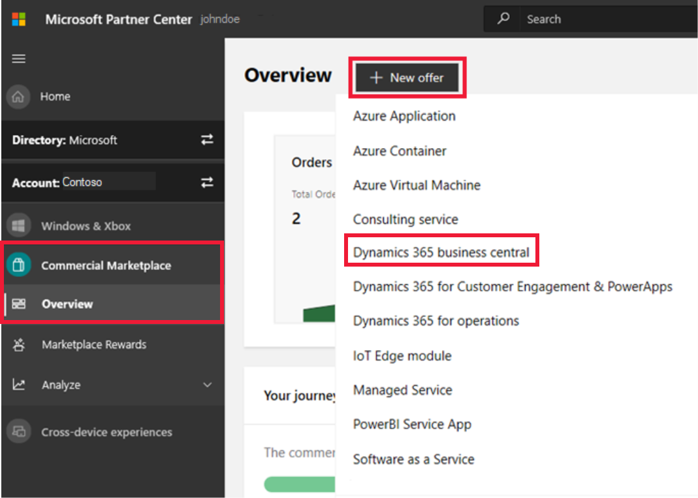

# Create a Dynamics 365 Business Central offer

This article explains how to create a new Dynamics 365 Business Central offer. [Microsoft Dynamics 365 Business Central](https://dynamics.microsoft.com/business-central) is an enterprise resource planning (ERP) system that handles a wide range of business processes, including finance, operations, supply chain, CRM, and project management and electronic commerce. Premium packages also support classic deployment model and manufacturing. All offers for Dynamics 365 Business Central must go through our certification process.

Before starting, [Create a Commercial Marketplace account in Partner Center](https://docs.microsoft.com/azure/marketplace/partner-center-portal/create-account) if you haven't done so yet. Ensure your account is enrolled in the commercial marketplace program.

## Create a new offer

1. Sign in to [Partner Center](https://partner.microsoft.com/dashboard/home).
2. In the left-nav menu, select **Commercial Marketplace** > **Overview**.
3. On the Overview page, select **+ New offer** > **Dynamics 365 business central**.

    

> [!NOTE]
> After an offer is published, edits made to it in Partner Center only appear in storefronts after republishing the offer. Make sure you always republish after making changes.

## New offer

Enter an **Offer ID**. This is a unique identifier for each offer in your account.

- This ID is visible to customers in the web address for the marketplace offer and Azure Resource Manager templates, if applicable.
- Use only lowercase letters and numbers. It can include hyphens and underscores, but no spaces, and is limited to 50 characters. For example, if you enter **test-offer-1**, the offer web address will be `https://azuremarketplace.microsoft.com/marketplace/../test-offer-1`.
- The Offer ID can't be changed after you select **Create**.

Enter an **Offer alias**. This is the name used for the offer in Partner Center.

- This name isn't used in the marketplace and is different from the offer name and other values shown to customers.
- The Offer alias can't be changed after you select **Create**.

Select **Create** to generate the offer and continue.

## Offer setup

Follow these steps to set up your offer.

### How do you want potential customers to interact with this listing offer?

Select the option you'd like to use for this offer.

#### Get it now (free)

List your offer to customers for free by providing a valid URL (beginning with *http* or *https*) where they can access your app.  For example, `https://contoso.com/my-app`.

#### Free trial (listing)

List your offer to customers with a link to a free trial by providing a valid URL (beginning with `http` or `https`) where they can get a trial.  For example, `https://contoso.com/trial/my-app`. Offer listing free trials are created, managed, and configured by your service and do not have subscriptions managed by Microsoft.

> [!NOTE]
> The tokens your application will receive through your trial link can only be used to obtain user information through Azure Active Directory (Azure AD) to automate account creation in your app. Microsoft accounts are not supported for authentication using this token.

#### Contact me

Collect customer contact information by connecting your Customer Relationship Management (CRM) system. The customer will be asked for permission to share their information. These customer details, along with the offer name, ID, and marketplace source where they found your offer, will be sent to the CRM system that you've configured. For more information about configuring your CRM, see [Customer leads](#customer-leads).

### Test drive

A test drive is a great way to showcase your offer to potential customers by giving them the option to "try before you buy", resulting in increased conversion and the generation of highly qualified leads. To learn more, start with [What is test drive](../what-is-test-drive.md).

To enable a test drive for a fixed period of time, select the **Enable a test drive** check box. To remove test drive from your offer, clear this check box.

### Customer leads

[!INCLUDE [Connect lead management](./includes/connect-lead-management.md)]

For more information, see [Lead management overview](./commercial-marketplace-get-customer-leads.md).

Select **Save draft** before continuing.

## Properties

This page lets you define the categories and industries used to group your offer on the marketplace, your app version, and the legal contracts supporting your offer.

### Category

Select a minimum of one and a maximum of three categories, which will be used to place your offer into the appropriate marketplace search areas. Be sure to call out how your offer supports these categories in the offer description. 

### Industry

[!INCLUDE [Industry Taxonomy](./includes/industry-taxonomy.md)]

### App version

Enter the version number of your offer. Customers will see this version listed on the offer's detail page.

### Terms and conditions

Provide your own legal terms and conditions in the **Terms and conditions** field. You can also provide the URL where your terms and conditions can be found. Customers will be required to accept these terms before they can try your offer.

Select **Save draft** before continuing.

## Offer listing

This is where you define details for your offer such as name, description, and images.

> [!NOTE]
> You can provide offer listing details in one language only. It is not required to be in English, as long as the offer description begins with the phrase, "This application is available only in [non-English language]." It is also acceptable to provide a *Help link URL* to offer content in a language other than the one used in the Offer listing content.

Here's an example of how offer information appears in Microsoft AppSource (any listed prices are for example purposes only and not intended to reflect actual costs):

:::image type="content" source="media/example-d365-business-central.png" alt-text="Illustrates how this offer appears in Microsoft AppSource.":::

#### Call-out descriptions

1. Logo
2. Products
3. Categories
4. Support address (link)
5. Terms of use
6. Privacy policy
7. Offer name
8. Summary
9. Description
10. Screenshots/videos

### Name

The name you enter here will be shown to customers as the title of your offer listing. This field is pre-populated with the text you entered for **Offer alias** when you created the offer, but you can change this value. This name may be trademarked (and you may include trademark or copyright symbols). The name can't be more than 50 characters and can't include any emojis.

### Short description

Provide a short description of your offer, up to 100 characters. This description may be used in marketplace search results.

### Description

[!INCLUDE [Long description-1](./includes/long-description-1.md)]

[!INCLUDE [Long description-2](./includes/long-description-2.md)]

[!INCLUDE [Rich text editor](./includes/rich-text-editor.md)]

### Search keywords

You can optionally enter up to three search keywords to help customers find your offer in the marketplace. For best results, try to use these keywords in your description as well.

### Products your app works with

If you want to let customers know that your app works with specific products, enter up to three product names here.

### Help/Privacy URLs

This section lets you provide links to help customers understand more about your offer.

#### Help link

Enter the URL where customers can learn more about your offer. Your **Help link** cannot be the same as your **Support URL** (explained below).

#### Privacy policy link

Enter the URL to your organization's privacy policy. You are responsible for ensuring your app complies with privacy laws and regulations, and for providing a valid privacy policy.

### Contact Information

In this section, you must provide the name, email, and phone number for a **Support contact** and an **Engineering contact**. This info is not shown to customers, but will be available to Microsoft, and may be provided to CSP partners.

In the **Support contact** section, you must also provide the **Support URL** where CSP partners can find support for your offer. Your Support URL cannot be the same as your **Help link**.

### Supporting documents

Provide at least one (and up to three) related marketing documents here, such as white papers, brochures, checklists, or presentations. These documents must be in .pdf format.

### Marketplace images

Provide logos and images for your offer. All images must be in PNG format. Upload your offer logo in two sizes:

* **Small** (48 x 48 pixels)
* **Large** (216 x 216 pixels)

>[!NOTE]
>If you have an issue uploading files, make sure your local network does not block the `https://upload.xboxlive.com` service used by Partner Center.

#### Screenshots

Add screenshots that show how your offer works. At least three screenshots are required, and you can add up to five. All screenshots must be 1280 x 720 pixels.

#### Videos

You can optionally add up to five videos that demonstrate your offer. These videos should be hosted on YouTube and/or Vimeo. For each one, enter the video's name, its URL, and a thumbnail image of the video (1280 x 720 pixels).

#### Additional marketplace listing resources

[Best practices for marketplace offer listings](https://docs.microsoft.com/azure/marketplace/gtm-offer-listing-best-practices)

Select **Save draft** before continuing.

## Availability

This page gives you options on where and how to make your offer available.

### Markets

This section lets you specify the markets in which your offer should be available. To do so, select **Edit markets**, which will display the **Market selection** popup window.

Select at least one market in order to publish your offer. Choose **Select all** to make your offer available in every possible market, or select the specific markets that you want to add.

Your selections here apply only to new acquisitions; if someone already has your app in a certain market, and you later remove that market, the people who already have the offer in that market can continue to use it, but no new customers in that market will be able to get your offer.

> [!IMPORTANT]
> It is your responsibility to meet any local legal requirements, even if those requirements aren't listed here or in Partner Center.

Keep in mind that even if you select all markets, local laws, restrictions, or other factors may prevent certain offers from being listed in some countries and regions.

### Preview audience

Before you publish your offer live to the broader marketplace offer, you'll first need to make it available to a limited **Preview audience**. Enter a **Hide key** (any string using only lowercase letters and/or numbers) here. Members of your preview audience can use this hide key as a token to view a preview of your offer in the marketplace.

Then, when you're ready to make your offer available and remove the preview restriction, you'll need to remove the **Hide key** and publish again.

Select **Save draft** before continuing.

## Technical configuration

This page defines the technical details used to connect to your offer. This connection enables us to provision your offer for the end customer if they choose to acquire it.

### Package type

Select the option that applies to your offer:

* **Add On** – An Add-on app extends the experience and the existing functionality of Dynamics 365 Business Central. For details, see [Add-on apps](https://docs.microsoft.com/dynamics365/business-central/dev-itpro/developer/readiness/readiness-add-on-apps).
* **Connect** – A Connect app can be used in the scenario where there must be established a point-to-point connection between Dynamics 365 Business Central and a third-party solution or service. For details, see [Connect Apps](https://docs.microsoft.com/dynamics365/business-central/dev-itpro/developer/readiness/readiness-connect-apps).

### File upload

If you selected **Add On** above, where you'll upload your offer's package file, along with the package files for any extension on which it has dependencies.

#### Extensions package file

Upload the extension package file (.app) file for your offer.

#### Library package file

Required if your offer must be installed along with another extension that will not be published to the marketplace. If so upload its .app file here.

#### Dependency package file

Required if your offer must be installed along with another extension that has already been published to the marketplace. If so, upload its `.app` or `.zip` file here.

### URL to app installation

If you selected **Connect** above, provide the address for your app installation here. For connected services that don’t require installation, provide the address for your service landing page or sign-up page.

Select **Save draft** before continuing.

## Test drive technical configuration

This page lets you set up a demonstration ("test drive") that allows customers to try your offer before purchasing it. Learn more in [What is test drive](../what-is-test-drive.md).

To enable a test drive, select the **Enable a test drive** check box on the [Offer setup](#test-drive) tab. To remove test drive from your offer, clear this check box.

When you've finished setting up your test drive, select **Save draft** before continuing.

## Supplemental content

This page lets you provide additional information about your offer to help us validate your offer. This information is not shown to customers or published to the marketplace.

### Target release

Indicate which release of Microsoft Dynamics Business Central your solution targets: **Current**, **Next major**, or **Next minor**. This information lets us test your solution appropriately.

### Supported editions

If your offer requires the Premium edition of Microsoft Dynamics 365 Business Central, select **Premium** only. Otherwise, select both **Essentials** and **Premium**.

### Key usage scenario

You must upload a PDF file that lists your offer's key usage scenarios listed out in a document (.pdf format). All scenarios listed here may be verified by our validation team before we approve your offer for the marketplace.

### App tests automation

If your offer is an Add-on app, you must upload an **App tests automation** file (.app). This file is not applicable to Connect apps.

### Test accounts

If a test account is needed in order for our certification team to properly review your offer, upload a .pdf, .doc, or .docx file with your **Test accounts** information.

## Publish

### Submit offer to preview

Once you have completed all the required sections of the offer, select **publish** in the upper right corner of the portal. You will be redirected to the **Review and publish** page. 

If it's your first time publishing this offer, you can:

- See the completion status for each section of the offer.
    - *Not started* - means the section has not been touched and needs to be completed.
    - *Incomplete* - means the section has errors that need to be fixed or requires more information to be provided. Go back to the section(s) and update it.
    - *Complete* - means the section is complete, all required data has been provided and there are no errors. All sections of the offer must be in a complete state before you can submit the offer.
- In the **Notes for certification** section, provide testing instructions to the certification team to ensure that your app is tested correctly, in addition to any supplementary notes helpful for understanding your app.
- Submit the offer for publishing by selecting **Submit**. We will send you an email when a preview version of the offer is available for you to review and approve. Return to Partner Center and select **Go-live** for the offer to publish your offer to the public.

## Next steps

- [Update an existing offer in the Commercial Marketplace](./update-existing-offer.md)
