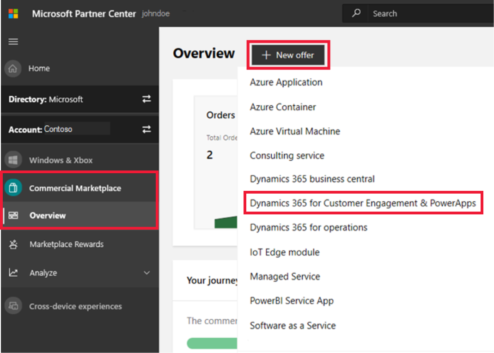

# Create a Dynamics 365 for Customer Engagement & PowerApps offer

This topic explains how to create a new Dynamics 365 for Customer Engagement & PowerApps offer. All apps for Dynamics 365 for Customer Engagement (PowerApps, Sales, Service, Project Service, and Field Service) must go through our certification process and support a trial experience. The certification process checks your solution for standard requirements, compatibility, and proper practices. The trial experience allows users to deploy your solution to a live Dynamics 365 environment.

Before starting, [Create a Commercial Marketplace account in Partner Center](https://docs.microsoft.com/azure/marketplace/partner-center-portal/create-account) if you haven't done so yet. Ensure your account is enrolled in the commercial marketplace program.

## Create a new offer

1. Sign in to [Partner Center](https://partner.microsoft.com/dashboard/home).
2. In the left-nav menu, select **Commercial Marketplace** > **Overview**.
3. On the Overview page, select **+ New offer** > **Dynamics 365 for Customer Engagement & PowerApps**.

    

> [!NOTE]
> After an offer is published, edits made to it in Partner Center only appear in storefronts after republishing the offer. Make sure you always republish after making changes.

## New offer

Enter an **Offer ID**. This is a unique identifier for each offer in your account.

- This ID is visible to customers in the web address for the marketplace offer and Azure Resource Manager templates, if applicable.
- Use only lowercase letters and numbers. It can include hyphens and underscores, but no spaces, and is limited to 50 characters. For example, if you enter **test-offer-1**, the offer web address will be `https://azuremarketplace.microsoft.com/marketplace/../test-offer-1`.
- The Offer ID can't be changed after you select **Create**.

Enter an **Offer alias**. This is the name used for the offer in Partner Center.

- This name isn't used in the marketplace and is different from the offer name and other values shown to customers.
- This can't be changed after you select **Create**.

Select **Create** to generate the offer and continue.

## Offer setup

Follow these steps to set up your offer.

### How do you want potential customers to interact with this listing offer?

Select the option you'd like to use for this offer.

#### Get it now (free)

List your offer to customers for free by providing a valid URL (beginning with *http* or *https*) where they can access your app.  For example, `https://contoso.com/my-app`.

#### Free trial (listing)

List your offer to customers with a link to a free trial by providing a valid URL (beginning with `http` or `https`) where they can get a trial.  For example, `https://contoso.com/trial/my-app`. Offer listing free trials are created, managed, and configured by your service and do not have subscriptions managed by Microsoft.

> [!NOTE]
> The tokens your application will receive through your trial link can only be used to obtain user information through Azure Active Directory (Azure AD) to automate account creation in your app. Microsoft accounts are not supported for authentication using this token.

#### Contact me

Collect customer contact information by connecting your Customer Relationship Management (CRM) system. The customer will be asked for permission to share their information. These customer details, along with the offer name, ID, and marketplace source where they found your offer, will be sent to the CRM system that you've configured. For more information about configuring your CRM, see [Customer leads](#customer-leads).

Select **Save draft** before continuing.

### Test drive

A test drive is a great way to showcase your offer to potential customers by giving them the option to "try before you buy", resulting in increased conversion and the generation of highly qualified leads. To learn more, start with [What is test drive](../what-is-test-drive.md).

To enable a test drive for a fixed period of time, select the **Enable a test drive** check box. To remove test drive from your offer, clear this check box.

### Customer leads

[!INCLUDE [Connect lead management](./includes/connect-lead-management.md)]

For more information, see [Lead management overview](./commercial-marketplace-get-customer-leads.md).

Select **Save draft** before continuing.

## Properties

This page lets you define the categories and industries used to group your offer on the marketplace, your app version, and the legal contracts supporting your offer.

### Category

Select at least one and up to three categories. These are used to place your offer into the appropriate marketplace search areas. Be sure to describe how your offer supports these categories in the offer description.

### Industry

[!INCLUDE [Industry Taxonomy](./includes/industry-taxonomy.md)]

### Applicable Dynamics 365 products

Select all of the Dynamics 365 products this offer applies to.

### App version

Enter the version number of your offer. Customers will see this version listed on the offer's detail page. If you are only updating the version number due to marketing/descriptive changes, check the **Marketing only change** box. This option allows the offer to bypass the certification and provisioning stages.

### Terms and conditions

Provide your own legal terms and conditions here. You can also provide the address where your terms and conditions can be found. Customers will be required to accept these terms before they can try your offer.

Select **Save draft** before continuing.

## Offer listing

This page displays the languages in which your offer will be listed. Currently, **English (United States)** is the only available option.

Define marketplace details for each language/market here, such as offer name, description, and images. Select the language/market name to provide this information.

> [!NOTE]
> Offer listing content (such as the description, documents, screenshots, and terms of use) is not required to be in English, as long as the offer description begins with the phrase, "This application is available only in [non-English language]." It is also acceptable to provide a *Useful Link URL* to offer content in a language other than the one used in the Offer listing content.

Here's an example of how offer information appears in Microsoft AppSource (any listed prices are for example purposes only and not intended to reflect actual costs):

:::image type="content" source="media/example-azure-marketplace-d365-customer-engagement.png" alt-text="Illustrates how this offer appears in Microsoft AppSource.":::

#### Call-out descriptions

1. Logo
2. Products
3. Categories
4. Support address (link)
5. Terms of use address (link)
6. Offer name
7. Description
8. Screenshots/videos

### Name

The name you enter here will be shown to customers as the title of your offer listing. This field is pre-populated with the text you entered for **Offer alias** when you created the offer, but you can change this value. This name may be trademarked (and you may include trademark or copyright symbols). The name can't be more than 50 characters and can't include any emojis.

### Short description

Provide a short description of your offer, up to 100 characters. This description may be used in marketplace search results.

### Description

[!INCLUDE [Long description-1](./includes/long-description-1.md)]

[!INCLUDE [Long description-2](./includes/long-description-2.md)]

[!INCLUDE [Rich text editor](./includes/rich-text-editor.md)]

### Search keywords

You can optionally enter up to three search keywords to help customers find your offer in the marketplace. For best results, also use these keywords in your description.

### Products your app works with

If you want to let customers know that your app works with specific products, enter up to three product names here.

### Support URLs

This section lets you provide links to help customers understand more about your offer.

#### Help link

Enter the address where customers can learn more about your offer.

#### Privacy policy URL

Enter the address to your organization's privacy policy. You are responsible for ensuring your app complies with privacy laws and regulations, and for providing a valid privacy policy.

### Contacts

Provide the name, email, and phone number for a **Support contact** and an **Engineering contact**. This info is not shown to customers, but will be available to Microsoft and may be provided to CSP partners.

In the **Support contact** section, you must also provide the **Support URL** where CSP partners can find support for your offer.

### Supporting documents

Provide at least one (and up to three) related marketing documents here, such as white papers, brochures, checklists, or presentations, in PDF format.

### Marketplace images

Provide logos and images for your offer. All images must be in PNG format.

>[!NOTE]
>If you have an issue uploading files, make sure your local network does not block the https://upload.xboxlive.com service used by Partner Center.

#### Store logos

Provide your offer's logo in three pixel sizes:
- **Small** (required; 48 x 48)
- **Large** (required; 216 x 216)
- **Wide** (optional; 255 x 115)

#### Screenshots

Add screenshots that show how your offer works. At least one screenshot is required, and you can add up to five. All screenshots must be 1280 x 720 pixels.

#### Videos

You can optionally add up to four videos that demonstrate your offer. These videos should be hosted on YouTube and/or Vimeo. For each one, enter the video's name, its URL, and a thumbnail image of the video (1280 x 720 pixels)

#### Additional marketplace listing resources

[Best practices for marketplace offer listings](https://docs.microsoft.com/azure/marketplace/gtm-offer-listing-best-practices)

Select **Save draft** before continuing.

## Availability

This page lets you define where and how to make your offer available.

### Markets

Specify the markets in which your offer should be available. To do so, select **Edit markets**, which will display the **Market selection** popup window.

By default, no markets are selected, but you must select at least one market in order to publish your offer. Choose  **Select all** to make your offer available in every possible market, or select the specific markets that you want to add.

Your selections here apply only to new acquisitions; if someone already has your app in a certain market and you later remove that market, the people who already have the offer in that market can continue to use it but no new customers in that market will be able to get your offer.

> [!IMPORTANT]
> It is your responsibility to meet any local legal requirements, even if those requirements aren't listed here or in Partner Center. Even if you select all markets, local laws and restrictions or other factors may prevent certain offers from being listed in some countries and regions.

### Preview audience

Before you publish your offer live to the broader marketplace offer, you'll first need to make it available to a limited **Preview audience**. Enter a **Hide key** (any string using only lowercase letters and/or numbers) here. Members of your preview audience can use this hide key as a token to view a preview of your offer in the marketplace.

Then, when you're ready to make your offer available and remove the preview restriction, you'll need to remove the **Hide key** and publish again.

Select **Save draft** before continuing.

## Technical configuration

This page defines the technical details used to connect to your offer. This connection enables us to provision your offer for the end customer if they choose to acquire it.

### Base license model

The base license model determines how customers are assigned your application in the CRM Admin Center. Select **Resource** for instance-based licensing or **User** if licenses are assigned one per tenant.

### Requires S2S outbound and CRM Secure Store Access

Check this box to enable configuration of CRM Secure Store or Server-to-Server (S2S) outbound access. This feature requires specialized consideration from the Dynamics 365 Team during the certification phase. Microsoft will contact you to complete additional steps to support this feature.

### Application configuration URL

Provide the URL for the configuration web page that enables the customer to configure your app.

### CRM package

In the **URL of your package location** field, enter the URL of an Azure Blob Storage account that contains the uploaded CRM package .zip file. Include a read-only SAS key in the URL so Microsoft can pick up your package for verification.

> [!IMPORTANT]
> To avoid a publishing block, make sure that the expiration date in the URL of your Blob storage hasn’t expired. You can revise the date by accessing your policy. We recommend the **Expiry time** be at least one month in the future.

Select the box labeled **There is more than one CRM package in my package file**, if applicable. If so, be sure to include all the packages in your .zip file.

For detailed information on how to build your package and update its structure, see [Step 3: Create an AppSource package for your app](https://docs.microsoft.com/powerapps/developer/common-data-service/create-package-app-appsource).

### CRM package availability

In this section, select **+ Add region** to specify the geographic regions in which your CRM package will be available to customers. Deploying to the following sovereign regions require special permission and validation during the certification process: [Germany](https://docs.microsoft.com/azure/germany/), [US Government Cloud](https://docs.microsoft.com/azure/azure-government/documentation-government-welcome), and TIP.

By default, the **Application configuration URL** you entered above will be used for each region. If you prefer, you can enter a separate Application Configuration URL for one or more specific regions. 

Select **Save draft** before continuing.

## Test drive technical configuration

This page lets you set up a demonstration ("test drive") that allows customers to try your offer before purchasing it. Learn more in [What is test drive](../what-is-test-drive.md).

To enable a test drive, select the **Enable a test drive** check box on the [Offer setup](#test-drive) tab. To remove test drive from your offer, clear this check box.

When you've finished setting up your test drive, select **Save draft** before continuing.

## Supplemental content

This page lets you provide additional information about your offer to help us validate your offer. This information is not shown to customers or published to the marketplace.

### Key usage scenario

Upload a PDF file that lists your offer's key usage scenarios. All scenarios may be verified by our validation team before we approve your offer for the marketplace.

Select **Save draft** before continuing.

## Publish

### Submit offer to preview

After you have completed all the required sections of the offer, select **Review and publish** at the upper-right corner of the portal.

If it's your first time publishing this offer, you can:

- See the completion status for each section of the offer.
    - **Not started** - The section has not been touched and should be completed.
    - **Incomplete** - The section has errors that need to be fixed or requires more information to be provided. Go back to the section(s) and update it.
    - **Complete** - The section is complete, all required data has been provided and there are no errors. All sections of the offer must be in a complete state before you can submit the offer.
- In the **Notes for certification** section, provide testing instructions to the certification team to ensure that your app is tested correctly, in addition to any supplementary notes helpful for understanding your app.
- Submit the offer for publishing by selecting **Submit**. We will send you an email to let you know when a preview version of the offer is available for you to review and approve. Return to Partner Center and select **Go-live** for the offer to publish to the public.

## Next step

- [Update an existing offer in the Commercial Marketplace](./update-existing-offer.md)
