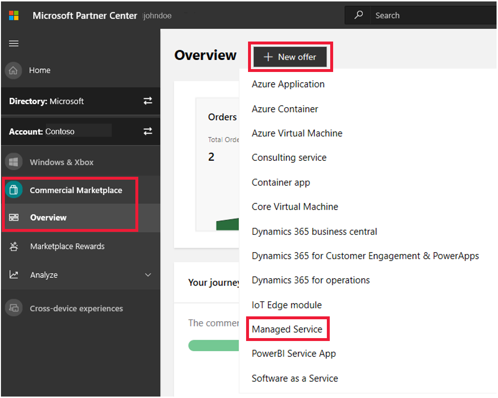

# Create a Managed Service offer

Managed Service offers help to enable [Azure Lighthouse](../../lighthouse/overview.md) scenarios. When a customer accepts a Managed Service offer, they are then able to onboard resources for [Azure delegated resource management](../../lighthouse/concepts/azure-delegated-resource-management.md). Before starting, [Create a Commercial Marketplace account in Partner Center](https://docs.microsoft.com/azure/marketplace/partner-center-portal/create-account) if you haven't done so yet. Ensure your account is enrolled in the commercial marketplace program.

You must have a [Silver or Gold Cloud Platform competency level](https://partner.microsoft.com/membership/cloud-platform-competency) or be an [Azure Expert MSP](https://partner.microsoft.com/membership/azure-expert-msp) to publish a Managed Service offer.

## Create a new offer

1. Sign in to [Partner Center](https://partner.microsoft.com/dashboard/home).
2. In the left-nav menu, select **Commercial Marketplace** > **Overview**.
3. On the Overview page, select **+ New offer** > **Managed Service**.

    

>[!NOTE]
>After an offer is published, edits made to it in Partner Center only appear in storefronts after republishing the offer. Make sure you always republish after making changes.

## New offer

Enter an **Offer ID**. This is a unique identifier for each offer in your account.

* This ID is visible to customers in the web address for the marketplace offer and Azure Resource Manager templates, if applicable.
* Use only lowercase letters and numbers. It can include hyphens and underscores, but no spaces, and is limited to 50 characters. For example, if you enter **test-offer-1**, the offer web address will be `https://azuremarketplace.microsoft.com/marketplace/../test-offer-1`.
* The Offer ID can't be changed after you select **Create**.

Enter an **Offer alias**. This is the name used for the offer in Partner Center.

* This name isn't used in the marketplace and is different from the offer name and other values shown to customers.
* Th Offer alias can't be changed after you select **Create**.

Select **Create** to generate the offer and continue.

## Offer setup

### Customer leads

[!INCLUDE [Connect lead management](./includes/connect-lead-management.md)]

Per the [Managed Services certification policies](https://docs.microsoft.com/legal/marketplace/certification-policies#700-managed-services), a **Lead Destination** is required. This will create a record in your CRM system each time a customer deploys your offer.

For more information, see [Lead management overview](./commercial-marketplace-get-customer-leads.md).

Select **Save draft** before continuing.

## Properties

This page lets you define the categories used to group your offer on the marketplace and the legal contracts supporting your offer.

### Category

Select a minimum of one and a maximum of five categories which will be used to place your offer into the appropriate marketplace search areas. Be sure to call out how your offer supports these categories in the offer description.

### Terms and conditions

Provide your own legal terms and conditions in the **Terms and conditions** field. You can also provide the URL where your terms and conditions can be found. Customers will be required to accept these terms before they can try your offer.

Select **Save draft** before continuing.

## Offer listing

This page lets you define marketplace details (such as offer name, description, and images) for your offer.

> [!NOTE]
> Offer listing content (such as the description, documents, screenshots, and terms of use) is not required to be in English, as long as the offer description begins with the phrase, "This application is available only in [non-English language]." It is also acceptable to provide a *Useful Link URL* to offer content in a language other than the one used in the Offer listing content.

Here's an example of how offer information appears in the Azure portal:

:::image type="content" source="media/example-managed-services.png" alt-text="Illustrates how this offer appears in the Azure portal.":::

#### Call-out descriptions

1. Title
2. Description
3. Useful links
4. Screenshots

### Name

The name you enter here will be shown to customers as the title of your offer listing. This field is pre-populated with the text you entered for **Offer alias** when you created the offer, but you can change this value. This name may be trademarked (and you may include trademark or copyright symbols). The name can't be more than 50 characters and can't include any emojis.

### Search results summary

Provide a short description of your offer (up to 100 characters), which may be used in marketplace search results.

### Long summary

Provide a longer description of your offer (up to 256 characters). This long summary may also be used in marketplace search results.

### Description

[!INCLUDE [Long description-1](./includes/long-description-1.md)]

[!INCLUDE [Long description-2](./includes/long-description-2.md)]

[!INCLUDE [Long description-3](./includes/long-description-3.md)]

### Privacy policy link

Enter the URL to your organization's privacy policy (hosted on your site). You are responsible for ensuring your app complies with privacy laws and regulations, and for providing a valid privacy policy.

### Useful links

Provide optional supplemental online documents about your solution. Add additional useful links by clicking **+ Add a link**.

### Contact Information

In this section, you must provide the name, email, and phone number for a **Support contact** and an **Engineering contact**. This info is not shown to customers, but will be available to Microsoft, and may be provided to CSP partners.

### Support URLs

If you have support websites for **Azure Global Customers** and/or **Azure Government customers**, provide those URLs here.

### Marketplace images

In this section, you can provide logos and images that will be used when showing your offer to customer. All images must be in .png format.

>[!NOTE]
>If you have an issue uploading files, make sure your local network does not block the https://upload.xboxlive.com service used by Partner Center.

#### Marketplace logos

Provide your offer's logo in four pixel sizes:

- **Small** (48 x 48)
- **Medium** (90 x 90)
- **Large** (216 x 216)
- **Wide** (255 x 115)

Follow these guidelines for your logos:

- The Azure design has a simple color palette. Limit the number of primary and secondary colors on your logo.
- The theme colors of the portal are white and black. Don't use these colors as the background color for your logo. Use a color that makes your logo prominent in the portal. We recommend simple primary colors.
- If you use a transparent background, make sure that the logo and text aren't white, black, or blue.
- The look and feel of your logo should be flat and avoid gradients. Don't use a gradient background on the logo.
- Don't place text on the logo, not even your company or brand name.
- Make sure the logo isn't stretched.

#### Screenshots

Add up to five screenshots that show how your offer works. All screenshots must be 1280 x 720 pixels.

#### Videos

You can optionally add up to five videos that demonstrate your offer. These videos should be hosted on YouTube and/or Vimeo. For each one, enter the video's name, its URL, and a thumbnail image of the video (1280 x 720 pixels).

#### Additional marketplace listing resources

- [Best practices for marketplace offer listings](https://docs.microsoft.com/azure/marketplace/gtm-offer-listing-best-practices)

Select **Save draft** before continuing.

## Preview

Before you publish your offer live to the broader marketplace offer, you'll first need to make it available to a limited preview audience. This lets you confirm how you offer appears in the Azure Marketplace before making it available to customers. Microsoft support and engineering teams will also be able to view your offer during this preview period.

You can define the preview audience by entering Azure subscription IDs in the **Preview Audience** section. You can enter up to 10 subscription IDs manually, or upload a .csv file with up to 100 subscription IDs.

Any customers associated with these subscriptions will be able to view the offer in Azure Marketplace before it goes live. Be sure to include your own subscriptions here so you can preview your offer.

Select **Save draft** before continuing.

## Plan overview

Each offer must have one or more plans (sometimes referred to as SKUs). You might add multiple plans to support different feature sets at different prices or to customize a specific plan for a limited audience of specific customers. Customers can view the plans that are available to them under the parent offer.

On the **Plan overview** page, select **+ Create new plan**. Then enter a **Plan ID** and a **Plan name**. Both of these values can only contain lowercase alphanumeric characters, dashes, and underscores, with a maximum of 50 characters. These values may be visible to customers, and they can't be changed after you publish the offer.

Select **Create** once you have entered these values to continue working on your plan. There are three sections to complete: **Plan listing**, **Pricing and availability**, and **Technical configuration**.

### Plan listing

First, provide a **Search results summary** for the plan. This is a short description of your plan (up to 100 characters), which may be used in marketplace search results.

Next, enter a **Description** that provides a more detailed explanation of the plan.

### Pricing and availability

Currently, there is only one pricing model that can be used for Managed Service offer: **Bring your own license (BYOL)**. This means that you will bill your customers directly for costs related to this offer, and Microsoft does not charge any fees to you.

The **Plan visibility** section lets you indicate if this plan should be [private](../../marketplace/private-offers.md). If you leave the **This is a private plan** box unchecked, your plan will not be restricted to specific customers (or to a certain number of customers).

To make this plan available only to specific customers, select **Yes**. When you do so, you'll need to identify the customers by providing their subscription IDs. These can be entered one by one (for up to 10 subscriptions) or by uploading a .csv file (for a maximum of 10,000 subscriptions across all plans). Be sure to include your own subscriptions here so you can test and validate the offer.

> [!IMPORTANT]
> Once a plan has been published as public, you can't change it to private. To control which customers can accept your offer and delegate resources, use a private plan. With a public plan, you can't restrict availability to certain customers or even to a certain number of customers (although you can stop selling the plan completely if you choose to do so). You can [remove access to a delegation](../../lighthouse/how-to/remove-delegation.md) after a customer accepts an offer only if you included an **Authorization** with the **Role Definition** set to [Managed Services Registration Assignment Delete Role](../../role-based-access-control/built-in-roles.md#managed-services-registration-assignment-delete-role) when you published the offer. You can also reach out to the  customer and ask them to [remove your access](../../lighthouse/how-to/view-manage-service-providers.md#add-or-remove-service-provider-offers).

### Technical configuration

This section of your plan creates a manifest with authorization information for managing customer resources. This information is required in order to enable [Azure delegated resource management](../../lighthouse/concepts/azure-delegated-resource-management.md).

Be sure to review [Tenants, roles, and users in Azure Lighthouse scenarios](../../lighthouse/concepts/tenants-users-roles.md#best-practices-for-defining-users-and-roles) to understand which roles are supported and the best practices for defining your authorizations.

> [!NOTE]
> As noted above, the users and roles in your **Authorization** entries will apply to every customer who purchases the plan. If you want to limit access to a specific customer, you'll need to publish a private plan for their exclusive use.

#### Manifest

First, provide a **Version** for the manifest. Use the format *n.n.n* (for example, 1.2.5).

Next, enter your **Tenant ID**. This is a GUID associated with the Azure Active Directory (Azure AD) tenant ID of your organization; that is, the managing tenant from which you will access your customers' resources. If you don't have this handy, you can find it by hovering over your account name on the upper right-hand side of the Azure portal, or by selecting **Switch directory**.

If you publish a new version of your offer and need to create an updated manifest, select **+ New manifest**. Be sure to increase the version number from the previous manifest version.

#### Authorization

Authorizations define the entities in your managing tenant who can access resources and subscriptions for customers who purchase the plan. Each of these entities are assigned a built-in role that grants specific levels of access.

You can create up to twenty authorizations for each plan.

> [!TIP]
> In most cases, you'll want to assign roles to an Azure AD user group or service principal, rather than to a series of individual user accounts. This lets you add or remove access for individual users without having to update and republish the plan when your access requirements change. When assigning roles to Azure AD groups, [be sure that the the **Group type** is **Security** and not **Office 365**](../../active-directory/fundamentals/active-directory-groups-create-azure-portal.md). For additional recommendations, see [Tenants, roles, and users in Azure Lighthouse scenarios](../../lighthouse/concepts/tenants-users-roles.md).

For each **Authorization**, you'll need to provide the following. You can then select **+ Add authorization** as many times as needed to add more users and role definitions.

- **Azure AD Object ID**: The Azure AD identifier of a user, user group, or application which will be granted certain permissions (as defined by the Role Definition) to your customers' resources.
- **Azure AD Object Display Name**: A friendly name to help the customer understand the purpose of this authorization. The customer will see this name when delegating resources.
- **Role Definition**: Select one of the available Azure AD built-in roles from the list. This role will determine the permissions that the user in the **Azure AD Object ID** field will have on your customers' resources. For descriptions of these roles, see [Built-in roles](../../role-based-access-control/built-in-roles.md) and [Role support for Azure delegated resource management](../../lighthouse/concepts/tenants-users-roles.md#role-support-for-azure-delegated-resource-management).
  > [!NOTE]
  > As applicable new built-in roles are added to Azure, they will become available here, although there may be some delay before they appear.
- **Assignable Roles**: This option will appear only if you have selected User Access Administrator in the **Role Definition** for this authorization. If so, you must add one or more assignable roles here. The user in the **Azure AD Object ID** field will be able to assign these roles to [managed identities](../../active-directory/managed-identities-azure-resources/overview.md), which is required in order to [deploy policies that can be remediated](../../lighthouse/how-to/deploy-policy-remediation.md). Note that no other permissions normally associated with the User Access Administrator role will apply to this user.

> [!TIP]
> To ensure you can [remove access to a delegation](../../lighthouse/how-to/remove-delegation.md) if needed, include an **Authorization** with the **Role Definition** set to [Managed Services Registration Assignment Delete Role](../../role-based-access-control/built-in-roles.md#managed-services-registration-assignment-delete-role). If this role is not assigned, delegated resources can only be removed by a user in the customer's tenant.

Once you've completed all of the sections for your plan, you can select **+ Create new plan** as many times as you need to create additional plans. When you're done, select **Save**.

Select **Save draft** before continuing.

## Publish

### Submit offer to preview

Once you have completed all the required sections of the offer, select **Review and publish** in the upper-right corner of the portal.

If it's your first time publishing this offer, you can:

- See the completion status for each section of the offer.
  - **Not started** - The section has not been touched and needs to be completed.
  - **Incomplete** - The section has errors that need to be fixed or requires more information to be provided. Go back to the section(s) and update it.
  - **Complete** - The section is complete, all required data has been provided and there are no errors. All sections of the offer must be in a complete state before you can submit the offer.
- In the **Notes for certification** section, provide testing instructions to the certification team to ensure that your app is tested correctly, in addition to any supplementary notes helpful for understanding your app.
- Submit the offer for publishing by selecting **Submit**. We will send you an email when a preview version of the offer is available for you to review and approve. Return to Partner Center and select **Go-live** for the offer to publish your offer to the public (or if a private offer, to the private audience).

### Customer experience and offer management

When a customer deploys your offer, they will be able to delegate subscriptions or resource groups for [Azure delegated resource management](../../lighthouse/concepts/azure-delegated-resource-management.md). For more about this process, see [The customer onboarding process](../../lighthouse/how-to/publish-managed-services-offers.md#the-customer-onboarding-process).

You can [publish an updated version of your offer](update-existing-offer.md) at any time. For example, you may want to add a new role definition to a previously-published offer. When you do so, customers who have already added the offer will see an icon in the [**Service providers**](../../lighthouse/how-to/view-manage-service-providers.md) page in the Azure portal that lets them know an update is available. Each customer will be able to review the changes and decide whether they want to update to the new version.

## Next steps

- [Update an existing offer in the Commercial Marketplace](./update-existing-offer.md)
- [Learn about Azure Lighthouse](../../lighthouse/overview.md)
