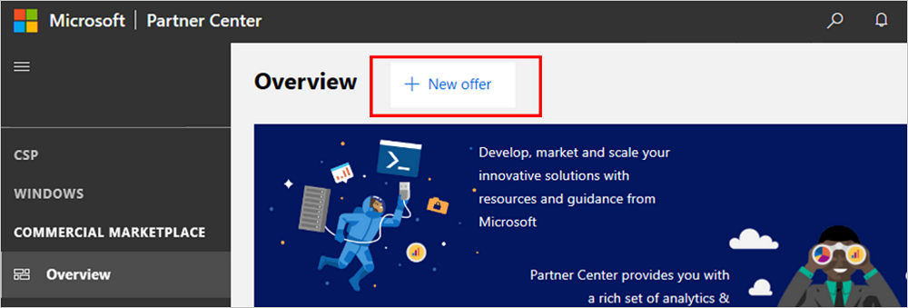

# Create a new Dynamics 365 for Operations offer

This topic explains how to create a new Dynamics 365 for Operations offer. [Microsoft Dynamics 365 for Finance and Operations](https://dynamics.microsoft.com/finance-and-operations) is an enterprise resource planning (ERP) service that supports advanced finance, operations, manufacturing, and supply chain management. All offers for Dynamics 365 for Operations must go through our certification process.

To begin creating Dynamics 365 for Operations offers, ensure that you first [Create a Partner Center account](./create-account.md) and open the [Commercial Marketplace dashboard](https://partner.microsoft.com/dashboard/commercial-marketplace/offers), with the **Overview** page selected.

>[!Note]
> Once an offer has been published, edits to the offer made in Partner Center will only be updated in the system and store fronts after re-publishing. Ensure that you submit the offer for publication after you make changes.

## Create a new offer

Select the **+ New offer** button, then select the **Dynamics 365 for Operations** menu item. The **New offer** dialog box will appear.

### Offer ID and alias

- **Offer ID**: Unique identifier for each offer in your account. This ID will be visible to customers in the URL address for the marketplace offer and Azure Resource Manager templates (if applicable). Offer ID must be lowercase alphanumeric characters (including hyphens and underscores, but no whitespace). This ID is limited to 50 characters and can't be changed after you select **Create**.  For example, if you enter *test-offer-1* here, the offer URL will be `https://azuremarketplace.microsoft.com/marketplace/../test-offer-1`.

- **Offer alias**: The name used to refer to the offer within the Partner Center. This name won't be used in the marketplace, and is different than the offer name and other values that will be shown to customers. This value can't be changed after you select **Create**.

Once you enter your **Offer ID** and **Offer alias**, select **Create**. You'll then be able to work on all of the different parts of your offer.

## Offer setup

The **Offer setup** page asks for the following information. Be sure to select **Save** after completing these fields.

### How do you want potential customers to interact with this listing offer?

Select the option you'd like to use for this offer.

#### Get it now (free)

List your offer to customers for free by providing a valid URL (beginning with *http* or *https*) where they can access your app.  For example: `https://contoso.com/my-app`

#### Free trial (listing)

List your offer to customers with a link to a free trial by providing a valid URL (beginning with *http* or *https*) where they can get a trial.  For example: `https://contoso.com/trial/my-app`. Offer listing free trials are created, managed, and configured by your service and do not have subscriptions managed by Microsoft.

> [!NOTE]
> The tokens your application will receive through your trial link can only be used to obtain user information through Azure Active Directory (Azure AD) to automate account creation in your app. Microsoft accounts are not supported for authentication using this token.

#### Contact me

Collect customer contact information by connecting your Customer Relationship Management (CRM) system. The customer will be asked for permission to share their information. These customer details, along with the offer name, ID, and marketplace source where they found your offer, will be sent to the CRM system that you've configured. For more information about configuring your CRM, see [Connect lead management](#connect-lead-management). 

### Test drive

A test drive is a great way to showcase your offer to potential customers by giving them the option to 'try before you buy', resulting in increased conversion and the generation of highly qualified leads. [Learn more about test drives.](https://docs.microsoft.com/azure/marketplace/cloud-partner-portal/test-drive/what-is-test-drive)

To enable a test drive, check the **Enable a test drive** box. You'll then need to configure a demonstration environment in the [Test drive technical configuration](#test-drive-technical-configuration) configure to let customers try your offer for a fixed period of time.

#### Type of test drive

Select from the following options:

- **[Azure Resource Manager](https://docs.microsoft.com/azure/marketplace/cloud-partner-portal/test-drive/azure-resource-manager-test-drive)**: A deployment template that contains all the Azure resources that comprise your solution. Products that fit this scenario use only Azure resources.
- **[Dynamics 365 for Business Central](https://docs.microsoft.com/azure/marketplace/cloud-partner-portal-orig/cpp-business-central-offer)**: Microsoft hosts and maintains the test drive service (including provisioning and deployment) for a Business Central enterprise resource planning system (finance, operations, supply chain, CRM, etc.).  
- **[Dynamics 365 for Customer Engagement](https://docs.microsoft.com/azure/marketplace/cloud-partner-portal/dyn365ce/cpp-customer-engagement-offer)**: Microsoft hosts and maintains the test drive service (including provisioning and deployment) for a Customer Engagement system (sales, service, project service, field service, etc.).  
- **[Dynamics 365 for Operations](https://docs.microsoft.com/azure/marketplace/cloud-partner-portal-orig/cpp-dynamics-365-operations-offer)**: Microsoft hosts and maintains the test drive service (including provisioning and deployment) for a Finance and Operations enterprise resource planning system (finance, operations, manufacturing, supply chain, etc.). 
- **[Logic app](https://docs.microsoft.com/azure/marketplace/cloud-partner-portal/test-drive/logic-app-test-drive)**: A deployment template encompassing all complex solution architectures. Any custom products should use this type of Test Drive.
- **[Power BI](https://docs.microsoft.com/power-bi/service-template-apps-overview)**: An embedded link to a custom-built dashboard. Products that want to demonstrate an interactive Power BI visual should use this type of Test Drive. All you need to upload here is your embedded Power BI URL.

#### Additional test drive resources

- [Test Drive Technical Best Practices](https://github.com/Azure/AzureTestDrive/wiki/Test-Drive-Best-Practices)
- [Test Drive Marketing Best Practices](https://docs.microsoft.com/azure/marketplace/cloud-partner-portal/test-drive/marketing-and-best-practices)
- [Test Drive Overview One Pager](https://assetsprod.microsoft.com/mpn/azure-marketplace-appsource-test-drives.pdf)

## Connect lead management

[!INCLUDE [Connect lead management](./includes/connect-lead-management.md)]

For more information, see [Lead management overview](./commercial-marketplace-get-customer-leads.md).

Remember to **Save** before moving on to the next section.

## Properties

The **Properties** page lets you define the categories and industries used to group your offer on the marketplace, your app version, and the legal contracts supporting your offer. Select **Save** after completing this page.

### Category

Select a minimum of one and a maximum of three categories. These categories will be used to place your offer into the appropriate marketplace search areas. Be sure to call out how your offer supports these categories in the offer description.

### Industry

[!INCLUDE [Industry Taxonomy](./includes/industry-taxonomy.md)]

### App version

Enter the version number of your offer. Customers will see this version listed on the offer's detail page.

### Standard Contract

To simplify the procurement process for customers and reduce legal complexity for software vendors, Microsoft offers a Standard Contract template in order to help facilitate a transaction in the marketplace.

Rather than crafting custom terms and conditions, you can choose to offer your software under the Standard Contract, which customers only need to vet and accept once.

The Standard Contract can be found here: https://go.microsoft.com/fwlink/?linkid=2041178

To use the Standard Contract, check the **Use Standard Contract?** box.

#### Terms of use

If you do not check the **Use Standard Contract?** box, you'll need to provide your own legal terms of use in the **Terms of use** field. Enter up to 10,000 characters of text, or, if your terms of use require a longer description, provide the URL where your additional license terms can be found. Customers will be required to accept these terms before they can try your app.

## Offer listing

The Offer listing page displays the languages in which your offer will be listed. Currently, **English (United States)** is the only available option.

You will need to define marketplace details (offer name, description, images, etc.) for each language/market. Select the language/market name to provide this info.

> [!NOTE]
> Offer listing content (such as the description, documents, screenshots, terms of use, etc.) is not required to be in English, as long as the offer description begins with the phrase, "This application is available only in [non-English language]." It is also acceptable to provide a *Useful Link URL* to offer content in a language other than the one used in the Offer listing content.

### Name

The name you enter here will be shown to customers as the title of your offer listing. This field is prepopulated with the text you entered for **Offer alias** when you created the offer, but you can change this value. This name may be trademarked (and you may include trademark or copyright symbols). The name can't be more than 50 characters and can't include any emojis.

### Short description

Provide a short description of your offer (up to 100 characters). This description may be used in marketplace search results.

### Description

Provide a longer description of your offer (up to 3,000 characters). This description will be displayed to customers in the marketplace listing overview. Include your offer's value proposition, key benefits, category and/or industry associations, in-app purchase opportunities, and any required disclosures.

Some tips for writing your description:  

- Clearly describe your offer's value proposition in the first few sentences of your description. Include the following information in your value proposition:
  - Description of the product
  - The type of user that benefits from the product
  - Customer needs or pain that the product addresses
- Keep in mind that the first few sentences might be displayed in search engine results.  
- Do not rely on features and functionality to sell your product. Instead, focus on the value you deliver.  
- Use industry-specific vocabulary or benefit-based wording as much as possible.
- Consider using HTML tags to format your description and make it more engaging.

To make your offer description more engaging, use the rich text editor to format your description.

Use the following instructions to use the rich text editor:

- To change the format of your content, highlight the text that you want to format and select a text style, as shown below:

     

- To add a bulleted or numbered list to the text, use the options below:

     

- To add or remove indentation to the text, use the options below:

     

### Search keywords

You can optionally enter up to three search keywords to help customers find your offer in the marketplace. For best results, try to use these keywords in your description as well.

### Products your app works with

If you want to let customers know that your app works with specific products, enter up to three product names here.

### Support URLs

This section lets you provide links to help customers understand more about your offer.

#### Help link

Enter the URL where customers can learn more about your offer.

#### Privacy policy URL

Enter the URL to your organization's privacy policy. You are responsible for ensuring your app complies with privacy laws and regulations, and for providing a valid privacy policy.

### Contacts

In this section, provide the name, email, and phone number for a **Support contact** and an **Engineering contact**. This information isn't shown to customers, but will be available to Microsoft, and may be provided to CSP partners.

In the **Support contact** section, provide the **Support URL** where CSP partners can find support for your offer.

### Supporting documents

Provide at least one (and up to three) related marketing documents here, such as white papers, brochures, checklists, or presentations. These documents must be in .pdf format.

### Marketplace images

In this section, you can provide logos and images that will be used when showing your offer to customer. All images must be in .png format.

#### Store logos

Provide your offer's logo in two sizes: **Small (48 x 48)** and **Large (216 x 216)**.

#### Hero

The hero image is optional. If you provide one, it must measure 815 x 290 pixels.

#### Screenshots

Add screenshots that show how your offer works. At least one screenshot is required, and you can add up to five. All screenshots must be 1280 x 720 pixels.

#### Videos

You can optionally add up to four videos that demonstrate your offer. These videos should be hosted on YouTube and/or Vimeo. For each one, enter the video's name, its URL, and a thumbnail image of the video (1280 x 720 pixels)

#### Additional marketplace listing resources

- [Best practices for marketplace offer listings](https://docs.microsoft.com/azure/marketplace/gtm-offer-listing-best-practices)

## Availability

The **Availability** page gives you options about where and how to make your offer available.

### Markets

This section lets you specify the markets in which your offer should be available. To do so, select **Edit markets,** which will display the **Market selection** popup window.

By default, no markets are selected. Select at least one market to publish your offer. Click  **Select all** to make your offer available in every possible market, or select the specific markets that you want to add. Once you've finished, select **Save**.

Your selections here apply only to new acquisitions; if someone already has your app in a certain market, and you later remove that market, the people who already have the offer in that market can continue to use it, but no new customers in that market will be able to get your offer.

> [!IMPORTANT]
> It is your responsibility to meet any local legal requirements, even if those requirements aren't listed here or in Partner Center.

Keep in mind that even if you select all markets, local laws and restrictions or other factors may prevent certain offers from being listed in some countries and regions.

### Preview audience

Before you publish your offer live to the broader marketplace offer, you'll first need to make it available to a limited **Preview audience**. Enter a **Hide key** (any string using only lowercase letters and/or numbers) here. Members of your preview audience can use this hide key as a token to view a preview of your offer in the marketplace.

Then, when you're ready to make your offer available and remove the preview restriction, you'll need to remove the **Hide key** and publish again.

## Technical configuration

The **Technical configuration** page defines the technical details used to connect to your offer. This connection enables us to provision your offer for the end customer if they choose to acquire it.

### Solution identifier

Provide the solution identifier (GUID) for your solution.

To find your solution identifier:
1. In Microsoft Dynamics Lifecycle Services (LCS), select **Solution Management**.
2. Select your solution, then look for the **Solution Identifier** in the **Package overview**. If the identifier is blank, select **Edit** and republish your package, then try again.

### Release version

Select the version of Dynamics 365 for Finance and Operations that this solution works with.

## Test drive technical configuration

If you selected **Enable a test drive** in the [Offer setup](#offer-setup) page, you'll need to provide details here to let customers experience a test drive of your offer.

The **Test drive** page enables you to set up a demonstration (or "test drive") which will enable customers to try your offer before committing to purchase it. Learn more in the article [What is Test Drive?](https://docs.microsoft.com/azure/marketplace/cloud-partner-portal/test-drive/what-is-test-drive). If you no longer want to provide a test drive for your offer, return to the **[Offer setup](#offer-setup)** page and uncheck **Enable test drive**.

The following types of test drives are available, each with their own technical configuration requirements.

- [Azure Resource Manager](#technical-configuration-for-azure-resource-manager-test-drive)
- [Dynamics 365](#technical-configuration-for-dynamics-365-test-drive)
- [Logic app](#technical-configuration-for-logic-app-test-drive)
- [Power BI](#technical-configuration-not-required-for-power-bi-test-drives) (Technical configuration not required)

### Technical configuration for Azure Resource Manager test drive

A deployment template that contains all the Azure resources that comprise your solution. Products that fit this scenario use only Azure resources. Learn more about setting up an [Azure Resource Manager test drive](https://docs.microsoft.com/azure/marketplace/cloud-partner-portal/test-drive/azure-resource-manager-test-drive).

- **Regions** (required): Currently there are 26 Azure-supported regions where your test drive can be made available. Typically, you will want to make your test drive available in the regions where you anticipate the largest number of customers, so that they can select the closest region for the best performance. You will need to make sure that your subscription is allowed to deploy all of the resources needed in each of the regions you are selecting.

- **Instances**: Select the type (hot or cold) and number of available instances, which will be multiplied by the number of regions where your offer is available.

**Hot**: This type of instance is deployed and awaiting access per selected region. Customers can instantly access *Hot* instances of a test drive, rather than having to wait for a deployment. The tradeoff is that these instances are always running on your Azure subscription, so they will incur a larger uptime cost. It is highly recommended to have at least one *Hot* instance, as most customers don't want to wait for full deployments, resulting in a drop-off in customer usage if no *Hot* instance is available.

**Cold**: This type of instance represents the total number of instances that can possibly be deployed per region. Cold instances require the entire Test Drive Resource Manager template to deploy when a customer requests the test drive, so *Cold* instances are much slower to load than *Hot* instances. The tradeoff is that you only have to pay for the duration of the test drive, it is *not* always running on your Azure subscription as with a *Hot* instance.

- **Test drive Azure Resource Manager template**: Upload the .zip containing your Azure Resource Manager template.  Learn more about creating an Azure Resource Manager template in the quickstart article [Create and deploy Azure Resource Manager templates by using the Azure portal](https://docs.microsoft.com/azure/azure-resource-manager/resource-manager-quickstart-create-templates-use-the-portal).

- **Test drive duration** (required): Enter the length of time that the Test Drive will stay active, in # of hours. The Test Drive terminates automatically after this time period ends. This duration may only be set by a whole number of hours (for example, "2" hours; "1.5" is not valid).

### Technical configuration for Dynamics 365 test drive

Microsoft can remove the complexity of setting up a test drive by hosting and maintaining the service provisioning and deployment using this type of test drive. The configuration for this type of hosted test drive is the same regardless of whether the test drive is targeting a Business Central, Customer Engagement, or Operations audience.

- **Max concurrent test drives** (required): Set the maximum number of customers that can use your test drive at one time. Each concurrent user will consume a Dynamics 365 license while the test drive is active, so you will need to ensure that you have enough licenses available to support the maximum limit set. Recommended value of 3-5.

- **Test drive duration** (required): Enter the length of time that the Test Drive will stay active by defining the number of hours. After this many hours, the session will end and no longer consume one of your licenses. We recommend a value of 2-24 hours depending on the complexity of your offer. This duration may only be set by a whole number of hours (for example, "2" hours; "1.5" is not valid).  The user can request a new session if they run out of time and want to access the test drive again.

- **Instance URL** (required): The URL where the customer will begin their test drive. Typically the URL of your Dynamics 365 instance running your app with sample data installed (for example, https://testdrive.crm.dynamics.com).

- **Instance Web API URL** (required): Retrieve the Web API URL for your Dynamics 365 instance by logging into your Microsoft 365 account and navigating to **Settings** \&gt; **Customization** \&gt; **Developer Resources** \&gt; **Instance Web API (Service Root URL)**, copy the URL found here (for example, https://testdrive.crm.dynamics.com/api/data/v9.0).

- **Role name** (required): Provide the security role name you have defined in your custom Dynamics 365 test drive. This will be assigned to the user during their test drive (for example, test-drive-role).

### Technical configuration for Logic app test drive

Any custom products should use this type of test drive deployment template, which encompasses a variety of complex solution architectures. For more information about setting up Logic App test drives, visit [Operations](https://github.com/Microsoft/AppSource/blob/master/Setup-your-Azure-subscription-for-Dynamics365-Operations-Test-Drives.md) and [Customer Engagement](https://github.com/Microsoft/AppSource/wiki/Setting-up-Test-Drives-for-Dynamics-365-app) on GitHub.

- **Region** (required, single-selection dropdown list): Currently there are 26 Azure-supported regions where your test drive can be made available. The resources for your Logic app will be deployed in the region you select. If your Logic App has any custom resources stored in a specific region, make sure that region is selected here. The best way to ensure you have custom resources for your region available is to fully deploy your Logic App locally on your Azure subscription in the portal and verify that it functions correctly before making this selection.

- **Max concurrent test drives** (required): Set the maximum number of customers that can use your test drive at one time. These test drives are already deployed, enabling customers to instantly access them without waiting for a deployment.

- **Test drive duration** (required): Enter the length of time that the Test Drive will stay active, in # of hours. The test drive terminates automatically after this time period ends.

- **Azure resource group name** (required): Enter the [Azure resource group](https://docs.microsoft.com/azure/azure-resource-manager/resource-group-overview#resource-groups) name where your Logic App test drive is saved.

- **Azure logic app name** (required): Enter the name of the Logic app that assigns the test drive to the user. This Logic app must be saved in the Azure resources group above.

- **Deprovision logic app name** (required): Enter the name of the Logic app that deprovisions the test drive once the customer is finished. This Logic app must be saved in the Azure resources group above.

### Technical configuration not required for Power BI test drives

Products that want to demonstrate an interactive Power BI visual can use an embedded link to share a custom-built dashboard as their test drive, no further technical configuration required. Learn more about setting up[Power BI](https://docs.microsoft.com/power-bi/service-template-apps-overview) template apps.

### Deployment subscription details

In order to deploy the Test Drive on your behalf, create and provide a separate, unique Azure Subscription. (Not required for Power BI test drives).

- **Azure subscription ID** (required for Azure Resource Manager and Logic apps): Enter the subscription ID to grant access to your Azure account services for resource usage reporting and billing. We recommend that you consider [creating a separate Azure subscription](https://docs.microsoft.com/azure/billing/billing-create-subscription) to use for test drives if you don't have one already. You can find your Azure subscription ID by logging in to the [Azure portal](https://portal.azure.com/) and navigating to the **Subscriptions** tab of the left-side menu. Selecting the tab will display your subscription ID (for example, "a83645ac-1234-5ab6-6789-1h234g764ghty").

- **Azure AD tenant ID** (required): Enter your Azure Active Directory (AD) [tenant ID](https://docs.microsoft.com/azure/active-directory/develop/howto-create-service-principal-portal#get-values-for-signing-in). To find this ID, sign in to the [Azure portal](https://portal.azure.com/), select the Active Directory tab in the left-menu, select **Properties**, then look for the **Directory ID** number listed (for example, 50c464d3-4930-494c-963c-1e951d15360e). You can also look up your organization's tenant ID using your domain name URL at:  [https://www.whatismytenantid.com](https://www.whatismytenantid.com).

- **Azure AD tenant name** (required for Dynamic 365): Enter your Azure Active Directory (AD) name. To find this name, sign in to the [Azure portal](https://portal.azure.com/), in the upper right corner your tenant name will be listed under your account name.

- **Azure AD app ID** (required): Enter your Azure Active Directory (AD) [application ID](https://docs.microsoft.com/azure/active-directory/develop/howto-create-service-principal-portal#get-values-for-signing-in). To find this ID, sign in to the [Azure portal](https://portal.azure.com/), select the Active Directory tab in the left-menu, select **App registrations**, then look for the **Application ID** number listed (for example, 50c464d3-4930-494c-963c-1e951d15360e).

- **Azure AD app client secret** (required): Enter your Azure AD application [client secret](https://docs.microsoft.com/azure/active-directory/develop/howto-create-service-principal-portal#certificates-and-secrets). To find this value, sign in to the [Azure portal](https://portal.azure.com/). Select the **Azure Active Directory** tab in the left menu, select **App registrations**, then select your test drive app. Next, select **Certificates and secrets**, select **New client secret**, enter a description, select **Never** under **Expires**, then choose **Add**. Make sure to copy down the value. (Don't navigate away from the page before you make a note of the value or you won't have access to the value.)

Remember to **Save** before moving on to the next section!

### Test drive marketplace listings

The **Marketplace listing** option found under the **Test drive** tab displays the languages in which your test drive is available. Currently, **English (United States)** is the only location available. Select the language name to enter info that describes the test drive experience.

- **Description** (required): Describe your test drive, what will be demonstrated, objectives for the user to experiment with, features to explore, and any relevant information to help the user determine whether to acquire your offer. Up to 3,000 characters of text can be entered in this field.

- **Access information** (required for Azure Resource Manager and Logic test drives): Explain what a customer needs to know in order to access and use this test drive. Walk through a scenario for using your offer and exactly what the customer should know to access features throughout the test drive. Up to 10,000 characters of text can be entered in this field.

- **User Manual** (required): An in-depth walk-through of your test drive experience. The User Manual should cover exactly what you want the customer to gain from experiencing the test drive and serve as a reference for any questions that they may have. The file must be in PDF format and be named (255 characters max) after uploading.

- **Videos: Add videos** (optional): Videos can be uploaded to YouTube or Vimeo and referenced here with a link and thumbnail image (533 x 324 pixels) so that a customer can view a walk-through of information to help them better understand the test drive, including how to successfully use the features of your offer and understand scenarios that highlight their benefits.
  - **Name** (required)
  - **URL (YouTube or Vimeo only)** (required)
  - **Thumbnail (533 x 324px)**: Image file must be in PNG format.

## Supplemental content

This page lets you provide additional information about your offer to help us validate your offer. This information is not shown to customers or published to the marketplace.

### Validation assets

Upload a [Customization Analysis Report (CAR)](https://docs.microsoft.com/dynamics365/unified-operations/dev-itpro/dev-tools/customization-analysis-report) in this section. This report is generated by analyzing your customization and extension models, based on a predefined set of best practice rules.

This file must be in .xls or .xlsx format. If you have more than one report, you can upload a .zip file containing all of the reports.

### Does solution include localizations?

Select **Yes** if the solution enables use of local standards and policies (for example, if it accommodates the different payroll rules required by different countries/regions). Otherwise, select **No**.

### Does solution enable translations?

Answer **Yes** if the text in your solution can be translated into other languages. Otherwise, select **No**.

## Publish

### Submit offer to preview

Once you have completed all the required sections of the offer, select **publish** in the upper right corner of the portal. You will be redirected to the **Review and publish** page.

If it's your first time publishing this offer, you can:

- See the completion status for each section of the offer.
    - *Not started* - means the section has not been touched and should be completed.
    - *Incomplete* - means the section has errors that need to be fixed or requires more information to be provided. Go back to the section(s) and update it.
    - *Complete* - means the section is complete, all required data has been provided and there are no errors. All sections of the offer must be in a complete state before you can submit the offer.
- In the **Notes for certification** section, provide testing instructions to the certification team to ensure that your app is tested correctly, in addition to any supplementary notes helpful for understanding your app.
- Submit the offer for publishing by selecting **Submit**. We will send you an email to let you know when a preview version of the offer is available for you to review and approve. Return to Partner Center and select **Go-live** for the offer to publish your offer to the public (or if a private offer, to the private audience).

## Next steps

- [Update an existing offer in the Commercial Marketplace](./update-existing-offer.md)
