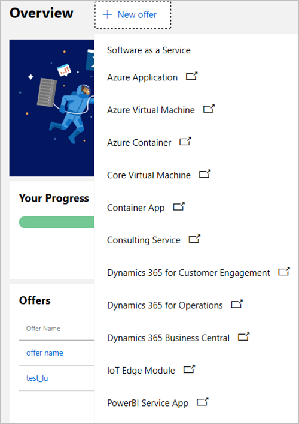
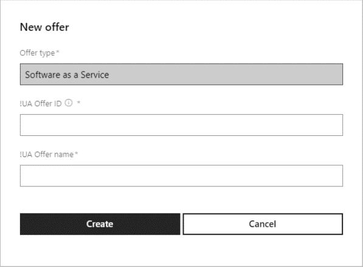
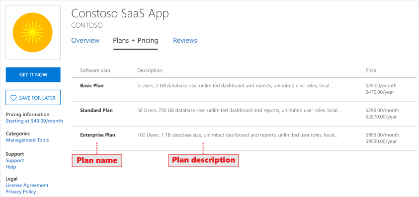

# Create a new SaaS offer

To begin creating Software as a Service (SaaS) offers, ensure that you first [Create a Partner Center account](./create-account.md) and open the [Commercial Marketplace dashboard](https://partner.microsoft.com/dashboard/commercial-marketplace/offers), with the **Overview** tab selected.

Select the + **New offer…** button, then select the **Software as a Service** menu item. 

If you select one of the other offer types, you will be redirected to the older [Cloud Partner Portal](https://cloudpartner.azure.com/).  Only SaaS offers are available in the Commercial Marketplace portal on Partner Center at this time. 

The **New offer** dialog box is displayed. 

## Offer ID and alias

- **Offer ID**: Unique identifier for each offer in your account. This ID will be visible to customers in the URL address for the marketplace offer and Azure Resource Manager templates (if applicable). Offer ID must be lowercase, alphanumeric (including hyphens and underscores, but no whitespace). This is limited to 50 characters and can’t be changed after you select *Create*.  
Example: test-offer-1 
 Resulting in the URL: `https://azuremarketplace.microsoft.com/marketplace/../test-offer-1`

- **Offer alias**: The name used to refer to the offer within the Partner Center portal. This name won't be used in the marketplace and is different than the *Offer Name* and other values that will be shown to customers. This value can't be changed after you select *Create*.

 Example: Test Offer 1&#8482;

Select **Create**.  An **Offer overview** page is created for this offer.  

<!---

-->

## Offer overview

The **Offer overview** page includes: 

- The **Publishing status** displays a visual representation of the steps required to publish this offer and how long each step will take to complete. Incomplete publishing step icons will be greyed out. 

- The **Offer overview** menu contains a list of links for performing operations on this offer. This list of operations will change based on the selection you make for your offer.  
    - If the offer is a draft – Delete draft 
    - If the offer is live – Stop sell offer 
    - If the offer is in preview – Go-live 
    - If you haven’t completed publisher sign out – Cancel publish

## Offer setup

The **Offer setup** tab asks for the following information. Select **Save** after completing these fields.

- **Would you like to sell through Microsoft?** (Yes/No)
    - **Yes**, you would like to sell your offer through Microsoft, with Microsoft hosting marketplace transactions on your behalf; or 
    - **No**, you would prefer to just list your offer through the marketplaces, processing any monetary transactions independently of Microsoft.    

### Sell through Microsoft

Selling through Microsoft provides better customer discovery and acquisition, allows Microsoft to host marketplace transactions on your behalf, and takes advantage of Microsoft’s globally available commerce capabilities.

#### SaaS Offer Requirements

In order to list Software as a Service (SaaS) offers with Commercial Marketplace on Partner Center, the following criteria must be met:

- Your offer must use [Azure Active Directory (Azure AD)](https://azure.microsoft.com/services/active-directory/) for identity management and authentication.
- Your offer must use [SaaS Fulfillment APIs](https://docs.microsoft.com/azure/marketplace/partner-center-portal/pc-saas-fulfillment-api-v2) to integrate with the Azure Marketplace.
- For more extensive requirements, see the [SaaS Offer Publishing Guide](https://docs.microsoft.com/azure/marketplace/marketplace-saas-applications-technical-publishing-guide).

#### SaaS on Azure Billing infrastructure costs
If the SaaS offer is hosted in Azure, you, as the publisher, must account for Azure infrastructure usage fees, and software licensing fees as a single cost item. This cost is represented as a flat monthly fee to the customer. Azure infrastructure usage is managed and billed to you, the partner, directly. Actual infrastructure usage fees are not seen by the customer. Publishers typically opt to bundle Azure infrastructure usage fees into their software license pricing. 

Software licensing fees are presented as a monthly, recurring site-based subscription flat-rate fee and are not metered or consumption based.

|**Your license cost**|**$100 per month**|
|:---|:---|
|Azure usage cost (D1/1-Core)|Billed directly to the publisher, not the customer|
|Customer is billed by Microsoft|$100.00 per month (Publisher must account for any incurred or pass-through infrastructure costs in the license fee)|

- In this scenario, Microsoft bills $100.00 for your software license and pays out $80.00 to the publisher.
- Partners who have qualified for the **Reduced Marketplace Service Fee** will see a reduced transaction fee on the SaaS offers from May 2019 until June 2020. In this scenario, Microsoft bills $100.00 for your software license and pays out $90.00 to the publisher.

> [!NOTE]
> **Reduced Marketplace Service Fee**: For certain SaaS offers that you have published on our Commercial Marketplace, Microsoft will reduce its Marketplace Service Fee from 20% (as described in the Microsoft Publisher Agreement) to 10%. In order for your offer to qualify, at least one of your offers must have been designated by Microsoft as being either IP co-sell ready or IP co-sell prioritized.  Eligibility must be met at least five (5) business days before the end of each calendar month in order to receive this reduced Marketplace Service Fee for the month.  The Reduced Marketplace Service Fee does not apply to VMs, Managed Apps or any other products made available through our Commercial Marketplace.  The Reduced Marketplace Service Fee will only be available to qualified offers for license charges collected by Microsoft between May 1, 2019 and June 30, 2020.  After this time, the Marketplace Service Fee will return to its normal amount. 

|**Microsoft bills**|**$100 per month**|
|:---|:---|
|Microsoft pays you 80% of your license cost  **For qualified SaaS apps, Microsoft pays 90% of your license cost*|$80.00 per month  *$*90.00 per month*|

#### CSP Program Opt-in
The [Cloud Solution Provider (CSP)](https://docs.microsoft.com/azure/marketplace/cloud-solution-providers) program enables software offers to reach millions of qualified Microsoft customers with minimal marketing and sales investment.

- **Channels: Make my offer available in the CSP program** (check box)

Electing to make your offer available in the CSP program enables Cloud Solution Providers to sell your product as part of a bundled solution to their customers. 

### List through Microsoft

Promote your business with Microsoft by creating a marketplace listing. Selecting to list your offer only and not transact through Microsoft means that Microsoft doesn't participate directly in software license transactions. There is no associated transaction fee and the publisher keeps 100% of any software licensing fees collected from the customer. However, the publisher is responsible for supporting all aspects of the software license transaction, including but not limited to: order fulfillment, metering, billing, invoicing, payment, and collection. 

- **How do you want potential customers to interact with this listing offer?**

##### Get it now (Free)
List your offer to customers for free by providing a valid URL (beginning with http or https) where they can access your app.  For example: `https://contoso.com/saas-app`

##### Free trial (Listing)
List your offer to customers with a link to a free trial by providing a valid URL (beginning with http or https) where they can access your app.  For example: `https://contoso.com/trial/saas-app`. Offer listing free trials are created, managed, and configured by your service and do not have subscriptions managed by Microsoft.

##### Contact me
Collect customer contact information by connecting your Customer Relationship Management (CRM) system. The customer will be asked for permission to share their information. These customer details, along with the offer name, ID, and marketplace source where they found your offer, will be sent to the CRM system that you’ve configured. For more information about configuring your CRM, see [Connect lead management](#connect-lead-management). 

## Example marketplace offer listing

## Enable a test drive

A test drive is a great way to showcase your offer to potential customers by giving them the option to 'try before you buy', resulting in increased conversion and the generation of highly qualified leads. [Learn more about test drives.](https://docs.microsoft.com/azure/marketplace/cloud-partner-portal/test-drive/what-is-test-drive)

- **Enable a test drive** (checkbox) 

By enabling test drive, you will be asked to configure a demonstration environment for customers to try your offer for a fixed period of time. 

### Type of test drive

- **[Azure Resource Manager](https://docs.microsoft.com/azure/marketplace/cloud-partner-portal/test-drive/azure-resource-manager-test-drive)**: A deployment template that contains all the Azure resources that comprise your solution. Products that fit this scenario use only Azure resources.
- **[Dynamics 365 for Business Central](https://docs.microsoft.com/azure/marketplace/cloud-partner-portal-orig/cpp-business-central-offer)**: Microsoft hosts and maintains the test drive service (including provisioning and deployment) for a Business Central enterprise resource planning system (finance, operations, supply chain, CRM, etc.).  
- **[Dynamics 365 for Customer Engagement](https://docs.microsoft.com/azure/marketplace/cloud-partner-portal/dyn365ce/cpp-customer-engagement-offer)**: Microsoft hosts and maintains the test drive service (including provisioning and deployment) for a Customer Engagement system (sales, service, project service, field service, etc.).  
- **[Dynamics 365 for Operations](https://docs.microsoft.com/azure/marketplace/cloud-partner-portal-orig/cpp-dynamics-365-operations-offer)**: Microsoft hosts and maintains the test drive service (including provisioning and deployment) for a Finance and Operations enterprise resource planning system (finance, operations, manufacturing, supply chain, etc.). 
- **[Logic app](https://docs.microsoft.com/azure/marketplace/cloud-partner-portal/test-drive/logic-app-test-drive)**: A deployment template encompassing all complex solution architectures. Any custom products should use this type of Test Drive.
- **[Power BI](https://docs.microsoft.com/power-bi/service-template-apps-overview)**: An embedded link to a custom-built dashboard. Products that want to demonstrate an interactive Power BI visual should use this type of Test Drive. All you need to upload here is your embedded Power BI URL.

#### Additional test drive resources
- [Test Drive Technical Best Practices](https://github.com/Azure/AzureTestDrive/wiki/Test-Drive-Best-Practices)
- [Test Drive Marketing Best Practices](https://docs.microsoft.com/azure/marketplace/cloud-partner-portal/test-drive/marketing-and-best-practices)
- [Test Drive Overview One Pager](https://assetsprod.microsoft.com/mpn/azure-marketplace-appsource-test-drives.pdf)

## Connect lead management

Connect with customers directly by listing your offer in the marketplaces and hooking up your Customer Relationship Management (CRM) system so that you can receive customer contact information immediately after a customer expresses interest or deploys your product.

- **Choose a lead destination** (drop-down menu): Provide connection details to the CRM system where you would like us to send customer leads. 

Partner Center supports the following CRM systems for lead management. Select the link for setup instructions.

- Azure Blob– Provide contact email, container name, and storage account connection string. 
- [Azure Table](https://docs.microsoft.com/azure/marketplace/cloud-partner-portal-orig/cloud-partner-portal-lead-management-instructions-azure-table) – Provide contact email and storage account connection string. 
- [Dynamics CRM Online](https://docs.microsoft.com/azure/marketplace/cloud-partner-portal-orig/cloud-partner-portal-lead-management-instructions-dynamics) – Provide contact email, URL, and authentication mode (Office 365 or Azure Active Directory).
- [Https Endpoint](https://docs.microsoft.com/azure/marketplace/cloud-partner-portal-orig/cloud-partner-portal-lead-management-instructions-https) – Provide contact email and HTTPS endpoint URL. 
- [Marketo](https://docs.microsoft.com/azure/marketplace/cloud-partner-portal-orig/cloud-partner-portal-lead-management-instructions-marketo) – Provide contact email, form ID, Munchkin account ID, and server ID.
- [Salesforce](https://docs.microsoft.com/azure/marketplace/cloud-partner-portal-orig/cloud-partner-portal-lead-management-instructions-salesforce) -  Provide contact email and organization ID. 

#### Additional lead management resources
- [Lead management FAQs](https://docs.microsoft.com/azure/marketplace/lead-management-for-cloud-marketplace#frequently-asked-questions)
- [Common lead configuration errors](https://docs.microsoft.com/azure/marketplace/lead-management-for-cloud-marketplace#common-lead-configuration-errors-during-publishing-on-cloud-partner-portal)
- [Lead Management Overview One Pager](https://assetsprod.microsoft.com/mpn/cloud-marketplace-lead-management.pdf)

Remember to **Save** before moving on to the next section!

## Properties
The **Properties** tab asks you to define the categories and industries used to group your offer on the marketplaces, the legal contracts supporting your offer, and your app version. 

Select **Save** after completing these fields. 

### Category
Select a minimum of one (1) and a maximum of three (3) categories used for grouping your offer into the appropriate marketplace search areas. Please call out how your offer supports these categories in the offer description. 

### Industry
Select up to two (2) industries used for grouping your offer into the appropriate marketplace search areas. If your offer is not specific to an industry, do not select one. Please call out how your offer supports the selected industries in the offer description. 

### App version
This is an optional field used in the AppSource marketplace to identify the version number of your offer. 

### Standard Contract

- **Use Standard Contract?**

To simplify the procurement process for customers and reduce legal complexity for software vendors, Microsoft offers a Standard Contract template in order to help facilitate a transaction in the marketplace. 

Rather than crafting custom terms and conditions, Azure Marketplace publishers can choose to offer their software under the Standard Contract, which customers only need to vet and accept once. 

The Standard Contract can be found here: https://go.microsoft.com/fwlink/?linkid=2041178.

#### Terms of use

If your license terms are different from the Standard Contract, you can elect to enter your own legal terms of use here. You can also enter up to 10,000 characters of text in this field. If your terms of use require a longer description, enter a single URL link into this field where your additional license terms can be found. It will display to customers as an active link.

Customers are required to accept these terms before they can try your app. 

Remember to **Save** before moving on to the next section!

## Offer listing

The Offer listing tab displays the languages (and markets) where your offer is available, currently English (United States) is the only location available. Additionally, this page displays the status of the language-specific listing and the date/time that it was added. You will need to define the marketplace details (offer name, description, search terms, etc.) for each language / market.

> [!NOTE]
> Offer listing content (such as offer description, documents, screenshots, terms of use and privacy policy) is not required to be in English as long as the offer description begins with the phrase, "This application is available only in [non-English language].” It is also acceptable to provide a *Useful Link URL* to offer content in a language other than the one used in the Offer listing content.

### Offer listings

Provide details to be displayed in the marketplace, including descriptions of your offer and marketing assets.

- **Name** (required): The name defined here will appear as the title of your offer listing on the marketplace(s) you have chosen. The name is prepopulated based on your previous **New offer** entry.  This may be trademarked.  This must not contain whitespace, emojis (unless they are the trademark and copyright symbols) and must be limited to 50 characters.
- **Summary** (required): Provide a short description of your offer to be used in marketplace listing(s) search results. Up to 100 characters of text can be entered in this field.
- **Description** (required): Provide a description of your offer to be displayed in the marketplace listing(s) overview. Consider including a value proposition, key benefits, any category or industry associations, in-app purchase opportunities, any required disclosures, and a link to learn more.
Up to 3,000 characters of text can be entered in this field. For additional tips, see the article [Write a great app description](https://docs.microsoft.com/windows/uwp/publish/write-a-great-app-description).
- **Search keywords**: Enter up to three search keywords that customers can use to find your offer in the marketplace(s).
- **Getting started instructions** (required): Explain how to configure and start using your app for potential customers.  This quickstart can contain links to more detailed online documentation. Up to 3,000 characters of text can be entered in this field. 

#### Links

- **Privacy Policy** (required): Link to your organization's privacy policy. You are responsible for ensuring your app complies with privacy laws and regulations, and for providing a valid privacy policy
- **CSP Program Marketing Materials** (optional): You must provide a link to marketing materials if you choose to extend your offer to the [Cloud Solution Provider (CSP)](https://docs.microsoft.com/azure/marketplace/cloud-solution-providers) program. CSP extends your offer to a broader range of qualified customers by enabling CSP partners to bundle, market, and resell your offer. These resellers will need access to materials for marketing your offer. For more information, see [Go-To-Market Services](https://partner.microsoft.com/reach-customers/gtm).
- **Useful Links** (optional): Optional supplemental online documents about your app or related services listed by providing a **Title**  and  **URL**. Add additional useful links by clicking  **+ Add a URL**.

#### Contact information

- **Contacts**: For each customer contact, provide an employee  **Name** ,  **Phone number**, and  **Email**  address.  (These *will not* be displayed publicly). A **Support URL**  is also required for the  **Support Contact**  group.  (This information *will* be displayed publicly).

**Support contact** (required): For general support questions.

**Engineering contact** (required): For technical questions.

**Channel Manager contact** (required): For reseller questions related to the CSP program.

#### Files and Images

- **Documents** (required): Add related marketing documents for your offer, in PDF format, providing a minimum of one (1) and maximum of three (3) documents per offer.
- **Images** (optional): There are multiple places where your offer's logo images may appear throughout the marketplace(s), requiring the following sizes -- Small: 48 x 48 pixels _(required),_ Medium: 90 x 90 pixels, Large: 216 x 216 pixels _(required),_ Wide: 255 x 115 pixels, and Hero: 815 x 290 pixels. All images must be in .PNG format.
- **Screenshots** (required): Add screenshots demonstrating your offer. A maximum of five (5) screenshots may be added and should be sized at 1280 x 720 pixels. All images must be in .PNG format.
- **Videos** (optional): Add links to videos demonstrating your offer. You can use links to YouTube and/or Vimeo videos, which are shown along with your offer to customers. You will also need to enter a thumbnail image of the video, sized to 1280 x 720 pixels in PNG format. You can display a maximum of four videos per offer.

Remember to **Save** before moving on to the next section!

#### Additional marketplace listing resources

- [Best practices for marketplace offer listings](https://docs.microsoft.com/azure/marketplace/gtm-offer-listing-best-practices)

## Preview

The **Preview** tab enables you to define a limited **Preview Audience** for releasing your offer prior to publishing your offer live to the broader marketplace audience.

> [!IMPORTANT]
> You must select **Go live** before your offer will be published live to the marketplace public audience after checking your offer in Preview.

- **Define a Preview Audience: Add a single AAD/MSA account email per line, along with an optional description.**

Add up to ten (10) email addresses manually, or twenty (20) if uploading a CSV file, for existing Microsoft Account (MSA) or Azure Active Directory (AAD) accounts to help with validating your offer before publishing live. By adding these accounts, you are defining an audience that will be allowed preview access to your offer before it is published to the marketplace(s). If your offer is already live, you may still define a preview audience for testing any changes or updates to your offer.

> [!NOTE]
> The preview audience differs from a private audience. A preview audience is allowed access to your offer _prior_ to being published live in the marketplaces. You may also choose to create a plan and make it available only to a private audience. In the **plan listing** tab, you can define a private audience with the **This is a private plan** checkbox. You can then define a private audience of up to 20,000 customers using Azure Tenant IDs.

## Technical configuration

The **Technical configuration** tab defines the technical details (URL path, webhook, tenant ID, and app ID) used to connect to your offer. This connection enables us to provision your offer for the end customer if they choose to acquire it. Diagrams describing the usage of the collected fields are available in documentation for [SaaS fulfillment APIs](https://docs.microsoft.com/azure/marketplace/partner-center-portal/pc-saas-fulfillment-api-v2).

- **Landing page URL** (required): Define the site URL that customers will land on after acquiring your offer from the marketplace. This URL will be the endpoint that receives a token when a customer is routed to the page. That token can be exchanged for provisioning details using resolve in the fulfillment APIs. Those details and any others you collect can be used as part of a customer-interactive web page built in your experience to complete registration and activate their purchase.

- **Connection webhook** (required): For all asynchronous events that Microsoft needs to send to you on behalf of the customer (example: SaaS Subscription has gone invalid), we require you to provide a connection webhook. If you don't already have a webhook system in place, the simplest configuration is to have an HTTP Endpoint Logic App that will listen for any events being posted to it and then handle them appropriately (e.g. https:\//prod-1westus.logic.azure.com:443/work). For more information, see [Call, trigger, or nest workflows with HTTP endpoints in logic apps](https://docs.microsoft.com/azure/logic-apps/logic-apps-http-endpoint).

- **Azure AD tenant ID** (required): Inside Azure portal, we require that you [create an Azure Active Directory (AD) app](https://docs.microsoft.com/azure/active-directory/develop/howto-create-service-principal-portal) so that we can validate the connection between our two services is behind an authenticated communication. To find the [tenant ID](https://docs.microsoft.com/azure/active-directory/develop/howto-create-service-principal-portal#get-values-for-signing-in), go to your Azure Active Directory and select **Properties**, then look for the **Directory ID** number listed (e.g. 50c464d3-4930-494c-963c-1e951d15360e).

- **Azure AD app ID** (required): You also need your [application ID](https://docs.microsoft.com/azure/active-directory/develop/howto-create-service-principal-portal#get-values-for-signing-in) and an authentication key. To get those values, go to your Azure Active Directory and select **App registrations**, then look for the **Application ID** number listed (e.g. 50c464d3-4930-494c-963c-1e951d15360e). To find the authentication key, go to **Settings** and select **Keys**. You will need to provide a description and duration and will then be provided a number value.

 Note that the Azure application ID is associated to your publisher ID, so make sure that the same application ID is used in all your offers.

## Plan overview

The **Plan overview** tab enables you to provide a variety of plan options within the same offer. These plans (sometimes referred to as SKUs) could differ in terms of version, monetization, or tiers of service. You must set up at least one plan in order to sell your offer in the marketplace.

Once created, you will see your plan names, IDs, pricing models, availability (Public or Private), current publishing status, and any available actions.

**Actions** available in the **Plan overview** vary depending on the current status of your plan and may include:

- If the plan status is **Draft** – Delete draft
- If the plan status is **Live** – Stop sell plan or Sync private audience

**Create new plan** (minimum of one plan for those who select to sell through Microsoft)

- **Plan ID:** Create a unique plan ID for each plan in this offer. This ID will be visible to customers in the product URL and Azure Resource Manager templates (if applicable). Use only lowercase, alphanumeric characters, dashes or underscores. A maximum of 50 characters are allowed for this plan ID. Note that the ID cannot be modified after selecting create.
- **Plan name:** Customers will see this name when deciding which plan to select within your offer. Create a unique offer name for each plan in this offer. The plan name is used to differentiate software plans that may be a part of the same offer (E.g. Offer name: Windows Server; plans: Windows Server 2016, Windows Server 2019).

### Plan listing

The **plan listing** tab displays the languages (and markets) where your plan is available, currently English (United States) is the only location available. Additionally, this page displays the status of the language-specific listing and the date/time that it was added. You will need to define the marketplace details (offer name, description, search terms, etc.) for each language / market.

#### Plan listing details

Selecting one of the plan languages will display the **plan listing** information, including **Name** and **Description.**

- **Name**: Pre-populated based on your preview **New plan** entry and will appear as the title of your offer's "Software plan" displayed in the marketplace.
- **Description:** This description is an opportunity to explain what makes this software plan unique and any differences from other software plans within your offer. May contain up to 500 characters.

Select **Save** after completing these fields.

#### Plan Pricing and availability

The **Pricing and availability** tab enables you to configure the markets that this plan will be available in, the desired monetization model, price, and billing term. In addition, you can indicate whether to make the plan visible to everyone or only to specific customers (a private audience).

##### Enabling Free Trials

SaaS offers through the commercial marketplace enable you to provide a one-month free trial when selling through Microsoft. For all billing models and terms except metered plans, free trials are supported. This option allows customers to have a low-barrier to entry through one month of free access.  If you choose to enable a free trial for plans within your offer, the customer will not be able to convert to a paid subscription before the end of the initial one month period.  During this time, customers purchasing your offer can try out any of the supported plans that have the free trial enabled and convert between them.  The conversion to a paid subscription is done automatically at the end of the term.

>[!Note]
>If the customer chooses to convert to a plan without free trials, the conversion will happen, but the free trial will be lost immediately.  Also, once a customer starts paying for a plan, they can no longer get free trial on the same subscription again, even if they convert to a SKU that does support free trials.

The ability to configure a free trial is available for each plan in your offer. Simply navigate to the Pricing and Availability for each offer and check the box to allow a one-month trial.

To obtain information on customer subscriptions currently participating in a free trial, use the new API property `isFreeTrial`, which will be marked as true or false. See the [SaaS Get Subscription API](https://docs.microsoft.com/azure/marketplace/partner-center-portal/pc-saas-fulfillment-api-v2#get-subscription) for more information.

>[!Note]
>Free trials are not supported for plans that leverage the marketplace metering service.

#### Markets

- **Edit markets** (optional)

Every plan must be available in at least one market. Select the checkbox for any market location where you would like to make this plan available. A search box and button for selecting "Tax Remitted" countries, in which Microsoft remits sales and use tax on your behalf, are included to help. 

If you have already set prices for your plan in United States Dollars (USD) and add another market location, the price for the new market will be calculated according to the current exchange rates. You should always review the price for each market before publishing. Pricing can be reviewed by using the "Export prices (xlsx)" link after saving your changes.

#### Pricing

- **Pricing model**: Flat rate or Seat based

**Flat rate:** Enable access to your offer with a single monthly or annual price flat rate price. This is sometimes referred to as site-based pricing. With this pricing model, you can optionally define metered plans that use the marketplace metering service API to charge customers according to non-standard units.  For more information on metered billing, see [metered billing using the marketplace metering service](./saas-metered-billing.md).

**Seat based:** Enable access to your offer with the price based on the number of users accessing the offer or occupying *seats*. This seat-based model enables you to set the minimum and maximum number of seats allowed based on the price. This way, different price points can be configured based on the number of users by configuring multiple plans.  These fields are optional. If left empty, the number of seats will be interpreted as not having a limit (min of 1 and max of as many as the system can support). These fields may be edited as part of an update to your plan.

Once published, the billing pricing model choice cannot be changed. In addition, all plans for the same offer must share the same pricing model.

- **Billing term**: Monthly or Annual

Select the frequency that customers must pay the price listed. At least one Monthly or Annual price must be provided, or both options can be made available to customers.

- **Price**: USD per month or USD per year

Prices set in local currency (USD = United States Dollar) are converted into the local currency of all selected markets using the current exchange rates available during setup. Validate these prices before publishing by exporting the pricing spreadsheet and reviewing the price in each market. If you would like to set custom prices in an individual market, modify and import the pricing spreadsheet. You are responsible for validating this pricing and own these settings.
**You must first save your pricing changes to enable export of pricing data.*

Review your prices carefully before publishing, as there are some restrictions on what can change after a plan is published:

- Once a plan is published, the pricing model can't be changed.
- Once a billing term is published for a plan, it can't be removed later.
- Once a price for a market in your plan is published, it can't be changed later.

### Plan Audience

You have the option to configure each plan to be visible to everyone or to only a specific audience of your choosing. You can assign membership in this restricted audience using Azure AD tenant IDs.

#### Privacy

- **This is a private plan** (Optional checkbox)

Check this box to make your plan private and visible only to the restricted audience of your choosing. Once published as a private plan, you can update the audience or choose to make the plan available to everyone. Once a plan is published as visible to everyone, it must remain visible to everyone. (The plan cannot be configured as a private plan again).

- **Restricted Audience (Tenant IDs)**

Assign the audience that will have access to this private plan. Access is assigned using tenant IDs with the option to include a description of each tenant ID assigned. A maximum of 10 tenant IDs can be added, or 20,000 customers tenant IDs if importing a .csv spreadsheet file.

A tenant is a representation of an organization, with an ID represented as a GUID (Globally Unique Identifier, a 128-bit integer number used to identify resources). It's a dedicated instance of Azure AD that an organization or app developer receives when the organization or app developer creates a relationship with Microsoft-- like signing up for Azure, Microsoft Intune, or Microsoft 365. Each Azure AD tenant is distinct and separate from other Azure AD tenants. To check the tenant, sign in to the Azure portal with the account you want to use to manage your application. If you have a tenant, you'll automatically be logged in and can see the tenant name directly under your account name. Hover over your account name on the upper right-hand side of the Azure portal to see your name, email, directory / tenant ID (a GUID), and your domain. If your account is associated with multiple tenants, you can select your account name to open a menu where you can switch between tenants. Each tenant has its own tenant ID. You can also look up your organization's tenant ID using a domain name URL at:  [https://www.whatismytenantid.com](https://www.whatismytenantid.com).

While SaaS offers use tenant IDs to define a private audience, other offer types may use Azure Subscription IDs (which are also represented as GUIDs).

> [!NOTE]
> The private audience (or restricted audience) differs from a preview audience. In the **[Preview](#preview)** tab, you can define a preview audience. A preview audience is allowed access to your offer *prior* to the offer being published live in the marketplace. While the private audience designation only applies to a specific plan, the preview audience can view all plans (private or not), but only during the limited preview period while the plan is tested and validated.

## Example list of plans within a marketplace offer

## Test drive

The **Test drive** tab enables you to set up a demonstration (or "test drive") which will enable customers to try your offer before committing to purchase it. Learn more in the article [What is Test Drive?](https://docs.microsoft.com/azure/marketplace/cloud-partner-portal/test-drive/what-is-test-drive). If you no longer want to provide a test drive for your offer, return to the **[Offer setup](#offer-setup)** page and uncheck **Enable test drive**.

### Technical configuration
The following types of test drives are available, each with their own technical configuration requirements.

- [Azure Resource Manager](#technical-configuration-for-azure-resource-manager-test-drive)
- [Dynamics 365](#technical-configuration-for-dynamics-365-test-drive)
- [Logic app](#technical-configuration-for-logic-app-test-drive)
- [Power BI](#technical-configuration-not-required-for-power-bi-test-drives) (Technical configuration not required)

#### Technical configuration for Azure Resource Manager test drive

A deployment template that contains all the Azure resources that comprise your solution. Products that fit this scenario use only Azure resources. Learn more about setting up an [Azure Resource Manager test drive](https://docs.microsoft.com/azure/marketplace/cloud-partner-portal/test-drive/azure-resource-manager-test-drive).

- **Regions** (required): Currently there are 26 Azure-supported regions where your test drive can be made available. Typically, you will want to make your test drive available in the regions where you anticipate the largest number of customers, so that they can select the closest region for the best performance. You will need to make sure that your subscription is allowed to deploy all of the resources needed in each of the regions you are selecting.

- **Instances**: Select the type (hot or cold) and number of available instances, which will be multiplied by the number of regions where your offer is available.

**Hot**: This type of instance is deployed and awaiting access per selected region. Customers can instantly access *Hot* instances of a test drive, rather than having to wait for a deployment. The tradeoff is that these instances are always running on your Azure subscription, so they will incur a larger uptime cost. It is highly recommended to have at least one *Hot* instance, as most customers don't want to wait for full deployments, resulting in a drop-off in customer usage if no *Hot* instance is available.

**Cold**: This type of instance represents the total number of instances that can possibly be deployed per region. Cold instances require the entire Test Drive Resource Manager template to deploy when a customer requests the test drive, so *Cold* instances are much slower to load than *Hot* instances. The tradeoff is that you only have to pay for the duration of the test drive, it is *not* always running on your Azure subscription as with a *Hot* instance.

- **Test drive Azure Resource Manager template**: Upload the .zip containing your Azure Resource Manager template.  Learn more about creating an Azure Resource Manager template in the quickstart article [Create and deploy Azure Resource Manager templates by using the Azure portal](https://docs.microsoft.com/azure/azure-resource-manager/resource-manager-quickstart-create-templates-use-the-portal).

- **Test drive duration** (required): Enter the length of time that the Test Drive will stay active, in # of hours. The Test Drive terminates automatically after this time period ends. This duration may only bet set by a whole number of hours (e.g. "2" hours, "1.5" is not valid).

#### Technical configuration for Dynamics 365 test drive

Microsoft can remove the complexity of setting up a test drive by hosting and maintaining the service provisioning and deployment using this type of test drive. The configuration for this type of hosted test drive is the same regardless of whether the test drive is targeting a Business Central, Customer Engagement, or Operations audience.

- **Max concurrent test drives** (required): Set the maximum number of customers that can use your test drive at one time. Each concurrent user will consume a Dynamics 365 license while the test drive is active, so you will need to ensure that you have enough licenses available to support the maximum limit set. Recommended value of 3-5.

- **Test drive duration** (required): Enter the length of time that the Test Drive will stay active by defining the number of hours. After this many hours, the session will end and no longer consume one of your licenses. We recommend a value of 2-24 hours depending on the complexity of your offer. This duration may only bet set by a whole number of hours (e.g. "2" hours, "1.5" is not valid).  The user can request a new session if they run out of time and want to access the test drive again.

- **Instance URL** (required): The URL where the customer will begin their test drive. Typically the URL of your Dynamics 365 instance running your app with sample data installed (e.g. https://testdrive.crm.dynamics.com).

- **Instance Web API URL** (required): Retrieve the Web API URL for your Dynamics 365 instance by logging into your Microsoft 365 account and navigating to **Settings** \&gt; **Customization** \&gt; **Developer Resources** \&gt; **Instance Web API (Service Root URL)**, copy the URL found here (e.g. https://testdrive.crm.dynamics.com/api/data/v9.0).

- **Role name** (required): Provide the security role name you have defined in your custom Dynamics 365 test drive. This will be assigned to the user during their test drive (e.g. test-drive-role).

#### Technical configuration for Logic app test drive

Any custom products should use this type of test drive deployment template which encompasses a variety of complex solution architectures. For more information about setting up Logic App test drives, visit [Operations](https://github.com/Microsoft/AppSource/blob/master/Setup-your-Azure-subscription-for-Dynamics365-Operations-Test-Drives.md) and [Customer Engagement](https://github.com/Microsoft/AppSource/wiki/Setting-up-Test-Drives-for-Dynamics-365-app) on GitHub.

- **Region** (required, single-selection dropdown list): Currently there are 26 Azure-supported regions where your test drive can be made available. The resources for your Logic app will be deployed in the region you select. If your Logic App has any custom resources stored in a specific region, make sure that region is selected here. The best way to do this is to fully deploy your Logic App locally on your Azure subscription in the portal and verify that it functions correctly before making this selection.

- **Max concurrent test drives** (required): Set the maximum number of customers that can use your test drive at one time. These test drives are already deployed, enabling customers to instantly access them without waiting for a deployment.

- **Test drive duration** (required): Enter the length of time that the Test Drive will stay active, in # of hours. The test drive terminates automatically after this time period ends.

- **Azure resource group name** (required): Enter the [Azure resource group](https://docs.microsoft.com/azure/azure-resource-manager/resource-group-overview#resource-groups) name where your Logic App test drive is saved.

- **Azure logic app name** (required): Enter the name of the Logic app that assigns the test drive to the user. This Logic app must be saved in the Azure resources group above.

- **Deprovision logic app name** (required): Enter the name of the Logic app that deprovisions the test drive once the customer is finished. This Logic app must be saved in the Azure resources group above.

#### Technical configuration not required for Power BI test drives

Products that want to demonstrate an interactive Power BI visual can use an embedded link to share a custom-built dashboard as their test drive, no further technical configuration required. Learn more about setting up[Power BI](https://docs.microsoft.com/power-bi/service-template-apps-overview) template apps.

### Deployment subscription details

In order to deploy the Test Drive on your behalf, please create and provide a separate, unique Azure Subscription. (Not required for Power BI test drives).

- **Azure subscription ID** (required for Azure Resource Manager and Logic apps): Enter the subscription ID to grant access to your Azure account services for resource usage reporting and billing. We recommend that you consider [creating a separate Azure subscription](https://docs.microsoft.com/azure/billing/billing-create-subscription) to use for test drives if you don't have one already. You can find your Azure subscription ID by logging in to the [Azure portal](https://portal.azure.com/) and navigating to the **Subscriptions** tab of the left-side menu. Selecting the tab will display your subscription ID (e.g. "a83645ac-1234-5ab6-6789-1h234g764ghty").

- **Azure AD tenant ID** (required): Enter your Azure Active Directory (AD) [tenant ID](https://docs.microsoft.com/azure/active-directory/develop/howto-create-service-principal-portal#get-values-for-signing-in). To find this ID, sign in to the [Azure portal](https://portal.azure.com/), select the Active Directory tab in the left-menu, select **Properties** , then look for the **Directory ID** number listed (e.g. 50c464d3-4930-494c-963c-1e951d15360e). You can also look up your organization's tenant ID using your domain name URL at:  [https://www.whatismytenantid.com](https://www.whatismytenantid.com).

- **Azure AD tenant name** (required for Dynamic 365): Enter your Azure Active Directory (AD) name. To find this name, sign in to the [Azure portal](https://portal.azure.com/), in the upper right corner your tenant name will be listed under your account name.

- **Azure AD app ID** (required): Enter your Azure Active Directory (AD) [application ID](https://docs.microsoft.com/azure/active-directory/develop/howto-create-service-principal-portal#get-values-for-signing-in). To find this ID, sign in to the [Azure portal](https://portal.azure.com/), select the Active Directory tab in the left-menu, select **App registrations**, then look for the **Application ID** number listed (e.g. 50c464d3-4930-494c-963c-1e951d15360e).

- **Azure AD app client secret** (required): Enter your Azure AD application [client secret](https://docs.microsoft.com/azure/active-directory/develop/howto-create-service-principal-portal#certificates-and-secrets). To find this value, sign in to the [Azure portal](https://portal.azure.com/). Select the **Azure Active Directory** tab in the left menu, select **App registrations**, then select your test drive app. Next, select **Certificates and secrets**, select **New client secret**, enter a description, select **Never** under **Expires**, then choose **Add**. Make sure to copy down the value. (Don't navigate away from the page before you do this, or else you won't have access to the value.)

Remember to **Save** before moving on to the next section!

### Test drive listings (optional)

The **Test Drive listings** option found under the **Test drive** tab displays the languages (and markets) where your test drive is available, currently English (United States) is the only location available. Additionally, this page displays the status of the language-specific listing and the date/time that it was added. You will need to define the test drive details (description, user manual, videos, etc.) for each language/market.

- **Description** (required): Describe your test drive, what will be demonstrated, objectives for the user to experiment with, features to explore, and any relevant information to help the user determine whether to acquire your offer. Up to 3,000 characters of text can be entered in this field. 

- **Access information** (required for Azure Resource Manager and Logic test drives): Explain what a customer needs to know in order to access and use this test drive. Walk through a scenario for using your offer and exactly what the customer should know to access features throughout the test drive. Up to 10,000 characters of text can be entered in this field.

- **User Manual** (required): An in-depth walkthrough of your test drive experience. The User Manual should cover exactly what you want the customer to gain from experiencing the test drive and serve as a reference for any questions that they may have. The file must be in PDF format and be named (255 characters max) after uploading.

- **Videos: Add videos** (optional): Videos can be uploaded to YouTube or Vimeo and referenced here with a link and thumbnail image (533 x 324 pixels) so that a customer can view a walk through of information to help them better understand the test drive, including how to successfully use the features of your offer and understand scenarios that highlight their benefits.
  - **Name** (required)
  - **URL (YouTube or Vimeo only)** (required)
  - **Thumbnail (533 x 324px)**: Image file must be in PNG format.

Select **Save** after completing these fields.

## Publish

#### Submit offer to preview

Once you have completed all the required sections of the offer, select **publish** in the top-right corner of the portal. You will be re-directed to the **Review and publish** page. 

If this is your first time publishing this offer, you can:

- See the completion status for each section of the offer.
    - *Not started* – means the section has not been touched and needs to be completed.
    - *Incomplete* – means the section has errors that need to be fixed or requires more information to be provided. Please go back to the section(s) and update it.
    - *Complete* – means the section is complete, all required data has been provided and there are no errors. All sections of the offer must be in a complete state before you can submit the offer.
- Provide testing instructions to the certification team to ensure that your app is tested correctly, in addition to any supplementary notes helpful for understanding your app.
- Submit the offer for publishing by selecting **Submit**. We will send you an email to let you know when a preview version of the offer is available for you to review and approve. You must return to Partner Center and select **Go-live** for the offer to publish your offer to the public (or if a private offer, to the private audience).

## Next steps

- [Update an existing offer in the Commercial Marketplace](./update-existing-offer.md)
