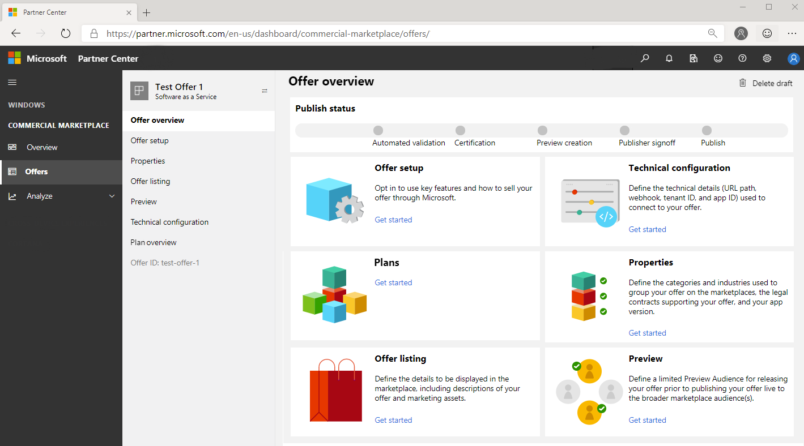
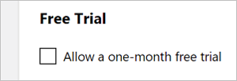

# Create a new SaaS offer in the commercial marketplace

To begin creating Software as a Service (SaaS) offers in the commercial marketplace, ensure that you first [create a Partner Center account](./create-account.md) and open the [Commercial Marketplace dashboard](https://partner.microsoft.com/dashboard/commercial-marketplace/offers), with the **Overview** tab selected.

## Create a new offer

1. Sign in to [Partner Center](https://partner.microsoft.com/dashboard/home).
2. In the left-nav menu, select **Commercial Marketplace** > **Overview**.
3. On the Overview page, select **+ New offer** > **Software as a Service**.

   

> [!NOTE]
> After an offer is published, edits made to it in Partner Center only appear in storefronts after republishing the offer. Make sure you always republish after making changes.

## New offer

Enter an **Offer ID**. This is a unique identifier for each offer in your account.

- This ID is visible to customers in the web address for the marketplace offer and Azure Resource Manager templates, if applicable.
- Use only lowercase letters and numbers. It can include hyphens and underscores, but no spaces, and is limited to 50 characters. For example, if you enter **test-offer-1** here, the offer web address will be `https://azuremarketplace.microsoft.com/marketplace/../test-offer-1`.
- The Offer ID can't be changed after you select **Create**.

Enter an **Offer alias**. This is the name used for the offer in Partner Center.

- This name isn't used in the marketplace and is different from the offer name and other values shown to customers.
- The Offer alias can't be changed after you select **Create**.

<!---

-->

Select **Create** to generate the offer and continue.

## Offer overview

**Publish status** displays a visual representation of the steps required to publish this offer and how long each step will take to complete. Incomplete publishing step icons will be greyed out.

The **Offer overview** menu contains a list of links for performing operations on this offer. This list of operations will change based on the selection you make for your offer.  

- If the offer is a draft - Delete draft
- If the offer is live - Stop sell offer
- If the offer is in preview - Go-live
- If you haven't completed publisher sign-out - Cancel publish

## Offer setup

This page asks for the following information.

- **Would you like to sell through Microsoft?** (Yes/No)
    - **Yes**, I would like to sell through Microsoft and have Microsoft host transactions on my behalf
    - **No**, I would prefer to only list my offer through the marketplaces and process transactions independently.

### Sell through Microsoft

Selling through Microsoft provides better customer discovery and acquisition, allows Microsoft to host marketplace transactions on your behalf, and takes advantage of Microsoft's globally available commerce capabilities.

#### SaaS offer requirements

In order to list Software as a Service (SaaS) offers with Commercial Marketplace on Partner Center, the following criteria must be met:

- Your offer must use [Azure Active Directory (Azure AD)](https://azure.microsoft.com/services/active-directory/) for identity management and authentication.
- Your offer must use [SaaS Fulfillment APIs](https://docs.microsoft.com/azure/marketplace/partner-center-portal/pc-saas-fulfillment-api-v2) to integrate with the Azure Marketplace.

#### SaaS pricing and billing options

With SaaS solutions running in the publisher's Azure subscription, license fees paid by customers include the cost of the infrastructure upon which the software is deployed. Azure infrastructure usage is managed and billed to you, the partner, directly. Actual infrastructure usage fees are not seen by the customer. Publishers should bundle Azure infrastructure usage fees into their software license pricing.

SaaS offers support monthly or annual billing based on a flat fee, per user, or consumption charges using the metered billing service. Microsoft's commercial marketplace operates on an agency model, whereby publishers set prices, Microsoft bills customers, and Microsoft pays revenue to the publisher while withholding an agency fee.

This is a sample breakdown of costs and payouts to demonstrate the agency model (any listed prices are for example purposes only and not intended to reflect actual costs):

|**Your license cost**|**$100 per month**|
|:---|:---|
|Azure usage cost (D1/1-Core)|Billed directly to the publisher, not the customer|
|Customer is billed by Microsoft|$100.00 per month (Publisher must account for any incurred or pass-through infrastructure costs in the license fee)|

|**Microsoft bills**|**$100 per month**|
|:---|:---|
|Microsoft pays you 80% of your license cost  **For qualified SaaS apps, Microsoft pays 90% of your license cost*|$80.00 per month  *$*90.00 per month*|

- In this example, Microsoft bills $100.00 to the customer for your software license and pays out $80.00 to the publisher.
- Partners who have qualified for the **Reduced Marketplace Service Fee** will see a reduced transaction fee on the SaaS offers from May 2019 until June 2020. In this scenario, Microsoft bills $100.00 for your software license and pays out $90.00 to the publisher.

> [!NOTE]
> **Reduced Marketplace Service Fee** – For certain SaaS offers that you have published on our Commercial Marketplace, Microsoft will reduce its Marketplace Service Fee from 20% (as described in the Microsoft Publisher Agreement) to 10%. In order for your offer to qualify, at least one of your offers must have been designated by Microsoft as being either IP co-sell ready or IP co-sell prioritized. Eligibility must be met at least five (5) business days before the end of each calendar month in order to receive this reduced Marketplace Service Fee for the month.  The Reduced Marketplace Service Fee does not apply to VMs, Managed Apps or any other products made available through our Commercial Marketplace. The Reduced Marketplace Service Fee will only be available to qualified offers for license charges collected by Microsoft between May 1, 2019 and June 30, 2020. After this time, the Marketplace Service Fee will return to its normal amount.

### List through Microsoft

Promote your business with Microsoft by creating a marketplace listing. Selecting to list your offer only and not transact through Microsoft means that Microsoft doesn't participate directly in software license transactions. There is no associated transaction fee and the publisher keeps 100% of any software licensing fees collected from the customer. However, the publisher is responsible for supporting all aspects of the software license transaction, including but not limited to: order fulfillment, metering, billing, invoicing, payment, and collection.

<!-- - **How do you want potential customers to interact with this listing offer?** -->

#### Get it now (free)

List your offer to customers for free by providing a valid address (beginning with *http* or *https*) where they can get a trial through [one-click authentication by using Azure Active Directory (Azure AD)](https://docs.microsoft.com/azure/marketplace/marketplace-saas-applications-technical-publishing-guide#using-azure-active-directory-to-enable-trials). For example, `https://contoso.com/saas-app`.

#### Free trial (listing)

List your offer to customers with a link to a free trial by providing a valid address (beginning with *http* or *https*), where they can get a trial through [one-click authentication by using Azure Active Directory (Azure AD)](https://docs.microsoft.com/azure/marketplace/marketplace-saas-applications-technical-publishing-guide#using-azure-active-directory-to-enable-trials). For example, `https://contoso.com/trial/saas-app`. Offer listing free trials are created, managed, and configured by your service and do not have subscriptions managed by Microsoft.

> [!NOTE]
> The tokens your application will receive through your trial link can only be used to obtain user information through Azure AD to automate account creation in your app. Microsoft Accounts (MSA) are not supported for authentication using this token.

#### Contact me

Collect customer contact information by connecting your Customer Relationship Management (CRM) system. The customer will be asked for permission to share their information. These customer details, along with the offer name, ID, and marketplace source where they found your offer, will be sent to the CRM system that you've configured. For more information about configuring your CRM, see [Customer leads](#customer-leads).

#### Example marketplace offer listing

<!--  -->

Here's an example of how offer information appears in Microsoft AppSource:

:::image type="content" source="media/example-appsource-saas.png" alt-text="Illustrates how this offer appears in Microsoft AppSource.":::

#### Call-out descriptions

1. Large logo
2. Categories
3. Industries
4. Support address (link)
5. Terms of use
6. Privacy policy
7. Offer name
8. Summary
9. Description
10. Screenshots/videos
11. Documents

 Here's an example of how offer information appears in the Azure portal:

:::image type="content" source="media/example-virtual-machine-container-iot-edge-saas.png" alt-text="Illustrates how this offer appears in the Azure portal.":::

#### Call-out descriptions

1. Title
2. Description
3. Useful links
4. Screenshots

## Enable a test drive

A test drive is a great way to showcase your offer to potential customers by giving them the option to "try before you buy", resulting in increased conversion and the generation of highly qualified leads. [Learn more about test drives](https://docs.microsoft.com/azure/marketplace/cloud-partner-portal/test-drive/what-is-test-drive).

To enable a test drive for a fixed period of time, select the **Enable a test drive** check box. To remove test drive from your offer, clear this check box.

For additional information, see [Test drive your offer in the commercial marketplace](https://docs.microsoft.com/azure/marketplace/partner-center-portal/test-drive).

### Test drive resources

- [Marketing best practices](https://docs.microsoft.com/azure/marketplace/cloud-partner-portal/test-drive/marketing-and-best-practices)
- [Technical best practices](https://github.com/Azure/AzureTestDrive/wiki/Test-Drive-Best-Practices)
- [Overview](https://assetsprod.microsoft.com/mpn/azure-marketplace-appsource-test-drives.pdf) (PDF; make sure your pop-up blocker is off)

### Customer leads

[!INCLUDE [Connect lead management](./includes/connect-lead-management-a.md)]

#### Additional lead management resources
- [Lead management FAQs](https://docs.microsoft.com/azure/marketplace/lead-management-for-cloud-marketplace#frequently-asked-questions)
- [Common lead configuration errors](https://docs.microsoft.com/azure/marketplace/lead-management-for-cloud-marketplace#common-lead-configuration-errors-during-publishing-on-cloud-partner-portal)
- [Lead Management Overview One Pager](https://assetsprod.microsoft.com/mpn/cloud-marketplace-lead-management.pdf)

Select **Save draft** before continuing.

## Properties

This page asks you to define the categories and industries used to group your offer on the marketplaces, the legal contracts supporting your offer, and your app version.

### Category

Select at least one and up to three categories for grouping your offer into the appropriate marketplace search areas. Describe how your offer supports these categories in the offer description.

### Industries

[!INCLUDE [Industry Taxonomy](./includes/industry-taxonomy.md)]

### App version

This field is optional and used in the AppSource marketplace to identify the version number of your offer.

### Standard Contract for the Microsoft commercial marketplace

Microsoft provides a Standard Contract template.

- **Use the Standard Contract for the Microsoft commercial marketplace?**

To simplify the procurement process for customers and reduce legal complexity for software vendors, Microsoft offers a Standard Contract for the Microsoft commercial marketplace to help facilitate transactions in the marketplace. Rather than crafting custom terms and conditions, commercial marketplace publishers can choose to offer their software under the Standard Contract, which customers only need to vet and accept once. The Standard Contract can be found at https://go.microsoft.com/fwlink/?linkid=2041178.

You can select to use the Standard Contract instead of providing your own custom terms and conditions by selecting "Use the Standard Contract for the commercial marketplace" checkbox.

> [!NOTE]
> Once you publish an offer using the Standard contract for Microsoft commercial marketplace, you're not able to use your own custom terms and conditions. It's an "or" scenario. You either offer your solution under the Standard Contract **or** your own terms and conditions. If you would like to modify the terms of the Standard Contract, you can do so through Standard Contract Amendments.

#### Standard Contract Amendments

Standard Contract Amendments let publishers select the Standard Contract terms for simplicity and customize the terms for their product or business. Customers only need to review the amendments to the contract, if they have already reviewed and accepted the Microsoft Standard Contract.

There are two kinds of amendments available for commercial marketplace publishers:

- Universal Amendments: These amendments are applied universally to the Standard Contract for all customers. Universal amendments are shown to every customer of the offer in the purchase flow. Customers must accept the terms of the Standard Contract and the amendment before they can use your offer.
- Custom Amendments: These amendments are special amendments to the Standard Contract that are targeted to specific customers only via Azure tenant IDs. Publishers can choose the tenant they want to target. Only customers from the tenant will be presented with the custom amendment terms in the offer's purchase flow.  Customers must accept the terms of the Standard Contract and the amendment(s) before they can use your offer.

>[!NOTE]
> These two types of amendments stack on top of each other. Customers targeted with custom amendments will also get the universal amendment to the Standard Contract during purchase.

**Universal amendment terms to the Standard Contract for Microsoft's commercial marketplace** – Enter the universal amendment terms in this box. You can provide a single universal amendment per offer. You can enter an unlimited number of characters in this box. These terms are displayed to customers in AppSource, Azure Marketplace, and/or the Azure portal during the discovery and purchase flow.

**Custom amendment terms to the Standard Contract for Microsoft's commercial marketplace** – Start by selecting **Add custom amendment terms**. You can provide up to 10 custom amendment terms per offer.

- **Custom amendment terms** – Enter your custom amendment terms in the custom amendment terms box. You can enter an unlimited number of characters in this box. Only customers from the tenant IDs you specify for these custom terms will be presented with the custom amendment terms in the offer's purchase flow in the Azure portal.  
- **Tenant IDs** (required) – Each custom amendment can be targeted to up to 20 tenant IDs. If you add a custom amendment, you must provide at least one tenant ID. The tenant ID identifies your customer in Azure. You can ask your customer for this ID and they can find it by navigating to portal.azure.com > Azure Active Directory > Properties. The directory ID value is the tenant ID (for example, 50c464d3-4930-494c-963c-1e951d15360e). You can also look up the organization's tenant ID of your customer by using their domain name URL at [What is my Microsoft Azure and Office 365 tenant ID?](https://www.whatismytenantid.com)
- **Description** (optional) – Optionally provide a friendly description for the tenant ID that helps you identify the customer you're targeting with the amendment.

#### Terms and conditions

If you want to provide your own custom terms and conditions, you can elect to enter them in the terms and conditions field. You can enter up to 10,000 characters of text in this field. If your terms and conditions require a longer description, enter a single URL link into this field where your terms and conditions can be found. It will display to customers as an active link.

Customers are required to accept these terms before they can try your offer.

Select **Save draft** before continuing.

## Offer listing

This page displays the languages (and markets) where your offer is available, currently English (United States) is the only location available. Additionally, this page displays the status of the language-specific listing and the date/time that it was added. You will need to define the marketplace details (offer name, description, search terms, etc.) for each language / market.

> [!NOTE]
> Offer listing content (such as offer description, documents, screenshots, terms of use and privacy policy) is not required to be in English as long as the offer description begins with the phrase, "This application is available only in [non-English language]." It is also acceptable to provide a *Useful Link URL* to offer content in a language other than the one used in the Offer listing content.

### Offer listings

Provide details to be displayed in the marketplace, including descriptions of your offer and marketing assets.

- **Name** (required) – The name defined here will appear as the title of your offer listing on the marketplace(s) you have chosen. The name is prepopulated based on your previous **New offer** entry. The name may be trademarked. It cannot contain emojis (unless they are the trademark and copyright symbols) and must be limited to 50 characters.
- **Summary** (required) – Provide a short description of your offer to be used in marketplace listing(s) search results. Up to 100 characters of text can be entered in this field.
- **Description** (required) – Provide a description of your offer to be displayed in the marketplace listing(s) overview. Consider including a value proposition, key benefits, any category or industry associations, in-app purchase opportunities, any required disclosures, and a link to learn more. Up to 3,000 characters of text can be entered in this field, including markup. For additional tips, see [Write a great app description](https://docs.microsoft.com/windows/uwp/publish/write-a-great-app-description).
- **Search keywords** – Enter up to three search keywords that customers can use to find your offer in the marketplace(s).
- **Getting started instructions** (required) – Explain how to configure and start using your app for potential customers.  This quickstart can contain links to more detailed online documentation. Up to 3,000 characters of text can be entered in this field.

#### Description

This field is required.

[!INCLUDE [Long description-2](./includes/long-description-2.md)]

[!INCLUDE [Rich text editor](./includes/rich-text-editor.md)]

#### Links

- **Privacy Policy** (required) – Link to your organization's privacy policy. You are responsible for ensuring your app complies with privacy laws and regulations, and for providing a valid privacy policy
- **CSP Program Marketing Materials** (optional) – Provide a link to marketing materials if you choose to extend your offer to the [Cloud Solution Provider (CSP)](https://docs.microsoft.com/azure/marketplace/cloud-solution-providers) program. CSP extends your offer to a broader range of qualified customers by enabling CSP partners to bundle, market, and resell your offer. These resellers will need access to materials for marketing your offer. For more information, see [Go-To-Market Services](https://partner.microsoft.com/reach-customers/gtm).
- **Useful Links** (optional) – Optional supplemental online documents about your app or related services listed by providing a **Title**  and  **URL**. Add additional useful links by clicking  **+ Add a URL**.

#### Contact information

- **Contacts** – For each customer contact, provide an employee  **Name**,  **Phone number**, and **Email** address (these *will not* be displayed publicly). A **Support URL**  is required for the **Support Contact** group (this *will* be displayed publicly).

    - **Support contact** (required) – For general support questions.
    - **Engineering contact** (required) – For technical questions.
    - **Channel Manager contact** (required) – For reseller questions related to the CSP program.

#### Files and Images

- **Documents** (required) – Add related marketing documents for your offer, in PDF format, of at least one and up to three documents per offer.
- **Images** (optional) – There are multiple places where your offer's logo images may appear throughout the marketplace(s), requiring the following pixel sizes in PNG format:

    - **Small** (48 x 48, required)
    - **Medium** (90 x 90, required)
    - **Large** (216 x 216, required)
    - **Wide** (255 x 115)

- **Screenshots** (required) – Add a maximum of five screenshots demonstrating your offer, sized at 1280 x 720 pixels. All images must be in .PNG format.
- **Videos** (optional) – Add links to videos demonstrating your offer. You can use links to YouTube and/or Vimeo videos, which are shown along with your offer to customers. You will also need to enter a thumbnail image of the video, sized to 1280 x 720 pixels in PNG format. You can display a maximum of four videos per offer.

>[!NOTE]
>If you have an issue uploading files, make sure your local network does not block the https://upload.xboxlive.com service used by Partner Center.

#### Additional marketplace listing resources

- [Best practices for marketplace offer listings](https://docs.microsoft.com/azure/marketplace/gtm-offer-listing-best-practices)

Select **Save draft** before continuing.

## Preview audience

This page lets you define a limited **Preview Audience** for releasing your offer prior to publishing your offer live to the broader marketplace audience.

> [!IMPORTANT]
> After checking your offer in Preview, select **Go live** so that your offer can be published live to the marketplace public audience.

Add a single AAD/MSA account email per line, along with an optional description.

Add up to 10 email addresses manually, or 20 if uploading a CSV file, for existing Microsoft Account (MSA) or Azure Active Directory accounts to help with validating your offer before publishing live. By adding these accounts, you are defining an audience that will be allowed preview access to your offer before it is published to the marketplace(s). If your offer is already live, you may still define a preview audience for testing any changes or updates to your offer.

> [!NOTE]
> The preview audience differs from a private audience. A preview audience is allowed access to your offer _prior_ to being published live in the marketplaces. You may also choose to create a plan and make it available only to a private audience. In the **plan listing** tab, you can define a private audience with the **This is a private plan** checkbox. You can then define a private audience of up to 20,000 customers using Azure Tenant IDs.

Select **Save draft** before continuing.

## Technical configuration

The **Technical configuration** tab defines the technical details used by marketplace to communicate to your SaaS service. This connection enables us to provision your offer for the end customer if they choose to acquire and manage it. 

>[!Note]
>You must implement integration with [SaaS fulfillment APIs](./pc-saas-fulfillment-api-v2.md) before configuring these details in offer's details.

Diagrams and detailed explanations describing the usage of the collected fields are available in documentation for [the APIs](./pc-saas-fulfillment-api-v2.md).

- **Landing page URL** (required) – Define the SaaS site URL (for example: `https://contoso.com/signup`) that end customers will land on after acquiring your offer from the marketplace and triggering the configuration process from the newly created SaaS subscription.  This URL will be called with the marketplace purchase identification token parameter which uniquely identifies the specific end customer's SaaS purchase.  You must exchange this token for the corresponding SaaS subscription details using the [resolve](./pc-saas-fulfillment-api-v2.md#resolve-a-purchased-subscription) API.  Those details and any others you wish to collect should be used as part of a customer-interactive web page built in your experience to complete end customer registration and activate their purchase.  On this page the user should sign up through one-click authentication by using Azure Active Directory (Azure AD).     This URL with marketplace purchase identification token parameter will also be called when end customer launches Managed SaaS experience from Azure portal or M365 Admin Center. You should handle both flows, when the token is provided first time after purchase for new customers and when it's provided for existing customer managing his SaaS.     The Landing page you configure here should be up and running 24/7. This is the only way you will be notified about new purchases of your SaaS offers made in the marketplace, or configuration requests of an active subscription of an offer.

- **Connection webhook** (required) – For all asynchronous events that Microsoft needs to send to you (for example, SaaS subscription has been canceled), we require you to provide a connection webhook URL. We will call this URL to notify you on the event.     The webhook you provide should be up and running 24/7 as this is the only way you will be notified about updates about your customers' SaaS subscriptions purchased via the marketplace.  If you don't already have a webhook system in place, the simplest configuration is to have an HTTP Endpoint Logic App that will listen for any events being posted to it and then handle them appropriately (for example, `https://prod-1westus.logic.azure.com:443/work`). For more information, see [Call, trigger, or nest workflows with HTTP endpoints in logic apps](https://docs.microsoft.com/azure/logic-apps/logic-apps-http-endpoint).

- **Azure AD tenant ID** (required) – Inside the Azure portal, we require that you [create an Azure Active Directory (AD) app](https://docs.microsoft.com/azure/active-directory/develop/howto-create-service-principal-portal) so that we can validate the connection between our two services is behind an authenticated communication. To find the [tenant ID](https://docs.microsoft.com/azure/active-directory/develop/howto-create-service-principal-portal#get-values-for-signing-in), go to your Azure Active Directory and select **Properties**, then look for the **Directory ID** number listed (such as 50c464d3-4930-494c-963c-1e951d15360e).

- **Azure AD app ID** (required) – You also need your [application ID](https://docs.microsoft.com/azure/active-directory/develop/howto-create-service-principal-portal#get-values-for-signing-in). To get its value, go to your Azure Active Directory and select **App registrations**, then look for the **Application ID** number listed (for example, `50c464d3-4930-494c-963c-1e951d15360e`).

>[!Note]
>The Azure AD app ID is associated to your publisher ID in your Partner Center account.  Make sure that the same application ID is used in all your offers.

>[!Note]
>If the publisher has two or more different accounts in Partner Center, two or more different Azure AD app IDs should be used, each for one of the accounts. Each partner account in Partner Center should use unique Azure AD app ID for all the SaaS offers that are published via this account.

Select **Save draft** before continuing.

## Plan overview

This page lets you provide a variety of plan options within the same offer. These plans (sometimes referred to as SKUs) could differ in terms of version, monetization, or tiers of service. You must set up at least one plan in order to sell your offer in the marketplace.

Once created, you will see your plan names, IDs, pricing models, availability (Public or Private), current publishing status, and any available actions.

**Actions** available in the **Plan overview** vary depending on the current status of your plan and may include:

- If the plan status is **Draft** - Delete draft
- If the plan status is **Live** - Stop sell plan or Sync private audience

**Create new plan** (minimum of one plan for those who select to sell through Microsoft)

- **Plan ID:** Create a unique plan ID for each plan in this offer. This ID will be visible to customers in the product URL and Azure Resource Manager templates (if applicable). Use only lowercase, alphanumeric characters, dashes, or underscores. A maximum of 50 characters are allowed for this plan ID. The ID cannot be modified after selecting create.
- **Plan name:** Customers will see this name when deciding which plan to select within your offer. Create a unique offer name for each plan in this offer. The plan name is used to differentiate software plans that may be a part of the same offer (for example, Offer name: Windows Server; plans: Windows Server 2016, Windows Server 2019).

### Plan listing

This page lets you define plan name and description. <!-- displays the languages (and markets) where your plan is available, currently English (United States) is the only location available. Additionally, this page displays the status of the language-specific listing and the date/time that it was added. You will need to define the marketplace details (offer name, description, search terms, etc.) for each language / market.-->

<!--#### Plan listing details-->

<!--Selecting one of the plan languages will display the **plan listing** information, including **Name** and **Description.** -->

- **Name** – Prepopulated based on your preview **New plan** entry and will appear as the title of your offer's "Software plan" displayed in the marketplace.
- **Description** – This description is an opportunity to explain what makes this software plan unique and any differences from other software plans within your offer. May contain up to 500 characters.

Select **Save draft** before continuing.

#### Pricing and availability

This page lets you configure the markets this plan will be available in, the desired monetization model, price, and billing term. In addition, you can indicate whether to make the plan visible to everyone or only to specific customers (a private audience).

#### Markets (optional)

Every plan must be available in at least one market. Select **Edit markets** and select the check box for any market location where you would like to make this plan available. This page includes a search box and option for selecting "Tax Remitted" countries/regions, in which Microsoft remits sales and use tax on your behalf.

If you have already set prices for your plan in United States Dollars (USD) and add another market location, the price for the new market will be calculated according to the current exchange rates. Review the price for each market before publishing. View pricing using the "Export prices (xlsx)" link after saving your changes.

Select **Save** before continuing.

#### Pricing

##### Pricing model

**Flat rate** – Enable access to your offer with a single monthly or annual price flat rate price. This is sometimes referred to as site-based pricing. With this pricing model, you can optionally define metered plans that use the marketplace metering service API to charge customers according to non-standard units.  For more information on metered billing, see [metered billing using the marketplace metering service](./saas-metered-billing.md).  You should also use this option if the usage behavior is in bursts for your SaaS service.  We do not recommend the customer to frequently switch plans on daily or hourly basis.

**Per user** – Enable access to your offer with the price based on the number of users accessing the offer or occupying seats. This user-based model enables you to set the minimum and maximum number of users allowed based on the price. This way, different price points can be configured based on the number of users by configuring multiple plans.  These fields are optional. If left unselected, the number of users will be interpreted as not having a limit (min of 1 and max of as many as the system can support). These fields may be edited as part of an update to your plan.

Once published, the billing pricing model choice cannot be changed. In addition, all plans for the same offer must share the same pricing model.

##### User limits

If applicable, select and set minimum and maximum user limits.

##### Billing term and price

Select the **term** and **price** that customers must pay the price listed. At least one Monthly or Annual price must be provided, or both options can be made available to customers.

Prices set in USD (USD = United States Dollar) are converted into the local currency of all selected markets using the current exchange rates when saved. Validate these prices before publishing by exporting the pricing spreadsheet and reviewing the price in each market. If you would like to set custom prices in an individual market, modify and import the pricing spreadsheet. You are responsible for validating this pricing and own these settings.
*\*You must first save your pricing changes to enable export of pricing data.*

Review your prices carefully before publishing, as there are some restrictions on what can change after a plan is published:

- Once a plan is published, the pricing model can't be changed.
- Once a billing term is published for a plan, it can't be removed later.
- Once a price for a market in your plan is published, it can't be changed later.

#### Free Trial

SaaS offers through the commercial marketplace let you provide a one-month free trial when selling through Microsoft. For all billing models and terms except metered plans, free trials are supported. This option allows customers to have a low-barrier to entry through one month of free access.  If you choose to enable a free trial for plans within your offer, the customer will not be able to convert to a paid subscription before the end of the initial one month period.  During this time, customers purchasing your offer can try out any of the supported plans that have the free trial enabled and convert between them.  The conversion to a paid subscription is done automatically at the end of the term.

>[!NOTE]
>If the customer chooses to convert to a plan without free trials, the conversion will happen, but the free trial will be lost immediately. Also, once a customer starts paying for a plan, they can no longer get free trial on the same subscription again, even if they convert to a SKU that does support free trials.

You can configure a free trial for each plan in your offer here. Select the check box to allow a one-month trial.

>[!NOTE]
>Once your transactable offer has been published with a free trial, it cannot be disabled for that plan. Make sure this setting is correct for the first publish to avoid having to re-create the plan.

To obtain information on customer subscriptions currently participating in a free trial, use the new API property `isFreeTrial`, which will be marked as true or false. For more information, see the [SaaS Get Subscription API](https://docs.microsoft.com/azure/marketplace/partner-center-portal/pc-saas-fulfillment-api-v2#get-subscription).

>[!NOTE]
>Free trials are not supported for plans that leverage the marketplace metering service.

#### Plan visibility

You can configure each plan to be visible to everyone or to only a specific audience of your choosing. You can assign membership in this restricted audience using Azure AD tenant IDs.

##### Privacy

Select **This is a private plan** to make your plan private and visible only to the restricted audience of your choosing. Once published as a private plan, you can update the audience or choose to make the plan available to everyone. Once a plan is published as visible to everyone, it must remain visible to everyone (it cannot be configured as a private plan again).

##### **Restricted Audience (Tenant IDs)**

Assign the audience that will have access to this private plan. Access is assigned using tenant IDs with the option to include a description of each tenant ID assigned. A maximum of 10 tenant IDs can be added, or 20,000 customers tenant IDs if importing a .csv spreadsheet file.

A tenant is a representation of an organization, with an ID represented as a GUID (Globally Unique Identifier, a 128-bit integer number used to identify resources). It's a dedicated instance of Azure AD that an organization or app developer receives when the organization or app developer creates a relationship with Microsoft, for example, when signing up for Azure, Microsoft Intune or Microsoft 365. Each Azure AD tenant is distinct and separate from other Azure AD tenants. To check the tenant, sign in to the Azure portal with the account you want to use to manage your application. If you have a tenant, you'll automatically be logged in and can see the tenant name directly under your account name. Hover over your account name on the upper right-hand side of the Azure portal to see your name, email, directory / tenant ID (a GUID), and your domain. If your account is associated with multiple tenants, you can select your account name to open a menu where you can switch between tenants. Each tenant has its own tenant ID. You can also look up your organization's tenant ID using a domain name URL at [https://www.whatismytenantid.com](https://www.whatismytenantid.com).

While SaaS offers use tenant IDs to define a private audience, other offer types may use Azure Subscription IDs (which are also represented as GUIDs).

> [!NOTE]
> The private audience (or restricted audience) differs from a preview audience. On the **[Preview](#preview-audience)** page, you can define a preview audience. A preview audience is allowed access to your offer *prior* to the offer being published live in the marketplace. While the private audience designation only applies to a specific plan, the preview audience can view all plans (private or not), but only during the limited preview period while the plan is tested and validated.

Select **Save draft** before continuing.

## Example list of plans within a marketplace offer

:::image type="content" source="media/marketplace-plan.png" alt-text="Example marketplace plan listing with notes.":::

#### Call-out descriptions

1. Plan name
2. Plan description

 

## Cloud Solution Provider (CSP) Reseller Audience

Electing to make your offer available in the CSP program enables Cloud Solution Providers to sell your product as part of a bundled solution to their customers. For more information, see [Cloud Solution Providers](https://go.microsoft.com/fwlink/?linkid=2111109).

## Publish

Once you have completed all the required sections of the offer, select **Review and publish** at the upper-right corner of the portal.

### Submit offer to preview

If this is your first time publishing this offer, you can:

- See the completion status for each section of the offer.
    - **Not started** – The section has not been touched and needs to be completed.
    - **Incomplete** – The section has errors that need to be fixed or requires more information to be provided. You'll need to go back to the section and update it.
    - **Complete** – The section is complete, all required data has been provided and there are no errors. All sections of the offer must be in a complete state before you can submit the offer.
- Provide testing instructions to the certification team to ensure your app is tested correctly, in addition to any supplementary notes helpful for understanding your app.
- Submit the offer for publishing by selecting **Submit**. We will send you an email to let you know when a preview version of the offer is available for you to review and approve. Return to Partner Center and select **Go-live** to publish your offer to the public (or if a private offer, to the private audience).

## Next step

- [Update an existing offer in the Commercial Marketplace](./update-existing-offer.md)
