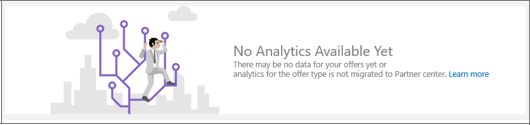

# Commercial marketplace analytics terminology and common questions

This article addresses commonly asked questions about analytics messages in Partner Center and also provides a dictionary of analytics terminology.

## Common questions

**I am unable to view my analytics data in Partner Center. When I access these pages, I see the message below. Why is this?**

Why you may be getting this message:

- No acquisitions currently exist for your published offers in marketplace. This can mean that your offers are live in marketplace and gaining views from customers in the product display pages, but customers haven't yet taken action to purchase and deploy them.
- The publishing of your offer might be in process and isn't live yet. Only live offers can be acquired by customers. To check the status of your offers, see Overview in the [Analyze dashboard](https://partner.microsoft.com/dashboard/commercial-marketplace/analytics/summary). For more information, see [Summary Dashboard in commercial marketplace analytics](./summary-dashboard.md).
- Your offers may be listed as **Contact Me**, which are list-only offers and cannot be purchased by customers in the marketplace. Although these offers generate leads and are shared with you, orders aren't created for these offers as they cannot be purchased. To check your offer listing type, go to setup page.

**I know I have analytics data, but the message below is appearing:**

If you're receiving this message, it means  you have analytics data but there isn't data for the date range you selected. Select a different date range or custom date range to view any data since 2010. For more information, see the Date Range section of [Summary Dashboard in commercial marketplace analytics](./summary-dashboard.md).

## Dictionary of data terms

| Attribute Name | Reports | Definition|
|---|---|---|
| Azure License Type | Customer, Order | The type of licensing agreement used by customers to purchase Azure. Also known as Channel |
| Azure License Type: Cloud Solution Provider | Customer, Order | The end customer procures Azure and your Marketplace offer through their Cloud Solution Provider, who acts as your reseller.|
| Azure License Type: Enterprise | Customer, Order | The end customer procures Azure and your Marketplace offer through an Enterprise Agreement, signed directly with Microsoft.|
| Azure License Type: Enterprise through Reseller  | Customer, Order | The end customer procures Azure and your Marketplace offer through a reseller who facilitates their Enterprise Agreement with Microsoft.|  |
| Azure License Type: Pay as You Go| Customer, Order | The end customer procures Azure and your Marketplace offer through a "Pay as You Go" agreement, signed directly with Microsoft.||
| Cloud Instance Name| Order| The Microsoft Cloud in which a VM deployment occurred.||
| Cloud Instance Name: Azure Global| Order| The public global Microsoft cloud.|| |
| Cloud Instance Name: Azure Government | Order| Government-specific Microsoft clouds for one of the following governments: China, Germany, or The United States of America.| |
| Customer City| Customer| The city name provided by the customer. City could be different than the city in a customer's Azure Subscription.||
| Customer Communication Language  | Customer| The language preferred by the customer for communication.||
| Customer Company Name | Customer, Order | The company name provided by the customer. Name could be different than the city in a customer's Azure Subscription.|  |
| Customer Country/Region | Customer, Order | The country/region name provided by the customer. Country/region could be different than the country/region in a customer's Azure Subscription.|  |
| Customer Email| Customer| The e-mail address provided by the end customer. Email could be different than the e-mail address in a customer's Azure Subscription.||
| Customer First Name| Customer| The name provided by the customer. Name could be different than the name provided in a customer's Azure Subscription.| |
| Customer ID | Customer, Order | The unique identifier assigned to a customer. A customer may have zero or more Azure Marketplace Subscriptions.|  |
| Customer Postal Code  | Customer| The postal code provided by the customer. Code could be different than the postal code provided in a customer's Azure Subscription.| |
| Customer State| Customer| The state (address) provided by the customer. State could be different than the state provided in a customer's Azure Subscription.| |
| Date Acquired| Customer| The first date the customer purchased any offer published by you.| |
| Date Lost| Customer| The last date the customer canceled the last of all offers previously purchased.||
| Is New Customer  | Order| The value will identify a new customer acquiring one or more of your offers for the first time (or not). Value will be "Yes" if within the same calendar month for "Date Acquired". Value will be "No" if the customer has purchased any of your offers prior to the calendar month reported. |
| Is Preview SKU| Order| The value will let you know if you have tagged the SKU as "preview". Value will be "Yes" if the SKU has been tagged accordingly, and only Azure subscriptions authorized by you can deploy and use this image. Value will be "No" if the SKU has not been identified as "preview".  |
| Is Promotional Contact Opt In| Customer| The value will let you know if the customer proactively opted in for promotional contact from publishers. At this time, we are not presenting the option to customers, so we have indicated "No" across the board. Once this feature is deployed, we will start updating accordingly.|
| Marketplace License Type| Order| The billing method of the Marketplace offer.||
| Marketplace License Type: Billed Through Azure| Order| Microsoft is your agent for this Marketplace offer and bills customers on your behalf. (Either PAYG Credit Card or Enterprise Invoice)||
| Marketplace License Type: Bring Your Own License | Order| The VM requires a license key provided by the customer to deploy. Microsoft does not bill customers for listing their offers in this way through the marketplace.||
| Marketplace License Type: Free| Order| The offer is configured to be free to all users. Microsoft does not bill customers for their usage of this offer.||
| Marketplace License Type: Microsoft as Reseller  | Order| Microsoft is your reseller for this Marketplace offer.|  |
| Marketplace Subscription ID | Customer, Order | The unique identifier associated with the Azure Subscription the customer used to purchase your Marketplace offer. ID was formerly the Azure Subscription GUID.||
| Offer Name  | Order| The name of the Marketplace offering.|| |
| Offer Type  | Order| The type of Microsoft Marketplace offering.|||
| Offer Type: Managed Application  | Order, | Use the Azure app: managed app offer type when the following conditions are required: You deploy either a subscription-based solution for your customer using either a VM or an entire IaaS-based solution. You or your customer require that the solution be managed by a partner. |
| Offer Type: Azure Application| Order, | Use the Azure Application solution template offer type when your solution requires additional deployment and configuration automation beyond a simple VM.||
| Offer Type: Consulting Service| Order| Consulting Services in Azure Marketplace help to connect customers with services to support and extend their use of Azure.| |
| Offer Type: Container | Order| Use the Container offer type when your solution is a Docker container image provisioned as a Kubernetes-based Azure container service.||
| Offer Type: Dynamics 365 Business Central| Order| Use this offer type when your solution is integrated with Dynamics 365 for Finance and Operations| |
| Offer Type: Dynamics 365 for Customer Engagement | Order| Use this offer type when your solution is integrated with Dynamics 365 for Customer Engagement.||
| Offer Type: IoT Edge Module | Order| Azure IoT Edge modules are the smallest computation units managed by IoT Edge and can contain Microsoft services (such as Azure Stream Analytics), 3rd-party services, or your own solution-specific code. |
| Offer Type: Power BI Application | Order| Use the Power BI Application offer type when you deploy an application integrated with Power BI.|  |
| Offer Type: SaaS Application| Order| Use the SaaS app offer type to enable your customer to buy your SaaS-based, technical solution as a subscription.||
| Offer Type: Virtual Machine | Order| Use the virtual machine offer type when you deploy a virtual appliance to the subscription associated with your customer.||
| Offer Type: Visual Studio Marketplace Extension  | Order| Offer type previously available to Azure DevOps extension developers. Going forward Azure DevOps extension developers can sell their extension directly to customers. Extension offers can be configured as paid or including a trial. |
| Order Cancel Date| Order| The date the Marketplace order was canceled.||
| Order ID| Order| The unique identifier of the customer order for your Marketplace service. Virtual Machine usage-based offers are not associated with an order.| |
| Order Purchase Date| Order| The date the Marketplace Order was created.|||
| Order Status| Order| The status of a Marketplace order at the time the data was last refreshed.|     |
| Order Status: Active  | Order| The customer has purchased an order and has not canceled their order.|         |
| Order Status: canceled | Order| The customer previously purchased an order and subsequently canceled their order.||
| Provider Email| Customer| The email address of the provider involved in the relationship between Microsoft and the end customer. If the customer is an Enterprise through Reseller, this will be the reseller. If a Cloud Solution Provider (CSP) is involved, this will be the CSP.|
| Provider Name| Customer| The name of the provider involved in the relationship between Microsoft and end customer. If the customer is an Enterprise through Reseller, this will be the reseller. If a Cloud Solution Provider (CSP) is involved, this will be the CSP.|
| SKU| Order| SKU name as defined during publishing. An offer may have many SKUs, but a SKU can only be associated with a single offer.||
| Trial End Date| Order| The date the trial period for this order will end or has ended.||

## Next steps

- For an overview of analytics reports available in the Partner Center commercial marketplace, see [Analytics for the commercial marketplace in Partner Center](./analytics.md).
- For graphs, trends, and values of aggregate data that summarize marketplace activity for your offer, see [Summary Dashboard in commercial marketplace analytics](./summary-dashboard.md).
- For information about your orders in a graphical and downloadable format, see [Orders Dashboard in commercial marketplace analytics](./orders-dashboard.md).
- For Virtual Machine (VM) offers usage and metered billing metrics, see [Usage Dashboard in commercial marketplace analytics](./usage-dashboard.md).
- For detailed information about your customers, including growth trends, see [Customer Dashboard in commercial marketplace analytics](./customer-dashboard.md).
- For a list of your download requests over the last 30 days, see [Downloads Dashboard in commercial marketplace analytics](./downloads-dashboard.md).
- To see a consolidated view of customer feedback for offers on Azure Marketplace and AppSource, see [Ratings and reviews dashboard in commercial marketplace analytics](./ratings-reviews.md).
