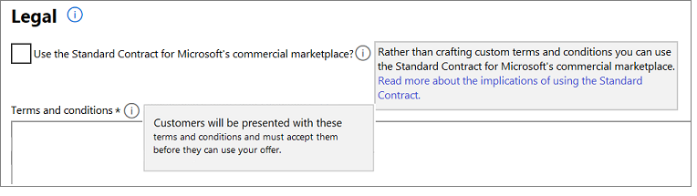

Microsoft provides a standard contract template for the commercial marketplace.

- **Use the Standard Contract for the Microsoft commercial marketplace?**

To simplify the procurement process for customers and reduce legal complexity for software vendors, Microsoft offers a Standard Contract for the Microsoft commercial marketplace to help facilitate transactions in the marketplace. Rather than crafting custom terms and conditions, commercial marketplace publishers can choose to offer their software under the Standard Contract, which customers only need to vet and accept once. The Standard Contract can be found here: https://go.microsoft.com/fwlink/?linkid=2041178.

You can select to use the Standard Contract instead of providing your own custom terms and conditions by selecting "Use the Standard Contract for the commercial marketplace" checkbox.

> [!NOTE]
> Once you publish an offer using the Standard contract for Microsoft commercial marketplace, you're not able to use your own custom terms and conditions. It's an “or” scenario. You either offer your solution under the Standard Contract **or** your own terms and conditions. If you would like to modify the terms of the Standard Contract, you can do so through Standard Contract Amendments.

**Standard Contract Amendments**

Standard Contract Amendments let publishers select the Standard Contract terms for simplicity and customize the terms for their product or business. Customers only need to review the amendments to the contract, if they have already reviewed and accepted the Microsoft Standard Contract.

There are two kinds of amendments available for commercial marketplace publishers:

- Universal Amendments: These amendments are applied universally to the Standard Contract for all customers. Universal amendments are shown to every customer of the offer in the purchase flow. Customers must accept the terms of the Standard Contract and the amendment before they can use your offer.
- Custom Amendments: These amendments are special amendments to the Standard Contract that are targeted to specific customers only via Azure tenant IDs. Publishers can choose the tenant they want to target. Only customers from the tenant will be presented with the custom amendment terms in the offer’s purchase flow.  Customers must accept the terms of the Standard Contract and the amendment(s) before they can use your offer.

>[!NOTE]
> These two types of amendments stack on top of each other. Customers targeted with custom amendments will also get the universal amendment to the Standard Contract during purchase.

**Universal amendment terms to the Standard Contract for Microsoft’s commercial marketplace**: Enter the universal amendment terms in this box. You can provide a single universal amendment per offer. You can enter an unlimited number of characters in this box. These terms are displayed to customers in AppSource, Azure Marketplace, and/or Azure portal during the discovery and purchase flow.

**Custom amendment terms to the Standard Contract for Microsoft’s commercial marketplace**: Start by selecting **Add custom amendment terms**. You can provide up to 10 custom amendment terms per offer.

- **Custom amendment terms**: Enter your custom amendment terms in the custom amendment terms box. You can enter an unlimited number of characters in this box. Only customers from the tenant IDs you specify for these custom terms will be presented with the custom amendment terms in the offer’s purchase flow in the Azure portal.  
- **Tenant IDs** (required): Each custom amendment can be targeted to up to 20 tenant IDs. If you add a custom amendment, you must provide at least one tenant ID. The tenant ID identifies your customer in Azure. You can ask your customer for this ID and they can find it by navigating to portal.azure.com > Azure Active Directory > Properties. The directory ID value is the tenant ID (for example, 50c464d3-4930-494c-963c-1e951d15360e). You can also look up the organization's tenant ID of your customer by using their domain name URL at [What is my Microsoft Azure and Office 365 tenant ID?](https://www.whatismytenantid.com).
- **Description** (optional): Optionally provide a friendly description for the tenant ID that helps you identify the customer you're targeting with the amendment.

**Terms and conditions**

If you want to provide your own custom terms and conditions, you can elect to enter them in the terms and conditions field. You can enter up to 10,000 characters of text in this field. If your terms and conditions require a longer description, enter a single URL link into this field where your terms and conditions can be found. It will display to customers as an active link.

Customers are required to accept these terms before they can try your offer.

Remember to **Save** before moving on to the next section.
Remember to **Save** before moving on to the next section.
